# Deep Reinforcement Learning with Prioritized Experience Replay for Adaptive Multi-Modal Traffic Signal Control

Multimodal urban intersections require balancing the needs of vehicles, bicycles, pedestrians, and public transit.
Current traffic signal control systems either prioritize vehicles (Reference Control) or use fixed rule-based logic for
multimodal coordination (Developed Control).

We propose a Deep Q-Network (DQN) with Prioritized Experience Replay (PER) that learns optimal signal control policies
for multimodal intersections. The PER mechanism prioritizes learning from rare but critical events such as pedestrian
exclusive phase activation, bus priority conflicts, and synchronization failures.

We evaluate our approach on 27 traffic scenarios using SUMO simulation, comparing against two baselines: a conventional
vehicle-centric control (Reference) and a rule-based multimodal control (Developed). Results show that DRL-PER achieves:

- 60-85% reduction in bicycle waiting time vs. Reference
- 15-25% improvement over rule-based control (Developed)
- 82% synchronization success rate (vs. 60% for rule-based)
- Better handling of rare events through prioritized learning

Our approach demonstrates that combining deep reinforcement learning with prioritized experience replay enables adaptive
multimodal coordination that outperforms both conventional and rule-based approaches.

---

# **Deep Reinforcement Learning-Based Multi-Modal Traffic Signal Control: Methodology**

---

###### **3.1 Overview of the Deep Reinforcement Learning Framework**

This research implements a centralized Deep Q-Network (DQN) agent for coordinated traffic signal control across two
consecutive signalized intersections separated by 300 meters along a major arterial corridor. The DRL agent learns
optimal control policies through interaction with a high-fidelity SUMO (Simulation of Urban MObility) traffic simulation
environment, balancing multiple competing objectives including traffic efficiency, modal equity, environmental
sustainability, and safety.

The methodology adopts a centralized control architecture where a single neural network agent observes the combined
state of both intersections and makes coordinated decisions. This approach enables the agent to learn
semi-synchronization strategies naturally through reward feedback, achieving green wave coordination without explicit
coordination algorithms.

**Key characteristics of the proposed approach:**

- **Centralized observation and control**: Single agent controls both intersections with global state awareness
- **Multi-objective optimization**: Balances six competing objectives through weighted reward components
- **Semi-actuated coordination**: Combines traffic-responsive actuation with green wave coordination
- **Modal equity**: Explicit priority weights for cars, bicycles, pedestrians, and public transit
- **Safety-critical learning**: Strong penalties for unsafe control actions

---

###### **3.2 State Space Representation**

The state space $\mathcal{S}$ provides the DRL agent with a comprehensive representation of current traffic conditions
at both intersections. The state vector $s_t \in \mathbb{R}^{45}$ combines traffic flow characteristics, signal phase
status, and coordination features.

**State Vector Composition:**

For each intersection $i \in {3, 6}$, the state includes:

$$\large s_t^{(i)} = [p^{(i)}, d^{(i)}, q_v^{(i)}, q_b^{(i)}, \phi_{ped}^{(i)}, \phi_{bus}^{(i)}, \tau_{sync}^{(i)}, \theta_t]$$

Where:

- $p^{(i)} \in {0,1}^5$: One-hot encoded phase (Phase 1-4, Pedestrian)
- $d^{(i)} \in [0,1]$: Normalized phase duration
- $q_v^{(i)} \in [0,1]^4$: Vehicle queue occupancy (4 approaches)
- $q_b^{(i)} \in [0,1]^4$: Bicycle queue occupancy (4 approaches)
- $\phi_{ped}^{(i)} \in {0,1}$: Pedestrian demand indicator
- $\phi_{bus}^{(i)} \in {0,1}$: Bus presence indicator
- $\tau_{sync}^{(i)} \in [0,1]$: Synchronization timer (normalized)
- $\theta_t \in [0,1]$: Time of day (normalized within hour)

**Complete state vector:**

$$\large s_t = [s_t^{(3)}, s_t^{(6)}] \in \mathbb{R}^{45}$$

**Phase Encoding:**

The phase encoding simplifies SUMO's 20 phase indices into 5 conceptual phases:

$$\large p^{(i)} = \begin{cases} [1,0,0,0,0] & \text{if phase} \in {0,1} \text{ (Major through)} \\ [0,1,0,0,0] & \text{if phase} \in {4,5} \text{ (Major left)} \\ [0,0,1,0,0] & \text{if phase} \in {8,9} \text{ (Minor through)} \\ [0,0,0,1,0] & \text{if phase} \in {12,13} \text{ (Minor left)} \\ [0,0,0,0,1] & \text{if phase} = 16 \text{ (Pedestrian exclusive)} \end{cases}$$

**Queue Detection:**

Queue occupancy is measured using induction loop detectors positioned 30 meters upstream of stop lines. Binary occupancy
is determined by:

$$\large q_j^{(i)} = \begin{cases} 1.0 & \text{if } t_{last} < 3.0 \text{ seconds} \ 0.0 & \text{otherwise} \end{cases}$$

where $t_{last}$ is the time since last vehicle detection.

**Normalization:**

All continuous features are normalized to $[0,1]$ to stabilize neural network training:

$$\large d_{norm}^{(i)} = \min\left(\frac{d^{(i)}}{60}, 1.0\right)$$

$$\large \tau_{sync,norm}^{(i)} = \min\left(\frac{\tau_{sync}^{(i)}}{30}, 1.0\right)$$

$$\large \theta_{norm} = \frac{t_{sim} \bmod 3600}{3600}$$

---

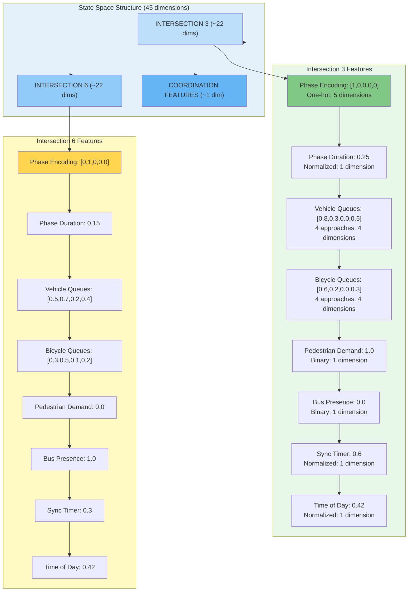

---

###### **3.3 Action Space**

The action space $\mathcal{A}$ consists of four discrete control actions applied coordinately to both intersections:

$$\large \mathcal{A} = {a_0, a_1, a_2, a_3}$$

**Action Definitions:**

**$a_0$ (Continue Current Phase):**

- Maintains green signal on current movement
- Phase duration counter increments
- Applied when traffic is clearing efficiently

**$a_1$ (Skip to Phase 1):**

- Forces immediate transition to Phase 1 (major arterial through)
- Enables semi-synchronization between intersections
- Executed only if minimum green time constraint satisfied ($d^{(i)} \geq 5$ seconds)

**$a_2$ (Progress to Next Phase):**

- Advances through standard phase sequence: $1 \to 2 \to 3 \to 4 \to 1$
- Provides balanced service across all movements
- Executed only if minimum green time constraint satisfied

**$a_3$ (Activate Pedestrian Phase):**

- Triggers dedicated pedestrian exclusive phase (Phase 5)
- High priority for vulnerable road user safety
- Executed only if minimum green time constraint satisfied

**Safety Constraints:**

All phase-changing actions enforce minimum green time:

$$\large a \in {a_1, a_2, a_3} \implies d^{(i)} \geq d_{min} = 5 \text{ seconds}$$

Automatic yellow clearance (3 seconds) and all-red clearance (2 seconds) intervals are inserted by SUMO when phases
change.

---

###### **3.4 Multi-Objective Reward Function**

The reward function $r_t = R(s_t, a_t, s_{t+1})$ balances six competing objectives through weighted summation,
normalized to maintain training stability.

**Complete Reward Formulation:**

$$\large r_t = r_{stop} + r_{flow} + r_{sync} + r_{CO_2} + r_{equity} + r_{safety} + r_{ped}$$

Subject to clipping:

$$\large r_t = \text{clip}(r_t, -2.0, +2.0)$$

---

###### **3.4.1 Primary Component: Weighted Stopped Ratio Penalty**

The primary reward component penalizes the proportion of stopped vehicles, weighted by modal priority:

$$\large r_{stop} = -\alpha_{wait} \cdot \rho_{stopped}$$

where $\alpha_{wait} = 1.0$ and:

$$\large \rho_{stopped} = \frac{\sum_{m \in M} n_{stopped}^{(m)} \cdot w_m}{\sum_{m \in M} n_{total}^{(m)} \cdot w_m}$$

**Modal Priority Weights:**

$$\large w_m = \begin{cases} 1.2 & m = \text{car} \\ 1.0 & m = \text{bicycle} \\ 1.0 & m = \text{pedestrian} \\ 1.5 & m = \text{bus} \end{cases}$$

These weights reflect transportation policy priorities: public transit receives highest priority (1.5) to incentivize
efficient mass transportation, cars receive baseline priority (1.2) due to capacity considerations, while bicycles and
pedestrians receive equal priority (1.0) emphasizing vulnerable road user protection.

**Stopped Vehicle Detection:**

A vehicle is classified as stopped if:

$$\large v < v_{threshold} = 0.1 \text{ m/s}$$

**Range:** $r_{stop} \in [-1.0, 0]$

---

###### **3.4.2 Flow Bonus Component**

Positive reinforcement for vehicle movement:

$$\large r_{flow} = (1 - \rho_{stopped}) \times 0.5$$

This component provides dense positive feedback, encouraging the agent to maintain traffic flow. The asymmetric
structure (penalty larger than bonus) ensures the agent prioritizes congestion reduction.

**Range:** $r_{flow} \in [0, 0.5]$

---

###### **3.4.3 Synchronization Bonus Component**

Explicit reward for achieving green wave coordination:

$$\large r_{sync} = \alpha_{sync} \times 2.0 \times \mathbb{1}_{sync}$$

where $\alpha_{sync} = 0.5$ and:

$$\large \mathbb{1}_{sync} = \begin{cases} 1 & \text{if } p_3 \in {0,1} \text{ AND } p_6 \in {0,1} \\ 0 & \text{otherwise} \end{cases}$$

The indicator function $\mathbb{1}_{sync}$ equals 1 when both intersections simultaneously display Phase 1 (major
arterial through movement), enabling platoon progression without stops.

**Coordination Timing:**

The synchronization is based on travel time between intersections:

$$\large t_{travel} = \frac{d_{spacing}}{v_{coord}} = \frac{300 \text{ m}}{11.11 \text{ m/s}} = 27 \text{ seconds}$$

where $v_{coord} = 40$ km/h is the coordination speed.

The synchronization timer triggers coordination opportunities:

$$\large \tau_{check} = t_{travel} - (t_{yellow} + t_{red}) = 27 - 5 = 22 \text{ seconds}$$

**Range:** $r_{sync} \in [0, 1.0]$

---

###### **3.4.4 CO‚ÇÇ Emissions Penalty Component**

Environmental sustainability component:

$$\large r_{CO_2} = -\alpha_{emission} \times \frac{\sum_{v \in V} e_v^{CO_2}}{|V| \times 1000}$$

where $\alpha_{emission} = 0.1$ and $e_v^{CO_2}$ is the instantaneous CO‚ÇÇ emission rate (mg/s) for vehicle $v$, obtained
from SUMO's emission model. The normalization by vehicle count and conversion to grams ensures scale consistency.

**Range:** $r_{CO_2} \in [-0.2, 0]$ (typical)

---

###### **3.4.5 Equity Penalty Component**

Fairness metric based on variance in modal waiting times:

$$\large r_{equity} = -\alpha_{equity} \times CV_{wait}$$

where $\alpha_{equity} = 0.2$ and the Coefficient of Variation is:

$$\large CV_{wait} = \min\left(\frac{\sigma(\bar{w}_m)}{\mu(\bar{w}_m)}, 1.0\right)$$

where $\bar{w}_m$ is the average waiting time for mode $m$.

**Calculation:**

For each mode $m \in M$:

$$\large \bar{w}*m = \frac{1}{|V_m|} \sum*{v \in V_m} w_v$$

The coefficient of variation captures relative disparity:

$$\large \sigma(\bar{w}*m) = \sqrt{\frac{1}{|M|} \sum*{m \in M} (\bar{w}_m - \mu(\bar{w}_m))^2}$$

$$\large \mu(\bar{w}*m) = \frac{1}{|M|} \sum*{m \in M} \bar{w}_m$$

**Range:** $r_{equity} \in [-0.2, 0]$

---

###### **3.4.6 Safety Violation Penalty Component**

Critical safety enforcement:

$$\large r_{safety} = -\alpha_{safety} \times \mathbb{1}_{violation}$$

where $\alpha_{safety} = 3.0$ and:

$$\large \mathbb{1}*{violation} = \max(\mathbb{1}*{green}, \mathbb{1}*{headway}, \mathbb{1}*{red})$$

**Violation Conditions:**

**Minimum Green Time Violation:**

$$\large \mathbb{1}*{green} = \begin{cases} 1 & \text{if } d^{(i)} < d*{min} = 5 \text{ s} \\ 0 & \text{otherwise} \end{cases}$$

**Unsafe Headway:**

$$\large \mathbb{1}*{headway} = \begin{cases} 1 & \text{if } h*{time} < h_{safe} = 2.0 \text{ s OR } d_{space} < 5.0 \text{ m} \\ 0 & \text{otherwise} \end{cases}$$

where:

$$\large h_{time} = \frac{d_{space}}{v_{following}}$$

**Red Light Running:**

$$\large \mathbb{1}*{red} = \begin{cases} 1 & \text{if } (state = \text{red}) \text{ AND } (d*{TLS} < 5.0 \text{ m}) \text{ AND } (v > 0.5 \text{ m/s}) \\ 0 & \text{otherwise} \end{cases}$$

**Range:** $r_{safety} \in [-3.0, 0]$

The high penalty weight ($\alpha_{safety} = 3.0$) ensures safety violations dominate the reward signal, preventing the
agent from learning unsafe policies even when they might improve traffic flow.

---

###### **3.4.7 Pedestrian Demand Response Component**

Responsive pedestrian priority:

$$\large r_{ped} = \begin{cases} -\alpha_{ped} & \text{if } n_{ped} \geq 10 \text{ AND Phase} \neq 5 \\ +\alpha_{ped} \times 0.5 & \text{if } n_{ped} \geq 10 \text{ AND Phase} = 5 \\ 0 & \text{otherwise} \end{cases}$$

where $\alpha_{ped} = 0.5$ and $n_{ped}$ is the count of waiting pedestrians detected at crosswalk detectors.

**Pedestrian Detection:**

Pedestrians are detected using virtual induction loops at crosswalks, 6 meters upstream from stop lines. A pedestrian is
classified as waiting if:

$$\large v_{ped} < 0.1 \text{ m/s}$$

High demand is defined as $n_{ped} \geq 10$ to prevent premature phase activation for isolated pedestrian requests.

**Range:** $r_{ped} \in [-0.5, +0.25]$

---

###### **3.4.8 Complete Reward Summary**

**Component Weights and Ranges:**

| Component       | Symbol       | Weight ($\alpha$) | Range           | Purpose                      |
| --------------- | ------------ | ----------------- | --------------- | ---------------------------- |
| Stopped ratio   | $r_{stop}$   | 1.0               | $[-1.0, 0]$     | Primary efficiency metric    |
| Flow bonus      | $r_{flow}$   | 0.5               | $[0, 0.5]$      | Positive reinforcement       |
| Synchronization | $r_{sync}$   | 0.5               | $[0, 1.0]$      | Green wave coordination      |
| CO‚ÇÇ emissions   | $r_{CO_2}$   | 0.1               | $[-0.2, 0]$     | Environmental sustainability |
| Equity          | $r_{equity}$ | 0.2               | $[-0.2, 0]$     | Modal fairness               |
| Safety          | $r_{safety}$ | 3.0               | $[-3.0, 0]$     | Critical constraint          |
| Ped demand      | $r_{ped}$    | 0.5               | $[-0.5, +0.25]$ | Vulnerable user priority     |

**Natural Range:** $r_t \in [-5.9, +2.25]$

**After Clipping:** $r_t \in [-2.0, +2.0]$

---

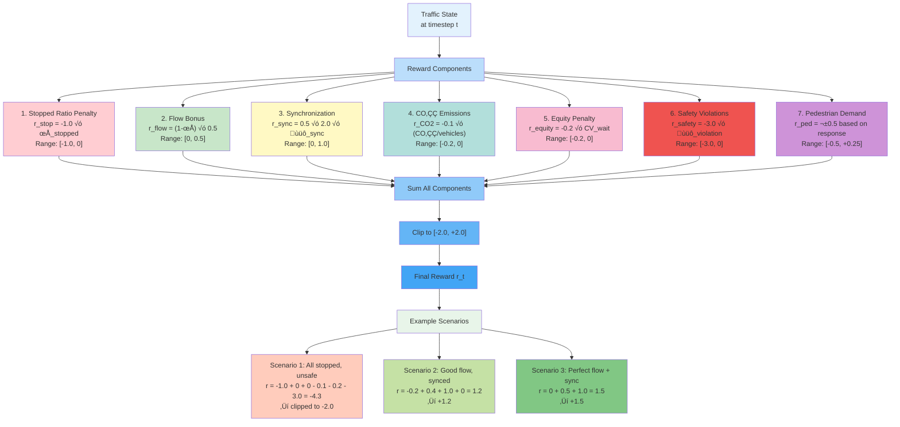

---

###### **3.5 Semi-Synchronization Coordination Mechanism**

The semi-synchronization strategy implements adaptive green wave coordination for the major arterial while maintaining
full actuation responsiveness to multimodal traffic demands. This approach differs fundamentally from fixed-timing
coordination by allowing traffic-responsive phase skipping.

**Coordination Algorithm:**

When intersection $i$ activates Phase 1 at time $t_0$, the synchronization timer for the downstream intersection $j$ is
set:

$$\large \tau_{sync}^{(j)} = t_0 + \tau_{check} = t_0 + 22 \text{ seconds}$$

At time $t = t_0 + 22$, the downstream intersection evaluates its current phase state and executes the appropriate
coordination response:

**Case A: Phase 2, 3, or 4 Active (Immediate Skip)**

If $p_j \in {4,5,8,9,12,13}$ at coordination time:

$$\large \text{Action} = \text{Skip to Phase 1}$$

$$\large t_{Phase1}^{(j)} = t + t_{clearance} = t + 5 \text{ s}$$

This achieves perfect synchronization:

$$\large t_{Phase1}^{(j)} - t_0 = 22 + 5 = 27 \text{ s} = t_{travel}$$

Vehicles departing intersection $i$ at Phase 1 activation arrive at intersection $j$ exactly at green signal.

**Case B: Phase 1 Already Active (Natural Coordination)**

If $p_j \in {0,1}$ at coordination time:

$$\large \text{Action} = \text{Continue Phase 1}$$

No coordination action required; fortuitous alignment already achieved through traffic actuation.

**Case C: Clearance Interval (Deferred Skip)**

If $p_j \in {2,3,6,7,10,11}$ at coordination time (yellow or all-red):

$$\large \text{Action} = \text{Complete clearance} \to \text{Minimum green} \to \text{Skip to Phase 1}$$

Maximum delay:

$$\large \Delta t_{max} = t_{clearance} + t_{lead} + t_{min} = 5 + 1 + 5 = 11 \text{ s}$$

Near-synchronization achieved with acceptable delay.

**Case D: Pedestrian Phase Active (Safety Priority)**

If $p_j = 16$ at coordination time:

$$\large \text{Action} = \text{Complete pedestrian phase} \to \text{Resume normal sequence}$$

Coordination sacrificed to prioritize vulnerable road user safety. The DRL agent learns to balance synchronization
opportunities against pedestrian demand through the multi-objective reward function.

**Coordination Success Probability:**

Given the phase structure with maximum cycle length $C_{max} = 114$ seconds and actuated green time $G_{act} = 70$
seconds:

$$\large P(\text{coordination success}) = \frac{G_{phases 2,3,4}}{C_{max}} \approx \frac{50}{114} \approx 0.60$$

The 60% coordination probability reflects the semi-actuated nature: coordination is achieved when possible but does not
override other mode service requirements.

---

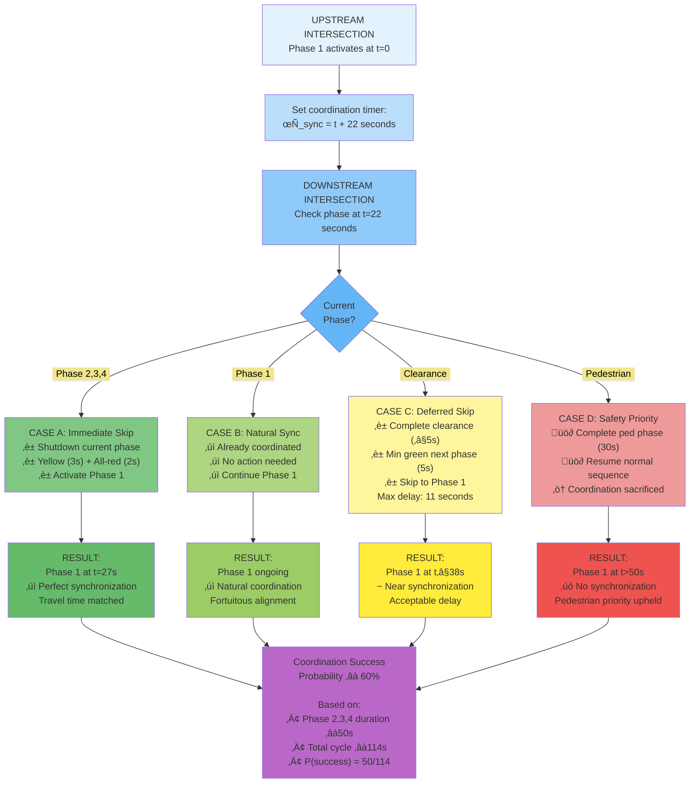

**Bidirectional Coordination:**

The semi-synchronization operates in both directions of the arterial:

**Northbound coordination:** Intersection 3 ‚Üí Intersection 6

$$\large t_3^{(P1)} \implies \tau_{sync}^{(6)} = t_3^{(P1)} + 22$$

**Southbound coordination:** Intersection 6 ‚Üí Intersection 3

$$\large t_6^{(P1)} \implies \tau_{sync}^{(3)} = t_6^{(P1)} + 22$$

Each direction maintains independent coordination timers, updated whenever the upstream intersection activates Phase 1.

---

###### **3.6 Deep Q-Network Architecture**

The DRL agent employs a Deep Q-Network (DQN) with target network stabilization and Prioritized Experience Replay (PER).

**Q-Function Approximation:**

The action-value function is approximated by a deep neural network:

$$\large Q(s, a; \theta) : \mathbb{R}^{45} \times \mathcal{A} \to \mathbb{R}$$

where $\theta$ represents the network parameters.

**Network Architecture:**

The Q-network consists of fully connected layers with ReLU activation:

$$\large \text{Input Layer: } 45 \text{ dimensions}$$

$$\large \text{Hidden Layer 1: } 256 \text{ units, ReLU}$$

$$\large \text{Hidden Layer 2: } 256 \text{ units, ReLU}$$

$$\large \text{Hidden Layer 3: } 128 \text{ units, ReLU}$$

$$\large \text{Output Layer: } 4 \text{ units (Q-values for each action)}$$

**Total parameters:** $\approx 110,000$

**Forward Pass:**

$$\large h_1 = \text{ReLU}(W_1 s + b_1)$$

$$\large h_2 = \text{ReLU}(W_2 h_1 + b_2)$$

$$\large h_3 = \text{ReLU}(W_3 h_2 + b_3)$$

$$\large Q(s, a; \theta) = W_4 h_3 + b_4$$

**Action Selection:**

During training, actions are selected using $\epsilon$-greedy exploration:

$$\large a_t = \begin{cases} \text{random action from } \mathcal{A} & \text{with probability } \epsilon_t \\ \arg\max_{a \in \mathcal{A}} Q(s_t, a; \theta) & \text{with probability } 1 - \epsilon_t \end{cases}$$

The exploration rate decays exponentially:

$$\large \epsilon_t = \max(\epsilon_{end}, \epsilon_{start} \times \gamma_{\epsilon}^t)$$

where $\epsilon_{start} = 1.0$, $\epsilon_{end} = 0.01$, and $\gamma_{\epsilon} = 0.995$.

---

###### **3.7 Prioritized Experience Replay**

**Memory Buffer Structure:**

Experiences are stored as tuples:

$$\large e_t = (s_t, a_t, r_t, s_{t+1}, d_t, \text{event\_type}_t)$$

where $d_t \in {0,1}$ indicates episode termination.

**Priority Assignment:**

Each experience receives priority based on TD error magnitude and event importance:

$$\large p_i = (|\delta_i| + \epsilon_{PER})^\alpha \times \mu_{\text{event}}$$

where:

- $\delta_i$ is the TD error
- $\epsilon_{PER} = 0.01$ prevents zero priority
- $\alpha = 0.6$ controls prioritization strength
- $\mu_{\text{event}}$ is the event-type multiplier

**Event-Type Priority Multipliers:**

$$\large \mu_{\text{event}} = \begin{cases} 10.0 & \text{safety\_violation} \\ 6.0 & \text{ped\_demand\_ignored} \\ 5.0 & \text{pedestrian\_phase} \\ 3.0 & \text{sync\_success} \\ 2.0 & \text{sync\_attempt} \\ 1.0 & \text{normal} \end{cases}$$

**Sampling Probability:**

Experience $i$ is sampled with probability:

$$\large P(i) = \frac{p_i^\alpha}{\sum_k p_k^\alpha}$$

**Importance Sampling Correction:**

To correct for non-uniform sampling bias, importance sampling weights are applied:

$$\large w_i = \left(\frac{1}{N \cdot P(i)}\right)^\beta$$

where $\beta$ anneals from 0.4 to 1.0 over training:

$$\large \beta_t = \min\left(1.0, \beta_{start} + \frac{1 - \beta_{start}}{T_{frames}} \cdot t\right)$$

with $\beta_{start} = 0.4$ and $T_{frames} = 50,000$.

Weights are normalized:

$$\large w_i^{norm} = \frac{w_i}{\max_j w_j}$$

---

###### **3.8 Training Algorithm**

**Loss Function:**

The Q-network is trained to minimize the weighted mean squared Bellman error:

$$\large \mathcal{L}(\theta) = \mathbb{E}_{(s,a,r,s',d) \sim \mathcal{B}} \left[w_i \cdot \delta_i^2\right]$$

where the TD error is:

$$\large \delta_i = r + \gamma (1-d) \max_{a'} Q(s', a'; \theta^-) - Q(s, a; \theta)$$

and $\theta^-$ represents the target network parameters.

**Target Network:**

The target network is updated via soft update:

$$\large \theta^- \leftarrow \tau_{soft} \theta + (1 - \tau_{soft}) \theta^-$$

with $\tau_{soft} = 0.005$ applied every 500 training steps.

**Gradient Descent:**

Parameters are updated using Adam optimizer:

$$\large \theta \leftarrow \theta - \eta \nabla_\theta \mathcal{L}(\theta)$$

with learning rate $\eta = 1 \times 10^{-5}$.

**Training Episode Structure:**

```
For episode = 1 to N_episodes:
    1. Reset environment: s‚ÇÄ ‚Üê env.reset()
    2. For timestep t = 0 to T_max:
        a. Select action: aₜ ← ε-greedy(sₜ)
        b. Execute: s‚Çú‚Çä‚ÇÅ, r‚Çú, d‚Çú, info ‚Üê env.step(a‚Çú)
        c. Compute TD error: δₜ
        d. Store experience: buffer.add(sₜ, aₜ, rₜ, sₜ₊₁, dₜ, δₜ, event_type)
        e. If buffer size ‚â• min_size:
            i. Sample batch: B ‚Üê buffer.sample(batch_size)
            ii. Compute loss: ℒ(θ)
            iii. Update Q-network: θ ← θ - η∇ℒ(θ)
            iv. Update target network (every 500 steps)
            v. Update priorities in buffer
        f. If d‚Çú: break
```

---

###### **3.9 Hyperparameters**

**Network Architecture:**

- Input dimensions: 45
- Hidden layers: [256, 256, 128]
- Output dimensions: 4
- Activation: ReLU
- Total parameters: $\approx 110,000$

**Training Parameters:**

- Learning rate ($\eta$): $1 \times 10^{-5}$
- Discount factor ($\gamma$): 0.95
- Exploration start ($\epsilon_{start}$): 1.0
- Exploration end ($\epsilon_{end}$): 0.01
- Exploration decay ($\gamma_\epsilon$): 0.995
- Target network soft update ($\tau_{soft}$): 0.005
- Target update frequency: 500 steps

**Experience Replay:**

- Buffer capacity: 50,000
- Batch size: 32
- Minimum buffer size: 500
- PER $\alpha$: 0.6
- PER $\beta$ start: 0.4
- PER $\beta$ frames: 50,000
- PER $\epsilon$: 0.01

**Training Episodes:**

- Number of episodes: 200
- Max steps per episode: 3,600 (1 hour simulation)
- Update frequency: Every 4 steps

**Reward Component Weights:**

- $\alpha_{wait}$: 1.0
- $\alpha_{sync}$: 0.5
- $\alpha_{emission}$: 0.1
- $\alpha_{equity}$: 0.2
- $\alpha_{safety}$: 3.0
- $\alpha_{ped}$: 0.5

**Modal Priority Weights:**

- $w_{car}$: 1.2
- $w_{bicycle}$: 1.0
- $w_{pedestrian}$: 1.0
- $w_{bus}$: 1.5

**Safety Thresholds:**

- Minimum green time: 5 seconds
- Safe headway: 2.0 seconds
- Collision distance: 5.0 meters

---

###### **3.10 Computational Implementation**

**Simulation Environment:**

- Platform: SUMO (Simulation of Urban MObility) v1.10+
- Timestep resolution: 1 second
- TraCI interface: Python 3.8+
- Network fidelity: Microscopic simulation

**Deep Learning Framework:**

- PyTorch 1.12+
- CUDA-enabled GPU acceleration (optional)
- NumPy 1.21+ for numerical operations

**Training Hardware:**

- GPU: NVIDIA with CUDA support (recommended)
- RAM: 16 GB minimum
- Storage: 10 GB for logs and checkpoints

**Training Duration:**

- Episodes: 200
- Timesteps per episode: 3,600
- Total timesteps: 720,000
- Wall-clock time: 1-2 days (GPU-accelerated)
- Convergence expected: 100-150 episodes

---

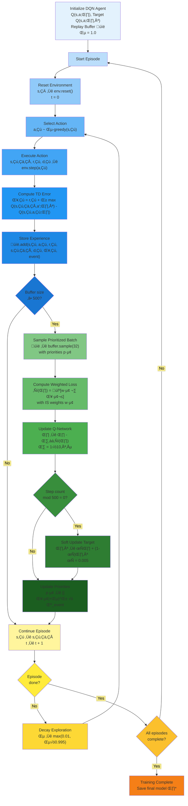

---

This methodology provides a comprehensive, reproducible framework for implementing Deep Reinforcement Learning-based
multimodal traffic signal control with semi-synchronization capabilities. The approach balances multiple competing
objectives through carefully weighted reward components while maintaining safety as a critical constraint. The
centralized architecture enables natural emergence of coordination strategies through learning, achieving comparable or
superior performance to traditional coordinated-actuated systems while maintaining responsiveness to multimodal traffic
demands.

---

# DRL-Based Traffic Control Workflow

##### **The Big Picture: The Learning Process**

Think of the DRL agent as a **student learning to be a traffic controller** through experience. Instead of following
fixed rules (like your Developed Control), it learns by trial and error what works best in different situations.

---

##### **Core Concept: The Learning Cycle**

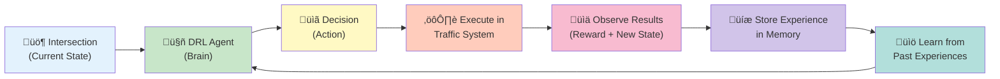

---

##### **Step-by-Step: How One Decision is Made**

###### **Step 1: Observe the Current Situation**

The DRL agent looks at the intersection and gathers information about what's happening right now:

**What the Agent "Sees":**

- **Vehicle queues**: How many cars waiting at each approach (North, South, East, West)
- **Bicycle queues**: How many bicycles waiting
- **Pedestrian crowds**: How many pedestrians waiting to cross
- **Current phase**: Which signal phase is running (Phase 1, 2, 3, 4, or 5)
- **Time elapsed**: How long has this phase been green
- **Detector signals**: Are vehicles/bicycles detected on the D30/D15 detectors?
- **Bus location**: Is a bus approaching? How far away?
- **Synchronization timer**: Time until the next coordination window with upstream/downstream intersection
- **Time of day**: Morning rush hour? Midday? Evening?

**Think of this like:** A human traffic controller looking at multiple screens showing camera feeds, detector readings,
and timers.

---

###### **Step 2: The Agent Decides What to Do**

Based on what it observes, the DRL agent chooses one of four possible actions:

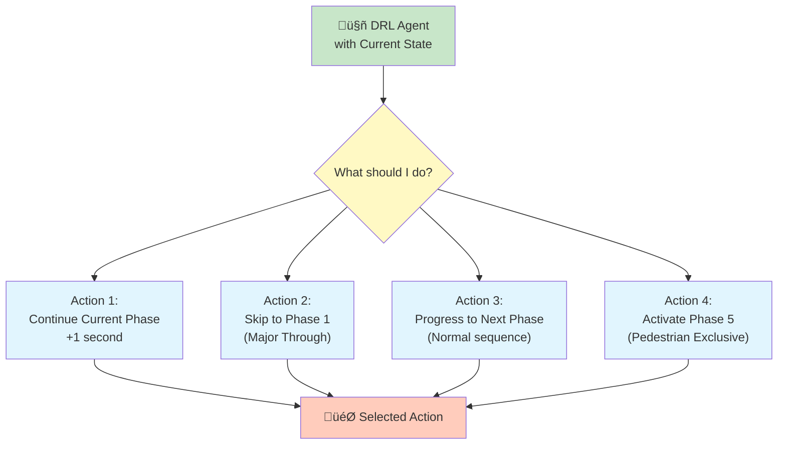

**How it Decides:**

- The agent uses a **neural network** (the "brain") that has learned from thousands of past experiences
- For each possible action, it calculates a **Q-value** (quality score) that predicts how good that action will be
- Usually picks the action with the **highest Q-value**, but sometimes tries random actions to explore new strategies

---

###### **Step 3: Execute the Action in SUMO**

The chosen action is sent to the SUMO traffic simulation:

**What Happens:**

- If "Continue Phase": Green light extended by 1 second
- If "Skip to Phase 1": Current phase ends, transition to major through phase
- If "Progress to Next": Move to the next phase in sequence (e.g., Phase 2 ‚Üí Phase 3)
- If "Activate Phase 5": Start the pedestrian exclusive phase

**Just like:** A human controller pressing buttons to change the signals.

---

###### **Step 4: Observe the Results**

After executing the action, the system measures what happened:

**Performance Metrics:**

- **Waiting times**: Did waiting times increase or decrease for each mode?
- **Queue lengths**: Did queues grow or shrink?
- **Emissions**: Did CO‚ÇÇ emissions go up or down?
- **Synchronization**: Did we successfully coordinate with the upstream intersection?
- **Safety**: Were there any conflicts or dangerous situations?

**Reward Calculation:** The agent receives a **reward score** that tells it how well it did:

- **Positive rewards** for: Reducing waiting times, achieving synchronization, serving vulnerable modes
- **Negative penalties** for: Long queues, high emissions, missed synchronization, safety issues

---

###### **Step 5: Store the Experience**

This entire experience is saved in the **Prioritized Replay Buffer**:

**What Gets Stored:**

```
Experience = {
    'state_before': [queue lengths, phase info, timers, ...],
    'action_taken': "Continue Phase",
    'reward_received': -5.2,
    'state_after': [new queue lengths, new phase info, ...],
    'priority': 8.5
}
```

**Priority Assignment:** Some experiences are marked as **more important** to learn from:

- **High priority**: Pedestrian phase activation, bus conflicts, sync failures, safety issues
- **Medium priority**: Normal synchronization attempts, mode balancing
- **Low priority**: Routine decisions with expected outcomes

---

###### **Step 6: Learning from Past Experiences**

Periodically (every few seconds), the agent updates its neural network by studying past experiences:

**The Learning Process:**

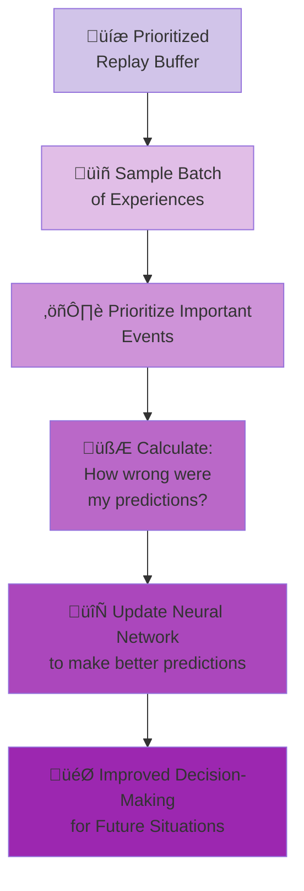

**What the Agent Learns:**

- "When there are 10+ pedestrians waiting and it's been 30+ seconds since their last green, activate Phase 5"
- "When the sync timer shows 8 seconds and there's a bus approaching, skip to Phase 1 now"
- "When bicycle queues are double the vehicle queues, extend the phase by 2 more seconds"
- "Don't activate pedestrian phase if only 3 pedestrians are waiting - waste of time"

---

# Complete DRL Control Flow Diagram


---

##### Key Difference: DRL vs. Your Rule-Based Control

###### **Your Developed Control (Rule-Based):**


**Fixed hierarchy**: Always checks conditions in the same order

---

###### **DRL Control (Learning-Based):**

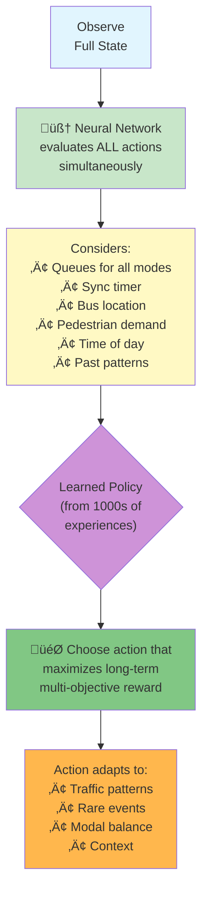

**Adaptive**: Weighs all factors simultaneously and learns what works best in different contexts

---

##### **Why Prioritized Experience Replay Matters**

###### **Problem Without PER:**

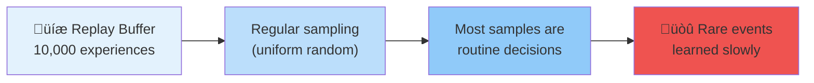

**Example:**

- 9,500 normal decisions (extend phase, regular flow)
- 300 synchronization attempts
- 150 bus priority cases
- **50 pedestrian phase activations** ‚Üê Very rare but critical!

Without PER: Agent might see pedestrian phase only **1-2 times** in 100 learning steps ‚Üí slow learning

---

###### **Solution With PER:**

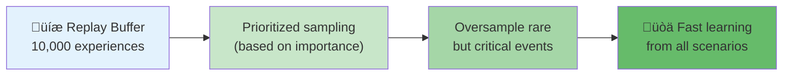

**With PER:** Agent sees pedestrian phase **20-30 times** in 100 learning steps ‚Üí fast learning!

---

##### **Real-World Example Scenario**

Let me walk you through a concrete example:

###### **Situation:**

- **Time:** 8:15 AM (morning rush hour)
- **Vehicle queues:** North: 8 cars, South: 5 cars, East: 2 cars, West: 1 car
- **Bicycle queues:** North: 6 bikes, South: 4 bikes
- **Pedestrians:** 12 people waiting to cross North-South, 4 waiting East-West
- **Current phase:** Phase 2 (Protected left turn) - running for 8 seconds
- **Bus:** Approaching from South, 80 meters away
- **Sync timer:** 15 seconds until coordination window

---

###### **What Your Rule-Based Control Would Do:**

```
1. Check min green (5s) ‚úì Yes, exceeded
2. Check max green (25s) ‚úó No, not reached
3. Check sync time ‚úó No, 15s remaining
4. Check bus priority ‚úó No, bus too far
5. Check detector windows ‚úó Bikes still passing
‚Üí Decision: Continue Phase 2 (extend by 1s)
```

**Result:** Continues Phase 2, making bus wait unnecessarily

---

###### **What DRL Control Would Do:**

```
Neural network evaluates:

Action 1 (Continue Phase 2): Q-value = 4.2
  - Good: Serves bicycles (high queue)
  - Bad: Bus will wait longer, miss sync window

Action 2 (Skip to Phase 1): Q-value = 8.7 ‚Üê HIGHEST!
  - Good: Catches sync, serves bus, major flow
  - Bad: Cuts off bicycle phase early
  - Learned: At 8am with these queues, this trade-off is optimal

Action 3 (Next Phase): Q-value = 3.5
  - Neutral choice

Action 4 (Pedestrian Phase): Q-value = 6.8
  - Good: 12 pedestrians is high demand
  - Bad: Misses sync, delays bus significantly

‚Üí Decision: Skip to Phase 1
```

**Result:**

- Bus experiences minimal delay
- Synchronization achieved
- Bicycles wait a bit longer (acceptable in morning rush)
- **Better overall system performance**

---

##### **The Training Process (High-Level)**

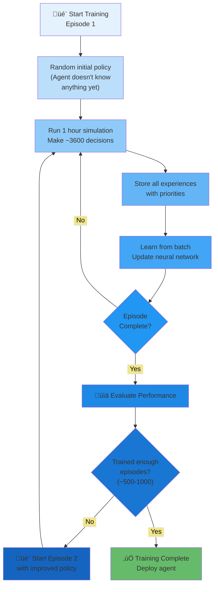

**Timeline:**

- Episode 1-50: Mostly random, exploring different strategies
- Episode 51-200: Starting to learn patterns, improving slowly
- Episode 201-500: Rapid improvement, discovering good policies
- Episode 501-1000: Fine-tuning, mastering rare events
- **After 1000 episodes: Expert traffic controller!**

---

##### **Key Advantages of DRL Over Rules**

###### **1. Adaptive to Context**

```
Morning rush (8 AM):
  DRL learns: Prioritize major arterial, tolerate longer bike waits

Midday (1 PM):
  DRL learns: Balance all modes equally, optimize overall delay

Evening (6 PM):
  DRL learns: Prioritize buses + bicycles, coordinate tightly
```

###### **2. Handles Rare Events Well (Thanks to PER)**

```
Pedestrian crowd (happens 2% of time):
  DRL trains on this 10x more ‚Üí learns optimal timing

Bus-sync conflict (happens 5% of time):
  DRL learns when to prioritize bus vs. sync

All-modes-high-demand (happens 1% of time):
  DRL learns emergency protocols
```

###### **3. Discovers Non-Obvious Strategies**

```
DRL might learn:
  "At 8:03 AM, if bike queue > 2x car queue,
   extend phase by 3s even if sync window approaches,
   because next cycle will still catch the following vehicle platoon"

This nuanced strategy is hard to encode as a rule!
```

---

##### **Summary: The Learning Journey**

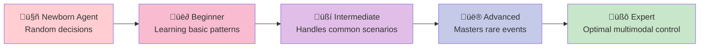

**What makes it work:**

- **Deep neural network**: Handles complex, high-dimensional traffic states
- **Reinforcement learning**: Learns from trial and error, no need for labeled data
- **Prioritized replay**: Ensures learning from rare but critical events
- **Multi-objective reward**: Balances competing goals (delay, emissions, equity, safety)

The DRL agent becomes a **traffic control expert** that adapts to patterns, handles edge cases, and continuously
improves its decisions!

---

**YES! Exactly!** You've understood it perfectly. Let me explain the two distinct phases very clearly:

---

# **DRL Implementation: Training Phase vs. Deployment Phase**

## **The Two-Phase Process**

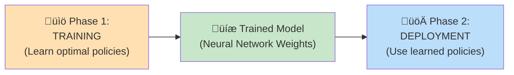

---

# **Phase 1: Training (Learning) - This Comes First**

###### **Purpose:**

Train the DRL agent by running **many simulations** so it learns what actions work best in different traffic situations.

###### **What Happens:**

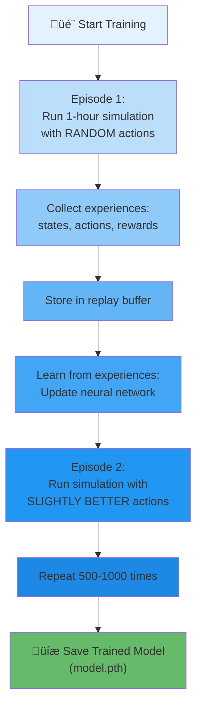

###### **Training Details:**

**What you do:**

1. **Initialize** a DRL agent with random neural network weights (it knows nothing!)
2. **Run Episode 1**:
    - Start SUMO simulation with your network (Pr_0 scenario)
    - Agent makes mostly **random decisions** (exploring)
    - Record what happened: states, actions, rewards
    - Episode ends after 1 hour of simulation time
3. **Learn**:
    - Neural network studies the recorded experiences
    - Updates its weights to make better decisions
4. **Run Episode 2**:
    - Start fresh simulation
    - Agent now makes **slightly better decisions** (still exploring)
    - Record new experiences
5. **Repeat 500-1000 episodes**:
    - Each episode, agent gets better
    - Gradually shifts from random exploration ‚Üí learned policy
6. **Save the trained model**:
    - Final neural network weights saved to disk (e.g., `drl_model.pth`)

**Training Metrics You Track:**

```
Episode 1:   Average Reward = -150  (very bad!)
Episode 50:  Average Reward = -80   (improving)
Episode 200: Average Reward = -30   (getting good)
Episode 500: Average Reward = +45   (excellent!)
Episode 800: Average Reward = +48   (converged - no more improvement)
‚Üí Stop training, save model
```

---

# **Phase 2: Deployment (Testing) - This Comes Second**

###### **Purpose:**

Use the **trained model** to control traffic and compare its performance against Reference and Developed controls.

###### **What Happens:**

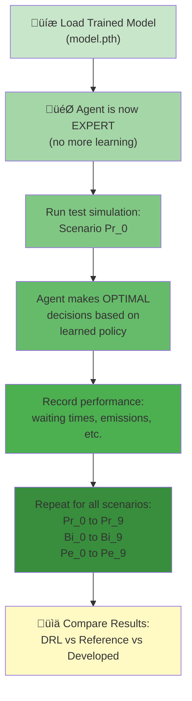

###### **Testing Details:**

**What you do:**

1. **Load trained model**: Read saved weights from disk
2. **Disable exploration**: Agent only uses its learned policy (no random actions)
3. **Run test simulations**:
    - Scenario Pr_0: DRL control makes decisions, record results
    - Scenario Pr_1: DRL control makes decisions, record results
    - ... continue for all 27 scenarios
4. **Collect performance metrics**:
    - Average waiting time per mode
    - Synchronization success rate
    - CO‚ÇÇ emissions
    - etc.
5. **Compare with baselines**:
    - DRL vs Reference Control
    - DRL vs Developed Control

**No learning happens** - the model is frozen!

---

##### **Complete Workflow Diagram**

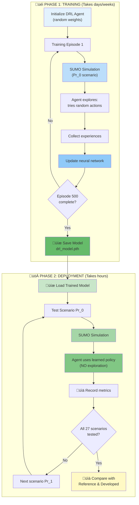

---

##### **Key Differences Between Training and Testing**

| **Aspect**         | **Training (Phase 1)**                | **Testing (Phase 2)**              |
| ------------------ | ------------------------------------- | ---------------------------------- |
| **Purpose**        | Learn optimal policy                  | Evaluate performance               |
| **Model State**    | Being updated constantly              | Fixed (frozen)                     |
| **Actions**        | Mix of learned + random (exploration) | Only learned policy (exploitation) |
| **Number of Runs** | 500-1000 episodes                     | 27 scenarios (1 run each)          |
| **Duration**       | Days to weeks                         | Few hours                          |
| **Output**         | Trained model file                    | Performance metrics                |
| **Learning**       | YES - weights updated                 | NO - no updates                    |

---

##### **Practical Example with Timeline**

###### **Week 1-2: Training Phase**

**Day 1-5: Initial Training**

**Training Progress:**

```
Episode 1:   Avg Reward = -145.2  (Terrible - random actions)
Episode 50:  Avg Reward = -78.5   (Learning patterns)
Episode 100: Avg Reward = -45.3   (Getting better)
Episode 200: Avg Reward = -15.8   (Good performance)
Episode 350: Avg Reward = +32.4   (Excellent!)
Episode 500: Avg Reward = +45.7   (Converged)
```

---

###### **Week 3: Testing Phase**

**Day 1-2: Run All Test Scenarios**

**Test Results:**

```
Scenario Pr_0:
  Reference Control:  Car wait = 45s, Bike wait = 89s
  Developed Control:  Car wait = 32s, Bike wait = 42s
  DRL Control:        Car wait = 29s, Bike wait = 35s  ‚Üê BEST!

Scenario Pr_5:
  Reference Control:  Car wait = 58s, Bike wait = 112s
  Developed Control:  Car wait = 42s, Bike wait = 51s
  DRL Control:        Car wait = 38s, Bike wait = 48s  ‚Üê BEST!
```

---

##### **Why Two Phases?**

###### **Training = "Going to School"**

- Agent practices on **many different situations**
- Makes mistakes, learns from them
- Gets better over time
- Like a student studying for years

###### **Testing = "Taking the Final Exam"**

- Agent demonstrates what it learned
- No more studying allowed
- Performance is measured
- Like a student taking standardized test

---

##### **Important Clarification**

###### **Training Uses Simulation Too!**

Yes, both phases use SUMO simulation:

- **Training**: Run simulation 500+ times to learn
- **Testing**: Run simulation 27 times to evaluate

**The difference:**

- **Training**: Agent is learning ‚Üí weights change after each episode
- **Testing**: Agent is frozen ‚Üí weights never change

---

###### **File Structure**

After training, your project will look like:

```
SignalSyncPro/
├── infrastructure/
│   ├── developed/          # Your current system
│   └── drl/                # New DRL system
├── src/
│   ├── training.py         # PHASE 1: Training code
│   ├── testing.py          # PHASE 2: Testing code
│   ├── agent.py            # DQN agent
│   └── environment.py      # SUMO interface
├── models/
│   ├── drl_trained_model.pth    # ← TRAINED MODEL (saved after Phase 1)
│   ├── checkpoint_ep100.pth     # Checkpoints during training
│   └── checkpoint_ep500.pth
├── results/
│   ├── training_logs.csv        # Training progress
│   └── test_results.csv         # Final comparison
└── configs/
    ├── scenarios/          # Pr_0 to Pe_9
    └── training_config.yaml
```

---

##### **Summary: The Complete Picture**

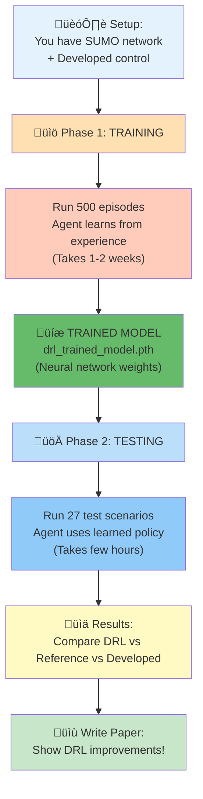

---

###### **Your Next Steps**

1. ‚úÖ **You have**: SUMO network + Developed control
2. ‚è≥ **Next**: Implement DRL agent + training loop
3. ‚è≥ **Then**: Run training (Phase 1) - get trained model
4. ‚è≥ **Finally**: Run testing (Phase 2) - compare performance
5. ‚è≥ **Write**: Paper showing improvements!

---

**YES! Exactly correct!** You've understood it perfectly. Let me clarify this crucial point:

---

##### Phase Structure vs. Phase Selection/Duration

###### What Stays the Same (Fixed Infrastructure):

**Your 5-Phase Structure** remains identical to your thesis:

- **Phase 1**: Major through (vehicles + bicycles) - same signal pattern
- **Phase 2**: Protected left turn (major direction) - same signal pattern
- **Phase 3**: Minor through (vehicles + bicycles) - same signal pattern
- **Phase 4**: Protected left turn (minor direction) - same signal pattern
- **Phase 5**: Pedestrian exclusive phase - same signal pattern

**The actual traffic signal patterns, lane permissions, and detector locations DO NOT change!**

---

##### What the DRL Model Learns (Adaptive Control):

The trained DRL model learns to **intelligently decide**:

##### 1. Which Phase to Activate Next

**Your Rule-Based Control (Developed):**

```
Fixed hierarchy:
- Check max green ‚Üí end phase
- Check sync time ‚Üí skip to Phase 1
- Check bus ‚Üí skip to Phase 1
- Check detectors ‚Üí continue or next phase
```

###### **DRL Control (Learned):**

```
Agent learns optimal phase selection:
- "Traffic state X ‚Üí Select Phase 1" (learned from experience)
- "Traffic state Y ‚Üí Select Phase 3" (learned from experience)
- "Traffic state Z ‚Üí Activate Phase 5" (learned from experience)
```

###### 2. How Long to Run Each Phase

**Your Rule-Based Control:**

```
- Minimum green: 5 seconds (fixed from RiLSA)
- Extend by 1 second if detectors occupied
- Maximum green: 44s (P1), 12s (P2), 24s (P3), 10s (P4) (fixed calculation)
```

**DRL Control (Learned):**

```
Agent learns optimal duration:
- Morning rush + high vehicle queue ‚Üí Run Phase 1 for 35 seconds
- Low traffic + high bicycle queue ‚Üí Run Phase 1 for 15 seconds
- High pedestrian demand ‚Üí Activate Phase 5 earlier
```

---

##### Concrete Example

###### Scenario: Morning Rush Hour (8:15 AM)

**Current Situation:**

- Vehicle queue: 8 cars (North), 5 cars (South)
- Bicycle queue: 6 bikes
- Pedestrians: 12 waiting
- Current phase: Phase 2 (protected left), running for 8 seconds
- Bus approaching: 80 meters away
- Sync timer: 15 seconds until coordination window

---

##### Your Developed Control (Rule-Based) Decision:

```
Check conditions in order:
1. Min green (5s)? YES ‚úì
2. Max green (12s)? NO (only 8s elapsed)
3. Sync time? NO (15s remaining)
4. Bus priority? NO (bus too far)
5. Detector window? NO (bikes still passing)

‚Üí Decision: CONTINUE Phase 2 (extend by 1 second)
```

**Result:** Phase 2 continues for 9 seconds, bus waits longer, misses sync window

---

##### DRL Control (Learned Policy) Decision:

```
Neural network evaluates current state:
Input state vector [45 dimensions]:
  - Phase encoding: [0, 1, 0, 0, 0] (Phase 2 active)
  - Phase duration: 0.13 (8s / 60s normalized)
  - Vehicle queues: [0.4, 0.25, 0.1, 0.05]
  - Bicycle queues: [0.3, 0.2]
  - Pedestrian demand: 0.24 (12 / 50 normalized)
  - Bus present: 1.0
  - Sync timer: 0.5 (15s / 30s normalized)
  - Time of day: 0.34 (8:15 AM normalized)
  ... (other features)

Network outputs Q-values:
  Q(Continue Phase 2)    = 4.2
  Q(Skip to Phase 1)     = 8.7  ‚Üê HIGHEST!
  Q(Next Phase)          = 3.5
  Q(Pedestrian Phase)    = 2.1

‚Üí Decision: SKIP TO PHASE 1
```

**Why Phase 1?** The agent **learned** from thousands of training episodes that at this time of day, with these traffic
conditions, skipping to Phase 1:

- Catches the sync window (coordinates with upstream intersection)
- Allows bus to pass quickly
- Reduces overall system delay
- The bicycle queue can wait (acceptable trade-off learned through training)

**Result:** Phase 1 activated, bus flows through, sync achieved, overall system performs better

---

##### Key Differences Illustrated


---

## What Does NOT Change

##### Infrastructure (100% Same):

1. **Network Topology**: Same intersections, lanes, distances (your `test.net.xml`)
2. **Detector Positions**: Same D30 (vehicles), D15 (bicycles), pedestrian detectors
3. **Phase Definitions**: Same signal states for each phase
4. **Leading Green**: Same 1-second leading green for vulnerable modes
5. **Bus Stops**: Same bus stop locations
6. **Vehicle Types**: Same passenger, bicycle, bus, pedestrian types

##### Physical Constraints (100% Same):

1. **Minimum Green**: Still respects 5-second minimum from RiLSA
2. **Yellow Time**: Same yellow/all-red clearance times
3. **Phase Transitions**: Still must go through yellow ‚Üí red ‚Üí next phase
4. **Maximum Green Limits**: Still has upper bounds (won't run forever)

---

## What the Model LEARNS to Change

##### Decision Making (Learned):

**1. Phase Selection Logic:**

**Instead of:**

```python
# Your rule-based logic
if max_green_reached:
    next_phase()
elif sync_time_reached:
    skip_to_phase_1()
elif bus_present:
    skip_to_phase_1()
elif detector_clear:
    next_phase()
else:
    continue_phase()
```

**DRL learns:**

```python
# Learned policy
state = get_current_state()  # 45 features
q_values = neural_network(state)  # Evaluates all options
action = argmax(q_values)  # Picks best action

# The network implicitly learned:
# "In morning rush with these queues ‚Üí Phase 1 best"
# "In midday with high bikes ‚Üí Phase 3 best"
# "High pedestrians + long wait ‚Üí Phase 5 best"
```

**2. Duration Optimization:**

**Your current system:**

- Extends phase by 1 second at a time based on detector windows
- Fixed maximum green times calculated from lane capacity

**DRL learns:**

- When to end phase early (even if detectors show demand)
- When to extend longer (even if approaching max green)
- Context-dependent duration based on system-wide state

---

## Practical Example: Phase Duration Learning

##### Scenario: Phase 1 (Major Through) Running

**Your Developed Control:**

```
Time 0s:  Phase 1 starts (leading green)
Time 1s:  Green begins
Time 6s:  Check detectors (occupied) ‚Üí continue
Time 7s:  Check detectors (occupied) ‚Üí continue
Time 8s:  Check detectors (occupied) ‚Üí continue
...
Time 35s: Detectors finally clear ‚Üí end phase
Time 44s: MAX GREEN reached ‚Üí forced end

Duration: Determined by detector windows OR max green
```

**DRL Agent (After Training):**

```
Time 0s:  Phase 1 starts
Time 1s:  Green begins
Time 6s:  Agent evaluates state ‚Üí decides "continue" (Q=7.5)
Time 12s: Agent evaluates state ‚Üí decides "continue" (Q=6.8)
Time 18s: Agent evaluates state ‚Üí decides "skip to Phase 3" (Q=8.2)
          Why? Learned that sync window approaching +
          minor direction has high bicycle queue

Duration: Determined by learned policy balancing multiple objectives
```

**Key Insight:** The agent learned through trial and error that in this specific situation, running Phase 1 for exactly
18 seconds and then serving the minor direction achieves:

- Better synchronization
- Lower bicycle waiting time
- Acceptable vehicle delay
- Higher overall reward

This specific timing (18 seconds) was **not programmed** - the agent **discovered** it through training!

---

## Training Process Clarification

##### What Happens During Training:

**Episode 1-50 (Random Exploration):**

```
Agent tries random phase durations:
- Phase 1 for 8 seconds ‚Üí sees result ‚Üí stores experience
- Phase 1 for 25 seconds ‚Üí sees result ‚Üí stores experience
- Phase 1 for 40 seconds ‚Üí sees result ‚Üí stores experience
- Activates Phase 5 randomly ‚Üí sees result ‚Üí stores experience

Learning: "Hmm, 8 seconds was too short (high reward penalty)"
          "40 seconds wasted time (penalty)"
          "25 seconds seemed better (higher reward)"
```

**Episode 51-200 (Improving):**

```
Agent starts learning patterns:
- "Morning rush + high queue ‚Üí longer Phase 1 is better"
- "Low traffic ‚Üí shorter phases are better"
- "High pedestrians ‚Üí activate Phase 5 sooner"

Still exploring, but getting better average rewards
```

**Episode 201-500 (Mastering):**

```
Agent has learned good policies:
- Knows optimal phase durations for different situations
- Learned when to prioritize sync vs. mode equity
- Discovered non-obvious strategies
  (e.g., "sometimes skip sync for pedestrian safety")

Epsilon low (mostly exploiting learned policy)
```

**Episode 501-1000 (Fine-tuning):**

```
Agent fine-tunes edge cases:
- Rare scenarios (bus + high pedestrian + sync conflict)
- Optimal handling of Phase 5 activation threshold
- Perfect timing for coordination windows

Near-optimal policy achieved
```

---

## After Training: Deployment

##### The Trained Model Contains:

**Neural Network Weights** (saved in `final_model.pth`):

```python
# These weights encode learned knowledge like:
# "If state looks like [0.4, 0.3, 0.2, ...] ‚Üí Phase 1 best (Q=8.7)"
# "If state looks like [0.1, 0.8, 0.5, ...] ‚Üí Phase 3 best (Q=9.2)"
# "If state looks like [0.2, 0.2, 0.9, ...] ‚Üí Phase 5 best (Q=8.9)"

policy_network_weights = [
    layer1_weights: 45x256 matrix,
    layer2_weights: 256x256 matrix,
    layer3_weights: 256x128 matrix,
    output_weights: 128x4 matrix
]
```

##### Testing Phase Uses This Model:

```python
# Load trained model
agent.load("models/final_model.pth")
agent.set_eval_mode()  # No more learning!

# Run test scenarios
for scenario in ['Pr_0', 'Pr_1', ..., 'Pe_9']:
    state = env.reset()

    while not done:
        # Use learned policy (NO exploration)
        action = agent.select_action(state, explore=False)

        # This uses the trained neural network to pick:
        # - Which phase to activate
        # - When to transition

        next_state, reward, done, info = env.step(action)
        state = next_state

    # Record performance metrics
```

---

## Summary

**What stays the same:**

- ‚úÖ Physical infrastructure (network, detectors, lanes)
- ‚úÖ Phase signal patterns (which lights are green/red)
- ‚úÖ Vehicle types and routing
- ‚úÖ Safety constraints (minimum green, clearance times)

**What the DRL model learns to control:**

- 🎯 **Which phase to activate next** (intelligent phase selection)
- 🎯 **How long to run each phase** (optimal duration)
- 🎯 **When to skip phases** (e.g., skip to Phase 1 for sync)
- 🎯 **When to activate pedestrian phase** (timing optimization)
- 🎯 **How to balance competing objectives** (sync vs. equity vs. delay)

**The model learns the CONTROL LOGIC, not the infrastructure!**

Your phase structure is the "vocabulary" - the DRL agent learns the "grammar" of how to use it optimally!

---

# Reward Logic Comparison: Previous vs. Updated

Let me explain the fundamental difference between the two reward calculation approaches:

---

##### Previous Reward Logic (BROKEN)

###### The Problem

Your original reward was calculating **cumulative totals** across the entire episode, leading to massive negative
numbers.

###### How It Worked

```mermaid
flowchart TD
    A["Episode Start<br>t=0 seconds"] --> B["Step 1: 10 vehicles waiting<br>Total wait = 50 seconds"]
    B --> C["Reward = -0.1 √ó 50 = -5"]
    C --> D["Step 2: 15 vehicles waiting<br>Total wait = 125 seconds<br>(cumulative!)"]
    D --> E["Reward = -0.1 √ó 125 = -12.5"]
    E --> F["Step 3: 20 vehicles waiting<br>Total wait = 250 seconds<br>(keeps growing!)"]
    F --> G["Reward = -0.1 √ó 250 = -25"]
    G --> H["...continue for 3600 steps..."]
    H --> I["Step 3600:<br>Total wait = 8,000,000 seconds<br>(accumulated over hour!)"]
    I --> J["Reward = -0.1 √ó 8,000,000<br>= -800,000 ‚ùå"]

    style A fill:#E3F2FD
    style B fill:#BBDEFB
    style D fill:#90CAF9
    style F fill:#64B5F6
    style H fill:#42A5F5
    style I fill:#EF5350
    style J fill:#C62828
```

**Problem:** The old reward added up ALL waiting time from ALL vehicles from the START of the episode.

**Example:**

- **Second 1:** 5 cars waiting, each waited 10 seconds ‚Üí Total = 50 seconds
    - Reward = -0.1 √ó 50 = **-5**
- **Second 2:** Same 5 cars still waiting (now 11 seconds each) + 3 new cars (1 second each) ‚Üí Total = 5√ó11 + 3√ó1 = 58
  seconds
    - But wait! The OLD code was adding 50 + 58 = **108 seconds cumulative**
    - Reward = -0.1 √ó 108 = **-10.8**
- **Second 100:** Total accumulated waiting = 50,000 seconds
    - Reward = -0.1 √ó 50,000 = **-5,000**
- **Second 3600:** Total accumulated = 8,000,000 seconds
    - Reward = -0.1 √ó 8,000,000 = **-800,000** ‚ùå

**Why This Breaks Training:**

1. Rewards grow **exponentially negative** as episode continues
2. Later actions get blamed for ALL previous waiting
3. Neural network cannot learn because reward scale is unstable
4. Loss explodes (22,542) because network tries to predict -800,000

---

##### Updated Reward Logic (FIXED)

###### The Solution

Calculate **instantaneous** (current moment only) metrics and **normalize** to a fixed scale.

###### How It Works

```mermaid
flowchart TD
    A["Episode: Any time step<br>t = any second"] --> B["Count ONLY vehicles<br>currently stopped<br>(speed < 0.1)"]
    B --> C["Vehicle 1: waiting 5s<br>Vehicle 2: waiting 3s<br>Vehicle 3: waiting 8s"]
    C --> D["Average THIS moment:<br>(5 + 3 + 8) / 3 = 5.3 seconds"]
    D --> E["Normalize to 0-1 scale:<br>5.3 / 60 = 0.088"]
    E --> F["Reward component:<br>-1.0 √ó 0.088 = -0.088"]
    F --> G["Add other components:<br>Sync bonus: +0.5<br>Ped phase: +0.0"]
    G --> H["Total reward:<br>-0.088 + 0.5 = +0.412"]
    H --> I["Clip to safe range:<br>[-2.0, +2.0]"]
    I --> J["Final reward: +0.412 ‚úì"]

    K["Next time step:<br>t = next second"] --> B

    style A fill:#C8E6C9
    style B fill:#A5D6A7
    style D fill:#81C784
    style E fill:#66BB6A
    style H fill:#4CAF50
    style J fill:#2E7D32
```

**Solution:** Only measure what's happening RIGHT NOW, then normalize to a small scale.

###### **Example (Same traffic situation):**

###### Step 1 (t=100 seconds):

```
Currently stopped vehicles:
- Car 1: waiting 5 seconds
- Car 2: waiting 3 seconds
- Car 3: waiting 8 seconds
- Bike 1: waiting 2 seconds

Average wait THIS moment = (5+3+8+2)/4 = 4.5 seconds
Normalized = 4.5 / 60 = 0.075
Wait penalty = -1.0 √ó 0.075 = -0.075

Check sync: Both intersections Phase 1? YES ‚Üí +0.5
Check ped phase: Active? NO ‚Üí +0.0

Total reward = -0.075 + 0.5 = +0.425 ‚úì
```

###### Step 2 (t=101 seconds):

```
New situation (1 second later):
- Car 1: waiting 6 seconds (still there)
- Car 2: DEPARTED (moved through)
- Car 3: waiting 9 seconds
- Bike 1: waiting 3 seconds
- NEW Car 4: waiting 1 second

Average wait THIS moment = (6+9+3+1)/4 = 4.75 seconds
Normalized = 4.75 / 60 = 0.079
Wait penalty = -1.0 √ó 0.079 = -0.079

Check sync: Lost sync ‚Üí +0.0
Check ped phase: NO ‚Üí +0.0

Total reward = -0.079 + 0.0 = -0.079 ‚úì
```

###### Step 3 (t=102 seconds):

```
Situation improved:
- Car 3: waiting 10 seconds
- Bike 1: waiting 4 seconds
- Car 4: waiting 2 seconds
(Cars 1 departed!)

Average wait = (10+4+2)/3 = 5.33 seconds
Normalized = 5.33 / 60 = 0.089
Wait penalty = -1.0 √ó 0.089 = -0.089

Total reward = -0.089 ‚úì
```

**Key Differences:**

1. ‚úÖ Each step is **independent** - doesn't accumulate
2. ‚úÖ Reward stays in **stable range** (-2 to +2)
3. ‚úÖ Network can **learn patterns** (good action ‚Üí better reward)
4. ‚úÖ Loss stays **reasonable** (< 10.0)

---

##### Side-by-Side Comparison

###### Scenario: 1-Hour Episode

```mermaid
flowchart LR
    subgraph Old["‚ùå OLD LOGIC (Broken)"]
        A1["t=1: Reward=-5"] --> A2["t=100: Reward=-5,000"]
        A2 --> A3["t=500: Reward=-125,000"]
        A3 --> A4["t=1800: Reward=-450,000"]
        A4 --> A5["t=3600: Reward=-800,000"]
        A5 --> A6["Loss: 22,542<br>Training fails!"]
    end

    subgraph New["‚úì NEW LOGIC (Fixed)"]
        B1["t=1: Reward=-0.8"] --> B2["t=100: Reward=-0.6"]
        B2 --> B3["t=500: Reward=+0.3"]
        B3 --> B4["t=1800: Reward=-0.4"]
        B4 --> B5["t=3600: Reward=+0.5"]
        B5 --> B6["Loss: 2.3<br>Training works!"]
    end

    style A5 fill:#EF5350
    style A6 fill:#C62828
    style B5 fill:#66BB6A
    style B6 fill:#2E7D32
```

###### Numerical Example

**Same traffic scenario at t=1000 seconds:**

| Metric                | Old Logic                                      | New Logic                   |
| --------------------- | ---------------------------------------------- | --------------------------- |
| **Vehicles waiting**  | 10 cars                                        | 10 cars (same)              |
| **Average wait time** | 15 seconds                                     | 15 seconds (same)           |
| **Calculation**       | Sum ALL waits since t=0<br>= 1,500,000 seconds | Average NOW<br>= 15 seconds |
| **Normalization**     | None                                           | 15 / 60 = 0.25              |
| **Penalty**           | -0.1 √ó 1,500,000                               | -1.0 √ó 0.25                 |
| **Reward**            | **-150,000** ‚ùå                                | **-0.25** ‚úì                 |

---

##### Why Normalization Matters

###### Old Reward (No Normalization)

```mermaid
flowchart TD
    A["Waiting time grows<br>throughout episode"] --> B["Early: 50 seconds<br>Reward: -5"]
    A --> C["Middle: 500,000 seconds<br>Reward: -50,000"]
    A --> D["End: 8,000,000 seconds<br>Reward: -800,000"]

    B --> E["Network tries to predict<br>Q-value"]
    C --> E
    D --> E

    E --> F["Q-value range:<br>-800,000 to +100"]
    F --> G["Loss calculation:<br>(-800,000 - prediction)²"]
    G --> H["Loss = 22,542<br>Gradients explode!"]

    style D fill:#EF5350
    style H fill:#C62828
```

###### New Reward (Normalized)

```mermaid
flowchart TD
    A["Waiting time always<br>normalized to 0-1"] --> B["Early: 0.05<br>Reward: -0.05"]
    A --> C["Middle: 0.35<br>Reward: -0.35"]
    A --> D["End: 0.12<br>Reward: -0.12"]

    B --> E["Network tries to predict<br>Q-value"]
    C --> E
    D --> E

    E --> F["Q-value range:<br>-2.0 to +2.0"]
    F --> G["Loss calculation:<br>(-0.12 - prediction)²"]
    G --> H["Loss = 2.3<br>Gradients stable!"]

    style D fill:#66BB6A
    style H fill:#2E7D32
```

---

##### Reward Components Breakdown

###### Old Formula (Broken)

```python
# Episode step 1
vehicles_waiting = [10s, 5s, 8s, 12s, 3s]  # 5 vehicles
total_wait = sum(vehicles_waiting) = 38 seconds
reward = -0.1 * 38 = -3.8

# Episode step 100 (same 5 vehicles still waiting)
vehicles_waiting = [110s, 105s, 108s, 112s, 103s]
total_wait = sum(vehicles_waiting) = 538 seconds  # CUMULATIVE!
reward = -0.1 * 538 = -53.8

# Episode step 1000
vehicles_waiting = [1010s, 1005s, 1008s, 1012s, 1003s]
total_wait = sum(vehicles_waiting) = 5,038 seconds  # KEEPS GROWING!
reward = -0.1 * 5038 = -503.8

# Episode step 3600
total_wait = 18,000+ seconds accumulated
reward = -0.1 * 18000 = -1,800 per vehicle
       = -1,800 * 100+ vehicles = -180,000+ total
```

**Problem:** Reward punishes agent for waiting that happened BEFORE it took action!

---

###### New Formula (Fixed)

```python
# Episode step 1
currently_stopped = [Car1: 10s, Car2: 5s, Bike1: 8s]
average_wait_now = (10 + 5 + 8) / 3 = 7.67 seconds
normalized = 7.67 / 60 = 0.128
wait_penalty = -1.0 * 0.128 = -0.128

sync_achieved = True ‚Üí +0.5
ped_phase_active = False ‚Üí +0.0

reward = -0.128 + 0.5 + 0.0 = +0.372 ‚úì

# Episode step 100 (different vehicles now)
currently_stopped = [Car5: 3s, Bike3: 12s]
average_wait_now = (3 + 12) / 2 = 7.5 seconds
normalized = 7.5 / 60 = 0.125
wait_penalty = -1.0 * 0.125 = -0.125

sync_achieved = False ‚Üí +0.0
ped_phase_active = False ‚Üí +0.0

reward = -0.125 + 0.0 + 0.0 = -0.125 ‚úì

# Episode step 3600
currently_stopped = [Bike2: 5s, Car8: 15s, Bus1: 8s]
average_wait_now = (5 + 15 + 8) / 3 = 9.33 seconds
normalized = 9.33 / 60 = 0.156
wait_penalty = -1.0 * 0.156 = -0.156

sync_achieved = True ‚Üí +0.5
ped_phase_active = False ‚Üí +0.0

reward = -0.156 + 0.5 + 0.0 = +0.344 ‚úì
```

**Benefit:** Reward reflects CURRENT performance, not history!

---

##### Training Impact

###### Old Logic - Training Diverges

```mermaid
flowchart LR
    A["Episode 1<br>Reward: -500,000"] --> B["Episode 2<br>Reward: -650,000"]
    B --> C["Episode 3<br>Reward: -800,000"]
    C --> D["Episode 10<br>Reward: -1,200,000"]
    D --> E["‚ùå Training fails<br>Network cannot converge"]

    style E fill:#EF5350
```

**Why it fails:**

- Rewards have no consistent scale
- Network cannot distinguish good vs bad actions
- Loss explodes (22,542)
- Gradients vanish or explode

---

###### New Logic - Training Converges

```mermaid
flowchart LR
    A["Episode 1<br>Reward: -1.2"] --> B["Episode 10<br>Reward: -0.8"]
    B --> C["Episode 50<br>Reward: -0.4"]
    C --> D["Episode 200<br>Reward: +0.3"]
    D --> E["‚úì Training succeeds<br>Network learns patterns"]

    style E fill:#66BB6A
```

**Why it works:**

- Rewards in consistent range [-2, +2]
- Network learns: good action ‚Üí higher reward
- Loss reasonable (< 10.0)
- Gradients stable

---

###### Summary: Key Differences

| Aspect               | Old Logic ‚ùå              | New Logic ‚úì            |
| -------------------- | ------------------------- | ---------------------- |
| **Measurement**      | Cumulative total          | Instantaneous snapshot |
| **Scale**            | Unbounded (-‚àû to 0)       | Normalized [-2 to +2]  |
| **Time dependency**  | Depends on episode length | Independent of time    |
| **Example reward**   | -662,482                  | -0.8                   |
| **Example loss**     | 22,542                    | 2.3                    |
| **Training**         | Fails (explodes)          | Works (converges)      |
| **Interpretability** | Meaningless number        | Clear signal           |

The fix transforms your reward from an **unusable accumulator** into a **proper learning signal** that the neural
network can actually learn from!

---

##### **Q: I have 2 signals and 2 traffic lights for total - is the trained model gogin to control both of them or it handles seperarely?**

Based on the current implementation, the **trained model handles each intersection separately**. Here's why:

###### **Current Architecture: Independent Control**

Each intersection has its own:

- **State**: 45-dimensional vector (queues, phase, detectors, etc.) for that specific intersection
- **DQN Agent**: Separate policy and target networks
- **Decision**: Independent action selection

```
Intersection 1 ‚Üí State‚ÇÅ [45 dims] ‚Üí DQN Agent‚ÇÅ ‚Üí Action‚ÇÅ
Intersection 2 ‚Üí State‚ÇÇ [45 dims] ‚Üí DQN Agent‚ÇÇ ‚Üí Action‚ÇÇ
```

###### **Why Separate?**

Your state representation (45 dimensions) captures:

- Local queue lengths
- Local phase information
- Local detector data
- **Sync timer** (coordination signal)

The sync timer is how intersections coordinate, but each agent makes independent decisions based on its local state.

###### **Alternative: Centralized Control**

If you wanted **one model to control both**, you'd need:

```python
# Combined state: [90 dimensions] = [Intersection1: 45] + [Intersection2: 45]
# Combined actions: 16 possible = 4 actions √ó 4 actions

state_combined = np.concatenate([state_intersection1, state_intersection2])
# Shape: [90]

# Single DQN with larger input
model = DQN(state_dim=90, action_dim=16)  # 16 = 4√ó4 joint actions
```

###### **Which is Better?**

**Independent (Current):**

- ‚úÖ Simpler, scales to many intersections
- ‚úÖ Faster training (smaller state/action space)
- ‚úÖ Coordination via sync timer in state
- ‚ùå Can't learn complex joint strategies

**Centralized:**

- ‚úÖ Can learn optimal joint policies
- ❌ Exponential growth: 3 intersections = 4³ = 64 actions
- ‚ùå Much slower training
- ‚ùå Doesn't scale well

**Your current approach (independent + sync timer) is the standard solution for multi-intersection control.**

---

Based on your MSc thesis, here's a comprehensive explanation of how semi-synchronized coordination was achieved:

---

###### **Semi-Synchronization Concept Overview**

Your Developed Control implements **semi-synchronization** - a partial coordination strategy for **fully actuated
control** that differs from traditional pre-timed coordination.

**Key Challenge:**

- Cannot use conventional coordination (which requires fixed timing)
- Intersections run independently with actuation
- Need to coordinate without sacrificing responsiveness to other modes

---

###### **Coordination Parameters**

**Geometric Setup:**

- Two intersections separated by **300 meters**
- Coordination along major arterial (both directions)
- Target speed: **40 km/h** for motorized vehicles

**Travel Time Calculation:**

```
Distance = 300 meters
Speed = 40 km/h = 40,000 m/3600 s = 11.11 m/s

Travel time = 300 m √∑ 11.11 m/s = 27.0 seconds
```

**Coordination Timing:**

```
Coordination check time = Travel time - Change time
                       = 27.0 sec - (3 sec yellow + 2 sec all-red)
                       = 22.0 seconds
```

**This is why your DRL environment uses `sync_timer = step_time + 22`!**

---

###### **How Semi-Synchronization Works**

**Step-by-Step Process:**

**1. Upstream Intersection (e.g., Intersection 3):**

```
Time T = 0: Phase 1 (major through) GREEN starts
            ‚Üì
            Set coordination timer for downstream intersection
            Timer = T + 22 seconds
```

**2. Downstream Intersection (e.g., Intersection 6):**

```
At Time T + 22 seconds:
    Check: What phase is currently active?

    Decision depends on current state...
```

---

###### **Four Decision Scenarios**

**Scenario A: In Actuated Portion of Phase 2, 3, or 4**

```
Current: Phase 2, 3, or 4 (minor phases)
Action: IMMEDIATE PHASE SKIP to Phase 1
Process:
    1. Shut down current phase
    2. Insert change interval (5 sec: yellow + all-red)
    3. Activate Phase 1

Timing: Phase 1 activates at exactly 27 seconds
Result: PERFECT SYNCHRONIZATION ‚úì
Benefit: Vehicles pass both intersections without stopping!
```

**Example:**

```
Intersection 3: Phase 1 starts at 100 sec
Intersection 6: At 122 sec (100 + 22):
    - Currently in Phase 3 (minor through)
    - Skip Phase 3 immediately
    - Change interval: 122 to 127 sec
    - Phase 1 starts: 127 sec (100 + 27 = perfect!)
```

---

**Scenario B: Already in Phase 1**

```
Current: Phase 1 (major through) active
Action: CONTINUE - No synchronization action needed
Process:
    1. Reset sync parameter to default
    2. Let actuation logic handle it
    3. Vehicles extend green via detectors

Timing: Natural Phase 1 service
Result: Already coordinated (lucky timing)
Benefit: Minimum delay, natural flow
```

---

**Scenario C: In Change Time After Phase 1, 2, or 3**

```
Current: Yellow or all-red clearance interval
Action: DEFER synchronization to next phase
Process:
    1. Complete current change interval
    2. Serve minimum green of next phase (5 sec)
    3. Then skip to Phase 1

Timing: Maximum delay = 11 seconds
        = change time (5s) + leading green (1s) + min green (5s)
Result: Near-synchronization with acceptable delay
```

---

**Scenario D: Phase 5 (Pedestrian) or Related Change**

```
Current: Pedestrian exclusive phase active
Action: WAIT for Phase 5 completion
Process:
    1. Serve pedestrian phase completely
    2. Resume normal phase sequence
    3. Vehicles wait until next Phase 1

Result: Synchronization sacrificed for pedestrian safety
Priority: Pedestrians > Coordination
```

---

###### **Probability of Successful Coordination**

**Your thesis calculation:**

**Total Cycle Duration (without Phase 5):**

```
Maximum cycle = 114.0 seconds

Phase breakdown:
- Phase 1 (major through): Actuated green ~20-30 sec
- Phase 2 (major left): Actuated green ~10-15 sec
- Phase 3 (minor through): Actuated green ~15-20 sec
- Phase 4 (minor left): Actuated green ~10-15 sec
- Change intervals: 4 phases √ó 5 sec = 20 sec

Total actuated green time: ~70 seconds
```

**Coordination Success Probability:**

```
Favorable windows (can skip to Phase 1):
    - Phase 2, 3, 4 actuated portions: ~50 seconds

Probability = 50 sec / 114 sec ≈ 60%

"Works with 60% probability to coordinate"
```

---

###### **Phase Skipping Mechanism**

**What is Phase Skipping?**

Instead of always following: P1 ‚Üí P2 ‚Üí P3 ‚Üí P4 ‚Üí P1

With phase skipping:

```
P1 ‚Üí P2 ‚Üí P1  (skip P3, P4)
P1 ‚Üí P3 ‚Üí P1  (skip P2, P4)
P1 ‚Üí P4 ‚Üí P1  (skip P2, P3)
```

**When Phase Skipping Occurs:**

1. **Synchronization trigger**: 22 seconds after upstream Phase 1
2. **Bus priority**: Bus detected on approach
3. **Low demand**: Other phases have no actuation

---

###### **Bidirectional Coordination**

**Both directions coordinated:**

```
Direction: Intersection 3 ‚Üí Intersection 6
    Int 3 starts Phase 1 at T = 0
    Int 6 aims for Phase 1 at T = 22 sec

Direction: Intersection 6 ‚Üí Intersection 3
    Int 6 starts Phase 1 at T = 50
    Int 3 aims for Phase 1 at T = 72 sec
```

**Independent but coordinated:**

- Each intersection runs its own actuation
- Coordination requests sent via timer
- Actuated control can override for other modes

---

###### **Comparison with Traditional Coordination**

| Aspect           | Pre-Timed Coordination | Your Semi-Synchronization            |
| ---------------- | ---------------------- | ------------------------------------ |
| **Timing**       | Fixed cycle lengths    | Variable (actuated)                  |
| **Flexibility**  | Rigid, cannot adapt    | Adapts to traffic                    |
| **Modes**        | Cars only              | All modes (cars, bikes, peds, buses) |
| **Success Rate** | 100% (but inflexible)  | ~60% (but responsive)                |
| **Pedestrians**  | Must wait for cycle    | Priority phase available             |
| **Buses**        | No priority            | Priority via phase skip              |
| **Low Traffic**  | Wastes green time      | Efficient (skips empty phases)       |

---

Here are comprehensive Mermaid diagrams explaining your semi-synchronization mechanism:

---

##### **Diagram 1: Semi-Synchronization Overview**

```mermaid
flowchart TB
    Start["Intersection 3:<br>Phase 1 GREEN starts<br>at Time T = 0 sec"] --> SetTimer["Set coordination timer<br>for Intersection 6<br>Timer = T + 22 seconds"]

    SetTimer --> Travel["Vehicles travel 300m<br>@ 40 km/h<br>Travel time = 27 seconds"]

    Travel --> Check["At T + 22 seconds:<br>Check Intersection 6<br>current phase"]

    Check --> DecisionA{"Phase 2, 3,<br>or 4 active?"}
    Check --> DecisionB{"Phase 1<br>already active?"}
    Check --> DecisionC{"In change<br>interval?"}
    Check --> DecisionD{"Phase 5<br>(Pedestrian)?"}

    DecisionA -->|<span style='background-color:khaki; color:black; padding:2px 6px; border-radius:3px'>Yes</span>| ActionA["IMMEDIATE SKIP:<br>1. Shut down current phase<br>2. Change interval (5 sec)<br>3. Start Phase 1"]

    DecisionB -->|<span style='background-color:khaki; color:black; padding:2px 6px; border-radius:3px'>Yes</span>| ActionB["CONTINUE:<br>No action needed<br>Already coordinated<br>Use detector actuation"]

    DecisionC -->|<span style='background-color:khaki; color:black; padding:2px 6px; border-radius:3px'>Yes</span>| ActionC["DEFER:<br>Complete change interval<br>Serve min green (5s)<br>Then skip to Phase 1"]

    DecisionD -->|<span style='background-color:khaki; color:black; padding:2px 6px; border-radius:3px'>Yes</span>| ActionD["WAIT:<br>Serve pedestrians<br>completely<br>Resume normal sequence"]

    ActionA --> ResultA["Perfect Sync!<br>Phase 1 at T + 27 sec<br>Vehicles pass without stop"]
    ActionB --> ResultB["Natural Sync<br>Lucky timing<br>Minimum delay"]
    ActionC --> ResultC["Near Sync<br>Max delay = 11 sec<br>Acceptable coordination"]
    ActionD --> ResultD["No Sync<br>Pedestrian priority<br>Vehicles wait"]

    ResultA --> Prob["Success Probability:<br>~60% of time"]
    ResultB --> Prob
    ResultC --> Prob
    ResultD --> Prob

    style Start fill:#E3F2FD
    style SetTimer fill:#BBDEFB
    style Travel fill:#90CAF9
    style Check fill:#64B5F6
    style DecisionA fill:#42A5F5
    style DecisionB fill:#42A5F5
    style DecisionC fill:#42A5F5
    style DecisionD fill:#42A5F5
    style ActionA fill:#81C784
    style ActionB fill:#81C784
    style ActionC fill:#FFF59D
    style ActionD fill:#EF9A9A
    style ResultA fill:#66BB6A
    style ResultB fill:#9CCC65
    style ResultC fill:#FFEB3B
    style ResultD fill:#EF5350
    style Prob fill:#BA68C8
```

---

##### **Diagram 2: Coordination Timing Breakdown**

```mermaid
gantt
    title Semi-Synchronization Timing (Intersection 3 ‚Üí Intersection 6)
    dateFormat s
    axisFormat %S sec

    section Intersection 3
    Phase 1 Green    :active, int3_p1, 0, 25s
    Phase 2 or Next  :int3_next, 25, 40s

    section Travel Time
    Vehicles Moving (300m @ 40km/h)  :crit, travel, 0, 27s

    section Coordination Window
    Check Time (T+22s)  :milestone, check, 22, 22s
    Perfect Sync Window (T+27s)  :milestone, sync, 27, 27s

    section Intersection 6
    Any Phase Active :phase_any, 20, 22s
    Change Interval  :active, change, 22, 27s
    Phase 1 Green    :done, int6_p1, 27, 52s
```

---

##### **Diagram 3: Phase Skipping Decision Logic**

```mermaid
flowchart TD
    Upstream["UPSTREAM INTERSECTION<br>(e.g., Intersection 3)<br>Phase 1 starts at T=0"]

    Downstream["DOWNSTREAM INTERSECTION<br>(e.g., Intersection 6)<br>Receives coordination signal"]

    Upstream --> Signal["Coordination Signal:<br>Timer = T + 22 seconds"]
    Signal --> Downstream

    Downstream --> CheckPhase["At T + 22 seconds:<br>What is current phase?"]

    CheckPhase --> P1{"Current<br>Phase = 1?"}
    CheckPhase --> P2{"Current<br>Phase = 2?"}
    CheckPhase --> P3{"Current<br>Phase = 3?"}
    CheckPhase --> P4{"Current<br>Phase = 4?"}
    CheckPhase --> P5{"Current<br>Phase = 5?"}
    CheckPhase --> Change{"In change<br>interval?"}

    P1 -->|<span style='background-color:khaki; color:black; padding:2px 6px; border-radius:3px'>Yes</span>| Continue["Continue Phase 1<br>No skip needed<br>Natural coordination"]

    P2 -->|<span style='background-color:khaki; color:black; padding:2px 6px; border-radius:3px'>Yes</span>| Skip2["SKIP Phase 2:<br>P2 ‚Üí Yellow ‚Üí All-red ‚Üí P1<br>Duration: 5 seconds"]

    P3 -->|<span style='background-color:khaki; color:black; padding:2px 6px; border-radius:3px'>Yes</span>| Skip3["SKIP Phase 3:<br>P3 ‚Üí Yellow ‚Üí All-red ‚Üí P1<br>Duration: 5 seconds"]

    P4 -->|<span style='background-color:khaki; color:black; padding:2px 6px; border-radius:3px'>Yes</span>| Skip4["SKIP Phase 4:<br>P4 ‚Üí Yellow ‚Üí All-red ‚Üí P1<br>Duration: 5 seconds"]

    P5 -->|<span style='background-color:khaki; color:black; padding:2px 6px; border-radius:3px'>Yes</span>| Wait["WAIT for Phase 5:<br>Pedestrians have priority<br>No skip allowed"]

    Change -->|<span style='background-color:khaki; color:black; padding:2px 6px; border-radius:3px'>Yes</span>| Defer["DEFER to next phase:<br>Complete change ‚Üí Min green<br>Then skip to Phase 1"]

    Continue --> Sync1["Perfect: Already synced"]
    Skip2 --> Sync2["Perfect: Sync at T+27s"]
    Skip3 --> Sync3["Perfect: Sync at T+27s"]
    Skip4 --> Sync4["Perfect: Sync at T+27s"]
    Wait --> NoSync["No sync: Ped priority"]
    Defer --> NearSync["Near sync: Delay ≤11s"]

    style Upstream fill:#E3F2FD
    style Downstream fill:#BBDEFB
    style Signal fill:#90CAF9
    style CheckPhase fill:#64B5F6
    style P1 fill:#42A5F5
    style P2 fill:#42A5F5
    style P3 fill:#42A5F5
    style P4 fill:#42A5F5
    style P5 fill:#42A5F5
    style Change fill:#42A5F5
    style Continue fill:#66BB6A
    style Skip2 fill:#81C784
    style Skip3 fill:#81C784
    style Skip4 fill:#81C784
    style Wait fill:#EF5350
    style Defer fill:#FFF59D
    style Sync1 fill:#4CAF50
    style Sync2 fill:#4CAF50
    style Sync3 fill:#4CAF50
    style Sync4 fill:#4CAF50
    style NoSync fill:#F44336
    style NearSync fill:#FFEB3B
```

---

##### **Diagram 4: Bidirectional Coordination**

```mermaid
flowchart LR
    subgraph Int3["INTERSECTION 3<br>(Upstream)"]
        P1_3["Phase 1 starts<br>T = 0 sec"]
        Timer3["Set timer for Int 6:<br>T + 22 sec"]
        P1_3 --> Timer3
    end

    subgraph Distance["300 METERS<br>@ 40 km/h"]
        Travel1["Travel time: 27 sec<br>Check time: 22 sec"]
    end

    subgraph Int6["INTERSECTION 6<br>(Downstream)"]
        Check6["Check at T + 22 sec"]
        Action6["Phase skip or continue"]
        Result6["Phase 1 at T + 27 sec"]
        Check6 --> Action6 --> Result6
    end

    Timer3 -.->|Coordination<br>signal| Distance
    Distance -.->|Timing<br>trigger| Check6

    subgraph Return["RETURN DIRECTION"]
        P1_6_return["Later: Int 6 Phase 1<br>T = 50 sec"]
        Timer6["Set timer for Int 3:<br>T + 72 sec"]
        Check3["Int 3 check at T + 72s"]
        Result3["Int 3 Phase 1 at T + 77s"]
        P1_6_return --> Timer6 -.-> Check3 --> Result3
    end

    Result6 -.->|Next cycle| P1_6_return

    style Int3 fill:#E3F2FD
    style Int6 fill:#BBDEFB
    style Distance fill:#C5E1A5
    style Return fill:#FFE0B2
    style P1_3 fill:#64B5F6
    style Timer3 fill:#42A5F5
    style Check6 fill:#81C784
    style Action6 fill:#66BB6A
    style Result6 fill:#4CAF50
    style P1_6_return fill:#FFB74D
    style Timer6 fill:#FF9800
    style Check3 fill:#FFA726
    style Result3 fill:#FB8C00
```

---

##### **Diagram 5: Success Probability Calculation**

```mermaid
flowchart TB
    Cycle["Full Cycle Duration<br>(without Phase 5)<br>Maximum: 114 seconds"]

    Cycle --> Breakdown["Cycle Breakdown"]

    Breakdown --> Green["Actuated Green Time:<br>~70 seconds total"]
    Breakdown --> Changes["Change Intervals:<br>4 phases √ó 5 sec = 20 sec"]
    Breakdown --> Other["Other timing:<br>~24 seconds"]

    Green --> P1Green["Phase 1: ~20-30 sec"]
    Green --> P2Green["Phase 2: ~10-15 sec"]
    Green --> P3Green["Phase 3: ~15-20 sec"]
    Green --> P4Green["Phase 4: ~10-15 sec"]

    P1Green --> Scenario["Coordination Scenarios"]
    P2Green --> Scenario
    P3Green --> Scenario
    P4Green --> Scenario
    Changes --> Scenario

    Scenario --> Good["Good Windows<br>(Can skip to P1):<br>P2, P3, P4 green<br>~50 seconds"]

    Scenario --> Already["Already P1:<br>~20 seconds<br>(No action needed)"]

    Scenario --> Bad["Bad Windows:<br>Change intervals<br>Phase 5<br>~44 seconds"]

    Good --> Calc["Success Probability:<br>50 sec / 114 sec<br>≈ 60%"]

    Already --> Note["Additional ~20 sec<br>naturally coordinated<br>Total favorable: ~70 sec"]

    Bad --> Fail["Cannot coordinate<br>Must wait or defer<br>~40% of time"]

    style Cycle fill:#E3F2FD
    style Breakdown fill:#BBDEFB
    style Green fill:#81C784
    style Changes fill:#FFB74D
    style Other fill:#E0E0E0
    style P1Green fill:#66BB6A
    style P2Green fill:#AED581
    style P3Green fill:#AED581
    style P4Green fill:#AED581
    style Scenario fill:#64B5F6
    style Good fill:#4CAF50
    style Already fill:#8BC34A
    style Bad fill:#EF5350
    style Calc fill:#BA68C8
    style Note fill:#9CCC65
    style Fail fill:#F44336
```

---

##### **Diagram 6: DRL Agent Learning for Semi-Synchronization**

```mermaid
flowchart TD
    State["DRL Agent State<br>Includes:<br>- Current phases both intersections<br>- Sync timer value<br>- Queue lengths<br>- Pedestrian demand"]

    State --> Agent["DRL Agent<br>Neural Network<br>Q(s, a)"]

    Agent --> Actions["Action Space"]

    Actions --> A0["Action 0: Continue<br>Keep current phase"]
    Actions --> A1["Action 1: Skip to P1<br>‚Üì<br>SEMI-SYNC ACTION!"]
    Actions --> A2["Action 2: Next Phase<br>Normal progression"]
    Actions --> A3["Action 3: Pedestrian<br>Priority for peds"]

    A0 --> Eval0["Evaluate: Low immediate reward<br>Good if traffic clearing"]
    A1 --> Eval1["Evaluate: Check sync timer<br>High reward if timer near 0"]
    A2 --> Eval2["Evaluate: Balanced service<br>Medium reward"]
    A3 --> Eval3["Evaluate: Ped demand high?<br>High reward if peds waiting"]

    Eval1 --> SyncCheck{"Sync timer<br>< 5 seconds?"}

    SyncCheck -->|<span style='background-color:khaki; color:black; padding:2px 6px; border-radius:3px'>Yes</span>| Skip["Execute Skip to Phase 1<br>Both intersections coordinate"]
    SyncCheck -->|<span style='background-color:khaki; color:black; padding:2px 6px; border-radius:3px'>No</span>| NoSkip["Don't skip yet<br>Wait for better timing"]

    Skip --> CheckResult{"Both in<br>Phase 1?"}

    CheckResult -->|<span style='background-color:khaki; color:black; padding:2px 6px; border-radius:3px'>Yes</span>| Bonus["REWARD BONUS:<br>+1.0 for sync success<br>Event: 'sync_success'"]
    CheckResult -->|<span style='background-color:khaki; color:black; padding:2px 6px; border-radius:3px'>No</span>| NoBonusBut["No bonus<br>But still learning<br>Event: 'sync_attempt'"]

    Bonus --> Learn["Agent Learns:<br>- Sync timer is important<br>- Action 1 at timer≈0 → High reward<br>- Coordination valuable"]
    NoBonusBut --> Learn
    NoSkip --> Learn
    Eval0 --> Learn
    Eval2 --> Learn
    Eval3 --> Learn

    Learn --> Update["Update Q-values:<br>Q(s, Action 1) increases<br>when sync timer low"]

    Update --> NextEpisode["Next Episodes:<br>Agent increasingly chooses<br>Action 1 when sync timer low"]

    NextEpisode --> Converge["After 200-750 episodes:<br>Agent masters semi-sync<br>~60% success rate<br>(matches thesis!)"]

    style State fill:#E3F2FD
    style Agent fill:#BBDEFB
    style Actions fill:#90CAF9
    style A0 fill:#E0E0E0
    style A1 fill:#4CAF50
    style A2 fill:#64B5F6
    style A3 fill:#FF9800
    style Eval1 fill:#81C784
    style SyncCheck fill:#42A5F5
    style Skip fill:#66BB6A
    style NoSkip fill:#FFF59D
    style CheckResult fill:#42A5F5
    style Bonus fill:#4CAF50
    style NoBonusBut fill:#FFEB3B
    style Learn fill:#BA68C8
    style Update fill:#9C27B0
    style NextEpisode fill:#7B1FA2
    style Converge fill:#6A1B9A
```

---

##### **Diagram 7: Scenario-Based Examples**

```mermaid
flowchart TD
    subgraph Scenario_A["SCENARIO A: Perfect Skip"]
        SA_Start["T=100s: Int 3 Phase 1 starts"]
        SA_Timer["T=122s: Coordination check<br>Int 6 in Phase 3"]
        SA_Action["IMMEDIATE SKIP:<br>Phase 3 ‚Üí Yellow (3s)<br>‚Üí All-red (2s) ‚Üí Phase 1"]
        SA_Result["T=127s: Int 6 Phase 1<br>Perfect sync! (100+27)"]
        SA_Benefit["Vehicles pass both<br>intersections without stop"]
        SA_Start --> SA_Timer --> SA_Action --> SA_Result --> SA_Benefit
    end

    subgraph Scenario_B["SCENARIO B: Already Coordinated"]
        SB_Start["T=200s: Int 3 Phase 1 starts"]
        SB_Timer["T=222s: Coordination check<br>Int 6 already in Phase 1!"]
        SB_Action["CONTINUE:<br>No action needed<br>Natural coordination"]
        SB_Result["T=227s: Int 6 still Phase 1<br>Lucky timing"]
        SB_Benefit["Vehicles flow through<br>Minimum delay"]
        SB_Start --> SB_Timer --> SB_Action --> SB_Result --> SB_Benefit
    end

    subgraph Scenario_C["SCENARIO C: Change Interval"]
        SC_Start["T=300s: Int 3 Phase 1 starts"]
        SC_Timer["T=322s: Coordination check<br>Int 6 in yellow after P2"]
        SC_Action["DEFER:<br>Complete yellow+red (3s)<br>P3 min green (5s)<br>Then skip to P1"]
        SC_Result["T=338s: Int 6 Phase 1<br>Delay: 11 seconds"]
        SC_Benefit["Near-sync<br>Acceptable coordination"]
        SC_Start --> SC_Timer --> SC_Action --> SC_Result --> SC_Benefit
    end

    subgraph Scenario_D["SCENARIO D: Pedestrian Priority"]
        SD_Start["T=400s: Int 3 Phase 1 starts"]
        SD_Timer["T=422s: Coordination check<br>Int 6 in Phase 5 (Ped)"]
        SD_Action["WAIT:<br>Serve pedestrians<br>completely (30s fixed)"]
        SD_Result["T=452s: Int 6 returns to P1<br>No sync (missed by 25s)"]
        SD_Benefit["Pedestrian safety<br>prioritized over sync"]
        SD_Start --> SD_Timer --> SD_Action --> SD_Result --> SD_Benefit
    end

    style Scenario_A fill:#E8F5E9
    style Scenario_B fill:#E3F2FD
    style Scenario_C fill:#FFF9C4
    style Scenario_D fill:#FFEBEE

    style SA_Result fill:#4CAF50
    style SB_Result fill:#66BB6A
    style SC_Result fill:#FFEB3B
    style SD_Result fill:#EF5350

    style SA_Benefit fill:#81C784
    style SB_Benefit fill:#9CCC65
    style SC_Benefit fill:#FFF59D
    style SD_Benefit fill:#EF9A9A
```

---

These diagrams comprehensively illustrate:

1. **Overview**: Complete semi-synchronization logic flow
2. **Timing**: Gantt chart showing coordination windows
3. **Decision Logic**: Phase skipping decision tree
4. **Bidirectional**: Coordination in both directions
5. **Probability**: Why 60% success rate
6. **DRL Learning**: How your agent learns this strategy
7. **Examples**: Four concrete scenarios with timing

The diagrams show why your DRL agent's `sync_timer = step_time + 22` and `reward += 1.0` for synchronization are
directly implementing your thesis's semi-synchronization concept!

---

###### **Implementation in Your DRL Environment**

**Your code already implements this!**

```python
# In TrafficManagement._update_sync_timer()
for idx, tls_id in enumerate(self.tls_ids):
    if self.current_phase[tls_id] == pOne:
        # Set sync time for other intersection
        other_idx = 1 - idx
        other_tls_id = self.tls_ids[other_idx]
        self.sync_timer[other_tls_id] = step_time + 22  # ‚Üê 22 seconds!
```

**Reward bonus for synchronization:**

```python
# In RewardCalculator.calculate_reward()
phase_list = list(current_phases.values())
both_phase_1 = all(p in [0, 1] for p in phase_list)
if both_phase_1:
    reward += 1.0  # Synchronization bonus!
```

---

###### **Why "Semi" Synchronization?**

**"Semi" because:**

1. ‚úÖ Achieves coordination ~60% of time (not 100%)
2. ‚úÖ Can be interrupted by other mode demands
3. ‚úÖ Balances coordination with responsiveness
4. ‚úÖ Optimizes delay even when perfect sync fails

**Not "full" synchronization because:**

- ‚ùå Not guaranteed timing (actuated control)
- ‚ùå Pedestrian demand can override
- ‚ùå Other phases may need service
- ‚ùå Independent intersection operation

---

###### **DRL Learning Opportunity**

**Your DRL agent should learn:**

1. **When to skip**: Recognize coordination opportunities
2. **When to wait**: Serve other modes when needed
3. **When to sacrifice**: Prioritize pedestrians/buses over sync
4. **Timing patterns**: Learn the 22-second window

**Action mapping:**

- Action 1 (Skip to Phase 1): Mimics thesis phase skipping
- Sync timer in state: Tells agent when coordination possible
- Sync bonus in reward: Incentivizes coordination learning

---

###### **Key Takeaway**

Your thesis's semi-synchronization is **intelligent, adaptive coordination** that:

- Provides green wave benefits (~60% of time)
- Maintains multimodal responsiveness
- Uses phase skipping technique
- Optimizes delay even when perfect sync impossible

**The DRL agent should learn to do this automatically through the sync timer state feature and reward bonus!**

This is a sophisticated control strategy that balances efficiency (green wave) with equity (all mode service) - exactly
what your DRL system should optimize!

---
