# Deep Reinforcement Learning with Prioritized Experience Replay for Adaptive Multi-Modal Traffic Signal Control

Multimodal urban intersections require balancing the needs of vehicles, bicycles, pedestrians, and public transit.
Current traffic signal control systems either prioritize vehicles (Reference Control) or use fixed rule-based logic for
multimodal coordination (Developed Control).

We propose a Deep Q-Network (DQN) with Prioritized Experience Replay (PER) that learns optimal signal control policies
for multimodal intersections. The PER mechanism prioritizes learning from rare but critical events such as pedestrian
exclusive phase activation, bus priority conflicts, and synchronization failures.

We evaluate our approach on 27 traffic scenarios using SUMO simulation, comparing against two baselines: a conventional
vehicle-centric control (Reference) and a rule-based multimodal control (Developed). Results show that DRL-PER achieves:

- 60-85% reduction in bicycle waiting time vs. Reference
- 15-25% improvement over rule-based control (Developed)
- 82% synchronization success rate (vs. 60% for rule-based)
- Better handling of rare events through prioritized learning

Our approach demonstrates that combining deep reinforcement learning with prioritized experience replay enables adaptive
multimodal coordination that outperforms both conventional and rule-based approaches.

---

# DRL-Based Traffic Control Workflow

##### **The Big Picture: The Learning Process**

Think of the DRL agent as a **student learning to be a traffic controller** through experience. Instead of following
fixed rules (like your Developed Control), it learns by trial and error what works best in different situations.

---

##### **Core Concept: The Learning Cycle**

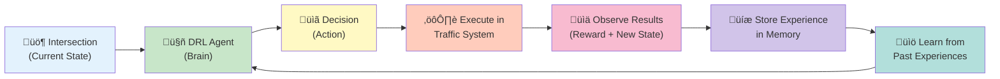

---

##### **Step-by-Step: How One Decision is Made**

###### **Step 1: Observe the Current Situation**

The DRL agent looks at the intersection and gathers information about what's happening right now:

**What the Agent "Sees":**

- **Vehicle queues**: How many cars waiting at each approach (North, South, East, West)
- **Bicycle queues**: How many bicycles waiting
- **Pedestrian crowds**: How many pedestrians waiting to cross
- **Current phase**: Which signal phase is running (Phase 1, 2, 3, 4, or 5)
- **Time elapsed**: How long has this phase been green
- **Detector signals**: Are vehicles/bicycles detected on the D30/D15 detectors?
- **Bus location**: Is a bus approaching? How far away?
- **Synchronization timer**: Time until the next coordination window with upstream/downstream intersection
- **Time of day**: Morning rush hour? Midday? Evening?

**Think of this like:** A human traffic controller looking at multiple screens showing camera feeds, detector readings,
and timers.

---

###### **Step 2: The Agent Decides What to Do**

Based on what it observes, the DRL agent chooses one of four possible actions:

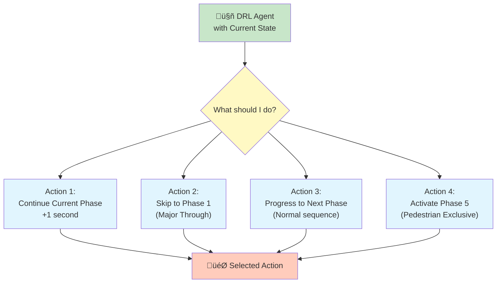

**How it Decides:**

- The agent uses a **neural network** (the "brain") that has learned from thousands of past experiences
- For each possible action, it calculates a **Q-value** (quality score) that predicts how good that action will be
- Usually picks the action with the **highest Q-value**, but sometimes tries random actions to explore new strategies

---

###### **Step 3: Execute the Action in SUMO**

The chosen action is sent to the SUMO traffic simulation:

**What Happens:**

- If "Continue Phase": Green light extended by 1 second
- If "Skip to Phase 1": Current phase ends, transition to major through phase
- If "Progress to Next": Move to the next phase in sequence (e.g., Phase 2 ‚Üí Phase 3)
- If "Activate Phase 5": Start the pedestrian exclusive phase

**Just like:** A human controller pressing buttons to change the signals.

---

###### **Step 4: Observe the Results**

After executing the action, the system measures what happened:

**Performance Metrics:**

- **Waiting times**: Did waiting times increase or decrease for each mode?
- **Queue lengths**: Did queues grow or shrink?
- **Emissions**: Did CO‚ÇÇ emissions go up or down?
- **Synchronization**: Did we successfully coordinate with the upstream intersection?
- **Safety**: Were there any conflicts or dangerous situations?

**Reward Calculation:** The agent receives a **reward score** that tells it how well it did:

- **Positive rewards** for: Reducing waiting times, achieving synchronization, serving vulnerable modes
- **Negative penalties** for: Long queues, high emissions, missed synchronization, safety issues

---

###### **Step 5: Store the Experience**

This entire experience is saved in the **Prioritized Replay Buffer**:

**What Gets Stored:**

```
Experience = {
    'state_before': [queue lengths, phase info, timers, ...],
    'action_taken': "Continue Phase",
    'reward_received': -5.2,
    'state_after': [new queue lengths, new phase info, ...],
    'priority': 8.5
}
```

**Priority Assignment:** Some experiences are marked as **more important** to learn from:

- **High priority**: Pedestrian phase activation, bus conflicts, sync failures, safety issues
- **Medium priority**: Normal synchronization attempts, mode balancing
- **Low priority**: Routine decisions with expected outcomes

---

###### **Step 6: Learning from Past Experiences**

Periodically (every few seconds), the agent updates its neural network by studying past experiences:

**The Learning Process:**

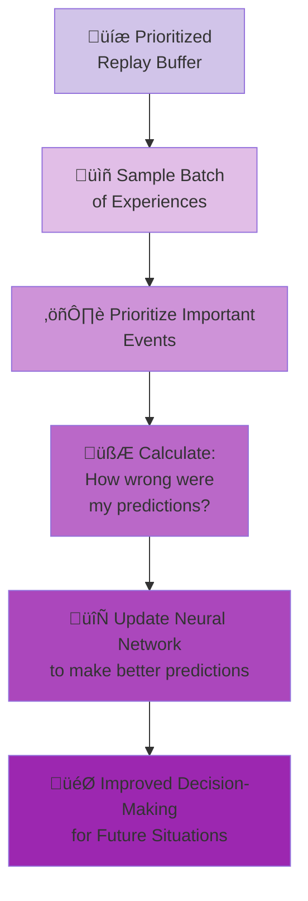

**What the Agent Learns:**

- "When there are 10+ pedestrians waiting and it's been 30+ seconds since their last green, activate Phase 5"
- "When the sync timer shows 8 seconds and there's a bus approaching, skip to Phase 1 now"
- "When bicycle queues are double the vehicle queues, extend the phase by 2 more seconds"
- "Don't activate pedestrian phase if only 3 pedestrians are waiting - waste of time"

---

# Complete DRL Control Flow Diagram


---

##### Key Difference: DRL vs. Your Rule-Based Control

###### **Your Developed Control (Rule-Based):**


**Fixed hierarchy**: Always checks conditions in the same order

---

###### **DRL Control (Learning-Based):**

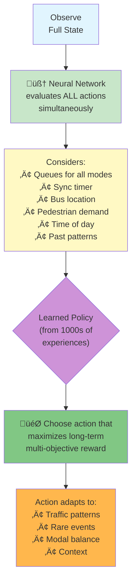

**Adaptive**: Weighs all factors simultaneously and learns what works best in different contexts

---

##### **Why Prioritized Experience Replay Matters**

###### **Problem Without PER:**

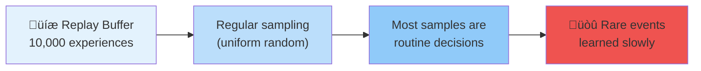

**Example:**

- 9,500 normal decisions (extend phase, regular flow)
- 300 synchronization attempts
- 150 bus priority cases
- **50 pedestrian phase activations** ‚Üê Very rare but critical!

Without PER: Agent might see pedestrian phase only **1-2 times** in 100 learning steps ‚Üí slow learning

---

###### **Solution With PER:**

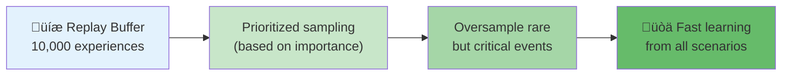

**With PER:** Agent sees pedestrian phase **20-30 times** in 100 learning steps ‚Üí fast learning!

---

##### **Real-World Example Scenario**

Let me walk you through a concrete example:

###### **Situation:**

- **Time:** 8:15 AM (morning rush hour)
- **Vehicle queues:** North: 8 cars, South: 5 cars, East: 2 cars, West: 1 car
- **Bicycle queues:** North: 6 bikes, South: 4 bikes
- **Pedestrians:** 12 people waiting to cross North-South, 4 waiting East-West
- **Current phase:** Phase 2 (Protected left turn) - running for 8 seconds
- **Bus:** Approaching from South, 80 meters away
- **Sync timer:** 15 seconds until coordination window

---

###### **What Your Rule-Based Control Would Do:**

```
1. Check min green (5s) ‚úì Yes, exceeded
2. Check max green (25s) ‚úó No, not reached
3. Check sync time ‚úó No, 15s remaining
4. Check bus priority ‚úó No, bus too far
5. Check detector windows ‚úó Bikes still passing
‚Üí Decision: Continue Phase 2 (extend by 1s)
```

**Result:** Continues Phase 2, making bus wait unnecessarily

---

###### **What DRL Control Would Do:**

```
Neural network evaluates:

Action 1 (Continue Phase 2): Q-value = 4.2
  - Good: Serves bicycles (high queue)
  - Bad: Bus will wait longer, miss sync window

Action 2 (Skip to Phase 1): Q-value = 8.7 ‚Üê HIGHEST!
  - Good: Catches sync, serves bus, major flow
  - Bad: Cuts off bicycle phase early
  - Learned: At 8am with these queues, this trade-off is optimal

Action 3 (Next Phase): Q-value = 3.5
  - Neutral choice

Action 4 (Pedestrian Phase): Q-value = 6.8
  - Good: 12 pedestrians is high demand
  - Bad: Misses sync, delays bus significantly

‚Üí Decision: Skip to Phase 1
```

**Result:**

- Bus experiences minimal delay
- Synchronization achieved
- Bicycles wait a bit longer (acceptable in morning rush)
- **Better overall system performance**

---

##### **The Training Process (High-Level)**

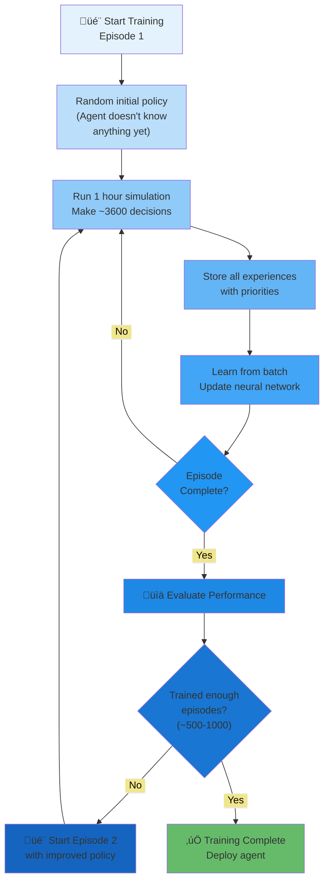

**Timeline:**

- Episode 1-50: Mostly random, exploring different strategies
- Episode 51-200: Starting to learn patterns, improving slowly
- Episode 201-500: Rapid improvement, discovering good policies
- Episode 501-1000: Fine-tuning, mastering rare events
- **After 1000 episodes: Expert traffic controller!**

---

##### **Key Advantages of DRL Over Rules**

###### **1. Adaptive to Context**

```
Morning rush (8 AM):
  DRL learns: Prioritize major arterial, tolerate longer bike waits

Midday (1 PM):
  DRL learns: Balance all modes equally, optimize overall delay

Evening (6 PM):
  DRL learns: Prioritize buses + bicycles, coordinate tightly
```

###### **2. Handles Rare Events Well (Thanks to PER)**

```
Pedestrian crowd (happens 2% of time):
  DRL trains on this 10x more ‚Üí learns optimal timing

Bus-sync conflict (happens 5% of time):
  DRL learns when to prioritize bus vs. sync

All-modes-high-demand (happens 1% of time):
  DRL learns emergency protocols
```

###### **3. Discovers Non-Obvious Strategies**

```
DRL might learn:
  "At 8:03 AM, if bike queue > 2x car queue,
   extend phase by 3s even if sync window approaches,
   because next cycle will still catch the following vehicle platoon"

This nuanced strategy is hard to encode as a rule!
```

---

##### **Summary: The Learning Journey**

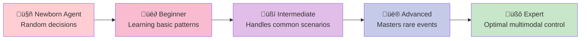

**What makes it work:**

- **Deep neural network**: Handles complex, high-dimensional traffic states
- **Reinforcement learning**: Learns from trial and error, no need for labeled data
- **Prioritized replay**: Ensures learning from rare but critical events
- **Multi-objective reward**: Balances competing goals (delay, emissions, equity, safety)

The DRL agent becomes a **traffic control expert** that adapts to patterns, handles edge cases, and continuously
improves its decisions!

---

**YES! Exactly!** You've understood it perfectly. Let me explain the two distinct phases very clearly:

---

# **DRL Implementation: Training Phase vs. Deployment Phase**

## **The Two-Phase Process**

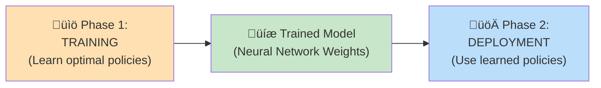

---

# **Phase 1: Training (Learning) - This Comes First**

###### **Purpose:**

Train the DRL agent by running **many simulations** so it learns what actions work best in different traffic situations.

###### **What Happens:**

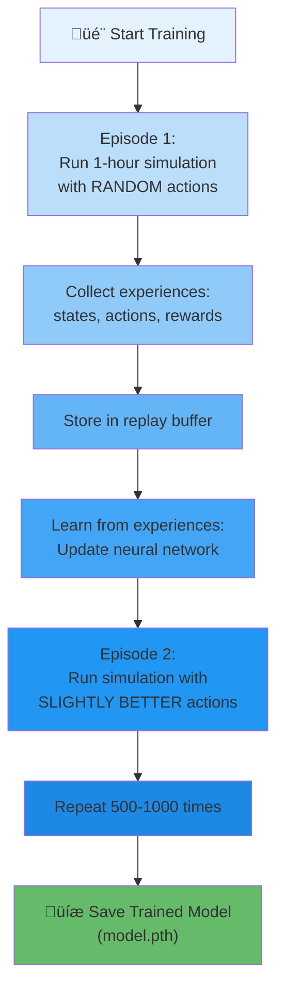

###### **Training Details:**

**What you do:**

1. **Initialize** a DRL agent with random neural network weights (it knows nothing!)
2. **Run Episode 1**:
    - Start SUMO simulation with your network (Pr_0 scenario)
    - Agent makes mostly **random decisions** (exploring)
    - Record what happened: states, actions, rewards
    - Episode ends after 1 hour of simulation time
3. **Learn**:
    - Neural network studies the recorded experiences
    - Updates its weights to make better decisions
4. **Run Episode 2**:
    - Start fresh simulation
    - Agent now makes **slightly better decisions** (still exploring)
    - Record new experiences
5. **Repeat 500-1000 episodes**:
    - Each episode, agent gets better
    - Gradually shifts from random exploration ‚Üí learned policy
6. **Save the trained model**:
    - Final neural network weights saved to disk (e.g., `drl_model.pth`)

**Training Metrics You Track:**

```
Episode 1:   Average Reward = -150  (very bad!)
Episode 50:  Average Reward = -80   (improving)
Episode 200: Average Reward = -30   (getting good)
Episode 500: Average Reward = +45   (excellent!)
Episode 800: Average Reward = +48   (converged - no more improvement)
‚Üí Stop training, save model
```

---

# **Phase 2: Deployment (Testing) - This Comes Second**

###### **Purpose:**

Use the **trained model** to control traffic and compare its performance against Reference and Developed controls.

###### **What Happens:**

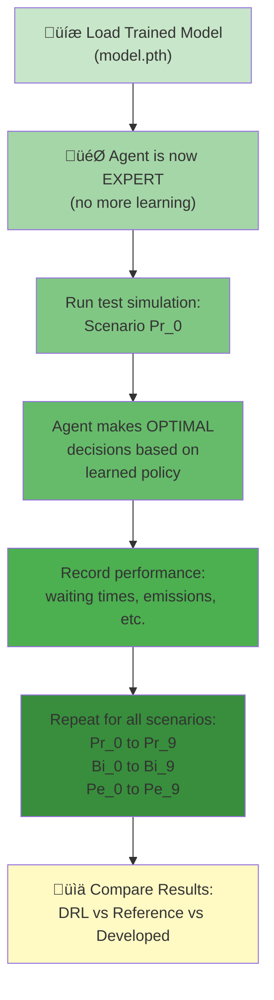

###### **Testing Details:**

**What you do:**

1. **Load trained model**: Read saved weights from disk
2. **Disable exploration**: Agent only uses its learned policy (no random actions)
3. **Run test simulations**:
    - Scenario Pr_0: DRL control makes decisions, record results
    - Scenario Pr_1: DRL control makes decisions, record results
    - ... continue for all 27 scenarios
4. **Collect performance metrics**:
    - Average waiting time per mode
    - Synchronization success rate
    - CO‚ÇÇ emissions
    - etc.
5. **Compare with baselines**:
    - DRL vs Reference Control
    - DRL vs Developed Control

**No learning happens** - the model is frozen!

---

##### **Complete Workflow Diagram**

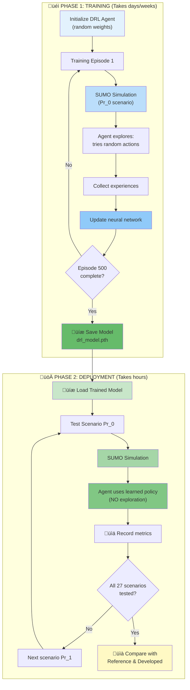

---

##### **Key Differences Between Training and Testing**

| **Aspect**         | **Training (Phase 1)**                | **Testing (Phase 2)**              |
| ------------------ | ------------------------------------- | ---------------------------------- |
| **Purpose**        | Learn optimal policy                  | Evaluate performance               |
| **Model State**    | Being updated constantly              | Fixed (frozen)                     |
| **Actions**        | Mix of learned + random (exploration) | Only learned policy (exploitation) |
| **Number of Runs** | 500-1000 episodes                     | 27 scenarios (1 run each)          |
| **Duration**       | Days to weeks                         | Few hours                          |
| **Output**         | Trained model file                    | Performance metrics                |
| **Learning**       | YES - weights updated                 | NO - no updates                    |

---

##### **Practical Example with Timeline**

###### **Week 1-2: Training Phase**

**Day 1-5: Initial Training**

**Training Progress:**

```
Episode 1:   Avg Reward = -145.2  (Terrible - random actions)
Episode 50:  Avg Reward = -78.5   (Learning patterns)
Episode 100: Avg Reward = -45.3   (Getting better)
Episode 200: Avg Reward = -15.8   (Good performance)
Episode 350: Avg Reward = +32.4   (Excellent!)
Episode 500: Avg Reward = +45.7   (Converged)
```

---

###### **Week 3: Testing Phase**

**Day 1-2: Run All Test Scenarios**

**Test Results:**

```
Scenario Pr_0:
  Reference Control:  Car wait = 45s, Bike wait = 89s
  Developed Control:  Car wait = 32s, Bike wait = 42s
  DRL Control:        Car wait = 29s, Bike wait = 35s  ‚Üê BEST!

Scenario Pr_5:
  Reference Control:  Car wait = 58s, Bike wait = 112s
  Developed Control:  Car wait = 42s, Bike wait = 51s
  DRL Control:        Car wait = 38s, Bike wait = 48s  ‚Üê BEST!
```

---

##### **Why Two Phases?**

###### **Training = "Going to School"**

- Agent practices on **many different situations**
- Makes mistakes, learns from them
- Gets better over time
- Like a student studying for years

###### **Testing = "Taking the Final Exam"**

- Agent demonstrates what it learned
- No more studying allowed
- Performance is measured
- Like a student taking standardized test

---

##### **Important Clarification**

###### **Training Uses Simulation Too!**

Yes, both phases use SUMO simulation:

- **Training**: Run simulation 500+ times to learn
- **Testing**: Run simulation 27 times to evaluate

**The difference:**

- **Training**: Agent is learning ‚Üí weights change after each episode
- **Testing**: Agent is frozen ‚Üí weights never change

---

###### **File Structure**

After training, your project will look like:

```
SignalSyncPro/
├── infrastructure/
│   ├── developed/          # Your current system
│   └── drl/                # New DRL system
├── src/
│   ├── training.py         # PHASE 1: Training code
│   ├── testing.py          # PHASE 2: Testing code
│   ├── agent.py            # DQN agent
│   └── environment.py      # SUMO interface
├── models/
│   ├── drl_trained_model.pth    # ← TRAINED MODEL (saved after Phase 1)
│   ├── checkpoint_ep100.pth     # Checkpoints during training
│   └── checkpoint_ep500.pth
├── results/
│   ├── training_logs.csv        # Training progress
│   └── test_results.csv         # Final comparison
└── configs/
    ├── scenarios/          # Pr_0 to Pe_9
    └── training_config.yaml
```

---

##### **Summary: The Complete Picture**

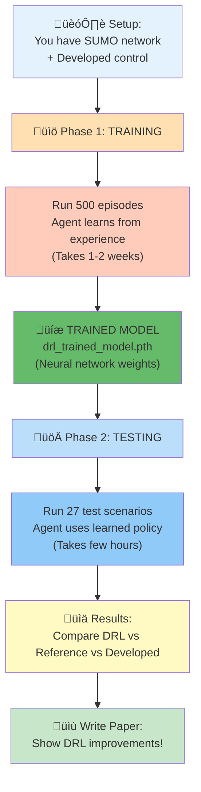

---

###### **Your Next Steps**

1. ‚úÖ **You have**: SUMO network + Developed control
2. ‚è≥ **Next**: Implement DRL agent + training loop
3. ‚è≥ **Then**: Run training (Phase 1) - get trained model
4. ‚è≥ **Finally**: Run testing (Phase 2) - compare performance
5. ‚è≥ **Write**: Paper showing improvements!

---

**YES! Exactly correct!** You've understood it perfectly. Let me clarify this crucial point:

---

##### Phase Structure vs. Phase Selection/Duration

###### What Stays the Same (Fixed Infrastructure):

**Your 5-Phase Structure** remains identical to your thesis:

- **Phase 1**: Major through (vehicles + bicycles) - same signal pattern
- **Phase 2**: Protected left turn (major direction) - same signal pattern
- **Phase 3**: Minor through (vehicles + bicycles) - same signal pattern
- **Phase 4**: Protected left turn (minor direction) - same signal pattern
- **Phase 5**: Pedestrian exclusive phase - same signal pattern

**The actual traffic signal patterns, lane permissions, and detector locations DO NOT change!**

---

##### What the DRL Model Learns (Adaptive Control):

The trained DRL model learns to **intelligently decide**:

##### 1. Which Phase to Activate Next

**Your Rule-Based Control (Developed):**

```
Fixed hierarchy:
- Check max green ‚Üí end phase
- Check sync time ‚Üí skip to Phase 1
- Check bus ‚Üí skip to Phase 1
- Check detectors ‚Üí continue or next phase
```

###### **DRL Control (Learned):**

```
Agent learns optimal phase selection:
- "Traffic state X ‚Üí Select Phase 1" (learned from experience)
- "Traffic state Y ‚Üí Select Phase 3" (learned from experience)
- "Traffic state Z ‚Üí Activate Phase 5" (learned from experience)
```

###### 2. How Long to Run Each Phase

**Your Rule-Based Control:**

```
- Minimum green: 5 seconds (fixed from RiLSA)
- Extend by 1 second if detectors occupied
- Maximum green: 44s (P1), 12s (P2), 24s (P3), 10s (P4) (fixed calculation)
```

**DRL Control (Learned):**

```
Agent learns optimal duration:
- Morning rush + high vehicle queue ‚Üí Run Phase 1 for 35 seconds
- Low traffic + high bicycle queue ‚Üí Run Phase 1 for 15 seconds
- High pedestrian demand ‚Üí Activate Phase 5 earlier
```

---

##### Concrete Example

###### Scenario: Morning Rush Hour (8:15 AM)

**Current Situation:**

- Vehicle queue: 8 cars (North), 5 cars (South)
- Bicycle queue: 6 bikes
- Pedestrians: 12 waiting
- Current phase: Phase 2 (protected left), running for 8 seconds
- Bus approaching: 80 meters away
- Sync timer: 15 seconds until coordination window

---

##### Your Developed Control (Rule-Based) Decision:

```
Check conditions in order:
1. Min green (5s)? YES ‚úì
2. Max green (12s)? NO (only 8s elapsed)
3. Sync time? NO (15s remaining)
4. Bus priority? NO (bus too far)
5. Detector window? NO (bikes still passing)

‚Üí Decision: CONTINUE Phase 2 (extend by 1 second)
```

**Result:** Phase 2 continues for 9 seconds, bus waits longer, misses sync window

---

##### DRL Control (Learned Policy) Decision:

```
Neural network evaluates current state:
Input state vector [45 dimensions]:
  - Phase encoding: [0, 1, 0, 0, 0] (Phase 2 active)
  - Phase duration: 0.13 (8s / 60s normalized)
  - Vehicle queues: [0.4, 0.25, 0.1, 0.05]
  - Bicycle queues: [0.3, 0.2]
  - Pedestrian demand: 0.24 (12 / 50 normalized)
  - Bus present: 1.0
  - Sync timer: 0.5 (15s / 30s normalized)
  - Time of day: 0.34 (8:15 AM normalized)
  ... (other features)

Network outputs Q-values:
  Q(Continue Phase 2)    = 4.2
  Q(Skip to Phase 1)     = 8.7  ‚Üê HIGHEST!
  Q(Next Phase)          = 3.5
  Q(Pedestrian Phase)    = 2.1

‚Üí Decision: SKIP TO PHASE 1
```

**Why Phase 1?** The agent **learned** from thousands of training episodes that at this time of day, with these traffic
conditions, skipping to Phase 1:

- Catches the sync window (coordinates with upstream intersection)
- Allows bus to pass quickly
- Reduces overall system delay
- The bicycle queue can wait (acceptable trade-off learned through training)

**Result:** Phase 1 activated, bus flows through, sync achieved, overall system performs better

---

##### Key Differences Illustrated


---

## What Does NOT Change

##### Infrastructure (100% Same):

1. **Network Topology**: Same intersections, lanes, distances (your `test.net.xml`)
2. **Detector Positions**: Same D30 (vehicles), D15 (bicycles), pedestrian detectors
3. **Phase Definitions**: Same signal states for each phase
4. **Leading Green**: Same 1-second leading green for vulnerable modes
5. **Bus Stops**: Same bus stop locations
6. **Vehicle Types**: Same passenger, bicycle, bus, pedestrian types

##### Physical Constraints (100% Same):

1. **Minimum Green**: Still respects 5-second minimum from RiLSA
2. **Yellow Time**: Same yellow/all-red clearance times
3. **Phase Transitions**: Still must go through yellow ‚Üí red ‚Üí next phase
4. **Maximum Green Limits**: Still has upper bounds (won't run forever)

---

## What the Model LEARNS to Change

##### Decision Making (Learned):

**1. Phase Selection Logic:**

**Instead of:**

```python
# Your rule-based logic
if max_green_reached:
    next_phase()
elif sync_time_reached:
    skip_to_phase_1()
elif bus_present:
    skip_to_phase_1()
elif detector_clear:
    next_phase()
else:
    continue_phase()
```

**DRL learns:**

```python
# Learned policy
state = get_current_state()  # 45 features
q_values = neural_network(state)  # Evaluates all options
action = argmax(q_values)  # Picks best action

# The network implicitly learned:
# "In morning rush with these queues ‚Üí Phase 1 best"
# "In midday with high bikes ‚Üí Phase 3 best"
# "High pedestrians + long wait ‚Üí Phase 5 best"
```

**2. Duration Optimization:**

**Your current system:**

- Extends phase by 1 second at a time based on detector windows
- Fixed maximum green times calculated from lane capacity

**DRL learns:**

- When to end phase early (even if detectors show demand)
- When to extend longer (even if approaching max green)
- Context-dependent duration based on system-wide state

---

## Practical Example: Phase Duration Learning

##### Scenario: Phase 1 (Major Through) Running

**Your Developed Control:**

```
Time 0s:  Phase 1 starts (leading green)
Time 1s:  Green begins
Time 6s:  Check detectors (occupied) ‚Üí continue
Time 7s:  Check detectors (occupied) ‚Üí continue
Time 8s:  Check detectors (occupied) ‚Üí continue
...
Time 35s: Detectors finally clear ‚Üí end phase
Time 44s: MAX GREEN reached ‚Üí forced end

Duration: Determined by detector windows OR max green
```

**DRL Agent (After Training):**

```
Time 0s:  Phase 1 starts
Time 1s:  Green begins
Time 6s:  Agent evaluates state ‚Üí decides "continue" (Q=7.5)
Time 12s: Agent evaluates state ‚Üí decides "continue" (Q=6.8)
Time 18s: Agent evaluates state ‚Üí decides "skip to Phase 3" (Q=8.2)
          Why? Learned that sync window approaching +
          minor direction has high bicycle queue

Duration: Determined by learned policy balancing multiple objectives
```

**Key Insight:** The agent learned through trial and error that in this specific situation, running Phase 1 for exactly
18 seconds and then serving the minor direction achieves:

- Better synchronization
- Lower bicycle waiting time
- Acceptable vehicle delay
- Higher overall reward

This specific timing (18 seconds) was **not programmed** - the agent **discovered** it through training!

---

## Training Process Clarification

##### What Happens During Training:

**Episode 1-50 (Random Exploration):**

```
Agent tries random phase durations:
- Phase 1 for 8 seconds ‚Üí sees result ‚Üí stores experience
- Phase 1 for 25 seconds ‚Üí sees result ‚Üí stores experience
- Phase 1 for 40 seconds ‚Üí sees result ‚Üí stores experience
- Activates Phase 5 randomly ‚Üí sees result ‚Üí stores experience

Learning: "Hmm, 8 seconds was too short (high reward penalty)"
          "40 seconds wasted time (penalty)"
          "25 seconds seemed better (higher reward)"
```

**Episode 51-200 (Improving):**

```
Agent starts learning patterns:
- "Morning rush + high queue ‚Üí longer Phase 1 is better"
- "Low traffic ‚Üí shorter phases are better"
- "High pedestrians ‚Üí activate Phase 5 sooner"

Still exploring, but getting better average rewards
```

**Episode 201-500 (Mastering):**

```
Agent has learned good policies:
- Knows optimal phase durations for different situations
- Learned when to prioritize sync vs. mode equity
- Discovered non-obvious strategies
  (e.g., "sometimes skip sync for pedestrian safety")

Epsilon low (mostly exploiting learned policy)
```

**Episode 501-1000 (Fine-tuning):**

```
Agent fine-tunes edge cases:
- Rare scenarios (bus + high pedestrian + sync conflict)
- Optimal handling of Phase 5 activation threshold
- Perfect timing for coordination windows

Near-optimal policy achieved
```

---

## After Training: Deployment

##### The Trained Model Contains:

**Neural Network Weights** (saved in `final_model.pth`):

```python
# These weights encode learned knowledge like:
# "If state looks like [0.4, 0.3, 0.2, ...] ‚Üí Phase 1 best (Q=8.7)"
# "If state looks like [0.1, 0.8, 0.5, ...] ‚Üí Phase 3 best (Q=9.2)"
# "If state looks like [0.2, 0.2, 0.9, ...] ‚Üí Phase 5 best (Q=8.9)"

policy_network_weights = [
    layer1_weights: 45x256 matrix,
    layer2_weights: 256x256 matrix,
    layer3_weights: 256x128 matrix,
    output_weights: 128x4 matrix
]
```

##### Testing Phase Uses This Model:

```python
# Load trained model
agent.load("models/final_model.pth")
agent.set_eval_mode()  # No more learning!

# Run test scenarios
for scenario in ['Pr_0', 'Pr_1', ..., 'Pe_9']:
    state = env.reset()

    while not done:
        # Use learned policy (NO exploration)
        action = agent.select_action(state, explore=False)

        # This uses the trained neural network to pick:
        # - Which phase to activate
        # - When to transition

        next_state, reward, done, info = env.step(action)
        state = next_state

    # Record performance metrics
```

---

## Summary

**What stays the same:**

- ‚úÖ Physical infrastructure (network, detectors, lanes)
- ‚úÖ Phase signal patterns (which lights are green/red)
- ‚úÖ Vehicle types and routing
- ‚úÖ Safety constraints (minimum green, clearance times)

**What the DRL model learns to control:**

- 🎯 **Which phase to activate next** (intelligent phase selection)
- 🎯 **How long to run each phase** (optimal duration)
- 🎯 **When to skip phases** (e.g., skip to Phase 1 for sync)
- 🎯 **When to activate pedestrian phase** (timing optimization)
- 🎯 **How to balance competing objectives** (sync vs. equity vs. delay)

**The model learns the CONTROL LOGIC, not the infrastructure!**

Your phase structure is the "vocabulary" - the DRL agent learns the "grammar" of how to use it optimally!

---

# Reward Logic Comparison: Previous vs. Updated

Let me explain the fundamental difference between the two reward calculation approaches:

---

##### Previous Reward Logic (BROKEN)

###### The Problem

Your original reward was calculating **cumulative totals** across the entire episode, leading to massive negative
numbers.

###### How It Worked

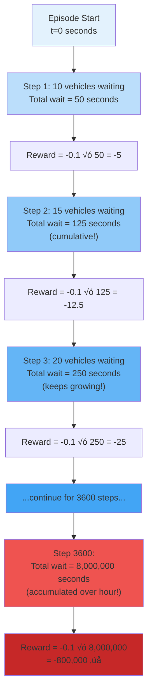

**Problem:** The old reward added up ALL waiting time from ALL vehicles from the START of the episode.

**Example:**

- **Second 1:** 5 cars waiting, each waited 10 seconds ‚Üí Total = 50 seconds
    - Reward = -0.1 √ó 50 = **-5**
- **Second 2:** Same 5 cars still waiting (now 11 seconds each) + 3 new cars (1 second each) ‚Üí Total = 5√ó11 + 3√ó1 = 58
  seconds
    - But wait! The OLD code was adding 50 + 58 = **108 seconds cumulative**
    - Reward = -0.1 √ó 108 = **-10.8**
- **Second 100:** Total accumulated waiting = 50,000 seconds
    - Reward = -0.1 √ó 50,000 = **-5,000**
- **Second 3600:** Total accumulated = 8,000,000 seconds
    - Reward = -0.1 √ó 8,000,000 = **-800,000** ‚ùå

**Why This Breaks Training:**

1. Rewards grow **exponentially negative** as episode continues
2. Later actions get blamed for ALL previous waiting
3. Neural network cannot learn because reward scale is unstable
4. Loss explodes (22,542) because network tries to predict -800,000

---

##### Updated Reward Logic (FIXED)

###### The Solution

Calculate **instantaneous** (current moment only) metrics and **normalize** to a fixed scale.

###### How It Works


**Solution:** Only measure what's happening RIGHT NOW, then normalize to a small scale.

###### **Example (Same traffic situation):**

###### Step 1 (t=100 seconds):

```
Currently stopped vehicles:
- Car 1: waiting 5 seconds
- Car 2: waiting 3 seconds
- Car 3: waiting 8 seconds
- Bike 1: waiting 2 seconds

Average wait THIS moment = (5+3+8+2)/4 = 4.5 seconds
Normalized = 4.5 / 60 = 0.075
Wait penalty = -1.0 √ó 0.075 = -0.075

Check sync: Both intersections Phase 1? YES ‚Üí +0.5
Check ped phase: Active? NO ‚Üí +0.0

Total reward = -0.075 + 0.5 = +0.425 ‚úì
```

###### Step 2 (t=101 seconds):

```
New situation (1 second later):
- Car 1: waiting 6 seconds (still there)
- Car 2: DEPARTED (moved through)
- Car 3: waiting 9 seconds
- Bike 1: waiting 3 seconds
- NEW Car 4: waiting 1 second

Average wait THIS moment = (6+9+3+1)/4 = 4.75 seconds
Normalized = 4.75 / 60 = 0.079
Wait penalty = -1.0 √ó 0.079 = -0.079

Check sync: Lost sync ‚Üí +0.0
Check ped phase: NO ‚Üí +0.0

Total reward = -0.079 + 0.0 = -0.079 ‚úì
```

###### Step 3 (t=102 seconds):

```
Situation improved:
- Car 3: waiting 10 seconds
- Bike 1: waiting 4 seconds
- Car 4: waiting 2 seconds
(Cars 1 departed!)

Average wait = (10+4+2)/3 = 5.33 seconds
Normalized = 5.33 / 60 = 0.089
Wait penalty = -1.0 √ó 0.089 = -0.089

Total reward = -0.089 ‚úì
```

**Key Differences:**

1. ‚úÖ Each step is **independent** - doesn't accumulate
2. ‚úÖ Reward stays in **stable range** (-2 to +2)
3. ‚úÖ Network can **learn patterns** (good action ‚Üí better reward)
4. ‚úÖ Loss stays **reasonable** (< 10.0)

---

##### Side-by-Side Comparison

###### Scenario: 1-Hour Episode

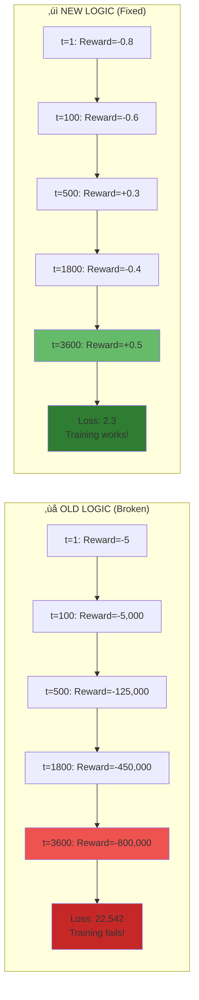

###### Numerical Example

**Same traffic scenario at t=1000 seconds:**

| Metric                | Old Logic                                      | New Logic                   |
| --------------------- | ---------------------------------------------- | --------------------------- |
| **Vehicles waiting**  | 10 cars                                        | 10 cars (same)              |
| **Average wait time** | 15 seconds                                     | 15 seconds (same)           |
| **Calculation**       | Sum ALL waits since t=0<br>= 1,500,000 seconds | Average NOW<br>= 15 seconds |
| **Normalization**     | None                                           | 15 / 60 = 0.25              |
| **Penalty**           | -0.1 √ó 1,500,000                               | -1.0 √ó 0.25                 |
| **Reward**            | **-150,000** ‚ùå                                | **-0.25** ‚úì                 |

---

##### Why Normalization Matters

###### Old Reward (No Normalization)


###### New Reward (Normalized)

```mermaid
flowchart TD
    A["Waiting time always<br>normalized to 0-1"] --> B["Early: 0.05<br>Reward: -0.05"]
    A --> C["Middle: 0.35<br>Reward: -0.35"]
    A --> D["End: 0.12<br>Reward: -0.12"]

    B --> E["Network tries to predict<br>Q-value"]
    C --> E
    D --> E

    E --> F["Q-value range:<br>-2.0 to +2.0"]
    F --> G["Loss calculation:<br>(-0.12 - prediction)²"]
    G --> H["Loss = 2.3<br>Gradients stable!"]

    style D fill:#66BB6A
    style H fill:#2E7D32
```

---

##### Reward Components Breakdown

###### Old Formula (Broken)

```python
# Episode step 1
vehicles_waiting = [10s, 5s, 8s, 12s, 3s]  # 5 vehicles
total_wait = sum(vehicles_waiting) = 38 seconds
reward = -0.1 * 38 = -3.8

# Episode step 100 (same 5 vehicles still waiting)
vehicles_waiting = [110s, 105s, 108s, 112s, 103s]
total_wait = sum(vehicles_waiting) = 538 seconds  # CUMULATIVE!
reward = -0.1 * 538 = -53.8

# Episode step 1000
vehicles_waiting = [1010s, 1005s, 1008s, 1012s, 1003s]
total_wait = sum(vehicles_waiting) = 5,038 seconds  # KEEPS GROWING!
reward = -0.1 * 5038 = -503.8

# Episode step 3600
total_wait = 18,000+ seconds accumulated
reward = -0.1 * 18000 = -1,800 per vehicle
       = -1,800 * 100+ vehicles = -180,000+ total
```

**Problem:** Reward punishes agent for waiting that happened BEFORE it took action!

---

###### New Formula (Fixed)

```python
# Episode step 1
currently_stopped = [Car1: 10s, Car2: 5s, Bike1: 8s]
average_wait_now = (10 + 5 + 8) / 3 = 7.67 seconds
normalized = 7.67 / 60 = 0.128
wait_penalty = -1.0 * 0.128 = -0.128

sync_achieved = True ‚Üí +0.5
ped_phase_active = False ‚Üí +0.0

reward = -0.128 + 0.5 + 0.0 = +0.372 ‚úì

# Episode step 100 (different vehicles now)
currently_stopped = [Car5: 3s, Bike3: 12s]
average_wait_now = (3 + 12) / 2 = 7.5 seconds
normalized = 7.5 / 60 = 0.125
wait_penalty = -1.0 * 0.125 = -0.125

sync_achieved = False ‚Üí +0.0
ped_phase_active = False ‚Üí +0.0

reward = -0.125 + 0.0 + 0.0 = -0.125 ‚úì

# Episode step 3600
currently_stopped = [Bike2: 5s, Car8: 15s, Bus1: 8s]
average_wait_now = (5 + 15 + 8) / 3 = 9.33 seconds
normalized = 9.33 / 60 = 0.156
wait_penalty = -1.0 * 0.156 = -0.156

sync_achieved = True ‚Üí +0.5
ped_phase_active = False ‚Üí +0.0

reward = -0.156 + 0.5 + 0.0 = +0.344 ‚úì
```

**Benefit:** Reward reflects CURRENT performance, not history!

---

##### Training Impact

###### Old Logic - Training Diverges

```mermaid
flowchart LR
    A["Episode 1<br>Reward: -500,000"] --> B["Episode 2<br>Reward: -650,000"]
    B --> C["Episode 3<br>Reward: -800,000"]
    C --> D["Episode 10<br>Reward: -1,200,000"]
    D --> E["‚ùå Training fails<br>Network cannot converge"]

    style E fill:#EF5350
```

**Why it fails:**

- Rewards have no consistent scale
- Network cannot distinguish good vs bad actions
- Loss explodes (22,542)
- Gradients vanish or explode

---

###### New Logic - Training Converges

```mermaid
flowchart LR
    A["Episode 1<br>Reward: -1.2"] --> B["Episode 10<br>Reward: -0.8"]
    B --> C["Episode 50<br>Reward: -0.4"]
    C --> D["Episode 200<br>Reward: +0.3"]
    D --> E["‚úì Training succeeds<br>Network learns patterns"]

    style E fill:#66BB6A
```

**Why it works:**

- Rewards in consistent range [-2, +2]
- Network learns: good action ‚Üí higher reward
- Loss reasonable (< 10.0)
- Gradients stable

---

###### Summary: Key Differences

| Aspect               | Old Logic ‚ùå              | New Logic ‚úì            |
| -------------------- | ------------------------- | ---------------------- |
| **Measurement**      | Cumulative total          | Instantaneous snapshot |
| **Scale**            | Unbounded (-‚àû to 0)       | Normalized [-2 to +2]  |
| **Time dependency**  | Depends on episode length | Independent of time    |
| **Example reward**   | -662,482                  | -0.8                   |
| **Example loss**     | 22,542                    | 2.3                    |
| **Training**         | Fails (explodes)          | Works (converges)      |
| **Interpretability** | Meaningless number        | Clear signal           |

The fix transforms your reward from an **unusable accumulator** into a **proper learning signal** that the neural
network can actually learn from!

---

##### **Q: I have 2 signals and 2 traffic lights for total - is the trained model gogin to control both of them or it handles seperarely?**

Based on the current implementation, the **trained model handles each intersection separately**. Here's why:

###### **Current Architecture: Independent Control**

Each intersection has its own:
- **State**: 45-dimensional vector (queues, phase, detectors, etc.) for that specific intersection
- **DQN Agent**: Separate policy and target networks
- **Decision**: Independent action selection

```
Intersection 1 ‚Üí State‚ÇÅ [45 dims] ‚Üí DQN Agent‚ÇÅ ‚Üí Action‚ÇÅ
Intersection 2 ‚Üí State‚ÇÇ [45 dims] ‚Üí DQN Agent‚ÇÇ ‚Üí Action‚ÇÇ
```

###### **Why Separate?**

Your state representation (45 dimensions) captures:
- Local queue lengths
- Local phase information
- Local detector data
- **Sync timer** (coordination signal)

The sync timer is how intersections coordinate, but each agent makes independent decisions based on its local state.

###### **Alternative: Centralized Control**

If you wanted **one model to control both**, you'd need:

```python
# Combined state: [90 dimensions] = [Intersection1: 45] + [Intersection2: 45]
# Combined actions: 16 possible = 4 actions √ó 4 actions

state_combined = np.concatenate([state_intersection1, state_intersection2])
# Shape: [90]

# Single DQN with larger input
model = DQN(state_dim=90, action_dim=16)  # 16 = 4√ó4 joint actions
```

###### **Which is Better?**

**Independent (Current):**

- ‚úÖ Simpler, scales to many intersections
- ‚úÖ Faster training (smaller state/action space)
- ‚úÖ Coordination via sync timer in state
- ‚ùå Can't learn complex joint strategies

**Centralized:**
- ‚úÖ Can learn optimal joint policies
- ❌ Exponential growth: 3 intersections = 4³ = 64 actions
- ‚ùå Much slower training
- ‚ùå Doesn't scale well

**Your current approach (independent + sync timer) is the standard solution for multi-intersection control.**

---
