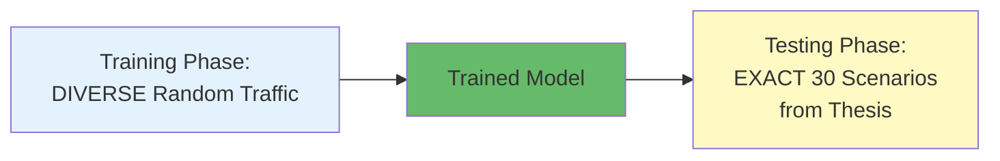

# Traffic Simulation Scenarios from Your MSc Thesis

###### **30 Total Scenarios (3 Categories)**

Your thesis tested **30 different traffic scenarios** organized into three categories:

**1. Variable Private Car Scenarios (Pr_0 to Pr_9)** - 10 scenarios

- **Base traffic**: 400 bicycles/hour, 400 pedestrians/hour, buses every 15 minutes
- **Variable**: Cars from 100 to 1000 vehicles/hour (increments of 100)

**2. Variable Bicycle Scenarios (Bi_0 to Bi_9)** - 10 scenarios

- **Base traffic**: 400 cars/hour, 400 pedestrians/hour, buses every 15 minutes
- **Variable**: Bicycles from 100 to 1000 vehicles/hour (increments of 100)

**3. Variable Pedestrian Scenarios (Pe_0 to Pe_9)** - 10 scenarios

- **Base traffic**: 400 cars/hour, 400 bicycles/hour, buses every 15 minutes
- **Variable**: Pedestrians from 100 to 1000 pedestrians/hour (increments of 100)

---

###### **Detailed Scenario Breakdown**

| **Scenario** | **Cars/hr** | **Bicycles/hr** | **Pedestrians/hr** | **Buses**   |
| ------------ | ----------- | --------------- | ------------------ | ----------- |
| **Pr_0**     | 100         | 400             | 400                | Every 15min |
| **Pr_1**     | 200         | 400             | 400                | Every 15min |
| **Pr_2**     | 300         | 400             | 400                | Every 15min |
| **Pr_3**     | 400         | 400             | 400                | Every 15min |
| **Pr_4**     | 500         | 400             | 400                | Every 15min |
| **Pr_5**     | 600         | 400             | 400                | Every 15min |
| **Pr_6**     | 700         | 400             | 400                | Every 15min |
| **Pr_7**     | 800         | 400             | 400                | Every 15min |
| **Pr_8**     | 900         | 400             | 400                | Every 15min |
| **Pr_9**     | 1000        | 400             | 400                | Every 15min |
|              |             |                 |                    |             |
| **Bi_0**     | 400         | 100             | 400                | Every 15min |
| **Bi_1**     | 400         | 200             | 400                | Every 15min |
| **Bi_2**     | 400         | 300             | 400                | Every 15min |
| **Bi_3**     | 400         | 400             | 400                | Every 15min |
| **Bi_4**     | 400         | 500             | 400                | Every 15min |
| **Bi_5**     | 400         | 600             | 400                | Every 15min |
| **Bi_6**     | 400         | 700             | 400                | Every 15min |
| **Bi_7**     | 400         | 800             | 400                | Every 15min |
| **Bi_8**     | 400         | 900             | 400                | Every 15min |
| **Bi_9**     | 400         | 1000            | 400                | Every 15min |
|              |             |                 |                    |             |
| **Pe_0**     | 400         | 400             | 100                | Every 15min |
| **Pe_1**     | 400         | 400             | 200                | Every 15min |
| **Pe_2**     | 400         | 400             | 300                | Every 15min |
| **Pe_3**     | 400         | 400             | 400                | Every 15min |
| **Pe_4**     | 400         | 400             | 500                | Every 15min |
| **Pe_5**     | 400         | 400             | 600                | Every 15min |
| **Pe_6**     | 400         | 400             | 700                | Every 15min |
| **Pe_7**     | 400         | 400             | 800                | Every 15min |
| **Pe_8**     | 400         | 400             | 900                | Every 15min |
| **Pe_9**     | 400         | 400             | 1000               | Every 15min |

---

###### **Simulation Parameters**

**Traffic Generation:**

- **Arrival pattern**: Poisson distribution (realistic stochastic arrivals)
- **Turning movements**: 10% left/right turns, 80% through traffic
- **Minor road traffic**: 25% of major road volume (1:4 ratio)
- **Bus stops**: 20 seconds after crossing intersection
- **Simulation duration**: 10,000 seconds (2 hours 47 minutes)
- **Warm-up period**: 15 minutes before data collection

**Network Layout:**

- **Two intersections** separated by 300 meters
- **Major arterial** with dedicated bus lanes and bicycle lanes
- **Minor roads** perpendicular to major arterial

---

##### **Critical Recommendation: Use EXACT Same Scenarios for DRL Testing**

###### **Why This Matters**

For a **fair and scientifically valid comparison**, you MUST test your trained DRL model on the **exact same 30
scenarios** that were used for the Reference Control and Developed Control. Here's why:

**1. Scientific Validity**

- Any comparison is only meaningful if all systems face identical traffic conditions
- Different scenarios = apples-to-oranges comparison
- Reviewers and journals will require this

**2. Reproducibility**

- Your thesis already has baseline results for all 30 scenarios
- Direct comparison: "DRL achieved X% better waiting time than Developed Control in scenario Pr_5"
- Can create side-by-side comparison tables

**3. Consistent Evaluation**

- Same Poisson seed for traffic generation → same exact vehicle arrivals
- Same network layout and detector positions
- Same measurement methodology

---

##### **Critical Question: Training vs Testing Traffic Conditions**

This is an excellent and important question! The traffic conditions for **training** and **testing** serve different purposes:

------

###### **Two-Phase Approach**



------

###### **Phase 1: TRAINING - Use Randomized Diverse Traffic**

During training (500-1000 episodes), you should use **RANDOMIZED traffic scenarios** that cover the full range of conditions:

**Training Traffic Generation:**

```python
# Each training episode uses RANDOM volumes
For each episode:
    cars_per_hour = random.randint(100, 1000)
    bikes_per_hour = random.randint(100, 1000)
    peds_per_hour = random.randint(100, 1000)
    buses = "Every 15 minutes" (constant)
    
    # Generate routes and run simulation
```

**Example Training Episodes:**

| **Episode** | **Cars/hr** | **Bikes/hr** | **Peds/hr** | **Buses**   |
| ----------- | ----------- | ------------ | ----------- | ----------- |
| Episode 1   | 347         | 892          | 156         | Every 15min |
| Episode 2   | 623         | 234          | 778         | Every 15min |
| Episode 3   | 145         | 567          | 423         | Every 15min |
| Episode 4   | 891         | 112          | 645         | Every 15min |
| Episode 5   | 234         | 789          | 234         | Every 15min |
| ...         | ...         | ...          | ...         | ...         |
| Episode 500 | 567         | 345          | 890         | Every 15min |

**Why Random Training?**

1. ✅ **Prevents overfitting** - Model doesn't just memorize specific scenarios
2. ✅ **Better generalization** - Learns patterns, not specific cases
3. ✅ **Robustness** - Can handle traffic conditions it's never seen exactly
4. ✅ **Exploration** - Discovers optimal strategies across diverse situations

------

###### **Phase 2: TESTING - Use EXACT 30 Thesis Scenarios**

After training, test on the **exact same 30 scenarios** from your thesis (Pr_0 to Pe_9) for fair comparison.

**Testing Traffic (Fixed):**

| **Scenario** | **Cars/hr** | **Bikes/hr** | **Peds/hr** | **Buses**   |
| ------------ | ----------- | ------------ | ----------- | ----------- |
| Pr_0         | 100         | 400          | 400         | Every 15min |
| Pr_1         | 200         | 400          | 400         | Every 15min |
| ...          | ...         | ...          | ...         | ...         |
| Pe_9         | 400         | 400          | 1000        | Every 15min |

**Why Fixed Testing?**

1. ✅ **Fair comparison** with Reference and Developed controls
2. ✅ **Reproducible results** - Same scenarios = same comparison
3. ✅ **Scientific validity** - All methods tested under identical conditions
4. ✅ **Published baselines** - Your thesis already has results for these

------

###### **Recommended Training Strategy**

**Option 1: Fully Random Training (RECOMMENDED)**

```python
# training/train_drl.py

for episode in range(NUM_EPISODES):
    # Generate random traffic volumes
    car_volume = np.random.randint(100, 1001)      # 100-1000
    bike_volume = np.random.randint(100, 1001)     # 100-1000
    ped_volume = np.random.randint(100, 1001)      # 100-1000
    
    # Generate route files with these volumes
    generate_routes(car_volume, bike_volume, ped_volume)
    
    # Run training episode
    train_episode(agent, environment)
```

**Advantages:**

- ✅ Maximum diversity in training data
- ✅ Best generalization to unseen conditions
- ✅ Avoids memorization of specific scenarios
- ✅ More realistic - real traffic is variable, not fixed

------

**Option 2: Stratified Sampling (ALTERNATIVE)**

Train on scenarios that systematically cover the space:

```python
# Create training scenarios similar to testing but with variations
training_scenarios = [
    # Low traffic
    (150, 150, 150), (200, 150, 150), (150, 200, 150), ...
    
    # Medium traffic  
    (400, 400, 400), (450, 400, 400), (400, 450, 400), ...
    
    # High traffic
    (800, 800, 800), (900, 800, 800), (800, 900, 800), ...
    
    # Mixed traffic
    (100, 500, 900), (900, 100, 500), (500, 900, 100), ...
]

for episode, scenario in enumerate(training_scenarios):
    car_vol, bike_vol, ped_vol = scenario
    train_episode(agent, environment, car_vol, bike_vol, ped_vol)
```

**Advantages:**

- ✅ Ensures coverage of important regions
- ✅ Can include extreme cases (all low, all high, mixed)
- ✅ More controlled than pure random

**Disadvantages:**

- ❌ Less diversity than fully random
- ❌ Might miss some traffic patterns

------

