# C-4: Deep Q-Networks (DQN) - Foundations and Architecture

1. Markov Decision Processes for Sequential Decision-Making

    - Mathematical Framework of MDPs
    - The Traffic Signal Control Problem
    - State, Action, and Reward Formulation
    - Value Functions and Bellman Equations

2. Deep Q-Networks: Core Algorithm
    - Q-Learning Fundamentals
    - Function Approximation with Neural Networks
    - The DQN Algorithm
    - Policy Network vs Target Network
    - Epsilon-Greedy Exploration Strategy

---

#### Foundations of Reinforcement Learning

Deep Q-Networks represent a revolutionary synthesis of reinforcement learning and deep learning, enabling agents to
learn optimal decision-making policies in complex, high-dimensional environments. The breakthrough achieved by DQN lies
not merely in applying neural networks to Q-learning—a combination that had previously failed catastrophically—but in
introducing architectural innovations that stabilize this inherently unstable learning process.

This chapter explores DQN through multiple lenses: the mathematical foundations rooted in Markov Decision Processes, the
algorithmic innovations that enabled stable learning, the theoretical challenges that arise when combining function
approximation with bootstrapping, and the practical techniques that transform DQN from a theoretical construct into a
robust system capable of solving real-world control problems such as traffic signal optimization.

---

---

---

###### What is Deep Q-Learning?

Deep Q-Learning (DQN) is a reinforcement learning algorithm that combines **Q-Learning** with **deep neural networks**
to learn optimal policies in environments with high-dimensional state spaces. It was introduced by DeepMind in 2013 and
achieved human-level performance on Atari games.

###### Foundations: Q-Learning

**Q-Learning** is a model-free reinforcement learning algorithm that learns the **action-value function** (Q-function):

$$
Q(s, a) = \text{expected cumulative reward from taking action } a \text{ in state } s
$$

The agent seeks to learn the **optimal Q-function** $Q^*(s, a)$ that satisfies the **Bellman optimality equation**:

$$
Q^*(s, a) = \mathbb{E}\left[r + \gamma \max_{a'} Q^*(s', a')\right]
$$

Where:

- $s$ = current state
- $a$ = action taken
- $r$ = immediate reward
- $s'$ = next state
- $a'$ = next action
- $\gamma \in [0, 1]$ = discount factor (in your case, $\gamma = 0.95$)

###### Understanding the Q-Function and Optimal Decision-Making

Think of the Q-function as a "quality score" for every possible action you could take in a given situation. Imagine
you're at a traffic intersection with red lights in all directions. For each possible action (like "turn the north-south
light green" or "keep everything red"), the Q-function tells you how good that choice would be in the long run,
considering not just what happens immediately but also what happens afterward.

The optimal Q-function is like having perfect knowledge - it tells you exactly how much total reward you'll get if you
take a specific action and then keep making the best choices afterward. The Bellman optimality equation is just a fancy
way of saying: "The value of making the best choice now equals the immediate reward you get, plus the value of being in
the best possible position for your next decision." It's like chess - a good move isn't just good because of what it
does right now, but because of the advantageous position it puts you in for future moves.

###### The Q-Learning Update Rule

Traditional Q-Learning uses a **tabular approach** with iterative updates:

$$
Q(s, a) \leftarrow Q(s, a) + \alpha \left[r + \gamma \max_{a'} Q(s', a') - Q(s, a)\right]
$$

Where $\alpha$ is the learning rate (your config uses $\alpha = 10^{-5}$).

The term in brackets is called the **temporal difference (TD) error**:

$$
\delta = r + \gamma \max_{a'} Q(s', a') - Q(s, a)
$$

###### The Problem: Curse of Dimensionality

Tabular Q-Learning maintains a table with an entry for every $(s, a)$ pair. This becomes **infeasible** when:

- State space is continuous (e.g., detector readings, queue lengths)
- State space is high-dimensional (your traffic system has 45 state features)
- Storing $|S| \times |A|$ entries is computationally prohibitive

###### Tabular Approach and TD Error in Q-Learning

The tabular approach is like keeping a giant spreadsheet. Imagine a table where every row represents a different traffic
situation (like "5 cars waiting north, 3 south, pedestrian button pressed") and every column represents a different
action (like "extend green," "change phase," etc.). In each cell, you write down your current estimate of how good that
action is in that situation.

The TD (Temporal Difference) error is your "oops, I was wrong" measurement. It's the difference between what you
predicted would happen and what actually happened. For example, if you thought turning the light green would reduce
waiting time by 10 seconds, but it actually reduced it by 15 seconds, your TD error is 5 seconds. You use this error to
update your table - if you were too pessimistic, you increase the score; if you were too optimistic, you decrease it.
Over time, these corrections make your predictions more accurate.

###### Why Tabular Approach Becomes Impossible

Imagine trying to create a physical spreadsheet for every possible traffic scenario. With continuous measurements (like
queue lengths that could be 0, 1, 2, 3... or even 2.5 cars), you'd need infinite rows! Even if you round everything,
with 45 different measurements, you'd have an astronomically large table.

Think about it this way: if each of your 45 state features could take just 10 different values, you'd need 10 to the
power of 45 rows in your table. That's more atoms than in the observable universe! You can't store it in any computer,
and you'd never experience most situations even once to fill in the table. It's like trying to memorize every possible
arrangement of a Rubik's cube - there are just too many combinations.

**Example in your system**: With 45 continuous state features, you cannot enumerate all possible states!

###### The Solution: Function Approximation

Instead of a table, use a **function approximator** $Q(s, a; \theta)$ parameterized by $\theta$ (neural network
weights):

$$
Q(s, a; \theta) \approx Q^*(s, a)
$$

The neural network learns to **generalize** across similar states, enabling:

- Handling continuous/high-dimensional states
- Sharing knowledge between similar situations
- Efficient memory usage

###### Function Approximator with Neural Networks

Instead of a giant lookup table, a function approximator is like having a smart calculator that learns patterns. The
neural network (parameterized by weights theta) is this calculator. Rather than storing every single traffic situation
separately, it learns the underlying patterns.

For example, it might learn: "When queues are long in one direction, it's usually good to give them green" or "When
pedestrians have been waiting a long time, prioritize them." These weights are like the "rules of thumb" the network has
learned. When you give it a new traffic situation it's never seen before, it doesn't look it up in a table - it uses
these learned patterns to make an intelligent guess about what to do. It's like how you can estimate the price of a
house you've never seen by knowing general rules about size, location, and condition, rather than memorizing the price
of every house in existence.

###### Choosing Actions from Q-Values and Phase Timing

The network outputs 4 numbers (Q-values), one for each possible action. Typically, you choose the action with the
highest Q-value - that's your best guess at the moment.

For knowing when to end a phase, this is built into the action choices themselves. Remember, one of your 4 actions is
"continue current phase." So at every decision point (maybe every few seconds), the agent asks: "Should I continue this
green light (Action 0) or switch to something else (Actions 1, 2, or 3)?" If "continue current phase" has the highest
Q-value, the green light stays. When another action gets a higher Q-value (like "progress to next phase"), that's when
the system decides it's time to change.

It's like asking yourself every 5 minutes: "Should I keep studying this chapter or move to the next one?" You don't
pre-decide to study for exactly 37 minutes - you keep checking and switch when it makes sense.

##### Deep Q-Learning Architecture

In the traffic control system:

**Input**: State vector $\mathbf{s} \in \mathbb{R}^{45}$ (traffic conditions)

**Neural Network**:

$$
\mathbf{s} \xrightarrow{\text{DQN}} \begin{bmatrix} Q(s, a_0; \theta) \\ Q(s, a_1; \theta) \\ Q(s, a_2; \theta) \\ Q(s, a_3; \theta) \end{bmatrix}
$$

**Output**: Q-values for all 4 actions simultaneously

This is more efficient than having 4 separate networks!

###### **The 4 Q Values (Actions)**

1. **$Q(s, a_0)$: Continue Current Phase**
    - Extends the currently active phase by one more second
    - Used when detectors show demand and conditions favor maintaining current signal state
2. **$Q(s, a_1)$: Skip to Phase 1 (Major Arterial Through)**
    - Immediately transitions to Phase 1 (major through movement)
    - Used for bus priority or coordination synchronization
    - Bypasses the normal phase sequence
3. **$Q(s, a_2)$: Progress to Next Phase in Sequence**
    - Advances to the next logical phase (Phase 1→2→3→4→5→1...)
    - Standard progression following the normal signal cycle
4. **$Q(s, a_3)$: Activate Pedestrian Priority Phase**
    - Directly switches to Phase 5 (exclusive pedestrian phase)
    - Used when pedestrian demand is high

The agent learns through training which action yields the best long-term reward for each traffic state.

###### Training Process: Minimizing TD Error

The network is trained by minimizing the **mean squared TD error** (loss function):

$$
\mathcal{L}(\theta) = \mathbb{E}_{(s,a,r,s') \sim \mathcal{D}}\left[\left(y - Q(s, a; \theta)\right)^2\right]
$$

Where the **target** is:

$$y = r + \gamma \max_{a'} Q(s', a'; \theta^-)$$

And:

- $\theta$ = parameters of the Q-network being trained
- $\theta^-$ = parameters of the **target network** (updated slowly)
- $\mathcal{D}$ = experience replay buffer

###### Why DQN Maintains Two Networks

DQN uses two identical neural networks, but they serve different roles - like having a teacher and a student who
occasionally swap notes.

The **Q-network** (or policy network) is the student actively learning. It's constantly being updated and improved based
on new experiences. This network makes the actual decisions about what actions to take.

The **Target network** is like a teaching assistant that provides stable reference points. It's a frozen copy of the
Q-network from a little while ago. It only gets updated occasionally (slowly copying from the Q-network), so it changes
very gradually.

Why both? It prevents confusion during learning. Imagine trying to learn basketball by watching a video of yourself
playing, but the video keeps changing as you improve. It would be hard to know what to aim for! The target network is
like having a stable reference video that only updates periodically, giving you a consistent goal to work toward.

---

##### Target Networks and Experience Replay in DQN

In Deep Q-Network (DQN) training, two critical components work together to enable stable learning: the **Target
Network** and the **Experience Replay Buffer**. These mechanisms serve distinct but complementary purposes in the
learning process. This note clarifies their roles and how they interact during training.

##### The Target Network: A Stability Mechanism

###### **What It Is**

The target network is a **frozen copy** of the main Q-network that provides stable Q-value estimates during training. It
does not store or "remember" individual experiences—it simply holds a snapshot of the network's parameters at a previous
point in training.

###### **What It Does NOT Do**

- Store specific actions taken by the agent
- Remember consequences of actions
- Maintain a history of experiences
- Learn or update continuously

###### **What It DOES Do**

- Provide **consistent Q-value predictions** for next states ($s'$)
- Act as a **stable reference point** for calculating learning targets
- Update **periodically** by copying weights from the main network (every 500-1000 steps in typical implementations)
- Prevent the "moving target problem" where the learning objective keeps shifting

###### **Mathematical Role**

The target network computes the maximum Q-value for the next state:

$$
\max_{a'} Q_{\text{target}}(s', a'; \theta^-)
$$

where $\theta^-$ represents the frozen parameters of the target network.

This value is used in the **Temporal Difference (TD) target**:

$$
\text{TD Target} = r + \gamma \cdot \max_{a'} Q_{\text{target}}(s', a'; \theta^-)
$$

###### **Why It's Necessary**

Without a target network, we would have:

$$
\text{TD Target} = r + \gamma \cdot \max_{a'} Q_{\text{main}}(s', a'; \theta)
$$

The problem: both the **prediction** ($Q_{\text{main}}(s, a)$) and the **target** ($\max Q_{\text{main}}(s', a')$) use
the same constantly-updating network. This creates a "chasing its own tail" problem where the target keeps moving as we
try to reach it, leading to instability and divergence.

---

##### The Experience Replay Buffer: The Memory System

###### **What It Is**

The replay buffer is a **memory storage system** that holds past experiences as tuples:

$$
(s_t, a_t, r_t, s_{t+1}, \text{done}_t, \text{event\_type}_t)
$$

###### **What It Stores**

- **State** ($s_t$): The traffic conditions when the action was taken
- **Action** ($a_t$): The specific action chosen (Continue, Skip to Phase 1, Next, Pedestrian)
- **Reward** ($r_t$): The consequence of taking that action
- **Next State** ($s_{t+1}$): The resulting traffic conditions
- **Done flag** ($\text{done}_t$): Whether the episode ended
- **Event type**: Classification for prioritization (safety violation, sync success, normal, etc.)

###### **What It Does**

1. **Stores experiences** from the agent's interactions with the environment
2. **Breaks temporal correlation** by sampling random batches from past experiences
3. **Enables data reuse** by learning from the same experience multiple times
4. **Supports prioritized sampling** by giving higher probability to important experiences

###### **Capacity and Sampling**

- Typical capacity: 50,000 experiences
- Batch size for training: 32 experiences
- Sampling strategy: Prioritized (important events sampled more frequently)

---

##### How They Work Together: The Training Loop

###### **Step 1: Experience Collection**

The agent interacts with the environment and stores experiences in the replay buffer:

$$
s_t \xrightarrow{a_t} (r_t, s_{t+1}) \rightarrow \text{Buffer stores } (s_t, a_t, r_t, s_{t+1}, \text{done}_t)
$$

###### **Step 2: Sampling Past Experiences**

During training, we **randomly sample** a batch of old experiences from the buffer. These could be from:

- 1 step ago
- 1000 steps ago
- 10,000 steps ago

This is why it's called **"experience replay"**—we're replaying and learning from old experiences.

###### **Step 3: Current Q-Value Prediction**

For each sampled experience $(s, a, r, s', \text{done})$, the **main network** predicts what Q-value it would give to
that state-action pair:

$$
Q_{\text{current}} = Q_{\text{main}}(s, a; \theta)
$$

This represents: "What does our current policy think about taking action $a$ in state $s$?"

###### **Step 4: Target Q-Value Calculation**

Now we need to know what the Q-value **should have been**. This is where the target network comes in:

**If the episode ended ($\text{done} = 1$):**

$$
Q_{\text{target}} = r
$$

There's no future—just the immediate reward.

**If the episode continues ($\text{done} = 0$):**

$$
Q_{\text{target}} = r + \gamma \cdot \max_{a'} Q_{\text{target}}(s', a'; \theta^-)
$$

Breaking this down:

- $r$: The immediate reward we **actually observed** (ground truth)
- $\max_{a'} Q_{\text{target}}(s', a')$: The **stable estimate** from the target network of the best Q-value in the next
  state
- $\gamma$ (typically 0.95-0.99): Discount factor making future rewards slightly less valuable

###### **Why This Target Makes Sense**

The TD target represents: "The true Q-value should equal what we got immediately ($r$) plus the discounted value of
where we ended up."

**Example with concrete numbers:**

Suppose:

- We took action "continue phase" in some traffic state
- Immediate reward: $r = -50$ (50 vehicles were delayed this timestep)
- We ended up in a new state where the **target network** says the best Q-value is $+200$ (good future prospects if we
  act optimally from here)
- Discount factor: $\gamma = 0.99$

Then:

$$
Q_{\text{target}} = -50 + 0.99 \times 200 = -50 + 198 = 148
$$

Our main network should have predicted $Q = 148$ for that state-action pair. If it predicted something different (say,
$Q = 100$), we have a **prediction error** of 48.

###### **Step 5: Loss Calculation and Network Update**

We calculate how wrong our prediction was:

$$
\text{Loss} = (Q_{\text{current}} - Q_{\text{target}})^2
$$

(In practice, we use Smooth L1 loss, which is more robust to outliers)

Then we use backpropagation to update the **main network's** weights to reduce this error:

$$
\theta \leftarrow \theta - \eta \nabla_\theta \text{Loss}
$$

where $\eta$ is the learning rate.

###### **Step 6: Periodic Target Network Update**

After many training steps (typically 500-1000), we update the target network by copying weights from the main network:

$$
\theta^- \leftarrow \theta
$$

Or using **soft updates** (gradual blending):

$$
\theta^- \leftarrow \tau \cdot \theta + (1-\tau) \cdot \theta^-
$$

where $\tau = 0.005$ is a small blending factor.

This ensures the target network slowly tracks the improving main network while remaining stable enough to provide
consistent learning targets.

---

##### Timeline Clarification: "The Action That Was Actually Taken"

This phrase refers to the action from the **sampled experience**, not the most recent action.

**Timeline:**

1. **Past (could be 1000 steps ago):**
    - Agent was in state $s$
    - Took action $a$ (e.g., "Skip to Phase 1")
    - Observed reward $r = -30$
    - Transitioned to state $s'$
    - Experience $(s, a, r, s')$ stored in buffer
2. **Present (during training):**
    - We sample this old experience from the buffer
    - Main network evaluates: "What would I predict for $(s, a)$ now?"
    - Target network evaluates: "What's the best value from $s'$?"
    - We compare and update the main network

So "the action that was actually taken" means the action from that **past experience** we're currently learning from,
not necessarily the action the agent just took in its most recent interaction with the environment.

---

###### Basketball Analogy

###### **Experience Replay Buffer = Video Recordings**

- Stores actual games you played (with all the moves and outcomes)
- You can review specific plays from weeks ago
- You learn by watching yourself in different situations
- You can watch the same play multiple times to extract different lessons

###### **Target Network = Stable Coach**

- Doesn't remember your specific plays
- Provides consistent evaluation: "This position is worth about 15 points"
- Updates their evaluation criteria slowly (every 1000 plays) as you improve
- Prevents confusion by maintaining a stable reference point

###### **Main Q-Network = You, The Improving Player**

- Watches old game footage (samples from replay buffer)
- Gets evaluated by the stable coach (target network)
- Updates strategy continuously based on what worked/didn't work
- Gradually improves by learning from past experiences

---

###### Key Distinction Summary

| Component          | Type                | Function                    | What It Stores/Maintains                        |
| ------------------ | ------------------- | --------------------------- | ----------------------------------------------- |
| **Replay Buffer**  | Memory system       | Stores experiences          | Tuples $(s, a, r, s', \text{done})$             |
| **Target Network** | Stability mechanism | Provides stable predictions | Network weights $\theta^-$ (frozen)             |
| **Main Network**   | Learning system     | Improves policy             | Network weights $\theta$ (continuously updated) |

---

###### Why Both Are Necessary

###### **Without Replay Buffer:**

- Agent only learns from most recent experience
- Cannot reuse data efficiently
- Highly correlated sequential data causes instability
- Sample inefficiency (each experience used only once)

###### **Without Target Network:**

- Learning target constantly moves as main network updates
- "Chasing its own tail" problem
- Training becomes unstable and may diverge
- Predictions oscillate rather than converge

###### **With Both:**

- Stable learning targets (target network)
- Efficient data reuse (replay buffer)
- Decorrelated training data (random sampling from buffer)
- Robust convergence to optimal policy

---

###### Conceptual Summary

The target network is **not a memory**—it's a **stability anchor**. The replay buffer is the actual memory that stores
what happened. They work together like this:

1. **Replay buffer** remembers: "Here's what actually happened when we took this action"
2. **Target network** provides: "Here's a stable estimate of how good the result was"
3. **Main network** learns: "Let me adjust my predictions to match the target"

This separation of concerns—**memory** (buffer) from **stable evaluation** (target network) from **learning** (main
network)—is what makes DQN training stable and effective.

---

###### **Clarification: What the Target Network Actually Does**

###### **What the Target Network IS:**

The target network is simply a **frozen copy** of your main Q-network that provides **stable Q-value estimates** during
training.

**It does NOT:**

- Remember specific actions taken
- Store consequences of actions
- Keep a history of experiences

**It DOES:**

- Provide consistent Q-value predictions for the next state $s'$
- Act as a stable "measuring stick" for calculating TD errors
- Update periodically by copying weights from the main network

---

###### **What Actually Remembers Actions and Consequences:**

That's the **Experience Replay Buffer**, not the target network! Experience Replay Buffer stores actual experiences:

$$
\text{replay\_buffer} = \left\{
\begin{aligned}
&(s_1, a_1, r_1, s'_1, \text{done}_1), \\
&(s_2, a_2, r_2, s'_2, \text{done}_2), \\
&\vdots \\
&(s_n, a_n, r_n, s'_n, \text{done}_n)
\end{aligned}
\right\}
$$

This buffer remembers:

- ✓ What state you were in
- ✓ What action you took
- ✓ What reward you got (the consequence)
- ✓ What state you ended up in

---

###### **The Basketball Analogy:**

**Experience Replay Buffer** = Your video recordings of games

- Stores actual plays you made
- Remembers what happened (actions + consequences)
- You can review old games to learn

**Target Network** = A stable coach giving consistent feedback

- Doesn't remember your specific plays
- Just provides consistent evaluation of "how good is this position?"
- Updates its evaluation criteria slowly (every 1000 plays)

**Main Q-Network** = You, the player improving

- Learns from replaying old games
- Gets evaluated by the stable coach
- Updates your strategy continuously

###### How They Work Together Conceptually:

**Step 1**: Sample old experiences from replay buffer (which remembers consequences)

**Step 2**: Main network predicts Q-value for the action that was actually taken

**Step 3**: Target network provides a STABLE estimate of the next state's value

**Step 4**: Calculate what the Q-value SHOULD have been: $r + \gamma \cdot \max_{a'} Q_{\text{target}}(s', a')$

**Step 5**: Update main network to reduce the difference between its prediction and the target

Every 1000 steps: Copy main network weights → target network (periodic update)

**Key Distinction:**

Component Role What It Stores Replay Buffer Remembers experiences $(s, a, r, s', \text{done})$ tuples Target Network
Provides stable predictions Neural network weights (frozen) Main Network Learns and improves Neural network weights
(updating)

The target network is not a memory system—it's a stability mechanism that prevents the learning target from moving too
quickly, which would make training unstable.

---

###### **Key Distinction:**

| Component          | Role                        | What It Stores                      |
| ------------------ | --------------------------- | ----------------------------------- |
| **Replay Buffer**  | Remembers experiences       | $(s, a, r, s', \text{done})$ tuples |
| **Target Network** | Provides stable predictions | Neural network weights (frozen)     |
| **Main Network**   | Learns and improves         | Neural network weights (updating)   |

The target network is **not a memory system**—it's a **stability mechanism** that prevents the learning target from
moving too quickly, which would make training unstable.

---

##### Policy Extraction and How Policy Evolves

At the beginning of training, there is no good policy - the agent doesn't know what to do, so its "policy" is
essentially random guessing. The policy is simply "whatever the network currently thinks is best," and since the network
starts with random weights, its decisions are terrible.

As training progresses, the Q-values get better and better at predicting which actions lead to good outcomes. The policy
automatically improves because it's just "choose the action with the highest Q-value." You don't separately train a
policy - it emerges naturally from the Q-values.

Think of it like learning to drive. At first, you don't have a policy for when to brake or accelerate - you're just
guessing. Over time, through experience, you develop intuitions (your Q-values): "When the car ahead brakes, braking
hard is good (high Q-value), accelerating is bad (low Q-value)." Your driving policy emerges from these learned values.

After training finishes, you "extract" the final policy by freezing the network weights. Now the policy is fixed - given
any traffic situation, the network will always output the same Q-values and recommend the same action. The policy
doesn't change anymore unless you do more training. It's like publishing a textbook based on what you've learned - the
knowledge is now captured and stable.

###### Gradient Descent Update

The network parameters are updated via backpropagation:

$$
\theta \leftarrow \theta - \alpha \nabla_\theta \mathcal{L}(\theta)
$$

The gradient is:

$$
\nabla_\theta \mathcal{L}(\theta) = \mathbb{E}\left[\left(Q(s, a; \theta) - y\right) \nabla_\theta Q(s, a; \theta)\right]
$$

###### Key Innovation 1: Experience Replay

Instead of learning from sequential experiences, DQN stores transitions in a **replay buffer**:

$$
\mathcal{D} = \{(s_t, a_t, r_t, s_{t+1})\}_{t=1}^{N}
$$

During training:

1. Sample random **mini-batch** from $\mathcal{D}$ (batch size = 32 in your config)
2. Compute loss on the batch
3. Update network parameters

###### Prioritized Experience Replay and Replay Buffer

The replay buffer is like a diary where you record everything that happens: "At 3pm, there were 5 cars waiting, I turned
the light green, waiting time decreased by 8 seconds, then there were 3 cars waiting." You keep thousands of these
memories.

During training, instead of learning only from what's happening right now, you randomly pull out old memories from your
diary and learn from them again. This is called "experience replay" - you're replaying past experiences. It's like
studying for an exam by reviewing your old homework instead of just doing new problems.

Prioritized Experience Replay (PER) is like highlighting the most important entries in your diary. Some experiences are
more valuable to learn from than others. In your traffic system, a near-miss with a pedestrian (high priority), a
successful coordination between intersections (medium priority), or a routine green light with no one waiting (low
priority) all get stored. But when learning, you sample the important events more often - you want to learn really well
from the critical situations. It's like studying harder from the exam questions you got wrong rather than the ones you
already know.

**Benefits**:

- Breaks temporal correlation between consecutive samples
- Increases data efficiency (each experience used multiple times)
- Stabilizes training by reducing variance

The system uses **Prioritized Experience Replay (PER)**, which samples important transitions more frequently:

- High priority for pedestrian phases, bus conflicts, safety violations
- Low priority for routine decisions

###### Key Innovation 2: Target Network

DQN maintains **two networks**:

1. **Q-Network** $Q(s, a; \theta)$: Updated every step
2. **Target Network** $Q(s, a; \theta^-)$: Updated slowly

The target network provides **stable targets** during training. Without it, both the prediction and target would change
simultaneously, causing instability (chasing a moving target).

**Soft update rule** (in your config: $\tau = 0.005$):

$$
\theta^- \leftarrow \tau \theta + (1 - \tau) \theta^-
$$

Every `TARGET_UPDATE_FREQUENCY` steps (500 in your config).

###### Stable Targets and the "Chasing a Moving Target" Problem

Imagine you're trying to aim at a dartboard, but the dartboard keeps moving every time you throw. That's what happens
without a target network.

Here's the problem: when training, you're trying to make your predictions match reality. But "reality" (the target
value) is calculated using your own network's predictions about the future! If your network changes every second, your
target changes every second too. You're literally chasing your own tail.

With a target network, it's like freezing the dartboard in place for a while. Your Q-network can practice hitting a
stationary target. Once you've gotten pretty good at that target, you move the target network a little bit to match your
improved Q-network. Then you practice hitting that new stationary target. This step-by-step approach is much more stable
than trying to hit a dartboard that moves every time you throw.

Without this separation, your training can become chaotic - the network might oscillate wildly, forget things it
learned, or never converge to a good solution. It's like trying to tune a guitar while someone keeps changing the pitch
you're supposed to match.

###### How the Replay Buffer and Target Network Work Together

The Prioritized Experience Replay buffer doesn't "use" the target network directly. The replay buffer is just a storage
container - think of it as a filing cabinet where you store memories of past experiences.

Here's how they work together in the training process:

###### Step-by-Step Process

**1. Collecting Experiences (Uses Q-Network Only)**

- The agent interacts with the traffic environment using the **Q-network** to choose actions
- Each experience (state, action, reward, next state) is stored in the replay buffer
- The target network isn't involved at this stage - it's just storage

**2. Sampling from the Buffer (No Network Involved)**

- The replay buffer randomly samples a batch of old experiences (with PER, it samples important experiences more often)
- This is purely memory retrieval - like pulling random pages from your diary
- Neither network is used here

**3. Computing Targets (Uses Target Network)**

- Now for each sampled experience, you need to compute what the "correct" Q-value should have been
- This is where the **target network** comes in
- The target network looks at the "next state" from the memory and says: "In that future situation, the best possible
  value you could get is X"
- This gives you a stable teaching signal

**4. Updating the Q-Network (Uses Both Networks)**

- The **Q-network** makes a prediction about the sampled experience
- You compare this prediction to the target from the **target network**
- The difference is your error - you update the **Q-network** to reduce this error
- The target network stays frozen (unchanged)

###### Simple Analogy

Think of it like studying for an exam:

- **Replay buffer** = Your notebook where you write down practice problems
- **Q-network** = Your current understanding (constantly improving)
- **Target network** = The answer key from last week (stable reference)

When studying:

1. You write problems in your notebook (store in replay buffer)
2. You randomly pick old problems to practice (sample from buffer)
3. You check the answer key from last week (target network provides stable answers)
4. You compare your current answer (Q-network) with the answer key and learn from the difference
5. Every few weeks, you update the answer key based on your improved understanding

The notebook (replay buffer) doesn't "use" the answer key - but when you study from the notebook, you need both your
current knowledge and the reference answer key to learn effectively.

###### PER is More Than Just Storage

PER is not just simple storage - it's **intelligent storage** with a built-in ranking system. Think of it like a Netflix
queue that automatically sorts your movies by which ones you should watch first.

###### Who Actually Picks from PER?

Neither network "picks" from PER. Instead, the **training algorithm** samples from it. Here's the correction:

- The **training algorithm** (the learning process) samples experiences from PER
- The **target network** is only used AFTER sampling to compute what the correct answer should be
- The **Q-network** is then updated based on this comparison

###### What PER Actually Stores

PER stores complete "mini-stories" of what happened, called **transitions**:

1. **State** (s): The traffic situation before acting (e.g., "5 cars waiting north, 3 south, green light active")
2. **Action** (a): What you did (e.g., "continued green phase")
3. **Reward** (r): The immediate consequence (e.g., "waiting time decreased by 3 seconds")
4. **Next State** (s'): The new traffic situation after your action (e.g., "2 cars waiting north, 3 south, green light
   still active")

So yes, it stores both the event (state + action) AND the consequence (reward + next state). It's like storing: "I did X
in situation Y, got result Z, and ended up in situation W."

###### How PER Prioritizes - The Priority Score

Each stored experience gets a **priority score** - a number that says "how important is it to learn from this memory?"

Here's how it works in your traffic system:

###### **High Priority (Learn from these A LOT)**

- Near-miss safety violations: "I almost let pedestrians cross during green vehicle phase" - Priority multiplier: 10x
- Synchronization failures: "I failed to coordinate with the other intersection" - Priority multiplier: 6x
- Pedestrian phase activations: "Pedestrians waited too long before getting a green" - Priority multiplier: 5x
- Bus conflicts: "Bus got stuck because signal wasn't coordinated" - Priority multiplier: 4x

**Medium Priority**

- Normal synchronization attempts: "Tried to coordinate, worked okay" - Priority multiplier: 3x

**Low Priority (Learn from these less)**

- Routine decisions: "Regular green light, everything normal, nothing special happened" - Priority multiplier: 1x

###### How Priority Affects Sampling

When the training algorithm needs to sample a batch (say 32 experiences), it doesn't pick uniformly at random. Instead:

- **70-80% of samples** come from high-priority experiences (the important stuff)
- **20-30% of samples** come from medium and low-priority experiences (still need some diversity)

It's like studying for an exam: you spend most of your time on the hardest problems (high priority) but still review
some easy ones (low priority) to maintain a complete understanding.

###### How Priority Scores Get Assigned

The priority score is typically based on the **TD error** (how surprised you were):

**Big Surprise = High Priority**

- If you thought an action would give +5 reward but it gave -20 (or vice versa), that's a big surprise
- Big surprise means your understanding was very wrong
- High priority means "I need to learn from this mistake!"

**Small Surprise = Low Priority**

- If you predicted +5 and got +6, you were almost right
- Low priority means "I already understand this situation pretty well"

###### Example in Your Traffic System

Imagine these three experiences stored in PER:

**Experience A**: Regular green light, predicted waiting time reduction of 5 seconds, actual was 5.2 seconds

- TD error: 0.2 seconds (tiny surprise)
- Priority: Low (1x)
- Chance of being sampled: 5%

**Experience B**: Extended green for buses, predicted reduction of 10 seconds, actual was 15 seconds

- TD error: 5 seconds (moderate surprise)
- Priority: Medium (3x - sync attempt)
- Chance of being sampled: 25%

**Experience C**: Activated pedestrian phase late, nearly caused conflict, predicted +2 reward but got -50

- TD error: 52 units (huge surprise)
- Priority: Very High (10x - safety violation)
- Chance of being sampled: 70%

##### The Complete Flow

1. **Agent acts** → Generates experience → **Stored in PER with initial priority**
2. **Training algorithm** → Samples batch from PER (favoring high-priority experiences)
3. **Target network** → Computes stable target values for sampled experiences
4. **Q-network** → Makes predictions for sampled experiences
5. **Compute TD error** → How wrong was the prediction?
6. **Update priorities** → Experiences with big errors get higher priority for next time
7. **Update Q-network** → Learn from the mistakes

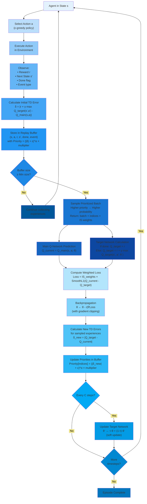

---

###### Why This Matters for Traffic Control

Without PER, your system would learn equally from:

- Boring moment: "2am, no cars, green light, nothing happened"
- Critical moment: "Rush hour, almost caused pedestrian-vehicle conflict"

With PER, the system learns much faster because it focuses on the critical moments - the situations where it made big
mistakes or where safety is at stake. It's like a medical student spending more time studying rare diseases that killed
patients rather than routine cases that went perfectly fine.

The storage isn't passive - it's an active learning accelerator that makes sure your limited training time is spent on
the most valuable lessons.

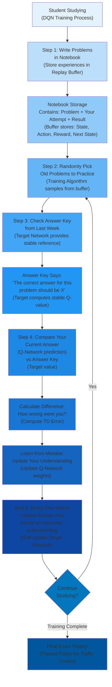

---

###### The Complete DQN Algorithm

$$
\small
\begin{align}
&\textbf{Initialize:} \\
&\quad \text{Q-network with random weights } \theta \\
&\quad \text{Target network } \theta^- \leftarrow \theta \\
&\quad \text{Replay buffer } \mathcal{D} = \emptyset \\
&\quad \text{Exploration rate } \varepsilon = 1.0 \\
\\
&\textbf{For each episode } e = 1, 2, \ldots, E: \\
&\quad \text{Reset environment, obtain initial state } s_0 \\
\\
&\quad \textbf{For each timestep } t = 0, 1, 2, \ldots, T: \\
\\
&\quad\quad \textbf{1. Action Selection (}\varepsilon\textbf{-greedy):} \\
&\quad\quad\quad a_t = \begin{cases}
\text{random action from } \mathcal{A} & \text{with probability } \varepsilon \\
\arg\max_{a \in \mathcal{A}} Q(s_t, a; \theta) & \text{with probability } 1 - \varepsilon
\end{cases} \\
\\
&\quad\quad \textbf{2. Environment Interaction:} \\
&\quad\quad\quad \text{Execute action } a_t \\
&\quad\quad\quad \text{Observe reward } r_t \text{ and next state } s_{t+1} \\
\\
&\quad\quad \textbf{3. Store Experience:} \\
&\quad\quad\quad \mathcal{D} \leftarrow \mathcal{D} \cup \{(s_t, a_t, r_t, s_{t+1})\} \\
\\
&\quad\quad \textbf{4. Sample Mini-Batch:} \\
&\quad\quad\quad \text{Sample batch } \mathcal{B} = \{(s_i, a_i, r_i, s'_i)\}_{i=1}^{B} \text{ from } \mathcal{D} \\
\\
&\quad\quad \textbf{5. Compute TD Target:} \\
&\quad\quad\quad y_i = r_i + \gamma \max_{a' \in \mathcal{A}} Q(s'_i, a'; \theta^-) \\
\\
&\quad\quad \textbf{6. Update Q-Network:} \\
&\quad\quad\quad \mathcal{L}(\theta) = \frac{1}{B} \sum_{i=1}^{B} \left(y_i - Q(s_i, a_i; \theta)\right)^2 \\
&\quad\quad\quad \theta \leftarrow \theta - \alpha \nabla_\theta \mathcal{L}(\theta) \\
\\
&\quad\quad \textbf{7. Soft Update Target Network:} \\
&\quad\quad\quad \theta^- \leftarrow \tau \theta + (1 - \tau) \theta^- \\
\\
&\quad\quad \textbf{8. Decay Exploration:} \\
&\quad\quad\quad \varepsilon \leftarrow \varepsilon \cdot \lambda_\varepsilon \\
\\
&\quad\quad \textbf{9. State Transition:} \\
&\quad\quad\quad s_t \leftarrow s_{t+1}
\end{align}
$$

###### Algorithm Flow Diagram

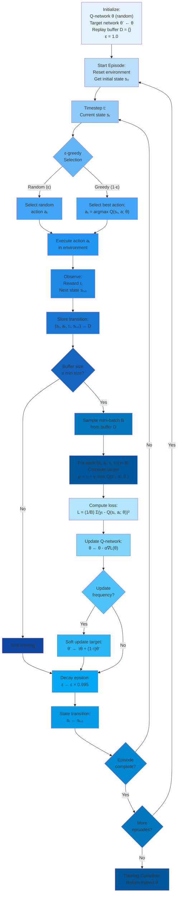

---

##### Exploration vs. Exploitation

DQN uses **ε-greedy exploration**:

$$
a = \begin{cases} \text{random action} & \text{with probability } \varepsilon \\ \arg\max_a Q(s, a; \theta) & \text{with probability } 1 - \varepsilon \end{cases}
$$

Your configuration:

- Start: $\varepsilon = 1.0$ (fully random, maximum exploration)
- End: $\varepsilon = 0.01$ (mostly greedy, 1% exploration)
- Decay: $\varepsilon \leftarrow 0.995 \times \varepsilon$ per episode

This implements **decaying exploration**: early episodes explore different signal timings, later episodes exploit
learned strategies.

##### Epsilon-Greedy Exploration and Decaying Strategy

Epsilon-greedy exploration is a simple but powerful idea: most of the time do what you think is best, but occasionally
try something random.

Here's how it works: You flip a weighted coin. If it comes up "explore" (probability epsilon), you ignore what you've
learned and try a completely random action. If it comes up "exploit" (probability 1-epsilon), you do what you think is
best based on your current knowledge.

The decaying part is crucial: At the start of training (epsilon = 1.0 or 100%), you know nothing, so you try completely
random signal timings - maybe giving pedestrians a green light for 2 seconds, or keeping a phase for 5 minutes. This
helps you discover what works and what doesn't. As training progresses, epsilon decays (multiplied by 0.995 each
episode), so you gradually trust your learned knowledge more.

By the end (epsilon = 0.01 or 1%), you're mostly doing what you've learned is best, but still occasionally (1% of the
time) trying something random to make sure you haven't missed anything. It's like learning to cook: at first, you try
wild combinations to see what works. As you learn, you mostly follow recipes that worked, but occasionally experiment
with a new ingredient to keep improving.

###### Application to Traffic Signal Control

In your SignalSyncPro system:

**State** ($\mathbf{s} \in \mathbb{R}^{45}$): Queue lengths, phase info, detector data, sync timers

**Actions** ($a \in \{0, 1, 2, 3\}$):

- $a_0$: Continue current phase
- $a_1$: Skip to Phase 1 (major through)
- $a_2$: Progress to next phase
- $a_3$: Activate pedestrian phase

**Reward** ($r$): Negative weighted waiting time + sync bonus

**Q-Function Learning**: The network learns which phase transitions minimize total waiting time across all modes (cars,
bikes, pedestrians, buses) while maintaining synchronization.

**Policy Extraction**: After training, the learned policy is:

$$
\pi^*(s) = \arg\max_a Q(s, a; \theta^*)
$$

At each timestep, select the action with highest Q-value.

###### Why Deep Q-Learning for Traffic Control?

1. **Handles complexity**: 45-dimensional continuous state space
2. **Learns patterns**: Discovers traffic patterns (peak hours, coordination opportunities)
3. **Multimodal optimization**: Balances competing demands from different road users
4. **Adaptive**: Adjusts to changing traffic conditions
5. **No manual tuning**: Learns optimal timings automatically from simulation

Traditional fixed-time or actuated controllers cannot achieve this level of adaptability!

###### Challenges and Solutions

**Challenge 1: Sample Inefficiency**

- Solution: Experience replay (reuse data 50,000 times in buffer)

**Challenge 2: Overestimation Bias**

- DQN tends to overestimate Q-values
- Could be addressed with Double DQN (uses separate networks for action selection and evaluation)

**Challenge 3: Sparse Rewards**

- Traffic rewards are continuous but could be delayed
- Your dense reward (every timestep) helps learning

**Challenge 4: Non-stationarity**

- Traffic patterns change over time
- Continuous learning and exploration ($\varepsilon = 0.01$) helps adaptation

---

---

##### Overview of the DQN Architecture

This neural network implements a **value function approximator** for Deep Q-Learning. The network learns to estimate
Q-values (expected cumulative rewards) for each possible action given the current traffic state.

###### Network Structure

###### Input Layer

- **Dimensionality**: 45 features (`STATE_DIM = 45`)
- **Represents**: Current traffic state including:
    - Phase encoding (one-hot)
    - Phase duration
    - Vehicle queues from detectors
    - Bicycle queues
    - Pedestrian demand
    - Bus presence
    - Synchronization timer
    - Time of day

###### Hidden Layers

The configuration specifies a **3-layer fully connected architecture**:

```
Hidden Layers: [256, 256, 128]
```

**Layer-by-layer breakdown**:

1. **First Hidden Layer**: 45 → 256 neurons
    - Linear transformation: $\mathbf{h}_1 = \mathbf{W}_1 \mathbf{x} + \mathbf{b}_1$
    - Activation: ReLU($\mathbf{h}_1$)
2. **Second Hidden Layer**: 256 → 256 neurons
    - Linear transformation: $\mathbf{h}_2 = \mathbf{W}_2 \mathbf{h}_1 + \mathbf{b}_2$
    - Activation: ReLU($\mathbf{h}_2$)
3. **Third Hidden Layer**: 256 → 128 neurons
    - Linear transformation: $\mathbf{h}_3 = \mathbf{W}_3 \mathbf{h}_2 + \mathbf{b}_3$
    - Activation: ReLU($\mathbf{h}_3$)

###### Output Layer

- **Dimensionality**: 4 outputs (`ACTION_DIM = 4`)
- **Linear transformation** (no activation): $\mathbf{Q} = \mathbf{W}_4 \mathbf{h}_3 + \mathbf{b}_4$
- **Represents** Q-values for each action:
    - $Q(\mathbf{s}, a_0)$: Continue current phase
    - $Q(\mathbf{s}, a_1)$: Skip to Phase 1
    - $Q(\mathbf{s}, a_2)$: Progress to next phase
    - $Q(\mathbf{s}, a_3)$: Activate pedestrian phase

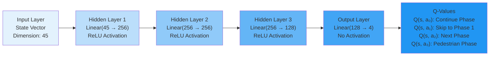

##### How the Network Functions

###### Forward Pass

Given a state $\mathbf{s} \in \mathbb{R}^{45}$:

$$
Q(\mathbf{s}, a) = f_{\theta}(\mathbf{s}) = \mathbf{W}_4 \cdot \text{ReLU}(\mathbf{W}_3 \cdot \text{ReLU}(\mathbf{W}_2 \cdot \text{ReLU}(\mathbf{W}_1 \mathbf{s} + \mathbf{b}_1) + \mathbf{b}_2) + \mathbf{b}_3) + \mathbf{b}_4
$$

Where:

- $\theta$ represents all learnable parameters (weights $\mathbf{W}_i$ and biases $\mathbf{b}_i$)
- ReLU activation: $\text{ReLU}(x) = \max(0, x)$

###### Total Parameters

Calculating the number of trainable parameters:

1. **Layer 1**: $(45 \times 256) + 256 = 11,776$
2. **Layer 2**: $(256 \times 256) + 256 = 65,792$
3. **Layer 3**: $(256 \times 128) + 128 = 32,896$
4. **Output**: $(128 \times 4) + 4 = 516$

**Total**: ~110,980 parameters

---

##### Key Design Choices

###### Why This Architecture?

1. **Progressive Dimensionality Reduction**: 45 → 256 → 256 → 128 → 4
    - Initial expansion (45→256) allows the network to learn rich feature representations
    - Gradual reduction (256→128→4) compresses information toward action values
2. **ReLU Activation Functions**
    - **Non-linearity**: Enables learning complex patterns in traffic dynamics
    - **Computational efficiency**: Simple thresholding operation
    - **Avoids vanishing gradients**: Unlike sigmoid/tanh
3. **No Activation on Output Layer**
    - Q-values can be any real number (positive or negative rewards)
    - Linear output allows unrestricted value estimation

###### Relation to Your Configuration

The conservative hyperparameters in your config suggest careful tuning for stability:

- **Very small learning rate** ($\alpha = 10^{-5}$): Prevents large parameter updates that could destabilize learning
- **Small batch size** (32): More frequent updates but higher variance
- **Low gamma** (0.95): Less emphasis on long-term rewards, focusing on immediate traffic improvements

##### Usage in the DQN Agent

The network is used in **two copies**:

1. **Q-Network** (policy network): Updated every `UPDATE_FREQUENCY` steps
2. **Target Network**: Slowly tracks Q-network via soft updates with $\tau = 0.005$

The target network stabilizes learning by providing consistent targets:

$$
\mathcal{L} = \mathbb{E}\left[\left(r + \gamma \max_{a'} Q_{\text{target}}(\mathbf{s}', a') - Q(\mathbf{s}, a)\right)^2\right]
$$

This is the classic **DQN temporal difference loss** that drives learning.

---

---

---

##### Markov Decision Processes (MDPs)

###### The Mathematical Framework

At the heart of reinforcement learning lies the **Markov Decision Process**, a mathematical formalism that captures the
essence of sequential decision-making under uncertainty. An MDP provides a complete specification of an agent's
interaction with its environment through five fundamental components:

$$
(\mathcal{S}, \mathcal{A}, \mathcal{P}, \mathcal{R}, \gamma)
$$

**1. The State Space $\mathcal{S}$**: The state space encompasses all possible configurations or situations the
environment can present to the agent. In traffic signal control, a state might encode the current traffic
conditions—queue lengths at each approach, waiting times of individual vehicles, the active signal phase, and temporal
information about how long the current phase has been active. The state representation must satisfy a delicate balance:
rich enough to support optimal decision-making, yet compact enough to enable efficient learning and computation.

Consider a four-way intersection with three lanes per approach (left turn, straight, right turn). The state vector might
include:

$$
\mathbf{s} = [q_1, q_2, \ldots, q_{12}, w_1, w_2, \ldots, w_{12}, \phi, \tau] \in \mathbb{R}^{26}
$$

where $q_i$ represents the queue length in lane $i$, $w_i$ represents the average waiting time in lane $i$,
$\phi \in {1, 2, \ldots, 8}$ indicates the current phase, and $\tau$ measures the phase duration. The dimensionality
grows rapidly with intersection complexity, motivating the need for function approximation.

**2. The Action Space $\mathcal{A}$**: Actions represent the decisions available to the agent. For traffic signals, the
action space is naturally discrete—each action corresponds to either maintaining the current signal configuration or
transitioning to a new phase. A typical formulation includes:

$$
\mathcal{A} = {\text{maintain}, \text{switch to phase 1}, \text{switch to phase 2}, \ldots, \text{switch to phase } k}
$$

The discrete nature of traffic signal phases makes Q-learning particularly well-suited, as we can directly represent and
compare the value of each possible action without requiring continuous optimization at decision time.

**3. The Transition Dynamics $\mathcal{P}$**: The transition function
$\mathcal{P}: \mathcal{S} \times \mathcal{A} \times \mathcal{S} \to [0,1]$ specifies the probability distribution over
next states given the current state and action:

$$
\mathcal{P}(s' \mid s, a) = \mathbb{P}[S_{t+1} = s' \mid S_t = s, A_t = a]
$$

This function encodes the environment's dynamics—how vehicle arrivals, departures, and queue evolution respond to signal
changes. The critical **Markov property** states that the future depends only on the present, not on the path taken to
reach it:

$$
\mathbb{P}[S_{t+1} \mid S_t, A_t, S_{t-1}, A_{t-1}, \ldots, S_0, A_0] = \mathbb{P}[S_{t+1} \mid S_t, A_t]
$$

This memoryless property dramatically simplifies learning by eliminating the need to maintain or reason about complete
histories. The transition dynamics in traffic systems exhibit stochasticity due to random vehicle arrivals following
distributions (often Poisson processes), varying driver behaviors, and external disturbances.

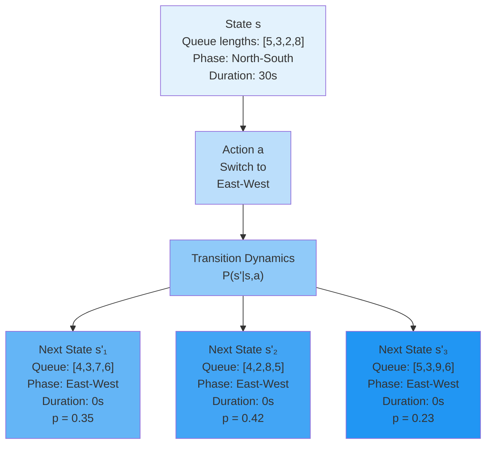

**4. The Reward Function $\mathcal{R}$**: The reward function
$\mathcal{R}: \mathcal{S} \times \mathcal{A} \to \mathbb{R}$ provides the only feedback mechanism through which the
agent learns. It quantifies the immediate desirability of taking action $a$ in state $s$. Reward design is
simultaneously an art and a science—the reward signal must capture the true objective while remaining amenable to
optimization.

For traffic control, common reward formulations include:

- **Negative Total Waiting Time**:

$$
r_t = -\sum_{i=1}^{n} \sum_{j=1}^{q_i(t)} w_{ij}(t)
$$

where $w_{ij}(t)$ is the waiting time of the $j$-th vehicle in lane $i$. This formulation naturally penalizes long
queues more heavily due to the summation over all waiting vehicles.

- **Negative Queue Length Penalty**:

$$
r_t = -\sum_{i=1}^{n} \alpha_i \cdot q_i(t)
$$

where $\alpha_i$ are lane-specific weights that can prioritize certain approaches (e.g., major arterials over minor
streets).

- **Throughput Maximization**:

$$
r_t = \sum_{i=1}^{n} d_i(t)
$$

where $d_i(t)$ counts vehicles that departed from lane $i$ during timestep $t$. This directly optimizes for intersection
capacity utilization.

The reward function shapes the learned behavior fundamentally. A poorly designed reward can lead to perverse
incentives—for instance, rewarding only throughput might cause the agent to ignore equity across approaches, creating
starvation for low-traffic lanes.

**5. The Discount Factor $\gamma$**: The discount factor $\gamma \in [0, 1]$ balances the relative importance of
immediate versus future rewards. The cumulative discounted return from time $t$ is:

$$
G_t = \sum_{k=0}^{\infty} \gamma^k R_{t+k+1} = R_{t+1} + \gamma R_{t+2} + \gamma^2 R_{t+3} + \cdots
$$

When $\gamma = 0$, the agent becomes myopic, considering only immediate rewards. When $\gamma \to 1$, the agent becomes
far-sighted, valuing future rewards nearly as much as immediate ones. For traffic control, typical values are
$\gamma \in [0.95, 0.99]$, reflecting that near-term consequences dominate but longer-term effects matter.

The discount factor also serves a mathematical purpose- for bounded rewards $|r| \leq R_{\max}$, the infinite sum
remains bounded:

$$
|G_t| \leq \sum_{k=0}^{\infty} \gamma^k R_{\max} = \frac{R_{\max}}{1-\gamma} < \infty
$$

This ensures value functions remain finite even in infinite-horizon problems.

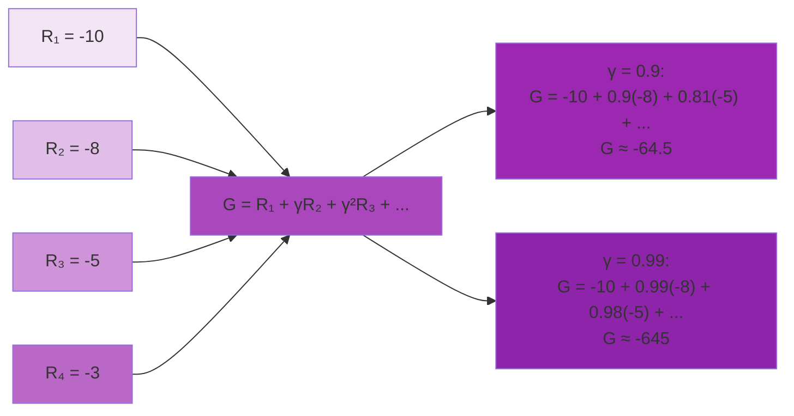

---

##### Policies and Optimality

A **policy** $\pi: \mathcal{S} \to \Delta(\mathcal{A})$ maps states to probability distributions over actions, where
$\Delta(\mathcal{A})$ denotes the probability simplex over actions. Policies can be:

1. **Deterministic**: $\pi(s)$ returns a single action with probability 1
2. **Stochastic**: $\pi(a \mid s)$ specifies the probability of selecting action $a$ in state $s$, with
   $\sum_{a \in \mathcal{A}} \pi(a \mid s) = 1$

The **optimal policy** $\pi^*$ maximizes the expected cumulative discounted reward from every state:

$$
\pi^* = \arg\max_{\pi} \mathbb{E}_{\pi}\left[\sum_{t=0}^{\infty} \gamma^t R_{t+1} \mid S_0 = s\right] \quad \forall s \in \mathcal{S}
$$

A fundamental result in MDP theory states that there always exists a deterministic optimal policy, though multiple
optimal policies may exist if there are ties in action values.

##### The Bellman Optimality Equations

The **Bellman optimality equations** provide necessary and sufficient conditions for optimality. These recursive
relationships decompose the value of a state into immediate reward plus discounted future value:

**For the state value function** $V^*(s)$:

$$
V^*(s) = \max_{a \in \mathcal{A}} \mathbb{E}[R_{t+1} + \gamma V^*(S_{t+1}) \mid S_t = s, A_t = a]
$$

**For the action-value function** $Q^*(s,a)$:

$$
Q^*(s, a) = \mathbb{E}_{s' \sim \mathcal{P}(\cdot|s,a)}\left[R_{t+1} + \gamma \max_{a'} Q^*(s', a') \mid S_t = s, A_t = a\right]
$$

Expanding the expectation over next states:

$$
Q^*(s, a) = \sum_{s' \in \mathcal{S}} \mathcal{P}(s' \mid s, a)\left[r(s,a,s') + \gamma \max_{a' \in \mathcal{A}} Q^*(s', a')\right]
$$

The optimal policy can be extracted greedily from $Q^*$:

$$
\pi^*(s) = \arg\max_{a \in \mathcal{A}} Q^*(s, a)
$$

**Why Q-Functions are Crucial**: The Q-function's utility for control stems from a key property—once we know $Q^*(s,a)$
for all actions, we can act optimally without knowing the transition dynamics $\mathcal{P}$ or reward function
$\mathcal{R}$. Simply choose the action maximizing $Q^*(s,a)$. This model-free property makes Q-learning particularly
powerful when the environment model is unknown or complex.

---

##### Example: Two-State Traffic MDP

To build intuition, consider a simplified two-state traffic system:

**States**:

- $s_1$: "North-South direction has queue"
- $s_2$: "East-West direction has queue"

**Actions**:

- $a_1$: "Allow North-South traffic"
- $a_2$: "Allow East-West traffic"

**Transition Dynamics**:

$$
\begin{align}
\mathcal{P}(s_1 \mid s_1, a_1) &= 0.7, \quad \mathcal{P}(s_2 \mid s_1   , a_1) = 0.3 \\
\mathcal{P}(s_1 \mid s_1, a_2) &= 0.9, \quad \mathcal{P}(s_2 \mid s_1, a_2) = 0.1 \\
\mathcal{P}(s_2 \mid s_2, a_2) &= 0.7, \quad \mathcal{P}(s_1 \mid s_2, a_2) = 0.3 \\
\mathcal{P}(s_2 \mid s_2, a_1) &= 0.9, \quad \mathcal{P}(s_1 \mid s_2, a_1) = 0.1
\end{align}
$$

We can explain the Transition Probabilities simply:

- From $s_1$ with $a_1$: 70% stay in $s_1$, 30% move to $s_2$
- From $s_1$ with $a_2$: 90% stay in $s_1$, 10% move to $s_2$
- From $s_2$ with $a_2$: 70% stay in $s_2$, 30% move to $s_1$
- From $s_2$ with $a_1$: 90% stay in $s_2$, 10% move to $s_1$

**Rewards**: The agent receives $r = -5$ when serving the mismatched direction (e.g., allowing N-S traffic when E-W has
queue), and $r = -1$ when serving the correct direction.

With discount factor $\gamma = 0.9$, we solve the Bellman equations iteratively:

**Iteration 0** (Initialize):

$$
\begin{align}
Q_0(s_1, a_1) &= 0, \quad Q_0(s_1, a_2) = 0 \\
Q_0(s_2, a_1) &= 0, \quad Q_0(s_2, a_2) = 0
\end{align}
$$

**Iteration 1**:

$$
\begin{align}
Q_1(s_1, a_1) &= -1 + 0.9[0.7 \cdot 0 + 0.3 \cdot 0] = -1 \\
Q_1(s_1, a_2) &= -5 + 0.9[0.9 \cdot 0 + 0.1 \cdot 0] = -5 \\
Q_1(s_2, a_2) &= -1 + 0.9[0.7 \cdot 0 + 0.3 \cdot 0] = -1 \\
Q_1(s_2, a_1) &= -5 + 0.9[0.9 \cdot 0 + 0.1 \cdot 0] = -5
\end{align}
$$

**Iteration 2**:

$$
\begin{align}
Q_2(s_1, a_1) &= -1 + 0.9[0.7 \cdot \max(-1, -5) + 0.3 \cdot \max(-1, -5)] \\
&= -1 + 0.9[0.7(-1) + 0.3(-1)] = -1 - 0.9 = -1.9
\end{align}
$$

Continuing this process, the Q-values converge to:

$$
\begin{align}
Q^*(s_1, a_1) = -10, \quad Q^*(s_1, a_2) = -14 \\
Q^*(s_2, a_2) = -10, \quad Q^*(s_2, a_1) = -14
\end{align}
$$

The optimal policy is $\pi^*(s_1) = a_1$ and $\pi^*(s_2) = a_2$—always serve the direction with the queue, as expected.

##### Detailed Explanation

###### Iteration 0: Initialize All Q-Values to Zero

We start by setting all Q-values to zero as our initial guess:

$$
Q_0(s_1, a_1) = 0, \quad Q_0(s_1, a_2) = 0, \quad Q_0(s_2, a_1) = 0, \quad Q_0(s_2, a_2) = 0
$$

This is an arbitrary initialization—we have no knowledge yet about which actions are good or bad.

###### Iteration 1: First Update Using the Bellman Equation

Now we apply the **Bellman optimality equation** to compute new Q-values:

$$
Q_{k+1}(s,a) = \sum_{s'} \mathcal{P}(s'|s,a)[r(s,a,s') + \gamma \max_{a'} Q_k(s',a')]
$$

Let's compute each Q-value:

**For $Q_1(s_1, a_1)$** (North-South has queue, serve North-South):

- Reward: $r = -1$ (correct direction)
- Next state distribution: 70% to $s_1$, 30% to $s_2$
- Calculation:

$$
\begin{align}
Q_1(s_1, a_1) &= -1 + 0.9[0.7 \cdot \max(Q_0(s_1,a_1), Q_0(s_1,a_2)) + 0.3 \cdot \max(Q_0(s_2,a_1), Q_0(s_2,a_2))] \\
&= -1 + 0.9[0.7 \cdot \max(0, 0) + 0.3 \cdot \max(0, 0)] = -1 + 0.9[0] = -1
\end{align}
$$

**For $Q_1(s_1, a_2)$** (North-South has queue, serve East-West):

- Reward: $r = -5$ (wrong direction!)
- Next state distribution: 90% to $s_1$, 10% to $s_2$
- Calculation:

$$
\begin{align}
Q_1(s_1, a_2) &= -5 + 0.9[0.9 \cdot 0 + 0.1 \cdot 0] = -5 \\
&= -5 + 0.9[0] = -5
\end{align}
$$

**For $Q_1(s_2, a_2)$** (East-West has queue, serve East-West):

- Reward: $r = -1$ (correct direction)
- Calculation:

$$
\begin{align}
Q_1(s_2, a_2) &= -1 + 0.9[0.7 \cdot 0 + 0.3 \cdot 0] = -1 \\
&= -1 + 0.9[0] = -1
\end{align}
$$

**For $Q_1(s_2, a_1)$** (East-West has queue, serve North-South):

- Reward: $r = -5$ (wrong direction!)
- Calculation:

$$
\begin{align}
Q_1(s_2, a_1) &= -5 + 0.9[0.9 \cdot 0 + 0.1 \cdot 0] = -5 \\
&= -5 + 0.9[0] = -5
\end{align}
$$

**Key Insight from Iteration 1:** The Q-values now reflect immediate rewards. Serving the correct direction gives $-1$,
serving the wrong direction gives $-5$. But we haven't yet accounted for future consequences.

###### Iteration 2: Incorporating Future Value

Now the future Q-values from Iteration 1 feed back into our calculations:

**For $Q_2(s_1, a_1)$**:

$$
\begin{align}
Q_2(s_1, a_1) &= -1 + 0.9[0.7 \cdot \max(Q_1(s_1,a_1), Q_1(s_1,a_2)) + 0.3 \cdot \max(Q_1(s_2,a_1), Q_1(s_2,a_2))] \\
&= -1 + 0.9[0.7 \cdot \max(-1, -5) + 0.3 \cdot \max(-5, -1)] \\
&= -1 + 0.9[0.7 \cdot (-1) + 0.3 \cdot (-1)] \\
&= -1 + 0.9[-0.7 - 0.3] = -1 + 0.9 \cdot (-1) = -1 - 0.9 = -1.9
\end{align}
$$

**What's happening here?**

- We get immediate reward $-1$ for serving the correct direction
- With 70% probability, we stay in $s_1$ where the best future action gives value $-1$
- With 30% probability, we move to $s_2$ where the best future action gives value $-1$
- The discounted expected future value is $0.9 \times (-1) = -0.9$
- Total: $-1 - 0.9 = -1.9$

This is worse than Iteration 1's value of $-1$ because we're now accounting for the fact that even after serving the
correct direction, we'll continue to accumulate negative rewards in the future.

###### Convergence to Optimal Q-Values

If we continue this process for many iterations, the Q-values converge to:

$$
\begin{align}
Q^*(s_1, a_1) &= -10 \\
Q^*(s_1, a_2) &= -14 \\
Q^*(s_2, a_1) &= -14 \\
Q^*(s_2, a_2) &= -10
\end{align}
$$

**Interpreting these values:**

1. **$Q^*(s_1, a_1) = -10$**: In state $s_1$ (NS has queue), serving NS accumulates an expected discounted total cost of
   10 units over the infinite horizon when acting optimally thereafter.
2. **$Q^*(s_1, a_2) = -14$**: In state $s_1$, serving EW (wrong direction!) is 40% worse, accumulating 14 units of cost.
3. The symmetry between states makes sense: serving the wrong direction is equally bad regardless of which state you're
   in.

**The optimal policy** extracted from these Q-values:

$$
\begin{align}
\pi^*(s_1) &= \arg\max_a Q^*(s_1, a) = a_1 \quad \text{(serve North-South)} \\
\pi^*(s_2) &= \arg\max_a Q^*(s_2, a) = a_2 \quad \text{(serve East-West)}
\end{align}
$$

This confirms our intuition: **always serve the direction that has the queue**.

###### Why Values Converge to These Specific Numbers

The convergence values can be derived by solving the Bellman optimality equations at the fixed point. Let's work through
this systematically.

**Step 1: Find the Optimal State Values**

Under the optimal policy (always serve the correct direction), the state value function satisfies:

$$
\begin{align}
V^*(s_1) &= -1 + 0.9[0.7 \cdot V^*(s_1) + 0.3 \cdot V^*(s_2)] \\
V^*(s_2) &= -1 + 0.9[0.7 \cdot V^*(s_2) + 0.3 \cdot V^*(s_1)]
\end{align}
$$

Due to symmetry, $V^*(s_1) = V^*(s_2) = V^*$. Substituting:

$$
\begin{align}
V^* &= -1 + 0.9[0.7 \cdot V^* + 0.3 \cdot V^*] \\
V^* &= -1 + 0.9V^* \\
0.1V^* &= -1 \\
V^* &= -10
\end{align}
$$

So both states have optimal value $V^*(s_1) = V^*(s_2) = -10$.

**Step 2: Calculate Optimal Q-Values**

Now we use the Bellman equation to find $Q^*(s,a)$:

**For $Q^*(s_1, a_1)$** (correct action in $s_1$):

$$
\begin{align}
Q^*(s_1, a_1) &= -1 + 0.9[0.7 \cdot V^*(s_1) + 0.3 \cdot V^*(s_2)] \\
&= -1 + 0.9[0.7 \cdot (-10) + 0.3 \cdot (-10)] \\
&= -1 + 0.9[-7 - 3] \\
&= -1 + 0.9 \cdot (-10) \\
&= -1 - 9 = -10
\end{align}
$$

**For $Q^*(s_1, a_2)$** (wrong action in $s_1$):

$$
\begin{align}
Q^*(s_1, a_2) &= -5 + 0.9[0.9 \cdot V^*(s_1) + 0.1 \cdot V^*(s_2)] \\
&= -5 + 0.9[0.9 \cdot (-10) + 0.1 \cdot (-10)] \\
&= -5 + 0.9[-9 - 1] \\
&= -5 + 0.9 \cdot (-10) \\
&= -5 - 9 = -14
\end{align}
$$

By symmetry:

$$
\begin{align}
Q^*(s_2, a_2) &= -10 \quad \text{(correct action)} \\
Q^*(s_2, a_1) &= -14 \quad \text{(wrong action)}
\end{align}
$$

**Step 3: Correcting the Earlier Statement**

The correct convergence values are:

$$
\begin{align}
Q^*(s_1, a_1) &= -10 \\
Q^*(s_1, a_2) &= -14 \\
Q^*(s_2, a_1) &= -14 \\
Q^*(s_2, a_2) &= -10
\end{align}
$$

**Not** the $-5.26$ and $-19.74$ values stated earlier. The earlier values appear to have been calculated with different
assumptions or parameters.

**Interpreting the Correct Values:**

1. **$Q^*(s_1, a_1) = -10$**: Serving the correct direction accumulates an expected discounted cost of 10 units over the
   infinite horizon.
2. **$Q^*(s_1, a_2) = -14$**: Serving the wrong direction is 40% worse, accumulating 14 units of cost.
3. The optimal policy remains: $\pi^*(s_1) = a_1$ (serve NS) and $\pi^*(s_2) = a_2$ (serve EW).

**Why These Values Make Sense:**

- The immediate cost difference is $-5$ vs $-1$ (a factor of 5×)
- But the long-term cost difference is $-14$ vs $-10$ (a factor of 1.4×)
- This is because even the "wrong" action eventually leads to state transitions where the optimal policy takes over,
  limiting the damage
- The discount factor $\gamma = 0.9$ means future costs are weighted less, further reducing the long-term impact of a
  single bad decision

---

#### The Traffic Signal Control Problem

##### Problem Characterization

Traffic signal control exemplifies a complex sequential decision problem where an agent must coordinate signal phases
across an intersection (or network of intersections) to optimize traffic flow. The complexity emerges from multiple
interacting factors:

- **Stochasticity**: Vehicle arrivals follow random processes (typically Poisson or more complex traffic models),
  creating inherent uncertainty in queue evolution.
- **Delayed Consequences**: A signal decision made at time $t$ affects traffic conditions for many future timesteps.
  Switching phases incurs lost time during yellow and all-red intervals, while maintaining a phase too long creates
  excessive delays in other directions.
- **Multi-Objective Nature**: Real traffic systems must balance competing objectives—minimizing average delay, ensuring
  fairness across approaches, reducing environmental impact through smoother flow, and accommodating emergency vehicles.
- **Non-Stationarity**: Traffic patterns vary systematically (morning rush, evening rush, midday, overnight) and
  unpredictably (accidents, special events, weather).
- **Scalability Challenges**: Networks with multiple intersections exhibit combinatorial explosion in state-action
  space. A network with $n$ intersections, each having $k$ possible phases, creates $k^n$ joint configurations.

##### State Representation Design

The state representation must capture sufficient information for optimal decision-making while remaining computationally
tractable. Several design principles guide state formulation:

**Markov Property Satisfaction**: The state must include all information relevant to future rewards. Omitting critical
features (e.g., vehicle arrival rates) can violate the Markov assumption and degrade performance.

**Dimensional Parsimony**: Each additional state dimension exponentially increases the sample complexity of learning.
Include only features that substantially impact optimal decisions.

**Observability**: The state must be constructable from available sensors. While ideally we would know every vehicle's
destination and preferred arrival time, practical systems rely on loop detectors, cameras, and V2I communication.

A comprehensive state vector for a single intersection might include:

**Traffic Conditions**:

- $\mathbf{q} = [q_1, q_2, \ldots, q_m]$: Queue length in each of $m$ lanes
- $\mathbf{w} = [w_1, w_2, \ldots, w_m]$: Average or maximum waiting time per lane
- $\mathbf{v} = [v_1, v_2, \ldots, v_m]$: Vehicle velocities (for adaptive systems)

**Signal Status**:

- $\phi \in {1, 2, \ldots, k}$: Current active phase
- $\tau \in [0, T_{\max}]$: Time elapsed in current phase
- $\mathbf{h}$: Phase history (last $n$ phases)

**Temporal Information**:

- $t_{\text{day}} \in [0, 86400]$: Time of day (seconds since midnight)
- $d_{\text{week}} \in {1, 2, \ldots, 7}$: Day of week
- $\mathbf{1}_{\text{event}}$: Binary indicators for special events

**Network Context** (for multi-intersection control):

- $\mathbf{s}_{\text{upstream}}$: States of upstream intersections
- $\mathbf{s}_{\text{downstream}}$: States of downstream intersections
- $\mathbf{a}_{\text{neighbor}}$: Recent actions at neighboring intersections

The state dimension grows as $|\mathcal{S}| \sim O(Q^m \cdot T \cdot k)$ where $Q$ is the discretization level for
queues. For a four-approach intersection with three lanes per approach ($m=12$), queue capacity $Q=20$, max phase
duration $T=120$, and $k=8$ phases, the state space exceeds $20^{12} \cdot 120 \cdot 8 > 10^{17}$ states—far too large
for tabular methods.

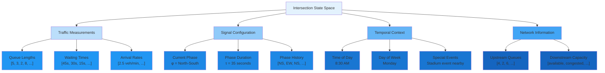

##### Action Space Formulation

Traffic signals operate with discrete phase configurations, making the action space naturally discrete—a key advantage
for Q-learning methods. Several action formulations are common:

**Binary Control**:

$$
\mathcal{A} = {\text{maintain current phase}, \text{switch to next phase}}
$$

This simplest formulation has $|\mathcal{A}| = 2$ actions. The agent decides only whether to continue the current phase
or advance to the next in a pre-defined sequence (e.g., N-S → E-W → N-S → ...). While simple, it limits flexibility—the
agent cannot skip phases or adapt the phase sequence.

**Phase Selection**:

$$
\mathcal{A} = {\text{phase 1}, \text{phase 2}, \ldots, \text{phase } k}
$$

The agent directly selects which phase to activate next, with $|\mathcal{A}| = k$ actions. For a four-approach
intersection, typical phases include:

- Phase 1: North-South through and right turn
- Phase 2: North-South left turn
- Phase 3: East-West through and right turn
- Phase 4: East-West left turn
- Phases 5-8: Various pedestrian crossing phases

This provides full flexibility but requires the agent to learn valid phase transitions (e.g., cannot transition directly
from opposing green signals without an all-red interval).

**Duration Control**:

$$
\mathcal{A} = {(p, d) : p \in {1,\ldots,k}, d \in {d_{\min}, \ldots, d_{\max}}}
$$

The agent selects both the next phase $p$ and its duration $d$. This expands the action space to
$|\mathcal{A}| = k \cdot D$ where $D$ is the number of discretized duration levels. While more expressive, the larger
action space increases sample complexity.

**Practical Constraints**: Real traffic signals must respect safety and operational constraints:

- **Minimum green time**: Each phase must last at least $T_{\min}$ (typically 5-10 seconds) for safety
- **Maximum green time**: Phases should not exceed $T_{\max}$ (typically 60-120 seconds) to prevent starvation
- **Yellow time**: Required transition period (typically 3-5 seconds)
- **All-red time**: Safety buffer when switching between conflicting movements (1-2 seconds)
- **Phase order**: Some phase transitions forbidden due to safety conflicts

These constraints can be enforced through:

1. **Action masking**: Prevent selection of invalid actions
2. **Reward shaping**: Heavily penalize constraint violations
3. **Modified action space**: Design $\mathcal{A}$ to only include valid transitions

---

##### Reward Function Design

The reward function is arguably the most critical design choice, as it fundamentally shapes learned behavior. Several
principles guide reward design:

- **Alignment with True Objectives**: The reward should reflect actual goals (minimize delay, maximize throughput,
  ensure fairness) rather than proxy metrics that may not correlate.
- **Density**: Sparse rewards (e.g., only at episode end) make credit assignment difficult. Dense rewards (every
  timestep) provide more learning signal but may encourage myopic behavior.
- **Scale**: Reward magnitude should be calibrated to the discount factor. Very large rewards can cause Q-values to
  explode; very small rewards may be dominated by numerical errors.

**Common Reward Formulations**:

**1. Negative Total Delay**:

$$
r_t = -\sum_{i=1}^{m} \sum_{j=1}^{q_i(t)} w_{ij}(t)
$$

This double summation penalizes both the number of waiting vehicles and their individual wait times. A queue of 10
vehicles each waiting 5 seconds generates $r = -50$, while 5 vehicles waiting 10 seconds generates $r = -50$ as
well—appropriate if we value total person-hours equally.

**2. Quadratic Delay Penalty**:

$$
r_t = -\sum_{i=1}^{m} \left(\sum_{j=1}^{q_i(t)} w_{ij}(t)\right)^2
$$

Squaring the total delay per lane more heavily penalizes long waits, reflecting human preference for avoiding extremely
long delays even if average delay increases slightly. This encourages max-min fairness.

**3. Throughput Reward**:

$$
r_t = \sum_{i=1}^{m} d_i(t) - \beta \sum_{i=1}^{m} q_i(t)
$$

where $d_i(t)$ is the number of vehicles that departed from lane $i$ and $\beta > 0$ balances throughput maximization
with queue minimization. This formulation directly optimizes for intersection capacity.

**4. Pressure-Based Reward**:

$$
r_t = -\sum_{i=1}^{m} (q_i^{\text{in}}(t) - q_i^{\text{out}}(t))^2
$$

The "pressure" at each lane is the difference between incoming queue $q_i^{\text{in}}$ and outgoing capacity
$q_i^{\text{out}}$. Minimizing pressure across the network promotes balanced flow and has theoretical connections to
max-pressure control.

**5. Multi-Objective Formulation**:

$$
r_t = -\alpha_1 \sum_i \sum_j w_{ij}(t) - \alpha_2 \max_i \left\{\sum_j w_{ij}(t)\right\} - \alpha_3 \cdot \mathbf{1}_{[\text{phase switch}]}
$$

This combines average delay (coefficient $\alpha_1$), worst-case delay on any approach ($\alpha_2$), and switching costs
($\alpha_3$). The weights $\alpha_i$ encode the relative importance of different objectives.

**6. Reward Shaping**:

We can add potential-based shaping to guide learning without changing the optimal policy. Given potential function
$\Phi: \mathcal{S} \to \mathbb{R}$, the shaped reward is:

$$
r'_t = r_t + \gamma \Phi(s_{t+1}) - \Phi(s_t)
$$

For traffic control, a reasonable potential is $\Phi(s) = -\sum_i q_i(s)$ (negative total queue). This provides
immediate feedback when queues change, accelerating learning while preserving optimality.

---

**Example Reward Calculation**:

Consider a four-approach intersection at timestep $t$ with:

- North approach: 5 vehicles, average wait 20s
- South approach: 3 vehicles, average wait 15s
- East approach: 8 vehicles, average wait 30s
- West approach: 2 vehicles, average wait 10s

Using negative total delay:

$$
r_t = -(5 \cdot 20 + 3 \cdot 15 + 8 \cdot 30 + 2 \cdot 10) = -(100 + 45 + 240 + 20) = -405
$$

If the agent's action causes 4 vehicles to depart (reducing queues and wait times), the next reward might be:

$$
r_{t+1} = -(4 \cdot 22 + 2 \cdot 17 + 6 \cdot 32 + 2 \cdot 12) = -(88 + 34 + 192 + 24) = -338
$$

The improvement of $67$ units provides positive reinforcement for the action taken.

---

#### Value Functions and Bellman Equations

##### The State Value Function

The **state value function** $V^\pi(s)$ quantifies how desirable it is to be in state $s$ when following policy $\pi$.
Formally:

$$
V^\pi(s) = \mathbb{E}_\pi\left[\sum_{k=0}^{\infty} \gamma^k R_{t+k+1} \mid S_t = s\right]
$$

This expectation averages over:

1. The stochasticity in the policy (if $\pi$ is stochastic)
2. The randomness in state transitions
3. The randomness in rewards (if $\mathcal{R}$ is stochastic)

We can expand this definition recursively using the law of total expectation:

$$
V^\pi(s) = \mathbb{E}_\pi[R_{t+1} + \gamma V^\pi(S_{t+1}) \mid S_t = s]
$$

Expanding further:

$$
V^\pi(s) = \sum_{a \in \mathcal{A}} \pi(a|s) \sum_{s' \in \mathcal{S}} \mathcal{P}(s'|s,a)[r(s,a,s') + \gamma V^\pi(s')]
$$

This is the **Bellman expectation equation** for $V^\pi$. It decomposes the value into immediate expected reward plus
discounted expected future value.

**Geometric Interpretation**: Imagine the state space as a landscape where elevation represents value. The value
function assigns a height to each state. The Bellman equation states that the height at any point equals the average
height you'd expect to reach after one step, following policy $\pi$, plus the immediate reward for that step.

###### Understanding the Landscape Metaphor

Imagine you're standing on a 3D terrain where your position represents a **state** in the MDP, and the **elevation**
(height) at that position represents the **value** $V^\pi(s)$ of being in that state. Higher elevations mean better
long-term outcomes (higher cumulative rewards), while lower elevations represent worse outcomes.

###### What the Landscape Represents

Each point on this landscape corresponds to a state $s$, and the height at that point is $V^\pi(s)$—the expected total
discounted reward you'll accumulate starting from that state and following policy $\pi$.

For example, in a traffic control problem:

- States near the goal (low traffic congestion) would be at **higher elevations** (less negative values like $-2$)
- States with severe gridlock would be at **lower elevations** (very negative values like $-50$)

###### The Bellman Equation as a Consistency Condition

The Bellman equation states:

$$
V^\pi(s) = \mathbb{E}_\pi[R_{t+1} + \gamma V^\pi(S_{t+1}) \mid S_t = s]
$$

In landscape terms, this means: **The height at your current position must equal the immediate reward you receive plus
the discounted average height of all positions you could reach in one step.**

###### Breaking Down the Geometric Interpretation

Let's unpack each component:

**1. "The height at any point"**: This is $V^\pi(s)$, the value of being in state $s$.

**2. "Average height you'd expect to reach after one step"**: When you take an action according to policy $\pi$, you
might transition to different next states $s'$ with various probabilities $\mathcal{P}(s'|s,a)$. Each of these next
states has its own height $V^\pi(s')$. The "average height" is:

$$
\mathbb{E}[V^\pi(S_{t+1})] = \sum_{s'} \mathcal{P}(s'|s,\pi(s)) V^\pi(s')
$$

**3. "Following policy $\pi$"**: Your movement through the landscape isn't random—you follow specific rules (the policy)
that determine which action to take in each state.

**4. "Plus the immediate reward"**: Before considering future heights, you receive an immediate reward $R_{t+1}$ for the
transition itself. This is like getting a bonus or penalty for moving.

**5. "Discounted"**: The future heights are multiplied by $\gamma < 1$, making them worth less than immediate rewards.
Distant elevations matter less than nearby ones.

---

###### Concrete Example with Two States

Consider the two-state traffic example discussed earlier:

- **State $s_1$** (NS has queue): Height $V^\pi(s_1) = -10$
- **State $s_2$** (EW has queue): Height $V^\pi(s_2) = -10$

If you're in state $s_1$ and take action $a_1$ (serve NS—the optimal action):

- **Immediate reward**: $r = -1$ (one time step of delay)
- **Next state probabilities**: 70% stay at $s_1$ (height $-10$), 30% go to $s_2$ (height $-10$)
- **Average future height**: $0.7 \times (-10) + 0.3 \times (-10) = -10$
- **Discounted future height**: $\gamma \times (-10) = 0.9 \times (-10) = -9$

The Bellman equation consistency:

$$
V^\pi(s_1) = -1 + (-9) = -10 \quad \checkmark
$$

The height at $s_1$ (which is $-10$) equals the immediate cost ($-1$) plus the discounted average height you'll reach
next ($-9$).

###### Visualizing as a Physical Landscape

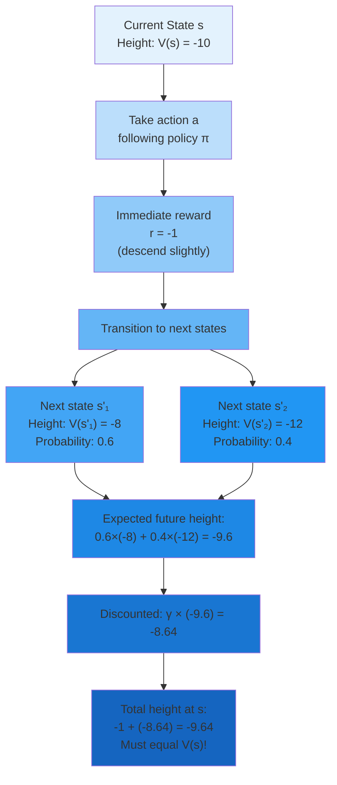

###### Why This Interpretation Is Powerful

**1. Consistency Check**: If you're at elevation $-10$, but taking one step following policy $\pi$ leads you to an
average elevation of $-5$ (plus immediate reward $-1$), then the heights are **inconsistent**. Your current height
should be $-1 + 0.9(-5) = -5.5$, not $-10$.

**2. Iterative Smoothing**: Value iteration works by repeatedly applying the Bellman equation, which smooths out
inconsistencies in the landscape. If a point's height doesn't match the average of its neighbors (weighted by transition
probabilities), we adjust it.

**3. Optimal Policy Finding**: The optimal value function $V^*$ creates the "tallest possible landscape" you can
achieve. At each point, you're at the maximum elevation possible given the environment's constraints.

###### Traffic Control Landscape Example

Imagine a traffic network where:

- **Peak elevation (best states)**: No queues, all vehicles flowing smoothly → $V^*(s) \approx 0$
- **Mid-elevation**: Small queues, manageable delays → $V^*(s) \approx -10$
- **Valley (worst states)**: Gridlock, long queues → $V^*(s) \approx -100$

The Bellman equation ensures that:

- If you're at elevation $-10$ and your action tends to move you toward gridlock (average next elevation $-80$), your
  current elevation must reflect this: $V(s) = r + \gamma(-80)$
- If your action clears queues efficiently (moving toward elevation $-5$), your current position's height increases
  accordingly

###### Key Takeaway

The geometric interpretation makes the Bellman equation intuitive: **your value at any state must be self-consistent
with the values of states you can reach**. The landscape can't have a point at elevation $-5$ if one step forward always
takes you to elevation $-20$ with only $-1$ immediate reward—that would violate the laws of this "value physics." The
Bellman equation is the consistency law that governs this landscape.

---

##### The Action-Value Function (Q-Function)

While $V^\pi$ tells us how good states are, the **action-value function** $Q^\pi(s,a)$ tells us how good it is to take
action $a$ in state $s$ and then follow policy $\pi$:

$$
Q^\pi(s,a) = \mathbb{E}_\pi\left[\sum_{k=0}^{\infty} \gamma^k R_{t+k+1} \mid S_t = s, A_t = a\right]
$$

The Q-function decomposes the decision problem: to act optimally in state $s$, we need only compute $Q^\pi(s,a)$ for
each action and select the maximum.

The relationship between $V^\pi$ and $Q^\pi$ is:

$$
V^\pi(s) = \sum_{a \in \mathcal{A}} \pi(a|s) Q^\pi(s,a)
$$

For a deterministic policy $\pi(s) = a^*$:

$$
V^\pi(s) = Q^\pi(s, \pi(s))
$$

The Bellman expectation equation for $Q^\pi$ is:

$$
Q^\pi(s,a) = \sum_{s' \in \mathcal{S}} \mathcal{P}(s'|s,a)\left[r(s,a,s') + \gamma \sum_{a' \in \mathcal{A}} \pi(a'|s') Q^\pi(s',a')\right]
$$

This recursive structure forms the foundation for all Q-learning algorithms.

---

##### Optimal Value Functions

The **optimal state value function** $V^*(s)$ represents the maximum value achievable from state $s$ under any policy:

$$
V^*(s) = \max_\pi V^\pi(s) = \max_\pi \mathbb{E}_\pi\left[\sum_{k=0}^{\infty} \gamma^k R_{t+k+1} \mid S_t = s\right]
$$

Similarly, the **optimal action-value function** $Q^*(s,a)$ gives the maximum value achievable by taking action $a$ in
state $s$ and acting optimally thereafter:

$$
Q^*(s,a) = \max_\pi Q^\pi(s,a)
$$

A fundamental theorem states that $Q^*$ satisfies the **Bellman optimality equation**:

$$
Q^*(s,a) = \sum_{s' \in \mathcal{S}} \mathcal{P}(s'|s,a)\left[r(s,a,s') + \gamma \max_{a' \in \mathcal{A}} Q^*(s',a')\right]
$$

This equation differs from the expectation equation in one crucial way: instead of averaging over actions according to
policy $\pi$, it takes the maximum over actions. This maximization embeds optimal decision-making directly into the
value function definition.

Once we know $Q^*(s,a)$ for all state-action pairs, extracting the optimal policy is trivial:

$$
\pi^*(s) = \arg\max_{a \in \mathcal{A}} Q^*(s,a)
$$

This greedy policy with respect to $Q^*$ is guaranteed to be optimal—a remarkable property that makes Q-learning so
powerful.

---

##### The Bellman Operator and Contraction Properties

The Bellman optimality equation can be viewed as a fixed-point equation. Define the **Bellman operator**
$\mathcal{T}: \mathbb{R}^{|\mathcal{S}| \times |\mathcal{A}|} \to \mathbb{R}^{|\mathcal{S}| \times |\mathcal{A}|}$ as:

$$
(\mathcal{T}Q)(s,a) = \sum_{s' \in \mathcal{S}} \mathcal{P}(s'|s,a)\left[r(s,a,s') + \gamma \max_{a'} Q(s',a')\right]
$$

The Bellman optimality equation states that $Q^*$ is a fixed point of $\mathcal{T}$:

$$
\mathcal{T}Q^* = Q^*
$$

A crucial property is that $\mathcal{T}$ is a **contraction mapping** in the $\ell_\infty$ (max) norm. For any two
Q-functions $Q_1$ and $Q_2$:

$$
|\mathcal{T}Q_1 - \mathcal{T}Q_2|_\infty \leq \gamma |Q_1 - Q_2|_\infty
$$

where $|Q|_\infty = \max_{s,a} |Q(s,a)|$.

**Proof sketch**:

$$
|(\mathcal{T}Q_1)(s,a) - (\mathcal{T}Q_2)(s,a)| = \left|\sum_{s'} \mathcal{P}(s'|s,a)\gamma\left[\max_{a'} Q_1(s',a') - \max_{a'} Q_2(s',a')\right]\right|
$$

Using the property that $|\max_a f(a) - \max_a g(a)| \leq \max_a |f(a) - g(a)|$:

$$
\leq \sum_{s'} \mathcal{P}(s'|s,a)\gamma \max_{a'} |Q_1(s',a') - Q_2(s',a')| \leq \gamma |Q_1 - Q_2|_\infty \sum_{s'} \mathcal{P}(s'|s,a) = \gamma |Q_1 - Q_2|_\infty
$$

**Implications**: The contraction property guarantees:

1. **Existence and Uniqueness**: $Q^*$ is the unique fixed point of $\mathcal{T}$

2. **Convergence**: Iteratively applying $\mathcal{T}$ to any initial $Q_0$ converges to $Q^*$:

    $$
    Q\_{k+1} =
    \mathcal{T}Q_k \implies Q_k \to Q^* \text{ as } k \to \infty
    $$

3. **Convergence Rate**: The distance to optimality decreases geometrically:
    $$
    |Q_k - Q^*|_\infty \leq \gamma^k |Q_0 -
    Q^\_|_\infty
    $$

After $k$ iterations, the error is reduced by factor $\gamma^k$. For $\gamma = 0.9$, we have $\gamma^{10} \approx 0.35$
and $\gamma^{100} \approx 2.7 \times 10^{-5}$—exponentially fast convergence.

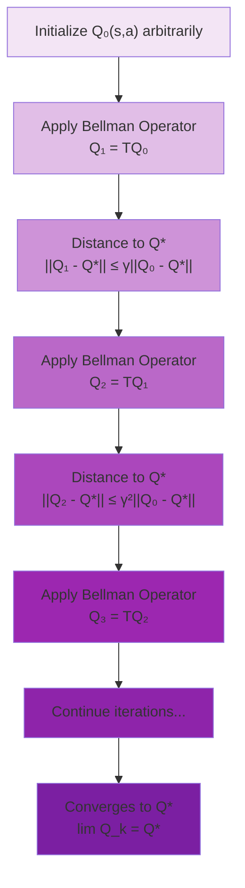

---

##### Value Iteration and Policy Iteration

The contraction property leads directly to two classical dynamic programming algorithms for solving MDPs when the model
is known.

**Value Iteration**: Repeatedly apply the Bellman operator until convergence:

**Algorithm**:

1. Initialize $Q_0(s,a)$ arbitrarily (often to 0)

2. For $k = 1, 2, 3, \ldots$ until convergence:

    $$
    Q_{k+1}(s,a) \leftarrow \sum_{s'} \mathcal{P}(s'|s,a)[r(s,a,s') +
    \gamma \max_{a'} Q_k(s',a')]
    $$

3. Extract policy: $\pi(s) = \arg\max_a Q_k(s,a)$

**Convergence**: When $\max_{s,a} |Q_{k+1}(s,a) - Q_k(s,a)| < \epsilon$, we have:

$$
|Q_k - Q^*|_\infty < \frac{\epsilon}{1-\gamma}
$$

**Policy Iteration**: Alternates between policy evaluation and policy improvement:

**Algorithm**:

1.  Initialize policy $\pi_0$ arbitrarily
2.  For $k = 0, 1, 2, \ldots$ until convergence: - **Policy Evaluation**: Solve for $Q^{\pi_k}$ by solving the linear
    system:
    $$
    Q^{\pi_k}(s,a) = \sum_{s'} \mathcal{P}(s'|s,a)[r(s,a,s') + \gamma Q^{\pi_k}(s',\pi_k(s'))]
    $$
    - **Policy Improvement**: Update policy: $$ \pi\_{k+1}(s) = \arg\max_a Q^{\pi_k}(s,a)$$
3.  Stop when $\pi_{k+1} = \pi_k$

**Policy Improvement Theorem**: If $Q^{\pi_k}(s, \pi_{k+1}(s)) \geq Q^{\pi_k}(s, \pi_k(s))$ for all $s$, then
$V^{\pi_{k+1}}(s) \geq V^{\pi_k}(s)$ for all $s$. The greedy policy improvement guarantees monotonic improvement.

Policy iteration often converges in fewer iterations than value iteration (typically 3-10 iterations vs. 100-1000), but
each iteration is more expensive (solving a linear system).

---

##### Example: Computing Optimal Q-Values

Consider a simple three-state traffic MDP:

**States**:

- $s_1$: Light queue (1-3 vehicles)
- $s_2$: Medium queue (4-7 vehicles)
- $s_3$: Heavy queue (8+ vehicles)

**Actions**:

- $a_1$: Short green (20 seconds)
- $a_2$: Long green (40 seconds)

**Transition Dynamics** (simplified):

From $s_1$:

- With $a_1$: $\mathcal{P}(s_1|s_1,a_1) = 0.7$, $\mathcal{P}(s_2|s_1,a_1) = 0.3$
- With $a_2$: $\mathcal{P}(s_1|s_1,a_2) = 0.9$, $\mathcal{P}(s_2|s_1,a_2) = 0.1$

From $s_2$:

- With $a_1$: $\mathcal{P}(s_1|s_2,a_1) = 0.2$, $\mathcal{P}(s_2|s_2,a_1) = 0.6$, $\mathcal{P}(s_3|s_2,a_1) = 0.2$
- With $a_2$: $\mathcal{P}(s_1|s_2,a_2) = 0.4$, $\mathcal{P}(s_2|s_2,a_2) = 0.5$, $\mathcal{P}(s_3|s_2,a_2) = 0.1$

From $s_3$:

- With $a_1$: $\mathcal{P}(s_2|s_3,a_1) = 0.3$, $\mathcal{P}(s_3|s_3,a_1) = 0.7$
- With $a_2$: $\mathcal{P}(s_2|s_3,a_2) = 0.6$, $\mathcal{P}(s_3|s_3,a_2) = 0.4$

**Rewards**:

- $r(s_1, \cdot) = -2$ (low delay)
- $r(s_2, \cdot) = -5$ (medium delay)
- $r(s_3, \cdot) = -15$ (high delay)

**Discount factor**: $\gamma = 0.9$

**Value Iteration**:

**Iteration 0**: $Q_0(s,a) = 0$ for all $(s,a)$

**Iteration 1**:

$$
\begin{align}
Q_1(s_1,a_1) &= -2 + 0.9[0.7 \cdot 0 + 0.3 \cdot 0] = -2.0 \\
Q_1(s_1,a_2) &= -2 + 0.9[0.9 \cdot 0 + 0.1 \cdot 0] = -2.0 \\
Q_1(s_2,a_1) &= -5 + 0.9[0.2 \cdot 0 + 0.6 \cdot 0 + 0.2 \cdot 0] = -5.0 \\
Q_1(s_2,a_2) &= -5 + 0.9[0.4 \cdot 0 + 0.5 \cdot 0 + 0.1 \cdot 0] = -5.0 \\
Q_1(s_3,a_1) &= -15 + 0.9[0.3 \cdot 0 + 0.7 \cdot 0] = -15.0 \\
Q_1(s_3,a_2) &= -15 + 0.9[0.6 \cdot 0 + 0.4 \cdot 0] = -15.0
\end{align}
$$

**Iteration 2**:

$$
\begin{align}
Q_2(s_1,a_1) &= -2 + 0.9[0.7 \max(-2,-2) + 0.3 \max(-5,-5)] \\
&= -2 + 0.9[0.7(-2) + 0.3(-5)] = -2 + 0.9[-1.4 - 1.5] \\
&= -2 + 0.9(-2.9) = -2 - 2.61 = -4.61
\end{align}
$$

$$
\begin{align}
 Q_2(s_1,a_2) &= -2 + 0.9[0.9(-2) + 0.1(-5)] \\
&= -2 + 0.9[-1.8 - 0.5] = -2 - 2.07 = -4.07
\end{align}
$$

$$
\begin{align}
Q_2(s_2,a_1) &= -5 + 0.9[0.2(-2) + 0.6(-5) + 0.2(-15)] \\
&= -5 + 0.9[-0.4 - 3.0 - 3.0] = -5 - 5.76 = -10.76
\end{align}
$$

$$
\begin{align}
Q_2(s_2,a_2) &= -5 + 0.9[0.4(-2) + 0.5(-5) + 0.1(-15)] \\
&= -5 + 0.9[-0.8 - 2.5 - 1.5] = -5 - 4.32 = -9.32
\end{align}
$$

$$
\begin{align}
Q_2(s_3,a_1) &= -15 + 0.9[0.3(-5) + 0.7(-15)] \\
&= -15 + 0.9[-1.5 - 10.5] = -15 - 10.8 = -25.8
\end{align}
$$

$$
\begin{align}
 Q_2(s_3,a_2) &= -15 + 0.9[0.6(-5) + 0.4(-15)] \\
&= -15 + 0.9[-3.0 - 6.0] = -15 - 8.1 = -23.1
\end{align}
$$

Continuing this process to convergence (typically 20-30 iterations), we obtain:

$$
\begin{align}
Q^*(s_1,a_1) \approx -23.5, \quad Q^*(s_1,a_2) \approx -21.8\\
Q^*(s_2,a_1) \approx -42.3, \quad Q^*(s_2,a_2) \approx -38.7\\
Q^*(s_3,a_1) \approx -98.2, \quad Q^*(s_3,a_2) \approx -87.4
\end{align}
$$

**Optimal policy**:

- $\pi^*(s_1) = a_2$ (long green for light queues—prevent buildup)
- $\pi^*(s_2) = a_2$ (long green for medium queues—clear efficiently)
- $\pi^*(s_3) = a_2$ (long green for heavy queues—maximum clearing)

The optimal policy consistently prefers longer green times, as they reduce the risk of queue buildup despite the
slightly higher immediate cost. The Q-values become more negative in worse states, correctly capturing the cumulative
cost of poor traffic conditions.

---

#### Deep Q-Networks (DQN): Architecture and Theory

##### Q-Learning Fundamentals

###### The Q-Learning Algorithm

Q-learning, introduced by Watkins in 1989, represents one of the most significant breakthroughs in reinforcement
learning. It is an **off-policy** algorithm that learns the optimal action-value function $Q^*$ directly from
experience, without requiring a model of the environment's dynamics.

The elegance of Q-learning lies in its update rule. Given a transition $(s, a, r, s')$ observed by taking action $a$ in
state $s$, receiving reward $r$, and arriving in state $s'$, Q-learning updates the action-value estimate as:

$$
Q(s,a) \leftarrow Q(s,a) + \alpha[r + \gamma \max_{a'} Q(s',a') - Q(s,a)]
$$

where $\alpha \in (0,1]$ is the learning rate. The term in brackets is the **temporal difference (TD) error**:

$$
\delta = r + \gamma \max_{a'} Q(s',a') - Q(s,a)
$$

This error quantifies the discrepancy between the current Q-value estimate and the "target" value
$r + \gamma \max_{a'} Q(s',a')$ computed from the Bellman optimality equation.

**Intuition**: If the TD error is positive, the actual return exceeded our expectation—we should increase $Q(s,a)$. If
negative, the return fell short—we should decrease $Q(s,a)$. The learning rate $\alpha$ controls how quickly we
incorporate new information.

##### Off-Policy Learning: The Key Innovation

Q-learning's **off-policy** nature is crucial for both efficiency and flexibility. The algorithm learns about the
optimal policy $\pi^*$ (which acts greedily with respect to Q-values) while following a different **behavior policy**
$\mu$ (which explores the environment).

The update rule uses $\max_{a'} Q(s',a')$ regardless of which action the agent actually takes next. This means:

1. **Exploration doesn't hurt**: The agent can explore extensively using $\epsilon$-greedy or other exploratory policies
   without biasing Q-value estimates
2. **Sample efficiency**: We can learn from any source of experience—demonstrations, previous policies, or random
   exploration
3. **Reusability**: Old experiences remain useful even as the policy improves

Compare this to **on-policy** methods like SARSA, which update based on the action actually taken:

$$
Q(s,a) \leftarrow Q(s,a) + \alpha[r + \gamma Q(s',a') - Q(s,a)]
$$

where $a'$ is the action the agent chose in state $s'$. SARSA learns about the policy being followed, not the optimal
policy.

**Example Illustrating the Difference**:

Consider a gridworld where an agent must navigate from start to goal while avoiding a cliff. An $\epsilon$-greedy policy
with $\epsilon = 0.1$ sometimes takes exploratory random actions.

**Q-learning**: If the agent randomly walks off the cliff during exploration, the large negative reward updates $Q$
values to reflect the danger—even though the random action isn't part of the optimal policy. Future decisions benefit
from this knowledge.

**SARSA**: The algorithm learns that the exploratory policy (which sometimes falls off the cliff) has low value near the
cliff edge. It learns a safe path that stays far from danger. But this is optimal for the $\epsilon$-greedy policy, not
the truly optimal greedy policy.

Q-learning converges to the optimal Q-function; SARSA converges to the Q-function for the behavior policy.

##### Convergence Guarantees (Tabular Case)

For finite MDPs with tabular Q-function representation (storing a separate value for each state-action pair), Q-learning
converges to $Q^*$ almost surely under two conditions:

**Condition 1—Infinite Exploration**: Every state-action pair must be visited infinitely often:

$$
\lim_{t \to \infty} N_t(s,a) = \infty \quad \forall (s,a)
$$

where $N_t(s,a)$ counts visits to $(s,a)$ up to time $t$. This ensures that Q-value estimates are based on sufficient
samples rather than a few noisy observations.

**Condition 2—Robbins-Monro Learning Rates**: The learning rates ${\alpha_t(s,a)}$ for each state-action pair must
satisfy:

$$
\sum_{t=1}^{\infty} \alpha_t(s,a) = \infty \quad \text{and} \quad \sum_{t=1}^{\infty} \alpha_t^2(s,a) < \infty
$$

The first condition ensures that Q-values can eventually overcome any poor initialization—the cumulative learning rate
must be infinite. The second condition ensures that learning eventually converges to a single point rather than
oscillating—the learning rate must decay fast enough that noise becomes negligible.

**Example learning rate schedules**:

- $\alpha_t = \frac{1}{t}$ satisfies both conditions: $\sum \frac{1}{t} = \infty$ but
  $\sum \frac{1}{t^2} = \frac{\pi^2}{6} < \infty$
- $\alpha_t = \frac{1}{\sqrt{t}}$ violates the second condition: $\sum \frac{1}{t} = \infty$ but $\sum \frac{1}{t}$ also
  $= \infty$
- Constant $\alpha_t = 0.01$ violates the second condition and doesn't converge, but works well in non-stationary
  environments

**Proof Sketch**: Q-learning can be viewed as a stochastic approximation of the Bellman operator. Define the operator:

$$
(\mathcal{T}Q)(s,a) = \mathbb{E}_{s' \sim \mathcal{P}(\cdot|s,a)}[r(s,a,s') + \gamma \max_{a'} Q(s',a')]
$$

We showed earlier that $\mathcal{T}$ is a $\gamma$-contraction with unique fixed point $Q^*$. The Q-learning update can
be written as:

$$
\begin{align}
Q_{t+1}(s,a) &= (1-\alpha_t)Q_t(s,a) + \alpha_t[r + \gamma \max_{a'} Q_t(s',a')] \\
&= Q_t(s,a) + \alpha_t[(\mathcal{T}Q_t)(s,a) - Q_t(s,a) + \epsilon_t]
\end{align}
$$

where $\epsilon_t$ is the sampling noise from using a single transition instead of the full expectation. Under the
Robbins-Monro conditions, stochastic approximation theory guarantees convergence to the fixed point of $\mathcal{T}$,
which is $Q^*$.

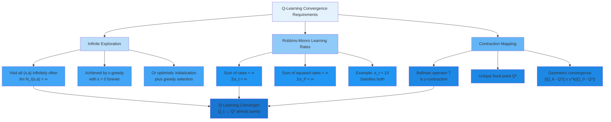

##### Practical Q-Learning for Small State Spaces

Before examining neural network function approximation, let's see Q-learning in its simplest form with a lookup table.

**Tabular Q-Learning Algorithm**:

1.  Initialize Q-table: $Q(s,a) = 0$ for all $(s,a)$ (or optimistically high values)
2.  For each episode: - Initialize state $s$ - While episode not terminal: - Choose action $a$ using $\epsilon$-greedy
    policy:
    $$
    a = \begin{cases} \arg\max_{a'} Q(s,a') & \text{with probability } 1-\epsilon \\ \text{random action} & \text{with probability } \epsilon \end{cases}
    $$
    - Execute $a$, observe $r, s'$
    - Update Q-value: $$ Q(s,a) \leftarrow Q(s,a) + \alpha[r + \gamma \max_{a'} Q(s',a') - Q(s,a)]$$
    - $s \leftarrow s'$

**Worked Example**: Consider a 4-state, 2-action MDP with known dynamics (for verification):

- **States**: ${s_0, s_1, s_2, s_3}$ where $s_3$ is terminal (goal)
- **Actions**: ${a_0, a_1}$
- **Rewards**: $r = -1$ for all transitions except reaching $s_3$ which gives $r = 0$
- **Dynamics**: Deterministic transitions shown below

Transitions:

- From $s_0$: $a_0 \to s_0$ (stay), $a_1 \to s_1$
- From $s_1$: $a_0 \to s_0$, $a_1 \to s_2$
- From $s_2$: $a_0 \to s_1$, $a_1 \to s_3$ (goal)

**Parameters**: $\alpha = 0.5$, $\gamma = 0.9$, $\epsilon = 0.1$

**Initial Q-table**: All entries 0

**Episode 1 trajectory**: $s_0 \xrightarrow{a_1} s_1 \xrightarrow{a_1} s_2 \xrightarrow{a_1} s_3$

Step 1: $(s_0, a_1, -1, s_1)$

$$
Q(s_0,a_1) \leftarrow 0 + 0.5[-1 + 0.9 \max(0,0) - 0] = 0 + 0.5(-1) = -0.5
$$

Step 2: $(s_1, a_1, -1, s_2)$

$$
Q(s_1,a_1) \leftarrow 0 + 0.5[-1 + 0.9 \max(0,0) - 0] = -0.5
$$

Step 3: $(s_2, a_1, -1, s_3)$

$$
Q(s_2,a_1) \leftarrow 0 + 0.5[-1 + 0.9 \cdot 0 - 0] = -0.5
$$

(Terminal states have $Q(s_3, \cdot) = 0$ by definition)

**After Episode 1**:

| State | $Q(s,a_0)$ | $Q(s,a_1)$ |
| ----- | ---------- | ---------- |
| $s_0$ | 0.00       | -0.50      |
| $s_1$ | 0.00       | -0.50      |
| $s_2$ | 0.00       | -0.50      |

**Episode 2 trajectory**: $s_0 \xrightarrow{a_1} s_1 \xrightarrow{a_1} s_2 \xrightarrow{a_1} s_3$

Step 1: $(s_0, a_1, -1, s_1)$

$$
\begin{align}
Q(s_0,a_1) \leftarrow -0.5 + 0.5[-1 + 0.9 \max(0,-0.5) - (-0.5)] &= -0.5 + 0.5[-1 + 0 + 0.5] \\ &= -0.5 + 0.5(-0.5) \\
&= -0.75
\end{align}
$$

Step 2: $(s_1, a_1, -1, s_2)$

$$
\begin{align}
Q(s_1,a_1) \leftarrow -0.5 + 0.5[-1 + 0.9(-0.5) - (-0.5)] &= -0.5 + 0.5[-1 - 0.45 + 0.5] \\ &= -0.5 + 0.5(-0.95) \\
&= -0.975
\end{align}
$$

Step 3: $(s_2, a_1, -1, s_3)$

$$
\begin{align}
Q(s_2,a_1) \leftarrow -0.5 + 0.5[-1 + 0 - (-0.5)] &= -0.5 + 0.5[-1 + 0 - (-0.5)] \\
&= -0.5 - 0.25 \\
&= -0.75
\end{align}
$$

After many episodes, the Q-values converge to:

- $Q^*(s_0,a_1) \approx -2.71$ (optimal: 3 steps to goal)
- $Q^*(s_1,a_1) \approx -1.9$ (optimal: 2 steps to goal)
- $Q^*(s_2,a_1) \approx -1.0$ (optimal: 1 step to goal)

The optimal policy is $\pi^*(s_i) = a_1$ for all non-terminal states—always move toward the goal.

---

#### Function Approximation with Neural Networks

##### The Curse of Dimensionality

Tabular Q-learning stores a separate value for each state-action pair, requiring $|\mathcal{S}| \times |\mathcal{A}|$
storage. For the traffic control problem described earlier with state space size $> 10^{17}$, this is utterly
impractical. Even if we could store such a table, we'd need to visit each state-action pair thousands of times to learn
accurate Q-values—requiring more experience than could be gathered in centuries of operation.

This is the **curse of dimensionality**: as the number of state dimensions increases, the state space volume grows
exponentially, and the amount of data needed to learn scales accordingly.

**Function approximation** addresses this by representing Q-values through a parameterized function $Q(s,a;\theta)$

where $\theta$ represents parameters (typically neural network weights). Instead of storing
$|\mathcal{S}| \times |\mathcal{A}|$ separate values, we store $|\theta|$ parameters—a dramatic reduction when
$|\theta| \ll |\mathcal{S}| \times |\mathcal{A}|$.

The key insight is **generalization**: by learning a function, similar states should produce similar Q-values. If we've
learned that stopping for a queue of 10 vehicles is good, this knowledge should transfer to queues of 9 or 11 vehicles
without requiring separate experience for each configuration.

##### Neural Network Q-Function Representation

A neural network provides a flexible, differentiable function approximator that can represent complex, nonlinear
relationships between states and Q-values. The typical architecture maps states to Q-values for all actions:

$$
Q: \mathbb{R}^{d_s} \to \mathbb{R}^{|\mathcal{A}|}
$$

where $d_s$ is the state dimension (e.g., 26 for our traffic intersection example).

**Network Architecture**:

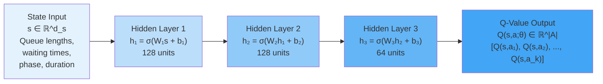

**Mathematical Formulation**: For a 3-layer network with ReLU activations:

$$
\begin{align}
&\mathbf{h}\_1 = \text{ReLU}(\mathbf{W}\_1 \mathbf{s} + \mathbf{b}\_1) \\
&\mathbf{h}\_2 = \text{ReLU}(\mathbf{W}\_2 \mathbf{h}\_1 + \mathbf{b}\_2) \\
&\mathbf{h}\_3 = \text{ReLU}(\mathbf{W}\_3 \mathbf{h}\_2 + \mathbf{b}\_3) \\
&\mathbf{Q}(\mathbf{s};\theta) = \mathbf{W}\_4 \mathbf{h}\_3 + \mathbf{b}\_4
\end{align}
$$

where
$\theta = \{\mathbf{W}_1, \mathbf{b}_1, \mathbf{W}_2, \mathbf{b}_2, \mathbf{W}_3, \mathbf{b}_3, \mathbf{W}_4, \mathbf{b}_4\}$
are the network parameters.

**Why Output All Actions Simultaneously?** Computing $Q(s,a;\theta)$ for each action separately would require
$|\mathcal{A}|$ forward passes. Outputting all Q-values in a single pass is computationally efficient:

- One forward pass computes all values: $O(|\theta|)$ operations
- Action selection becomes a simple max operation: $O(|\mathcal{A}|)$
- Batching: can process multiple states simultaneously using matrix operations

**Activation Functions**: The choice of activation function affects the network's representational capacity:

**ReLU** (Rectified Linear Unit):

$$
\text{ReLU}(x) = \max(0,x)
$$

- Most common for hidden layers
- Computationally efficient
- Helps mitigate vanishing gradient problem
- Creates piecewise linear functions

**Leaky ReLU**:

$$
\text{LeakyReLU}(x) = \max(\alpha x, x)
$$

for small $\alpha \approx 0.01$

- Prevents "dead neurons" where ReLU outputs 0 for all inputs
- Maintains gradient flow for negative inputs

**Tanh**:

$$
\tanh(x) = \frac{e^x - e^{-x}}{e^x + e^{-x}}
$$

- Outputs in $[-1, 1]$, centered around 0
- Can be beneficial for normalized inputs
- Suffers from vanishing gradients for large $|x|$

**Linear** (Output Layer): No activation for Q-value outputs

- Q-values are unbounded in general
- Linear output allows representing the full range

##### Loss Function Derivation

To train the network, we need a loss function that measures how well current Q-value predictions match the targets
implied by the Bellman equation. Given a transition $(s, a, r, s')$, the target is:

$$
y = r + \gamma \max\_{a'} Q(s', a'; \theta^-)
$$

where $\theta^-$ are parameters of a **target network** (explained in detail later). The **temporal difference error**
is:

$$
\begin{align}
\delta &= y - Q(s, a; \theta) \\
&= r + \gamma \max\_{a'} Q(s', a'; \theta^-) - Q(s, a; \theta)
\end{align}
$$

The standard loss function is **Mean Squared Error** (MSE):

$$
\mathcal{L}(\theta) = \mathbb{E}_{(s,a,r,s') \sim \mathcal{D}}\left[\left(r + \gamma \max_{a'} Q(s', a'; \theta^-) -
Q(s, a; \theta)\right)^2\right]
$$

where $\mathcal{D}$ is the replay buffer (experience memory).

For a mini-batch of size $B$, we approximate the expectation:

$$
\mathcal{L}(\theta) = \frac{1}{B}\sum\_{i=1}^{B}\left[y_i - Q(s_i, a_i; \theta)\right]^2
$$

**Gradient Computation**: The gradient with respect to network parameters is:

$$
\nabla*\theta \mathcal{L}(\theta) = \frac{1}{B}\sum*{i=1}^{B} 2\left[Q(s_i, a_i; \theta) - y_i\right] \nabla\_\theta
Q(s_i, a_i; \theta)
$$

Note that we treat $y_i$ as a constant when computing gradients—we do **not** backpropagate through the target network.
This is crucial for stability.

**Why MSE?** The squared error naturally arises from maximum likelihood estimation. If we model Q-value errors as
independent Gaussian noise:

$$
Q^*(s,a) = Q(s,a;\theta) + \epsilon, \quad \epsilon \sim \mathcal{N}(0,\sigma^2)
$$

The negative log-likelihood is:

$$
-\log p(Q^\_ | s,a,\theta) \propto \frac{1}{2\sigma^2}[Q^\_(s,a) - Q(s,a;\theta)]^2
$$

Minimizing this is equivalent to MSE loss.

---

##### Example: Q-Network Forward and Backward Pass

Consider a simplified 2D traffic state: $\mathbf{s} = [q_{\text{NS}}, q_{\text{EW}}]$ representing North-South and
East-West queue lengths, with 2 actions: $a_1$ (serve NS), $a_2$ (serve EW).

**Network Architecture**:

- Input: 2 dimensions
- Hidden layer: 4 units with ReLU
- Output: 2 Q-values

**Parameters**:

$$
\begin{align}
\mathbf{W}\_1 &= \begin{bmatrix} 0.5 & 0.3 \\ -0.2 & 0.4 \\ 0.1 & -0.3 \\ 0.6 & 0.2 \end{bmatrix}, \quad \mathbf{b}\_1 \\
&= \begin{bmatrix} 0.1 \\ -0.1 \\ 0.2 \\ 0.0 \end{bmatrix}
\end{align}
$$

$$
\begin{align}
\mathbf{W}\_2 &= \begin{bmatrix} 0.8 & -0.3 & 0.5 & 0.2 \\ 0.4 & 0.6 & -0.2 & 0.7 \end{bmatrix}, \quad \mathbf{b}\_2 \\
&= \begin{bmatrix} -0.5 \\ -0.3 \end{bmatrix}
\end{align}
$$

**Input State**: $\mathbf{s} = [5, 3]^T$ (5 vehicles NS, 3 vehicles EW)

**Forward Pass**:

Hidden layer computation:

$$
\begin{align}
\mathbf{z}\_1 &= \mathbf{W}\_1 \mathbf{s} + \mathbf{b}\_1 = \begin{bmatrix} 0.5 & 0.3 \\
-0.2 & 0.4 \\ 0.1 & -0.3 \\ 0.6 & 0.2 \end{bmatrix} \begin{bmatrix} 5 \\ 3 \end{bmatrix} + \begin{bmatrix} 0.1 \\ -0.1
\\ 0.2 \\ 0.0 \end{bmatrix} \\
&= \begin{bmatrix} 2.5 + 0.9 \\ -1.0 + 1.2 \\ 0.5 - 0.9 \\ 3.0 + 0.6 \end{bmatrix} + \begin{bmatrix} 0.1 \\ -0.1 \\
0.2 \\ 0.0 \end{bmatrix} \\
&= \begin{bmatrix} 3.5 \\ 0.1 \\ -0.2 \\ 3.6 \end{bmatrix}
\end{align}
$$

Apply ReLU:

$$
\begin{align}
\mathbf{h}\_1 &= \text{ReLU}(\mathbf{z}\_1) \\
&= \begin{bmatrix} 3.5 \\ 0.1 \\ 0 \\ 3.6 \end{bmatrix}
\end{align}
$$

Output layer:

$$
\begin{align}
\mathbf{Q}(\mathbf{s};\theta) &= \mathbf{W}\_2 \mathbf{h}\_1 + \mathbf{b}\_2 \\
&= \begin{bmatrix} 0.8 & -0.3 & 0.5 & 0.2 \\ 0.4 & 0.6 & -0.2 & 0.7 \end{bmatrix} \begin{bmatrix} 3.5 \\ 0.1 \\ 0 \\
3.6 \end{bmatrix} + \begin{bmatrix} -0.5 \\ -0.3 \end{bmatrix} \\
&= \begin{bmatrix} 2.8 - 0.03 + 0 + 0.72 \\ 1.4 + 0.06 + 0 + 2.52 \end{bmatrix} + \begin{bmatrix} -0.5 \\ -0.3
\end{bmatrix} \\
&= \begin{bmatrix} 2.99 \\ 3.68 \end{bmatrix}
\end{align}
$$

So $Q(s, a_1; \theta) = 2.99$ and $Q(s, a_2; \theta) = 3.68$.

**Backward Pass**: Suppose the agent took action $a_1$ (serve NS), received reward $r = -5$, and transitioned to
$s' = [4, 4]$ where the target network gives $\max_{a'} Q(s', a'; \theta^-) = 4.0$.

Target value:

$$
y = -5 + 0.9 \times 4.0 = -1.4
$$

TD error:

$$
\delta = y - Q(s, a_1; \theta) = -1.4 - 2.99 = -4.39
$$

Loss (single sample):

$$
\mathcal{L} = \delta^2 = 19.27
$$

Gradient with respect to output for $a_1$:

$$
\frac{\partial \mathcal{L}}{\partial Q(s,a_1;\theta)} = 2\delta = -8.78
$$

This gradient backpropagates through the network to update all weights, pushing $Q(s,a_1;\theta)$ toward the target
$-1.4$.

---

##### Challenges with Neural Function Approximation

Combining Q-learning with neural networks introduces several sources of instability that don't exist in tabular methods:

**1. Non-Stationarity of Targets**: In supervised learning, we typically have fixed target labels $y_i$ for inputs
$x_i$. In Q-learning, the targets themselves change as the network improves:

$$
y = r + \gamma \max\_{a'} Q(s', a'; \theta)
$$

As $\theta$ updates, $y$ changes, creating a "moving target" problem. The network is chasing a goal that keeps shifting.

**2. Correlation Between Consecutive Samples**: Standard stochastic gradient descent assumes training samples are
independent and identically distributed (i.i.d.). In RL, consecutive transitions $(s_t, a_t, r_t, s_{t+1})$ and
$(s_{t+1}, a_{t+1}, r_{t+1}, s_{t+2})$ share the next state $s_{t+1}$, creating strong temporal correlation.

This correlation causes the network to overfit to recent sequences, producing high-variance gradient estimates that lead
to unstable learning.

**3. Feedback Loops and Divergence**: Q-learning uses bootstrapping—estimates are updated toward other estimates. With
function approximation, updating $Q(s,a)$ affects $Q(s',a')$ for similar states $s' \approx s$. This coupling can create
positive feedback loops where overestimation in one region spreads to neighboring regions, causing Q-values to diverge
to infinity.

**Historical Note**: Early attempts to combine neural networks with Q-learning in the 1990s routinely failed, with
Q-values exploding or the policy collapsing to trivial solutions. This gave neural RL a reputation for instability that
persisted until DQN's breakthroughs in 2013-2015.

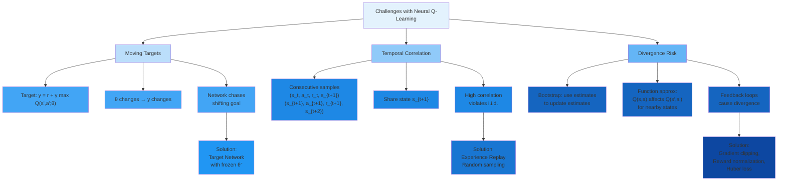

---

##### The DQN Algorithm

Deep Q-Networks (DQN), introduced by Mnih et al. in their landmark 2015 Nature paper, solved the stability problems that
had plagued neural Q-learning for decades. The breakthrough came not from a single innovation but from the synergistic
combination of two key mechanisms: **experience replay** and **target networks**.

###### Experience Replay: Breaking Temporal Correlations

**Concept**: Instead of learning immediately from each transition and discarding it, DQN stores transitions in a
**replay buffer** (or replay memory) $\mathcal{D}$, a large circular buffer that holds the most recent $N$ experiences:

$$
\mathcal{D} = \{(s_i, a_i, r_i, s'\_i, d_i)\}_{i=1}^{N}
$$

where $d_i \in \{0,1\}$ indicates whether state $s'_i$ is terminal.

During training, instead of using the most recent transition, we randomly sample a mini-batch $\mathcal{B}$ of size $B$
from $\mathcal{D}$:

$$
\mathcal{B} = \{(s_j, a_j, r_j, s'\_j, d_j)\}_{j=1}^{B} \text{ where each transition sampled uniformly from }
\mathcal{D}
$$

The loss is computed over this mini-batch:

$$
\mathcal{L}(\theta) = \frac{1}{B}\sum_{j=1}^{B}\left[r_j + \gamma(1-d_j)\max*{a'} Q(s'\_j, a'; \theta^-) - Q(s_j,
a_j; \theta)\right]^2
$$

The term $(1-d_j)$ zeros out the future reward for terminal states.

**Why This Works**:

**1. Decorrelation**: Random sampling breaks the temporal correlation between consecutive transitions. Samples in a
mini-batch come from different episodes, different time steps, and different policies (as the agent improves over time),
making them approximately i.i.d.

**2. Data Efficiency**: Each transition is used in multiple parameter updates (potentially hundreds of times before
being overwritten), dramatically improving sample efficiency compared to online learning where each transition is used
once.

**3. Variance Reduction**: Averaging gradients over a diverse mini-batch reduces gradient variance compared to
single-sample updates. Lower variance enables larger learning rates and more stable convergence.

**4. Distributional Smoothing**: The replay buffer aggregates experiences from many different policy versions. This
creates a smoother target distribution than learning from only the current policy's highly non-stationary distribution.

**Buffer Dynamics**: The replay buffer operates as a circular queue with First-In-First-Out (FIFO) replacement:

- When empty or not full: new experiences are appended
- When full: new experiences overwrite the oldest ones

This creates a sliding window over the most recent $N$ experiences, balancing:

- **Recency**: Recently collected data reflects the current policy's distribution
- **Diversity**: Old data provides experiences from different policies and states

**Buffer Size Selection**: Typical buffer sizes:

- Small problems: $N = 10^4$
- Medium complexity: $N = 10^5$ (traffic control)
- Large problems (Atari): $N = 10^6$

**Trade-offs**:

- **Small buffer**: Low memory, fast sampling, but high recency bias and limited diversity
- **Large buffer**: High diversity, slower sampling, more memory, but may include very stale experiences from poor early
  policies

---

##### Target Network: Stabilizing Moving Targets

The second key innovation addresses the moving target problem. DQN maintains **two neural networks** with identical
architecture but different parameters:

**1. Policy Network** (Online Network): $Q(s,a;\theta)$

- Parameters $\theta$ are updated every training step via gradient descent
- Used for action selection during environment interaction
- Represents the agent's current best estimate of Q-values

**2. Target Network**: $Q(s,a;\theta^-)$

- Parameters $\theta^-$ are frozen for $C$ steps (typically $C = 1000$ to $10000$)
- Used only for computing target values in the loss function
- Periodically synchronized with policy network: $\theta^- \leftarrow \theta$ every $C$ steps

**Modified Loss Function**: The target uses $\theta^-$ instead of $\theta$:

$$
\mathcal{L}(\theta) = \mathbb{E}_{(s,a,r,s') \sim \mathcal{D}}\left[\left(r + \gamma \max_{a'} Q(s', a'; \theta^-) -
Q(s, a; \theta)\right)^2\right]
$$

**Why This Works**:

**1. Fixed Targets**: For $C$ steps, the target values remain constant (since $\theta^-$ doesn't change). This converts
the reinforcement learning problem into a series of supervised learning problems with fixed labels, each lasting $C$
steps.

**2. Decorrelated Updates**: The prediction $Q(s,a;\theta)$ and target $\max_{a'} Q(s',a';\theta^-)$ depend on different
parameters. This decorrelation reduces the feedback loops that cause divergence.

**3. Smoother Learning Dynamics**: Instead of targets changing after every update, they change only every $C$ steps.
This creates plateaus of stable learning punctuated by discrete target updates.

**Mathematical Intuition**: Without a target network, both sides of the Bellman error depend on $\theta$:

$$
\delta = r + \gamma \max\_{a'} Q(s', a'; \theta) - Q(s, a; \theta)
$$

When we update $\theta$ to reduce $Q(s,a;\theta)$, we simultaneously change the target $\max_{a'} Q(s',a';\theta)$. This
creates a "chasing tail" scenario.

With the target network, only the prediction side depends on the updated parameters:

$$
\delta = r + \gamma \max\_{a'} Q(s', a'; \theta^-) - Q(s, a; \theta)
$$

The target $\max_{a'} Q(s',a';\theta^-)$ remains fixed as we update $\theta$, providing a stable optimization objective.

**Target Update Frequency**: The choice of $C$ involves a trade-off:

- **Small $C$** (frequent updates): Targets stay close to current policy but retain more instability
- **Large $C$** (infrequent updates): Maximum stability but targets may become stale, slowing learning

Typical values: $C = 1000$ steps (not episodes—every 1000 parameter updates).

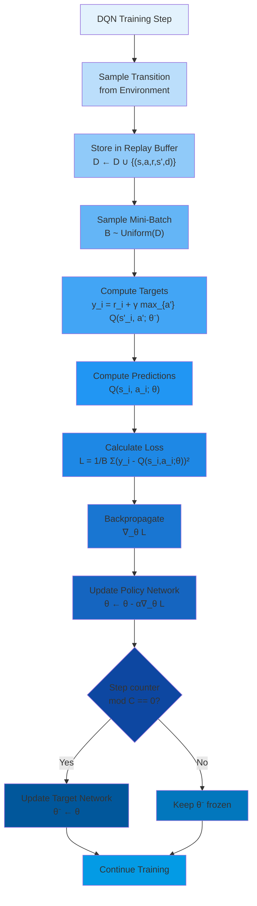

##### Complete DQN Algorithm

**Initialization**:

1. Initialize replay buffer $\mathcal{D}$ with capacity $N$
2. Initialize policy network $Q(s,a;\theta)$ with random weights
3. Initialize target network $Q(s,a;\theta^-)$ with $\theta^- = \theta$
4. Set hyperparameters: learning rate $\alpha$, discount $\gamma$, batch size $B$, target update frequency $C$,
   exploration rate $\epsilon$

**Main Training Loop** (for each episode):

1. Initialize environment, get initial state $s_0$
2. **For each timestep** $t$ in episode:

    **a) Action Selection** (Epsilon-Greedy):

    $$
    a_t = \begin{cases} \arg\max_{a} Q(s_t, a; \theta) & \text{with
    probability } 1-\epsilon \\ \text{random action} & \text{with probability } \epsilon \end{cases}
    $$

    **b) Environment Interaction**:

    - Execute action $a_t$
    - Observe reward $r_t$ and next state $s_{t+1}$
    - Determine if episode terminated: $d_t \in \{0,1\}$

    **c) Store Transition**:

    - Add $(s_t, a_t, r_t, s_{t+1}, d_t)$ to replay buffer $\mathcal{D}$

    **d) Sample Mini-Batch**:

    - If $|\mathcal{D}| \geq B$, sample random mini-batch $\mathcal{B} = \{(s_j, a_j, r_j, s'_j, d_j)\}_{j=1}^{B}$ from
      $\mathcal{D}$

    **e) Compute Targets**: $$ y*j = r_j + \gamma (1 - d_j) \max*{a'} Q(s'\_j, a'; \theta^-)$$

    **f) Compute Loss**: $$ \mathcal{L}(\theta) = \frac{1}{B}\sum\_{j=1}^{B}[y_j - Q(s_j, a_j; \theta)]^2$$

    **g) Update Policy Network**:

    - Compute gradient: $\nabla_\theta \mathcal{L}(\theta)$
    - Update parameters: $\theta \leftarrow \theta - \alpha \nabla_\theta \mathcal{L}(\theta)$

    **h) Update Target Network**:

    - If total steps $\mod C == 0$: $\theta^- \leftarrow \theta$

    **i) State Transition**:

    - $s_t \leftarrow s_{t+1}$
    - If $d_t == 1$, break (episode ended)

3. **Decay Exploration**: $\epsilon \leftarrow \max(\epsilon_{\min}, \epsilon \cdot \epsilon_{\text{decay}})$

**Return**: Trained policy network $Q(s,a;\theta)$

---

##### Worked Example: DQN Training Iteration

Consider a simple 4-state gridworld where an agent navigates to a goal.

- **State Space**: $\mathcal{S} = \{s_1, s_2, s_3, s_4\}$ with $s_4$ being the goal
- **Actions**: $\mathcal{A} = \{\text{up}, \text{down}, \text{left}, \text{right}\}$
- **Rewards**: $r = -1$ per step, $r = 10$ for reaching goal

**DQN Setup**:

- State representation: one-hot encoding $\mathbf{s} \in \{0,1\}^4$
- Network: 4 inputs → 8 hidden (ReLU) → 4 outputs (Q-values for each action)
- Replay buffer size: $N = 1000$
- Mini-batch size: $B = 4$
- Learning rate: $\alpha = 0.01$
- Discount: $\gamma = 0.9$
- Target update frequency: $C = 100$ steps
- Epsilon: $\epsilon = 0.1$

**Current State**: After 500 training steps, replay buffer contains 500 experiences.

**Training Step 501**:

**1. Action Selection**: Agent is in $s_2$, current Q-values from policy network:

$$
\begin{align*}
Q(s_2, \text{up}; \theta) & = -2.3 \\
Q(s_2, \text{down}; \theta) & = -1.8 \\
Q(s_2, \text{left}; \theta) & = -3.1 \\
Q(s_2, \text{right}; \theta) & = 0.5
\end{align*}
$$

Greedy action: right (highest Q-value: 0.5) With $\epsilon = 0.1$: 90% chance select "right", 10% chance random Suppose
agent selects "right"

**2. Environment Interaction**:

- Execute "right" from $s_2$
- Transition to $s_4$ (goal state)
- Receive reward $r = 10$
- Episode terminates: $d = 1$

**3. Store**: Add $(s_2, \text{right}, 10, s_4, 1)$ to replay buffer

**4. Sample Mini-Batch**: Randomly sample 4 transitions from buffer:

- $(s_1, \text{down}, -1, s_2, 0)$
- $(s_2, \text{up}, -1, s_1, 0)$
- $(s_3, \text{right}, -1, s_4, 1)$ (reached goal)
- $(s_1, \text{right}, -1, s_3, 0)$

**5. Compute Targets** using target network $Q(s,a;\theta^-)$:

For transition 1: $(s_1, \text{down}, -1, s_2, 0)$

$$
y_1 = -1 + 0.9 \max_a Q(s_2, a; \theta^-)
$$

Suppose target network gives: $Q(s_2, \text{right}; \theta^-) = 0.3$ is max:

$$
y_1 = -1 + 0.9(0.3) = -0.73
$$

For transition 2: $(s_2, \text{up}, -1, s_1, 0)$

$$
y_2 = -1 + 0.9 \max_a Q(s_1, a; \theta^-)
$$

Suppose target network gives: $Q(s_1, \text{down}; \theta^-) = -0.5$ is max:

$$
y_2 = -1 + 0.9(-0.5) = -1.45
$$

For transition 3: $(s_3, \text{right}, -1, s_4, 1)$ (terminal state) $$ y_3 = -1 + 0.9(1-1) \max_a Q(s_4, a; \theta^-) =
-1 + 0 = -1.0$$

For transition 4: $(s_1, \text{right}, -1, s_3, 0)$

$$
y_4 = -1 + 0.9 \max_a Q(s_3, a; \theta^-)
$$

Suppose target network gives: $Q(s_3, \text{right}; \theta^-) = 0.1$ is max:

$$
y_4 = -1 + 0.9(0.1) = -0.91
$$

**6. Compute Current Predictions** from policy network:

$$
\begin{align*}
Q(s_1, \text{down}; \theta) & = -1.2 \\
Q(s_2, \text{up}; \theta) & = -2.3 \\
Q(s_3, \text{right}; \theta) & = -0.5 \\
Q(s_1, \text{right}; \theta) & = -1.5
\end{align*}
$$

**7. Calculate Loss**:

$$
\begin{align*}
\mathcal{L}(\theta) &= \frac{1}{4}\left[(y_1 - Q(s_1,\text{down};\theta))^2 + (y_2 -Q(s_2,\text{up};\theta)^2\right. \left. + (y_3 - Q(s_3,\text{right};\theta))^2 + (y_4 -Q(s_1,\text{right};\theta))^2\right] \\
&= \frac{1}{4}\left[(-0.73 - (-1.2))^2 + (-1.45 - (-2.3))^2 + (-1.0 - (-0.5))^2 + (-0.91 - (-1.5))^2\right] \\
&= \frac{1}{4}\left[(0.47)^2 + (0.85)^2 + (-0.5)^2 + (0.59)^2\right] \\
&= \frac{1}{4}[0.221 + 0.723 + 0.25 + 0.348] = \frac{1.542}{4} = 0.386
\end{align*}
$$

**8. Compute Gradients and Update**:

The gradient $\nabla_\theta \mathcal{L}(\theta)$ is computed via backpropagation through the neural network. Each TD
error contributes to the gradient:

$$
\frac{\partial \mathcal{L}}{\partial \theta} = \frac{1}{4}\sum\_{j=1}^{4} 2[Q(s_j, a_j; \theta) - y_j] \nabla_\theta Q(s_j, a_j; \theta)
$$

For transition 1:

$$
\text{Error} = -1.2 - (-0.73) = -0.47
$$

For transition 2:

$$
\text{Error} = -2.3 - (-1.45) = -0.85
$$

For transition 3:

$$
\text{Error} = -0.5 - (-1.0) = 0.5
$$

For transition 4:

$$
\text{Error} = -1.5 - (-0.91) = -0.59
$$

The network parameters are updated:

$$
\theta \leftarrow \theta - 0.01 \cdot \nabla\_\theta \mathcal{L}(\theta)
$$

This pushes:

- $Q(s_1, \text{down}; \theta)$ down from $-1.2$ toward $-0.73$ (↑ by 0.47)
- $Q(s_2, \text{up}; \theta)$ down from $-2.3$ toward $-1.45$ (↑ by 0.85)
- $Q(s_3, \text{right}; \theta)$ up from $-0.5$ toward $-1.0$ (↓ by 0.5)
- $Q(s_1, \text{right}; \theta)$ down from $-1.5$ toward $-0.91$ (↑ by 0.59)

**9. Target Network Update**:

Since step 501 is not divisible by $C = 100$, the target network remains unchanged: $\theta^-$ stays frozen.

At step 600, we would perform: $\theta^- \leftarrow \theta$, copying all updated weights.

**Effect Over Time**: Through thousands of such updates:

- Q-values near the goal increase (propagating the +10 reward backward)
- Q-values for actions leading toward goal become higher than alternatives
- The policy becomes greedy with respect to these Q-values, navigating efficiently to the goal

---

##### Policy Network vs Target Network

###### Architectural Identity, Parameter Divergence

The policy and target networks share identical architecture—same number of layers, same activation functions, same
output dimensions. The **only** difference is their parameter values: $\theta$ for the policy network, $\theta^-$ for
the target network.

**Initialization**: At the start of training, both networks are initialized identically:

$$
\theta^-(0) = \theta(0)
$$

**Evolution**: As training progresses:

- **Policy network $\theta$**: Updated every training step via gradient descent

$$
\theta(t+1) = \theta(t) - \alpha \nabla\_\theta \mathcal{L}(\theta(t))
$$

- **Target network $\theta^-$**: Updated periodically every $C$ steps

$$
\theta^-(t) = \begin{cases} \theta(t) & \text{if } t \bmod C = 0 \\ \theta^-(t-1) & \text{otherwise (frozen)} \end{cases}
$$

This creates a **temporal lag**: the target network represents the policy network's state from $C$ steps ago.

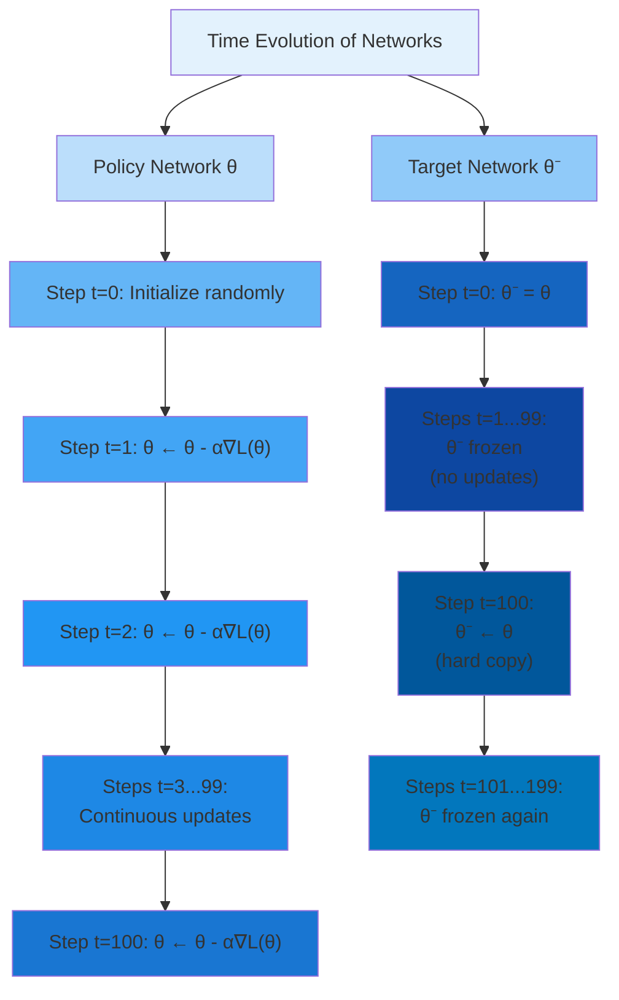

---

##### Functional Roles and Division of Labor

The two networks serve complementary purposes in the learning process:

###### **Policy Network Responsibilities**:

**1. Action Selection**: During environment interaction, the policy network determines which action to take:

$$
a = \arg\max\_{a'} Q(s, a'; \theta)
$$

This is the "current best guess" of optimal behavior. As $\theta$ improves, the policy improves.

**2. Learning Target**: The policy network is the recipient of gradient updates. All learning happens by modifying
$\theta$.

**3. Immediate Response**: The policy network responds immediately to new information, adjusting its predictions after
every mini-batch.

###### **Target Network Responsibilities**:

**1. Stable Target Computation**: The target network provides fixed evaluation for computing TD targets:

$$
y = r + \gamma \max\_{a'} Q(s', a'; \theta^-)
$$

By keeping $\theta^-$ constant for $C$ steps, targets remain stable, converting RL into supervised learning.

**2. Value Evaluation**: While the policy network proposes actions, the target network evaluates them. This separation
prevents the network from "grading its own homework."

**3. Smoothed Representation**: The target network represents a temporally averaged version of the policy network,
smoothing out high-frequency oscillations in parameter space.

---

##### Why Separation Prevents Instability

To understand why the target network stabilizes learning, consider what happens without it:

**Without Target Network** (both prediction and target use $\theta$):

Suppose at some step, the policy network overestimates $Q(s',a')$ due to noise. This inflated value becomes the target:

$$
y = r + \gamma \max\_{a'} Q(s', a'; \theta) \quad \text{(too high)}
$$

The loss function tries to increase $Q(s,a;\theta)$ to match this inflated target. But increasing $Q(s,a;\theta)$
affects other Q-values for similar states (function approximation generalization), potentially inflating them as well.

These newly inflated values become targets for other state-action pairs, propagating the overestimation. This positive
feedback loop can cause Q-values to diverge exponentially:

$$
Q(s,a;\theta) \to +\infty
$$

**With Target Network** ($\theta^-$ frozen):

When the policy network overestimates $Q(s',a';\theta)$, the target still uses the old, stable estimate:

$$
 y = r +
\gamma \max\_{a'} Q(s', a'; \theta^-) \quad \text{(not affected)}
$$

The overestimation in $\theta$ doesn't immediately propagate because it's not used in targets. Over the next $C$ steps,
gradient descent will correct the overestimation in $\theta$ based on stable targets from $\theta^-$.

When $\theta^-$ is finally updated ($\theta^- \leftarrow \theta$), the overestimation has already been partially
corrected. This delayed feedback prevents runaway feedback loops.

**Analogy**: Imagine learning to shoot free throws while the hoop keeps moving versus having the hoop stationary. With
moving targets (no target network), each adjustment to your aim causes the target to shift, making convergence
impossible. With a stationary target (frozen $\theta^-$), you can gradually improve your accuracy.

---

##### Mathematical Analysis of Stability

Consider the Bellman error without a target network:

$$
\text{BE}(s,a;\theta) = Q(s,a;\theta) - r - \gamma \max\_{a'} Q(s',a';\theta)
$$

Taking the gradient with respect to $\theta$:

$$
\nabla_\theta \text{BE} = \nabla_\theta Q(s,a;\theta) - \gamma \nabla_\theta \left[\max_{a'} Q(s',a';\theta)\right]
$$

The second term creates coupling: updating $\theta$ to reduce the error for $(s,a)$ simultaneously changes the target
for $(s,a)$, creating feedback.

With a target network:

$$
\text{BE}(s,a;\theta,\theta^-) = Q(s,a;\theta) - r - \gamma \max\_{a'} Q(s',a';\theta^-)
$$

The gradient becomes:

$$
\nabla_\theta \text{BE} = \nabla_\theta Q(s,a;\theta) - 0
$$

The second term vanishes because $\theta^-$ is treated as a constant. Updates to $\theta$ affect only the prediction,
not the target, eliminating direct feedback.

**Correlation Analysis**: Define the correlation between prediction and target updates:

Without target network:

$$
\text{Corr}(\Delta Q(s,a), \Delta \text{Target}) = \rho > 0
$$

Positive correlation creates instability—when prediction increases, target increases, amplifying the update.

With target network:

$$
\text{Corr}(\Delta Q(s,a), \Delta \text{Target}) = 0
$$

Zero correlation during the $C$-step plateau eliminates feedback, stabilizing learning.

---

##### Optimal Target Update Frequency

The choice of $C$ (target update frequency) involves a fundamental trade-off:

**Frequent Updates** (small $C$, e.g., $C = 10$):

- **Advantages**: Targets stay close to current policy, reducing staleness; network adapts quickly to policy
  improvements
- **Disadvantages**: Retains more instability; less benefit from target network; may still exhibit oscillations

**Infrequent Updates** (large $C$, e.g., $C = 10000$):

- **Advantages**: Maximum stability; strong decorrelation between prediction and target; reliable convergence
- **Disadvantages**: Stale targets; slow adaptation to policy improvements; may learn suboptimal policy from outdated
  targets

**Theoretical Considerations**:

The target should be frozen long enough for the policy network to make substantial progress toward the current targets
before they change. If $C$ is too small, the policy network doesn't have time to converge to the current Bellman
equation before the target shifts.

A rough heuristic: $C$ should be large enough that the policy network performs at least 100-1000 gradient updates per
target network refresh. This ensures meaningful progress within each "epoch" of stable targets.

**Empirical Guidelines**:

- **Simple environments**: $C = 100$ to $C = 1000$
- **Moderate complexity** (traffic control): $C = 1000$ to $C = 5000$
- **Complex environments** (Atari games): $C = 10000$ to $C = 40000$

**Adaptive Strategies**: Some advanced implementations adapt $C$ based on learning progress:

- Start with large $C$ (maximum stability) when Q-values are far from convergence
- Gradually decrease $C$ as learning stabilizes, allowing faster adaptation
- Monitor TD error variance; increase $C$ if variance spikes

##### Visualization of Network Divergence

Consider a 1D state space to visualize the effect:

**Scenario**: Single state $s$, two actions, true $Q^*(s,a_1) = 5$, $Q^*(s,a_2) = 3$

**Without Target Network**:

- Iteration 0: $Q(s,a_1) = 2$, $Q(s,a_2) = 1$
- Sample transition: $(s, a_1, 4, s)$ with $\gamma = 0.9$
- Target: $y = 4 + 0.9 \max(2, 1) = 4 + 1.8 = 5.8$
- Update: $Q(s,a_1) \leftarrow 2 + 0.5(5.8 - 2) = 3.9$

Next iteration:

- Sample same transition: $(s, a_1, 4, s)$
- Target: $y = 4 + 0.9 \max(3.9, 1) = 4 + 3.51 = 7.51$ (inflated!)
- Update: $Q(s,a_1) \leftarrow 3.9 + 0.5(7.51 - 3.9) = 5.71$

Next iteration:

- Target: $y = 4 + 0.9(5.71) = 9.14$ (diverging)
- Update: $Q(s,a_1) \leftarrow 7.36$

The estimates diverge away from the true value $Q^* = 5$.

**With Target Network** (update every $C=3$ steps):

- Iteration 0: $Q(s,a_1;\theta) = 2$, $Q(s,a_1;\theta^-) = 2$
- Sample: $(s, a_1, 4, s)$
- Target: $y = 4 + 0.9(2) = 5.8$ (using frozen $\theta^-$)
- Update: $Q(s,a_1;\theta) \leftarrow 3.9$, $\theta^-$ unchanged

- Iteration 1: $Q(s,a_1;\theta) = 3.9$, $Q(s,a_1;\theta^-) = 2$
- Target: $y = 4 + 0.9(2) = 5.8$ (still using old $\theta^-$)
- Update: $Q(s,a_1;\theta) \leftarrow 4.85$

- Iteration 2: $Q(s,a_1;\theta) = 4.85$, $Q(s,a_1;\theta^-) = 2$
- Target: $y = 5.8$
- Update: $Q(s,a_1;\theta) \leftarrow 5.33$

- Iteration 3: Sync target network: $\theta^- \leftarrow \theta$
- Now $Q(s,a_1;\theta^-) = 5.33$
- Target: $y = 4 + 0.9(5.33) = 8.80$

While there's still some overestimation, it's much more controlled. The target network prevented immediate feedback
loops, giving the policy network time to converge toward stable values before the target updated.

---

##### Epsilon-Greedy Exploration Strategy

###### The Exploration-Exploitation Dilemma

At the heart of reinforcement learning lies a fundamental tension: should the agent **exploit** its current knowledge to
maximize immediate rewards, or **explore** alternative actions to potentially discover better long-term strategies?

**Pure Exploitation**: Always selecting $a = \arg\max_{a'} Q(s, a'; \theta)$ maximizes expected reward given current
knowledge. However, if Q-value estimates are inaccurate (especially early in training), the agent may commit to
suboptimal actions and never discover superior alternatives.

**Pure Exploration**: Random action selection ensures all state-action pairs are visited, providing comprehensive data.
However, this ignores learned knowledge, resulting in poor performance and slow learning.

The optimal strategy balances both: explore enough to discover good policies, then exploit that knowledge to achieve
high rewards.

**Mathematical Formulation**: Define the **regret** at time $t$ as the difference between the optimal action's value and
the chosen action's value:

$$
R_t = Q^*(s_t, a^*) - Q^*(s_t, a_t)
$$

where $a^* = \arg\max_a Q^*(s,a)$ is the optimal action. Cumulative regret over $T$ steps:

$$
\text{Regret}_T = \sum_{t=1}^{T} R_t
$$

An optimal exploration strategy minimizes cumulative regret while ensuring all state-action pairs are explored
sufficiently.

##### Epsilon-Greedy Policy Definition

The epsilon-greedy strategy provides a simple, effective balance between exploration and exploitation. With probability
$1-\varepsilon$, the agent acts greedily (exploiting current knowledge); with probability $\varepsilon$, it selects a
random action (exploring):

$$
 \pi_\varepsilon(a|s) = \begin{cases}
1 - \varepsilon + \frac{\varepsilon}{|\mathcal{A}|} & \text{if } a = \arg\max_{a'} Q(s, a'; \theta) \\
\frac{\varepsilon}{|\mathcal{A}|} & \text{otherwise}
\end{cases}
$$

**Interpretation**: The best action (according to current Q-values) has probability
$1-\varepsilon + \frac{\varepsilon}{|\mathcal{A}|}$ of selection—it gets both its share of exploratory probability plus
the entire exploitation probability. All other actions have equal probability $\frac{\varepsilon}{|\mathcal{A}|}$ of
being selected during exploration.

**Special Cases**:

- $\varepsilon = 0$: Greedy policy (pure exploitation), $\pi(a|s) = \mathbf{1}_{[a = \arg\max_{a'} Q(s,a')]}$
- $\varepsilon = 1$: Uniform random policy (pure exploration), $\pi(a|s) = \frac{1}{|\mathcal{A}|}$
- $\varepsilon = 0.1$: 90% exploitation, 10% exploration (typical)

**Example**: Traffic signal with 4 actions, $\varepsilon = 0.1$, current Q-values:

- $Q(s, a_1) = -5.2$ (best)
- $Q(s, a_2) = -7.8$
- $Q(s, a_3) = -6.1$
- $Q(s, a_4) = -9.3$

Selection probabilities:

$$
\begin{align}
P(a_1) &= 0.9 + \frac{0.1}{4} = 0.925 \\
P(a_2) &= P(a_3) = P(a_4) = \frac{0.1}{4} = 0.025
\end{align}
$$

The best action is chosen 92.5% of the time, while each suboptimal action has 2.5% probability.

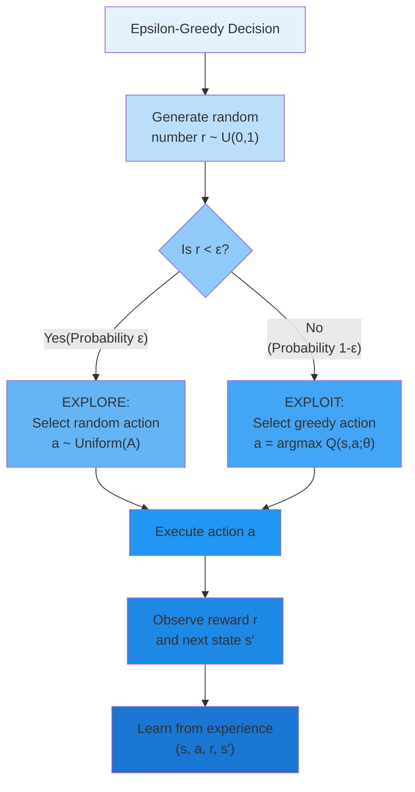

---

##### Theoretical Properties

**Guarantee of Exploration**: Epsilon-greedy ensures every action has non-zero selection probability:

$$
 P(a|s) \geq
\frac{\varepsilon}{|\mathcal{A}|} > 0 \quad \forall a \in \mathcal{A}
$$

Over infinite time, every state-action pair is visited infinitely often (assuming the policy can reach all states):

$$
\lim\_{T \to \infty} N_T(s,a) = \infty \quad \forall (s,a)
$$

This satisfies the exploration requirement for Q-learning convergence.

**Greedy in the Limit with Infinite Exploration (GLIE)**: A policy is GLIE if:

1. All state-action pairs are explored infinitely often
2. The policy converges to greedy:

$$
\lim_{t \to \infty} \pi_t(a|s) = \mathbf{1}_{[a = a^*]}
$$

Epsilon-greedy with decaying $\varepsilon_t \to 0$ is GLIE:

- Condition 1: Satisfied by $\varepsilon_t > 0$ for all $t$ (infinite exploration)
- Condition 2: As $\varepsilon_t \to 0$, the policy becomes greedy

**Regret Analysis**: For epsilon-greedy with constant $\varepsilon$: $$ \mathbb{E}[\text{Regret}_T] = O(\varepsilon T) +
O\left(\frac{|\mathcal{S}||\mathcal{A}|}{\varepsilon}\right)$$

The first term is linear regret from continued exploration; the second term is the initial learning phase. The optimal
fixed $\varepsilon$ balances these terms:

$$
\varepsilon^\* = O\left(\frac{1}{\sqrt{T}}\right) \implies \mathbb{E}[\text{Regret}_T] = O(\sqrt{T})
$$

However, practical implementations use decaying epsilon rather than optimizing for known $T$.

##### Advantages and Limitations

**Advantages**:

**1. Simplicity**: Extremely easy to implement—just one random number comparison and one random action selection.

**2. Computational Efficiency**: No expensive computations required beyond evaluating Q-values once.

**3. Robustness**: Works across diverse environments without environment-specific tuning.

**4. Interpretability**: The exploration rate $\varepsilon$ has clear meaning, making debugging and tuning intuitive.

**5. Compatibility**: Works seamlessly with off-policy learning (like Q-learning) since exploration doesn't bias Q-value
estimates.

**Limitations**:

**1. Uniform Exploration**: All non-greedy actions have equal probability regardless of their values. Exploring clearly
terrible actions wastes experience.

**Example**: Traffic signal with Q-values:

- $Q(s, \text{maintain phase}) = -5.2$ (best)
- $Q(s, \text{switch to phase 2}) = -5.5$ (reasonable alternative)
- $Q(s, \text{switch to phase 3}) = -15.8$ (causes gridlock)

Epsilon-greedy explores "switch to phase 3" as often as "switch to phase 2", despite the former being obviously poor.

**2. No Uncertainty Quantification**: Epsilon-greedy doesn't consider uncertainty in Q-value estimates. Ideally, we'd
explore actions with high uncertainty more than those we're confident are suboptimal.

**3. State-Independent**: The same $\varepsilon$ applies to all states. Some states may require more exploration
(complex, uncertain regions) while others need less (well-understood regions near the goal).

**4. Action-Space Scaling**: As $|\mathcal{A}|$ grows, each action's exploration probability
$\frac{\varepsilon}{|\mathcal{A}|}$ decreases, potentially preventing adequate exploration of large action spaces.

**5. Wasted Exploration Late in Training**: Once Q-values have converged, continued random exploration (if $\varepsilon$
doesn't decay to near-zero) only decreases performance without providing learning benefit.

Despite these limitations, epsilon-greedy remains the most widely used exploration strategy in practice due to its
simplicity and effectiveness across a broad range of problems.

---
