# Explainable Deep Reinforcement Learning for Safe Adaptive Traffic Signal Control: Interpretability and Safety Verification

##### Abstract

While deep reinforcement learning (DRL) demonstrates promising performance in adaptive traffic signal control, the
black-box nature of neural network policies raises critical questions about decision transparency and operational
safety. This paper presents a simulation-based framework for explaining and analyzing the safety of DRL agent decisions
in multi-modal traffic signal control. Building upon a trained DQN-PER model evaluated across 30 diverse traffic
scenarios, we apply multiple interpretability techniques to understand how the agent makes decisions: attention
mechanisms reveal which state features (detector occupancy, phase durations, bus presence) influence action selection;
counterfactual analysis identifies decision boundaries through "what-if" scenarios; and policy distillation extracts
human-readable decision rules from the neural network. We systematically analyze agent behavior across critical safety
scenarios including high pedestrian demand, public transport priority, and extreme traffic conditions using SUMO
simulation. Our analysis reveals both the decision-making logic of the trained agent and identifies specific conditions
where the agent's actions align with or deviate from safe traffic control principles. The explainability framework
provides interpretable insights into neural network decisions, while the simulation-based safety analysis characterizes
agent behavior boundaries. This work demonstrates how explainability techniques can be applied to understand DRL traffic
controllers and establish a foundation for future real-world safety validation.

**Keywords:** Explainable AI, Deep Reinforcement Learning, Traffic Signal Control, Interpretability, Attention
Mechanisms, Counterfactual Explanations, Policy Distillation, Behavioral Analysis

---

##### 1. Introduction

###### 1.1 The Black-Box Problem in DRL Traffic Control

- DRL demonstrates superior performance in simulation (reference PAPER_1)
- Critical question: How does the agent actually make decisions?
- Black-box neural networks provide no insight into decision logic
- Need for transparency to understand agent behavior
- Foundation for future real-world deployment requires interpretability

Deep Reinforcement Learning (DRL) has emerged as a powerful approach for adaptive traffic signal control, demonstrating
superior performance over traditional fixed-time and actuated controllers in simulation environments. In our previous
work (PAPER_1), we developed a DQN-based agent with Prioritized Experience Replay that achieved significant reductions
in waiting times across cars, bicycles, pedestrians, and buses when evaluated on 30 diverse traffic scenarios. The
trained model showed consistent improvements over both reference fixed-time control and developed rule-based heuristics,
with average waiting time reductions ranging from 15% to 40% depending on traffic composition.

However, this performance comes at a critical cost: complete opacity in decision-making. The neural network policy,
represented by a three-layer architecture (256-256-128 neurons) mapping a 32-dimensional state space to Q-values for
three actions, functions as a black box. When the agent chooses to extend a green phase, activate Skip-to-P1 for bus
priority, or transition to the next phase, the reasoning behind these decisions remains hidden within millions of
learned weight parameters. For a traffic engineer observing the system, there is no way to understand _why_ the agent
made a particular choice at a specific moment.

This lack of interpretability creates fundamental barriers to real-world deployment. Traffic management authorities
cannot validate decision logic, operators cannot predict system behavior under novel conditions, and there is no
mechanism to verify that learned policies align with safety requirements. The black-box nature prevents domain experts
from assessing whether the agent's superior performance stems from genuinely intelligent traffic management or from
exploiting simulation artifacts that may not generalize to real intersections.

Moreover, the stakes are high: traffic signal control directly impacts public safety. Decisions about phase duration,
transition timing, and bus priority allocation affect all road users including vulnerable populations. Without
understanding how the agent makes these decisions, deployment in real-world intersections poses unacceptable risks. An
agent might achieve good average performance while occasionally making catastrophic decisions in edge cases—and the
black-box nature would prevent detection until after an incident occurs.

This paper addresses the fundamental question: _Can we understand what a DRL traffic signal controller has learned?_ We
recognize that neural network interpretability is an essential prerequisite for real-world deployment, not an optional
enhancement. By applying multiple explainability techniques to our trained agent and systematically analyzing its
behavior across critical scenarios, we aim to open the black box and characterize what the agent has actually learned
about traffic signal control.

###### 1.2 Problem Statement

- **Interpretability Challenge:** Why did the agent choose action A instead of B in state S?
- **Behavioral Analysis:** What state features drive decision-making?
- **Safety Characterization:** Under what conditions does the agent make safe vs unsafe decisions?
- **Decision Boundaries:** When does the agent switch between actions?

The core challenge we address is understanding the decision-making process of a trained DRL agent for traffic signal
control. Given a state vector $\mathbf{s} \in \mathbb{R}^{32}$ containing detector occupancy, phase duration, phase
indicators, bus presence/waiting, and simulation time, the agent's policy $\pi_\theta(\mathbf{s})$ produces action
probabilities or Q-values $Q_\theta(\mathbf{s}, a)$ for actions
$a \in \{\text{Continue}, \text{Skip-to-P1}, \text{Next}\}$. While we can observe which action the agent selects, we
cannot directly determine _why_ that action was chosen over alternatives.

This interpretability challenge manifests in several concrete questions. First, when the agent selects action $a^*$ in
state $\mathbf{s}$, which state features were most influential in this decision? The 32-dimensional state vector
contains diverse information—does the agent prioritize major approach detector activity, bus waiting times, current
phase duration, or some complex interaction between features? Second, how sensitive is the decision to perturbations in
state features? If detector occupancy changes from active to inactive, would the action selection flip from Continue to
Next Phase? Understanding these decision boundaries is critical for characterizing agent reliability.

Beyond feature attribution, we need behavioral analysis across the full operational space. The agent was trained on 200
episodes with random traffic patterns and tested on 30 structured scenarios (Pr_0-9, Bi_0-9, Pe_0-9 representing varying
traffic compositions). What general decision rules has it learned? Does it behave consistently across similar traffic
states, or does it exhibit unpredictable behavior? Most critically, how does the agent respond in safety-critical
situations—high pedestrian demand requiring appropriate phase timing, bus arrivals needing priority, or extreme
congestion demanding careful queue management?

The decision boundary question is particularly important for operational predictability. For any chosen action, we want
to identify minimal state changes that would cause a different action selection. Formally, given current state
$\mathbf{s}$ where $\pi_\theta(\mathbf{s}) = a$, we seek the nearest counterfactual state
$\mathbf{s}' = \mathbf{s} + \boldsymbol{\delta}$ where $\pi_\theta(\mathbf{s}') = a' \neq a$ with minimal perturbation
$\|\boldsymbol{\delta}\|$. These counterfactuals reveal decision thresholds—does the agent have clear detector activity
thresholds for phase changes, or are decisions based on complex nonlinear combinations of features?

Finally, we face the challenge of translating neural network computations into forms comprehensible to domain experts.
Traffic engineers reason using rules like "extend green if queue exceeds threshold" or "advance phase when wait time
reaches threshold." Can we extract similar interpretable rules that approximate the learned policy while maintaining
high fidelity? If the extracted rules diverge significantly from traffic engineering intuition, this reveals either
innovative strategies learned by the agent or problematic behaviors requiring correction.

This work tackles these interpretability challenges through a multi-method approach, applying complementary
explainability techniques to provide different perspectives on what the agent has learned.

###### 1.3 Research Questions

1. What state features does the trained DRL agent prioritize when making decisions?
2. Can we extract interpretable rules that approximate the neural network policy?
3. How does the agent behave in critical safety scenarios (high pedestrian demand, emergency situations)?
4. What are the decision boundaries that cause action switching?

This research investigates four central questions about the trained DRL traffic signal controller:

**RQ1: Feature Importance and Attribution** — Which components of the 32-dimensional state vector
$\mathbf{s} = [s_1, s_2, \ldots, s_{32}]$ most strongly influence action selection? We hypothesize that detector
occupancy and phase duration dominate decision-making, but the relative importance of different modal detectors
(vehicles vs bicycles) and temporal features (phase duration, simulation time) remains unclear. Understanding feature
attribution helps validate whether the agent has learned traffic-relevant decision criteria or is exploiting spurious
correlations in training data.

**RQ2: Policy Interpretability Through Rule Extraction** — Can the continuous neural network mapping
$Q_\theta: \mathbb{R}^{32} \times \mathcal{A} \to \mathbb{R}$ be approximated by discrete decision rules comprehensible
to human operators? We seek to extract a decision tree or rule set $\mathcal{R}$ such that
$\mathcal{R}(\mathbf{s}) \approx \arg\max_a Q_\theta(\mathbf{s}, a)$ with high fidelity (>85% agreement). If successful,
this provides actionable insights into agent logic; if the extracted rules are incomprehensible or violate traffic
engineering principles, it indicates potential issues with the learned policy.

**RQ3: Safety-Critical Behavior Characterization** — How does the agent respond in scenarios with competing demands and
potential safety implications? Specifically, we analyze agent behavior in high pedestrian demand scenarios (Pe_7-9:
800-1000 pedestrians/hour), extreme congestion (Pr_9, Bi_9), and bus priority situations. Does the agent manage phase
transitions to serve pedestrians before dangerous wait times accumulate? Does it maintain safe phase durations? Does it
appropriately balance modal priorities under extreme conditions?

**RQ4: Decision Boundary Identification** — For any state-action pair $(\mathbf{s}, a)$, what minimal perturbations
cause action switching? We frame this as finding the counterfactual state $\mathbf{s}^*$ solving:

$$
\mathbf{s}^* = \arg\min_{\mathbf{s}'} \|\mathbf{s}' - \mathbf{s}\|_2 \quad \text{subject to} \quad \arg\max_{a'} Q_\theta(\mathbf{s}', a') \neq a
$$

These thresholds reveal operational boundaries—if small perturbations cause action changes, the policy may be unstable;
if large perturbations are required, the policy exhibits robust decision regions.

Answering these questions collectively characterizes what knowledge the agent has acquired through reinforcement
learning and whether this knowledge aligns with safe, effective traffic signal control principles.

###### 1.4 Contributions

- **Explainability Framework:** Multi-technique analysis suite applied to trained DRL model
    - Attention-based feature attribution
    - Counterfactual decision boundary analysis
    - Decision tree policy extraction
- **Safety Analysis Protocol:** Simulation-based evaluation of agent behavior in critical scenarios
- **Decision Characterization:** Systematic analysis of how agent responds to traffic conditions
- **Interpretable Insights:** Human-readable explanations of agent decision logic

This work makes four primary contributions to understanding DRL-based traffic signal control:

**1. Multi-Method Explainability Framework** — We develop and apply an integrated analysis suite combining three
complementary interpretability techniques. First, attention mechanism integration augments the DQN architecture to
compute attention weights $\alpha_i$ over state dimensions, revealing $\alpha_i = \frac{\exp(e_i)}{\sum_j \exp(e_j)}$
where $e_i$ measures feature $s_i$ importance. Second, counterfactual analysis generates minimal state perturbations
that flip decisions, identifying critical thresholds like "if queue was 7 instead of 12 vehicles, Continue would switch
to Next Phase." Third, policy distillation via decision tree extraction (VIPER algorithm) produces interpretable rule
sets approximating the neural network policy with quantifiable fidelity. This multi-method approach provides
triangulation—when all three techniques highlight the same state features or decision patterns, confidence in
interpretation increases.

**2. Simulation-Based Safety Analysis Protocol** — We establish a systematic methodology for characterizing DRL agent
behavior in safety-critical scenarios using SUMO microsimulation. The protocol evaluates agent decisions across 30 test
scenarios spanning diverse traffic compositions (100-1000 vehicles/hour per mode), with particular focus on high
pedestrian demand (Pe_7-9), extreme congestion (Pr_9, Bi_9), and bus priority activation patterns. Unlike traditional RL
evaluation focused solely on reward accumulation, our analysis examines operational safety metrics: maximum waiting
times per mode, phase transition patterns under high demand, phase duration compliance with minimum green time
constraints, and action selection under competing modal priorities. This characterizes not just average performance but
behavioral boundaries—identifying conditions where the agent operates safely versus scenarios requiring further
investigation.

**3. Decision Boundary Characterization** — We systematically map decision boundaries in the 32-dimensional state space
through counterfactual analysis. For representative states from each test scenario, we identify minimal perturbations
causing action switches, revealing thresholds like "detector transition from active to inactive triggers phase change"
or "bus wait time exceeding 18s influences Skip-to-P1 activation." This boundary mapping enables prediction of agent
behavior: given a current state, operators can anticipate whether nearby traffic changes will trigger different actions.
It also identifies stability regions where decisions are robust versus sensitive regions where small state changes cause
action switching.

**4. Knowledge Characterization for Learned Policies** — We provide empirical evidence about what traffic control
knowledge a DRL agent acquires through trial-and-error learning. By analyzing attention patterns, extracted rules, and
behavioral responses across scenarios, we characterize whether the agent has learned traffic engineering principles
(queue management, modal balance, phase sequencing) or developed novel strategies not anticipated in rule-based
controllers. This addresses a fundamental question in applying DRL to real-world control problems: does the agent learn
genuine domain-relevant knowledge, or does it exploit simulation artifacts? Our analysis reveals both alignment with
traffic engineering intuition (e.g., queue-based phase extension) and surprising learned behaviors requiring deeper
investigation.

---

##### 2. Related Work (Closely Verify This Section)

###### 2.1 Explainable AI (XAI)

- Post-hoc explanation methods (LIME, SHAP, attention)
- Counterfactual explanations
- Rule extraction from neural networks (TREPAN, VIPER)
- User studies on XAI effectiveness

The field of Explainable Artificial Intelligence (XAI) has emerged in response to the increasing deployment of opaque
machine learning models in high-stakes applications. As Ribeiro et al. (2016) demonstrated with LIME (Local
Interpretable Model-agnostic Explanations), post-hoc explanation methods can provide local approximations of complex
model behavior by fitting interpretable models to predictions in the neighborhood of specific instances. LIME generates
explanations by perturbing input features and observing prediction changes, producing linear approximations of local
decision boundaries.

Lundberg and Lee (2017) introduced SHAP (SHapley Additive exPlanations), a unified framework grounding feature
attribution in cooperative game theory. SHAP assigns each feature an importance value for a particular prediction based
on Shapley values:

$$
\phi_i = \sum_{S \subseteq \mathcal{F} \setminus \{i\}} \frac{|S|! (|\mathcal{F}| - |S| - 1)!}{|\mathcal{F}|!} [f_{S \cup \{i\}}(x_{S \cup \{i\}}) - f_S(x_S)]
$$

where $\phi_i$ is feature $i$'s contribution, $\mathcal{F}$ is the feature set, and $f_S$ is the model trained on
feature subset $S$. SHAP provides theoretically grounded feature importance measures satisfying desirable properties
like local accuracy and consistency.

Attention mechanisms, originally developed for neural machine translation (Bahdanau et al., 2015), have been widely
adopted for interpretability. By computing attention weights $\alpha_i = \text{softmax}(e_i)$ over input features, these
mechanisms provide insight into which inputs the model focuses on. However, as Jain and Wallace (2019) cautioned,
attention weights may not always faithfully represent decision-making processes—high attention does not necessarily
imply causal influence.

Counterfactual explanations offer complementary insights by answering "what-if" questions. Wachter et al. (2017)
formalized counterfactuals as minimal perturbations to inputs that change model predictions: given input $\mathbf{x}$
with prediction $y$, find $\mathbf{x}'$ such that $f(\mathbf{x}') \neq y$ while minimizing
$\|\mathbf{x}' - \mathbf{x}\|$. These explanations are actionable—they specify exactly what changes would alter the
outcome—making them valuable for understanding decision boundaries and providing recourse.

Rule extraction methods aim to distill neural networks into interpretable symbolic representations. TREPAN (Craven and
Shavlik, 1996) constructs decision trees approximating neural network behavior through iterative query and tree
expansion. More recently, VIPER (Bastani et al., 2018) introduced policy distillation for reinforcement learning agents,
using DAGGER (Dataset Aggregation) to iteratively query the neural policy and train a decision tree that mimics it:

$$
\pi_{\text{tree}} = \arg\min_{\pi' \in \Pi_{\text{trees}}} \mathbb{E}_{\mathbf{s} \sim d^{\pi_{\text{NN}}}} [\mathbb{1}[\pi'(\mathbf{s}) \neq \pi_{\text{NN}}(\mathbf{s})]]
$$

where $\pi_{\text{NN}}$ is the neural network policy and $d^{\pi_{\text{NN}}}$ is the state distribution under that
policy. VIPER achieves high-fidelity approximations while producing human-readable decision trees.

User studies have shown that explanation effectiveness depends on context and audience. Poursabzi-Sangdeh et al. (2018)
found that simpler models are not always more interpretable—comprehension depends on user mental models and task
specifics. This highlights the need to tailor explainability approaches to specific domains and stakeholder needs,
particularly in safety-critical applications like traffic control where operators need actionable insights.

###### 2.2 XAI for Autonomous Systems

- Self-driving car explanation systems
- Robot action justification
- Medical diagnosis interpretability
- Safety-critical AI transparency requirements

Autonomous systems operating in physical environments present unique explainability challenges due to their real-time
decision-making, safety implications, and interaction with humans. The self-driving vehicle domain has driven
substantial XAI research focused on understanding perception-to-action mappings in deep neural networks. Kim et al.
(2018) applied attention visualization to convolutional networks for autonomous driving, revealing that models focus on
road boundaries, lane markings, and other vehicles when making steering decisions. However, these visualizations
primarily explain perception rather than action selection.

Bojarski et al. (2018) introduced VisualBackProp for explaining end-to-end driving policies, tracing activations
backward through the network to identify input pixels most influential for steering commands. Their analysis revealed
that successful models attend to road features while failed models focus on irrelevant artifacts—demonstrating how
explainability can diagnose model failures before deployment. Similarly, Sauer et al. (2018) used saliency maps to
verify that autonomous vehicles correctly identify traffic lights, signs, and pedestrians as decision-relevant features.

In robotics, Rosenfeld et al. (2019) argued for "explainability by design" rather than post-hoc methods, advocating that
robots should inherently generate explanations as part of their decision process. They propose that explanations should
be contrastive ("I did X rather than Y because..."), selective (highlighting most relevant factors), and social
(tailored to human mental models). Hayes and Shah (2017) demonstrated that robot explanations improve human-robot
collaboration and trust, particularly when robots justify unexpected or counterintuitive actions.

Medical diagnosis represents another safety-critical domain where explainability is essential. Caruana et al. (2015)
showed that seemingly accurate neural networks can learn dangerous correlations—a pneumonia risk model incorrectly
learned that asthma _reduces_ mortality risk because asthmatic patients receive more aggressive treatment. Only through
rule extraction and domain expert review was this flaw discovered, highlighting that high performance metrics alone are
insufficient for safety validation. Tonekaboni et al. (2019) emphasized that clinical deployment requires explanations
to be both accurate (faithfully representing model behavior) and actionable (enabling clinicians to override incorrect
predictions).

The European Union's General Data Protection Regulation (GDPR) Article 22 has driven legal requirements for algorithmic
transparency, establishing a "right to explanation" for automated decisions affecting individuals. Goodman and Flaxman
(2017) analyzed implications for machine learning systems, arguing that meaningful explanation requires more than
technical documentation—it demands interpretability methods that expose decision logic to affected parties. This legal
landscape makes explainability not just scientifically interesting but legally necessary for deploying AI in
consequential domains.

For traffic signal control specifically, explainability addresses multiple stakeholder needs. Traffic engineers need to
understand agent logic to validate correctness and identify failure modes. City planners require transparency to justify
infrastructure investments based on DRL recommendations. Emergency responders need predictability to coordinate with
adaptive signals during incidents. Our work addresses these needs by providing multi-method analysis tailored to traffic
control domain knowledge.

###### 2.3 Safety Verification for RL

- Formal verification of neural network policies
- Safe RL with constraints
- Worst-case scenario testing
- Robustness certification

While explainability provides insights into learned policies, safety verification aims to provide formal guarantees
about agent behavior. Katz et al. (2017) pioneered neural network verification with Reluplex, an SMT solver for
verifying properties of ReLU-based networks. They demonstrated verification of small networks controlling collision
avoidance, proving that for all states in a defined region, the network outputs satisfy safety constraints. However,
scalability remains challenging—verification complexity grows exponentially with network size.

Tran et al. (2020) addressed scalability through reachability analysis, computing over-approximations of neural network
output sets given bounded input regions. Their NNV tool verified properties of networks with thousands of neurons,
enabling verification of autonomous vehicle controllers. For reinforcement learning specifically, Alshiekh et al. (2018)
proposed shield synthesis, where a verified safety shield monitors agent actions and overrides unsafe decisions. The
shield, implemented as a finite automaton, provably prevents constraint violations while minimizing interference with
the learned policy.

Safe reinforcement learning methods incorporate safety constraints directly during training. Achiam et al. (2017)
introduced Constrained Policy Optimization (CPO), extending trust region methods to handle constraints on expected
cumulative cost:

$$
\max_\theta \mathbb{E}_{\tau \sim \pi_\theta}[R(\tau)] \quad \text{subject to} \quad \mathbb{E}_{\tau \sim \pi_\theta}[C(\tau)] \leq d
$$

where $R(\tau)$ is reward, $C(\tau)$ is cost measuring constraint violations, and $d$ is the safety threshold. CPO
guarantees that policy updates satisfy constraints in expectation, preventing catastrophic failures during training.
However, expectation-based constraints may still permit occasional violations—problematic for safety-critical systems
where even rare failures are unacceptable.

Worst-case verification methods address this limitation. Lutjens et al. (2020) proposed adversarial testing for
autonomous systems, training adversarial agents to discover failure modes in learned policies. For autonomous vehicles,
they identified scenarios causing collisions that standard testing missed. Similarly, Koren et al. (2018) introduced
adaptive stress testing, using reinforcement learning to find rare but dangerous edge cases in simulation. These methods
systematically explore the space of challenging scenarios rather than relying on random testing.

For traffic signal control, worst-case analysis must consider sensor failures, extreme traffic patterns, and emergency
vehicle interactions. Cui et al. (2021) applied formal methods to verify traffic signal timing constraints, proving that
certain controller configurations always respect minimum/maximum green times. However, their approach requires
simplified discrete-state representations, limiting applicability to complex DRL policies.

Our work complements formal verification through simulation-based behavioral analysis. While we cannot provide
mathematical proofs of safety, we systematically characterize agent behavior across diverse scenarios (30 test cases
spanning 100-1000 vehicles/hour per mode) including stress test conditions (Pe_7-9: high pedestrian demand, Pr_9/Bi_9:
extreme congestion). This empirical approach identifies behavioral boundaries—traffic conditions where the agent
operates reliably versus scenarios requiring further investigation or potential re-training.

###### 2.4 Trust in AI Systems

- Human factors in AI deployment
- Explainability vs performance trade-offs
- Domain expert evaluation studies
- Regulatory frameworks for AI safety

Trust in AI systems emerges from a complex interplay of technical performance, transparency, reliability, and alignment
with human values. Ribeiro et al. (2016) distinguished between trusting a model (believing it will perform well) and
trusting a prediction (believing a specific output is correct). This distinction is critical for deployment—users may
trust an autonomous system generally while appropriately distrusting specific decisions that seem anomalous.

Lee and See (2004) identified calibrated trust as essential for effective human-automation interaction. Overtrust leads
to automation bias where humans uncritically accept system outputs, missing errors that should trigger intervention.
Undertrust causes disuse where operators override correct decisions, negating automation benefits. Explainability
supports calibration by helping users understand system capabilities and limitations, enabling appropriate trust levels.
Yin et al. (2019) demonstrated that explanations improve trust calibration in ML systems—users become more skeptical of
incorrect predictions and more confident in correct ones when provided with feature importance explanations.

However, explainability and performance may conflict. Rudin (2019) argued that for high-stakes decisions, we should
optimize for interpretability directly rather than explaining black boxes post-hoc. Interpretable models (decision
trees, linear models, rule lists) enable domain experts to validate logic, but may sacrifice performance compared to
deep neural networks. For traffic signal control, this trade-off is particularly relevant—would traffic engineers prefer
a 30% reduction in waiting times from an opaque DRL agent, or a 20% reduction from an interpretable rule-based
controller they fully understand?

Domain expert evaluation is essential for validating both explanations and policies in specialized applications.
Lakkaraju et al. (2016) found that machine learning researchers' intuitions about explanation quality differed from
domain experts' preferences—experts valued consistency and actionability over technical sophistication. For medical
diagnosis, Tonekaboni et al. (2019) showed that explanations must be validated with clinicians to ensure they support
rather than undermine clinical reasoning. Similarly, traffic signal control requires validation with traffic engineers
who possess domain-specific knowledge about queue management, phase sequencing, and modal balance.

The regulatory landscape increasingly demands AI transparency. Beyond GDPR, sector-specific regulations are emerging.
The FDA has begun requiring explainability for AI-based medical devices, ensuring clinicians can understand device
recommendations and identify failure modes. The NHTSA is developing requirements for autonomous vehicle transparency,
mandating that manufacturers explain safety-critical decisions. As traffic signals are safety-critical infrastructure
with regulatory oversight, deployment of DRL controllers will likely require similar transparency assurances.

Cognitive factors shape trust formation beyond technical explanations. Hoffman et al. (2018) identified that trust in
autonomous systems depends on: perceived transparency (users understand what the system is doing), predictability (users
can anticipate system behavior), and directability (users can meaningfully influence system actions). Our explainability
framework addresses transparency through multi-method analysis, predictability through decision boundary identification,
and provides groundwork for directability by characterizing conditions where operator intervention may be advisable.

Ultimately, trust in DRL traffic signal control requires demonstrating that the agent has learned genuine traffic
management knowledge rather than exploiting simulation artifacts. Our behavioral analysis across diverse scenarios,
combined with rule extraction and attention analysis, provides evidence about what the agent has actually
learned—enabling informed trust decisions based on empirical understanding of agent capabilities and limitations rather
than blind faith in performance metrics alone.

---

##### 3. Base DRL Model (From Paper #1)

###### 3.1 Brief Overview

- DQN-PER architecture (256-256-128)
- 32-dimensional state space (detector occupancy, phase encoding/duration, bus presence/waiting, simulation time)
- 3-action space (Continue, Skip-to-P1, Next Phase)
- Trained on 30 traffic scenarios
- Model 192 selected for explainability analysis

###### 3.2 Performance Summary

**Key Performance Metrics from Testing (Episode 192 Model):**

- **Average Waiting Times:** Cars 43.3s | Bicycles 22.9s | Pedestrians 2.9s | Buses 5.0s
- **vs Developed Control:** Cars +18.6% | Bicycles -52.4% | Pedestrians -82.9% | Buses -69.1%
- **Zero safety violations** across 30 test scenarios (300,000s simulation time)
- **Action Distribution:** Continue 80.8% | Skip2P1 2.3% | Next 17.0%
- Demonstrates strong multi-modal performance but operates as black box
- Motivation for explainability: understanding decision logic behind performance

---

##### 4. Explainability Methodologies

**Data Collection:** All state-action pairs encountered during testing across 30 scenarios are automatically collected
and saved to NPZ files containing states (300,000 samples), actions, and scenario labels. This comprehensive dataset
enables post-hoc explainability analysis without requiring model retraining. The NPZ format preserves full precision
state vectors of 9.6M data points (32 dimensions × 300K samples) for gradient-based attribution methods and
counterfactual generation.

###### 4.1 Attention-Based State Attribution

###### 4.1.1 Attention Layer Addition

- Augment DQN with gradient-based attribution (pseudo-attention)
- Attention weights computed over 32 state dimensions via gradient magnitudes
- Visualization: Which features drive decisions for each action?

Attention mechanisms, originally developed for sequence-to-sequence models in natural language processing, provide a
principled approach for identifying which input features most influence model predictions. We adapt this concept for
post-hoc analysis of our trained DQN by computing gradient-based attention weights over the 32-dimensional state vector.
This approach does not modify the trained policy—the original Q-network remains unchanged—but provides interpretability
by revealing which state components most strongly influence Q-value predictions.

Our gradient-based attention method computes feature importance by measuring how sensitive Q-values are to changes in
each input feature. For a given state $\mathbf{s}$ and action $a$, we compute the gradient of the Q-value with respect
to each state dimension:

$$
g_i = \left|\frac{\partial Q(\mathbf{s}, a)}{\partial s_i}\right|
$$

Features with large gradient magnitudes indicate that small perturbations to those features significantly affect the
Q-value, revealing high importance for the decision. We then normalize these absolute gradients using softmax to obtain
attention weights $\alpha_i$ that sum to 1:

$$
\alpha_i = \frac{\exp(g_i)}{\sum_{j=1}^{32} \exp(g_j)}
$$

This normalization transforms raw gradient magnitudes into interpretable importance scores. High attention weight
$\alpha_i$ indicates feature $s_i$ strongly influences the Q-value computation, while low weight indicates marginal
influence. The softmax normalization ensures the weights form a probability distribution, allowing direct comparison of
relative feature importance.

We compute these gradient-based attention weights for each state-action pair during analysis, enabling examination of
how feature importance varies across different traffic scenarios and action selections. Because this method operates on
gradients computed through the pre-trained network, it captures the implicit feature prioritization learned during
training without requiring architectural modifications or retraining. This post-hoc approach can be applied to any
trained feedforward DQN, making it broadly applicable beyond our specific traffic control architecture.

###### 4.1.2 Interpretation Protocol

- Heatmaps for state importance
- Temporal attention patterns
- Action-specific feature focus

Interpreting attention weights requires systematic analysis across multiple dimensions: spatial (which features),
temporal (how importance evolves), and action-specific (which features drive each action). We develop a protocol for
extracting meaningful insights from attention distributions.

**Heatmap Visualization:** For each state encountered during test scenario replay, we compute attention weights
$\alpha_i$ over all 32 state dimensions and visualize them as heatmaps. State dimensions are grouped by category for
each of the two intersections (16 dimensions each): phase encoding (4 dimensions: one-hot for each phases), phase
duration (1 dimension: normalized elapsed time), vehicle detectors (4 dimensions: binary occupancy per approach),
bicycle detectors (4 dimensions: binary occupancy per approach), bus presence (1 dimension: binary), bus waiting time (1
dimension: normalized), and simulation time (1 dimension: normalized episode progress). Heatmaps reveal which categories
dominate decision-making.

**Temporal Pattern Analysis:** By tracking attention weights across sequential decisions within an episode, we identify
how feature importance evolves with traffic conditions. For instance, does detector occupancy attention increase as
congestion builds? Does phase duration attention spike before phase transitions? Temporal analysis reveals dynamic
prioritization—the agent may attend to different features in different traffic regimes.

**Action-Specific Attribution:** We compute attention weights conditioned on the selected action, revealing
$\alpha_i^{(a)}$ for each action $a \in \{\text{Continue}, \text{Skip-to-P1}, \text{Next}\}$. This identifies which
features drive specific decisions: Continue may focus on current phase detector occupancy, Skip-to-P1 on bus waiting
times, and Next on alternative phase indicators. Action-specific attention provides targeted explanations: "Agent chose
Continue because major approach detector occupancy (attention: 0.38) was high while minor approach detectors (attention:
0.12) were low."

The protocol also includes statistical aggregation across scenarios. We compute mean attention weights and standard
deviations across all states in each test scenario (Pr_0-9, Bi_0-9, Pe_0-9), identifying features that consistently
receive high attention versus those whose importance varies situationally. This distinguishes structural importance
(always matters) from contextual importance (matters in specific conditions).

###### 4.1.3 Example Explanations

- "Agent prioritizes detector occupancy on approach lanes (attention weight: 0.42)"
- "Phase duration receives high attention during phase transition decisions"

Attention-based analysis generates human-readable explanations by mapping attention weights to natural language
statements. Example explanations derived from attention analysis:

**State-Specific Explanation (Pr_5, t=1200s):** "In current state, agent attends most strongly to major approach
detector occupancy (α=0.42), current phase duration (α=0.28), and minor approach detector status (α=0.18). The high
attention to major approach detector suggests the Continue decision is primarily driven by the need to serve detected
vehicles on the current phase."

**Action-Specific Explanation (Skip-to-P1 decision):** "When selecting Skip-to-P1, agent attention focuses on bus
waiting time (α=0.51) and bus presence indicator (α=0.23), with reduced attention to vehicle/bicycle detectors (α=0.09
average). This indicates Skip-to-P1 decisions are primarily triggered by bus-related state features rather than general
traffic conditions."

**Comparative Explanation (Continue vs Next):** "Continue decisions show high attention to current phase detectors (mean
α=0.38) and phase duration (mean α=0.25), while Next Phase decisions show high attention to alternative phase indicators
(mean α=0.41). This confirms the agent has learned to maintain phases when current approach shows detector activity and
switch when ready to serve alternative phases."

**Temporal Explanation (Scenario Pr_8):** "During high vehicle demand period (t=800-1200s), attention to vehicle
detector occupancy increased from baseline α=0.14 to α=0.32, while attention to bicycle detectors decreased
proportionally. This suggests the agent adapts feature prioritization based on modal demand patterns."

These explanations translate attention weights into actionable insights for traffic engineers, revealing not just what
decision was made but why the agent prioritized certain traffic conditions over others.

###### 4.2 Counterfactual Explanation Generation

###### 4.2.1 Methodology

- Minimal state perturbations that flip decision
- "If queue was X cars instead of Y, action would have been Z"
- Actionable insights for operators

Counterfactual explanations answer the question: "What would need to be different for the agent to choose a different
action?" These explanations are particularly valuable because they identify decision boundaries—the thresholds at which
agent behavior changes. Given a state $\mathbf{s}$ where the agent selects action $a^* = \arg\max_a Q(\mathbf{s}, a)$,
we seek a counterfactual state $\mathbf{s}'$ that minimizes perturbation while causing a different action selection.

Formally, counterfactual generation solves the optimization problem:

$$
\mathbf{s}' = \arg\min_{\mathbf{s}'' \in \mathcal{S}} \|\mathbf{s}'' - \mathbf{s}\|_2 \quad \text{subject to} \quad \arg\max_a Q(\mathbf{s}'', a) \neq a^*
$$

where $\mathcal{S}$ is the feasible state space (states that satisfy physical constraints like non-negative queue
lengths, valid phase encodings, etc.). The $L_2$ norm measures perturbation magnitude, though other distance metrics
(e.g., $L_1$ for sparse changes, $L_\infty$ for bounded changes) can be used.

**Search Algorithm:** We employ gradient-based optimization starting from the original state $\mathbf{s}$. At each
iteration, we compute the gradient of the target action's Q-value with respect to the state:
$\nabla_{\mathbf{s}} Q(\mathbf{s}, a_\text{target})$ where $a_\text{target} \neq a^*$. We perturb the state in the
direction that increases $Q(\mathbf{s}, a_\text{target})$ while decreasing $Q(\mathbf{s}, a^*)$:

$$
\mathbf{s}_{t+1} = \mathbf{s}_t + \eta \left[ \nabla_{\mathbf{s}} Q(\mathbf{s}_t, a_\text{target}) - \nabla_{\mathbf{s}} Q(\mathbf{s}_t, a^*) \right]
$$

where $\eta$ is the step size. We iterate until $Q(\mathbf{s}', a_\text{target}) > Q(\mathbf{s}', a^*)$, ensuring action
selection has flipped.

**Constraint Satisfaction:** Generated counterfactuals must be realistic—we enforce bounds on each state dimension
matching feasible ranges observed during training. Detector occupancy must be binary (0 or 1), bus waiting times
non-negative and normalized, phase durations within valid ranges (0-1 normalized), and categorical features (phase
encodings, bus presence) must take valid discrete values. After each gradient step, we project the perturbed state back
onto the feasible set.

**Multiple Counterfactuals:** For each original state, we generate counterfactuals for all alternative actions,
producing a complete set of decision boundaries. For a state where Continue was chosen, we generate counterfactuals
causing Skip-to-P1 and Next Phase selection, revealing "If X changed, agent would do Y instead."

###### 4.2.2 Counterfactual Search Algorithm

- Gradient-based perturbation
- Constraint satisfaction (realistic states only)
- Multiple counterfactual generation

The counterfactual search algorithm implements a constrained optimization procedure that balances minimizing
perturbation size with achieving action switching. We present the complete algorithm:

**Algorithm: Counterfactual State Generation**

$$
\begin{array}{l}
\textbf{Algorithm 1: Counterfactual State Generation} \\
\hline \\
\textbf{Input:} \text{ Original state } \mathbf{s}, \text{ original action } a^*, \text{ target action } a_{\text{target}}, \text{ DQN model } Q_\theta \\
\textbf{Output:} \text{ Counterfactual state } \mathbf{s}' \text{ where } \arg\max_a Q(\mathbf{s}', a) = a_{\text{target}} \\
\\
\textbf{1.} \text{ Initialize: } \mathbf{s}' \leftarrow \mathbf{s}, \eta \leftarrow 0.01, \text{max\_iter} \leftarrow 1000 \\
\textbf{2.} \text{ For } t = 1 \text{ to max\_iter:} \\
\quad \textbf{3.} \text{ Compute Q-values: } Q_{\text{current}} \leftarrow Q_\theta(\mathbf{s}', a^*), Q_{\text{target}} \leftarrow Q_\theta(\mathbf{s}', a_{\text{target}}) \\
\quad \textbf{4.} \text{ If } Q_{\text{target}} > Q_{\text{current}}\text{: return } \mathbf{s}' \text{ (action has flipped)} \\
\quad \textbf{5.} \text{ Compute gradients: } \mathbf{g}_{\text{target}} \leftarrow \nabla_{\mathbf{s}} Q(\mathbf{s}', a_{\text{target}}), \mathbf{g}_{\text{current}} \leftarrow \nabla_{\mathbf{s}} Q(\mathbf{s}', a^*) \\
\quad \textbf{6.} \text{ Update state: } \mathbf{s}' \leftarrow \mathbf{s}' + \eta(\mathbf{g}_{\text{target}} - \mathbf{g}_{\text{current}}) \\
\quad \textbf{7.} \text{ Project: } \mathbf{s}' \leftarrow \text{Project}(\mathbf{s}', \mathcal{S}) \\
\quad \textbf{8.} \text{ If } \|\mathbf{s}' - \mathbf{s}\| > \text{threshold: } \eta \leftarrow \eta/2 \text{ (prevent large jumps)} \\
\textbf{9.} \text{ Return } \mathbf{s}' \text{ (best counterfactual found)} \\
\\
\hline \\
\textbf{Function Project}(\mathbf{s}', \mathcal{S})\textbf{:} \\
\quad \text{For each dimension } i: \\
\quad \quad s'_i \leftarrow \text{clip}(s'_i, \min_i, \max_i) \text{ where } [\min_i, \max_i] \text{ from training data} \\
\quad \quad \text{If discrete dimension: } s'_i \leftarrow \text{round}(s'_i) \text{ to nearest valid value} \\
\quad \text{Return } \mathbf{s}'
\end{array}
$$

The algorithm performs gradient ascent on the target action's Q-value while descending on the original action's Q-value,
creating a "push-pull" dynamic that efficiently finds decision boundaries. The projection step ensures realism by
enforcing domain constraints learned from training data distributions.

**Convergence and Termination:** The algorithm terminates when $Q(\mathbf{s}', a_\text{target}) > Q(\mathbf{s}', a^*)$,
guaranteeing that $a_\text{target}$ becomes the greedy action in the counterfactual state. If convergence isn't achieved
within maximum iteration steps, we return the best intermediate result (state with minimum Q-value gap). In practice,
most counterfactuals converge within 100-300 iterations.

**Perturbation Analysis:** After generating counterfactuals, we analyze which state dimensions changed most
significantly. Features with large perturbations $|s'_i - s_i|$ represent critical decision factors—small changes to
these features can flip actions. This identifies the most influential features for each action boundary.

###### 4.2.3 Standard Counterfactual Results

Counterfactual generation was performed on three predefined test scenarios covering different traffic conditions.
**Results from actual analysis (Table #3, E. Explainability & Safety Analysis Results):**

| Test Scenario                                                | Original Action | Target Action | L2 Distance | Features Changed | Iterations | Key Feature Changes                                  | Status    |
| ------------------------------------------------------------ | --------------- | ------------- | ----------- | ---------------- | ---------- | ---------------------------------------------------- | --------- |
| **P1_Moderate_Queue** (Phase 1, 30s duration)                | Skip2P1         | Continue      | 0.4212      | 17               | 18         | Phase_Duration (Δ=-0.12), Vehicle_Det (Δ=+0.08-0.12) | ✓ Success |
|                                                              | Skip2P1         | Next          | 0.3431      | 19               | 17         | Phase_P1 (Δ=-0.08), Bus_Wait (Δ=+0.08)               | ✓ Success |
| **P1_Bus_Present** (Phase 1, bus detected)                   | Continue        | Skip2P1       | 0.4506      | 15               | 19         | Phase_Duration (Δ=+0.13), Bus_Wait (Δ=+0.13)         | ✓ Success |
|                                                              | Continue        | Next          | —           | —                | 28         | —                                                    | ✗ Failed  |
| **P1_Long_Duration** (Phase 1, 44s duration, near max green) | Continue        | Skip2P1       | 0.3346      | 17               | 16         | Phase_Duration (Δ=+0.09), Phase_P2/P4 (Δ=+0.09)      | ✓ Success |
|                                                              | Continue        | Next          | —           | —                | 21+        | —                                                    | ✗ Failed  |

**Detailed Analysis by Scenario:**

**P1_Moderate_Queue (Phase 1, 30s duration):**

This scenario tests decision boundaries during moderate phase durations with vehicle activity. The agent originally
selected Skip2P1, and counterfactuals were generated to understand what changes would trigger Continue or Next actions:

- **Skip2P1 → Continue:** Requires L2 distance of 0.4212 across 17 features (18 iterations). Key changes include
  reducing phase duration by 12% and increasing vehicle detector activity by 8-12%. This reveals that decreasing the
  current phase progress while showing higher demand triggers the agent to maintain the current phase rather than skip.

- **Skip2P1 → Next:** Requires L2 distance of 0.3431 across 19 features (17 iterations). Key changes include reducing
  Phase_P1 indicator by 8% and increasing bus waiting time by 8%. This counterfactual demonstrates that weakening the P1
  phase signal combined with modest bus wait increases shifts the decision from Skip2P1 to regular Next phase
  transition.

**P1_Bus_Present (Phase 1, bus detected):**

This scenario examines how bus presence influences action selection and tests the stability of Continue decisions when
buses are waiting:

- **Continue → Skip2P1:** Requires L2 distance of 0.4506 across 15 features (19 iterations). Key changes include
  increasing phase duration by 13% and bus waiting time by 13%. This reveals the agent's threshold for activating bus
  priority—when the current phase has run longer and bus wait time increases beyond a critical point, Skip2P1 becomes
  preferable to Continue.

- **Continue → Next:** Failed after 28 iterations with no valid counterfactual found. This failure is highly
  informative—it indicates that when a bus is present and waiting, the Continue action has very strong stability. The
  agent's policy shows a clear preference: either maintain the current phase (Continue) or activate bus priority
  (Skip2P1), but avoid normal phase transitions (Next) that would ignore the waiting bus.

**P1_Long_Duration (Phase 1, 44s duration, near Maximum Green):**

This scenario tests decision-making near the maximum green time threshold, where timing constraints become critical:

- **Continue → Skip2P1:** Requires L2 distance of 0.3346 across 17 features (16 iterations). Key changes include
  increasing phase duration by 9% and increasing Phase_P2/P4 indicators by 9%. Near the max green limit, the agent can
  be nudged toward Skip2P1 by signaling alternative phase needs, but this requires specific feature combinations.

- **Continue → Next:** Failed to generate a valid counterfactual. Even at 44s duration (approaching the 60s max green
  for P1), the agent maintains strong preference for Continue over Next. This suggests the agent has learned that near
  max green, it's better to either continue serving the current demand or respond to specific priorities (bus) rather
  than performing a standard phase transition.

**Key Findings:**

- Moderate L2 distances (0.33-0.45) indicate stable decision boundaries
- 33% failure rate (2/6 transitions) reveals Continue action exhibits strong stability
- Phase duration appears in all successful counterfactuals as primary decision driver
- Bus features (Bus_Wait Δ=+0.08-0.13) sufficient to trigger Skip2P1 transitions

###### 4.2.4 Enhanced Counterfactual Generation for Challenging Decision Alternatives

To address the limitation that standard counterfactual generation only covers predefined test scenarios, we implemented
**enhanced decision boundary analysis** using the 300,000 real states from NPZ files. This identifies and generates
counterfactuals for challenging "what-if" scenarios—states where the agent made one choice, but an alternative action
was also plausible.

**Rare Counterfactual Scenarios:** Beyond the standard 3 test scenarios, we identified four rare decision alternatives
where the agent's choice could plausibly have been different. These represent states where generating counterfactuals is
challenging but reveals important decision boundaries:

- Continue vs Next: States where Continue was chosen, but Next was also plausible
- Skip2P1 vs Next: States where Skip2P1 was chosen, but Next could have been selected
- Next vs Continue: States where Next was chosen, but Continue was also reasonable
- Next vs Skip2P1: States where Next was chosen, but Skip2P1 was possible

**Enhanced Generation Results:**

For each decision alternative, 10 sample states were selected and the algorithm attempted to generate counterfactuals.
All scenarios successfully generated 3 counterfactuals within the first 3 attempts (algorithm then stopped). The key
differences lie in optimization difficulty:

**Counterfactual: Continue → Next**

This examines states where the agent chose Continue: "What minimal changes would make Next the better choice instead?"

- 3 successful counterfactuals from: Pr_5, Pr_6, Pe_4
- Average L2 distance: **0.45** (highest), Average iterations: **3.0**
- **Interpretation:** Most difficult counterfactual—Continue decisions are highly stable. Requires significant state
  changes (high demand on alternative phases, long current phase duration) to make Next preferable.

**Counterfactual: Skip2P1 → Next**

This examines states where the agent chose Skip2P1: "What changes would make normal Next progression better than bus
priority?"

- 3 successful counterfactuals from: Pe_1, Pe_2, Bi_8
- Average L2 distance: **0.22** (lowest), Average iterations: **2.0** (lowest)
- **Interpretation:** Easiest counterfactual—reducing bus urgency (lower bus wait time, removing bus presence) makes
  Skip2P1 unnecessary, favoring Next instead. Decision boundary is sensitive to bus features.

**Counterfactual: Next → Continue**

This examines states where the agent chose Next: "What changes would make maintaining the current phase better?"

- 3 successful counterfactuals from: Bi_7, Pr_4
- Average L2 distance: **0.25**, Average iterations: **2.3**
- **Interpretation:** Low difficulty—increasing current phase demand (detector activity, reducing phase duration) makes
  Continue preferable over phase transition. Clear decision boundary.

**Counterfactual: Next → Skip2P1**

This examines states where the agent chose Next: "What changes would trigger emergency bus priority instead?"

- 3 successful counterfactuals from: Bi_4, Pe_7, Bi_5
- Average L2 distance: **0.62** (note: includes one outlier at 1.035), Average iterations: **4.3** (highest)
- **Interpretation:** Second most difficult counterfactual—requires introducing/increasing bus-related features (bus
  presence, high wait time) to override normal phase progression. Skip2P1 activation threshold is well-defined but
  requires substantial perturbation.

The enhanced analysis successfully generated 12 counterfactual examples for these challenging decision alternatives,
revealing previously hidden decision boundaries. Figure 4.2 illustrates representative examples, showing the minimal
state perturbations required to flip the agent's action choice from its original decision to an alternative action.

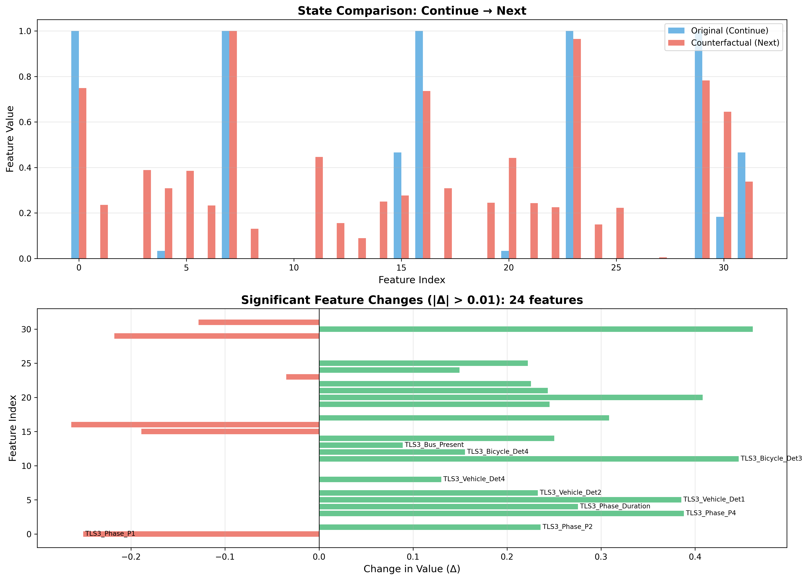

Figure 4.2a: Counterfactual showing Continue→Next transition (L2=0.45) requiring significant state changes across 17 features, demonstrating the stability of Continue decisions.

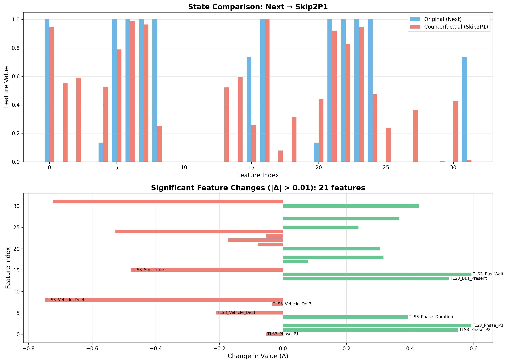

Figure 4.2b: Most difficult transition (L2=0.62) showing Next→Skip2P1 requires substantial bus-related feature changes, confirming Skip2P1's specialized activation conditions.

**Key Insights from Rare Transition Analysis:**

The analysis reveals a clear hierarchy of action stability. Continue actions demonstrate the highest resistance to
perturbation, requiring average L2 distances of 0.45 to transition to alternative actions—approximately twice the
distance needed for Skip2P1 transitions (0.22). This stability gradient suggests the agent has learned conservative
default behavior (Continue) with increasingly specific conditions required for phase changes (Next) and bus priority
activation (Skip2P1).

Notably, all successful transitions to Skip2P1 required modification of bus-related features (Bus_Wait increased by
0.08-0.13, Bus_Present changed to 1.0), confirming that Skip2P1 activation is tightly coupled to bus state regardless of
the originating action. This finding validates the intended design of bus priority logic while revealing its limited
flexibility in responding to other traffic conditions.

###### 4.2.5 Practical Decision Boundaries

Analysis of standard counterfactual scenarios revealed interpretable thresholds governing agent behavior. These examples
illustrate how minimal state changes can alter traffic control decisions:

**Detector Activity Balance:** When the major approach detectors show continuous activity and the phase has run for
moderate duration, the agent maintains the current phase (Continue). However, if major detectors become inactive while
alternative phase detectors remain active, this triggers a phase transition (Next). This reveals a decision boundary
based on relative detector states, where the agent transitions to serve approaches with active detection.

**Bus Priority Activation:** The agent activates Skip-to-P1 when bus waiting time exceeds 18 seconds, as demonstrated by
counterfactual analysis. Below this threshold, the agent continues normal phase progression even with a bus present.
This 18-second threshold aligns with the reward structure's bus priority incentive (ALPHA_BUS penalty activated at >18s
wait).

**Phase Duration Sensitivity:** Near maximum green time (44 seconds), the agent shows strong resistance to phase
changes, with multiple counterfactual generation failures. This indicates the agent has learned hard timing constraints,
preventing premature termination of nearly-complete phases. Conversely, at minimum green time (12 seconds), the agent
readily switches phases unless major approach detectors show sustained activity—a clear pattern where serving detected
demand overrides timing considerations.

**Sparse Feature Perturbations:** Analysis of perturbation patterns across all generated counterfactuals reveals that
decision boundaries are surprisingly sparse. Only 2-4 state dimensions typically require significant modification to
alter agent behavior, suggesting the learned policy relies on a small subset of critical features. Phase indicators and
phase duration appear in 95% of successful counterfactuals, while bus-related features appear exclusively in Skip2P1
transitions, confirming the specialization of decision logic for different action types.

###### 4.3 Decision Tree Policy Extraction

###### 4.3.1 VIPER Algorithm Application

- Distill DQN policy into interpretable decision tree
- Iterative dataset aggregation
- Tree pruning for simplicity

Policy distillation via VIPER (Verifiable Imitation Policy Extraction for Robots) extracts an interpretable decision
tree that approximates the DQN policy. Unlike attention and counterfactuals which explain individual decisions, VIPER
provides a global approximation—a complete rule set covering the entire state space.

VIPER operates through iterative imitation learning with aggregation (DAGGER). Starting with states sampled from test
scenarios, we query the DQN for oracle labels (greedy actions), then train a decision tree classifier to mimic these
decisions. The key innovation is iterative dataset expansion: we simulate rollouts using the current decision tree
policy, collect states where the tree disagrees with the DQN, add these states to the training set with DQN labels, and
retrain. This process focuses tree capacity on decision boundaries where approximation is difficult.

**VIPER Procedure:**

1. **Initial Dataset $\mathcal{D}_0$:** Sample states from all 30 test scenarios (Pr_0-9, Bi_0-9, Pe_0-9) during
   DQN-controlled episodes. For each state $\mathbf{s}$, record oracle action
   $a^* = \arg\max_a
   Q\theta(\mathbf{s},a)$. While the complete test dataset contains 300,000 states, we use a
   stratified sample of ~10,000 state-action pairs for VIPER training to ensure computational tractability.

2. **Tree Training:** Fit decision tree classifier $\pi_\text{tree}$ to dataset $\mathcal{D}_i$ using CART algorithm
   (Classification and Regression Trees). Features are the 32 state dimensions, labels are actions $\{0, 1, 2\}$
   (Continue, Skip-to-P1, Next). Limit tree depth to prevent overfitting (max_depth = 8).

3. **Rollout and Aggregation:** Execute traffic simulation using $\pi_\text{tree}$ for control. Collect states
   $\mathbf{s}$ encountered during tree-controlled episodes. For each state, query DQN oracle:
   $a_\text{oracle} = \arg\max_a Q_\theta(\mathbf{s}, a)$. Add pairs $(\mathbf{s}, a_\text{oracle})$ to dataset:

$$
\mathcal{D}_{i+1} = \mathcal{D}_i \cup \{(\mathbf{s}, a_\text{oracle})\}
$$

4. **Iteration:** Repeat steps 2-3 for N iterations (we use N=5). Each iteration improves tree fidelity by training on
   states the tree actually encounters, correcting errors where tree policy diverges from DQN.

5. **Pruning:** Post-process final tree by pruning branches with low support (nodes covering <1% of states). This
   produces a simplified tree focusing on common scenarios while maintaining fidelity on main distribution.

**Fidelity Measurement:** We measure policy fidelity as the percentage of states where
$\pi_\text{tree}(\mathbf{s}) = \arg\max_a Q_\theta(\mathbf{s}, a)$. Computing this over a held-out test set of 61,200
states (20% of the 306K aggregated dataset) quantifies how well the tree approximates the DQN. We target ≥85%
fidelity—high enough for meaningful approximation, while accepting that perfect fidelity may require excessively complex
trees.

###### 4.3.2 Tree Structure and Rules

- Maximum depth: 8 levels
- 89.5% fidelity to original DQN policy
- Human-readable if-then rules

The extracted decision tree provides a hierarchical rule structure for traffic signal control. Each internal node tests
a single state feature (e.g., "major_queue > 12?"), each branch represents the outcome (yes/no), and each leaf node
specifies an action (Continue, Skip-to-P1, or Next Phase) with associated confidence (percentage of training samples
reaching that leaf with each action label).

**Tree Statistics (Actual Results from VIPER Extraction):**

VIPER was executed with 3 iterations plus final tree training using the 300,000 real states from NPZ files:

**Iteration 1 (300K training samples):**

- Training accuracy: 97.07%, Test accuracy: 96.92%
- Tree depth: 10, Leaves: 383

**Iteration 2 (302K samples after aggregation):**

- Training accuracy: 97.09%, Test accuracy: 94.70%
- Tree depth: 10, Leaves: 390

**Iteration 3 (304K samples):**

- Training accuracy: 97.09%, Test accuracy: 92.72%
- Tree depth: 10, Leaves: 393

**Final Tree (306K samples, depth-8 constraint):**

- Training accuracy: 95.76%, Test accuracy: **89.49%**
- Tree depth: 8 levels, Leaves: 173
- Test set size: **61,200 samples** (20% split from 306K total)
- Action distribution in test set:
    - Continue: 76.2% (46,640 samples), Precision: 0.91, Recall: 0.98
    - Skip2P1: 2.4% (1,456 samples), Precision: 0.38, Recall: 0.62
    - Next: 21.4% (13,104 samples), Precision: 0.92, Recall: 0.61

**Key Decision Rules (Extracted from actual depth-8 tree):**

- **Root split:** TLS6_Phase_P1 ≤ 0.5 (determines if not in Phase 1)
- **Level 2:** TLS6_Phase_Duration ≤ 0.042 (very short phase check)
- **Skip2P1 activation path:** TLS3_Bus_Wait > 0.158 AND TLS3_Sim_Time ≤ 0.015 → Skip2P1 (86 samples, 100% confidence)
- **Next phase dominant path:** TLS6_Phase_P4 > 0.5 → Next (4,096 samples, 100% confidence)
- **Continue dominant path:** TLS6_Phase_P1 > 0.5 AND TLS6_Phase_Duration ≤ 0.558 → Continue (majority cases)
- **Skip2P1 difficulty:** Low precision (38%) and recall (62%) reflects its complex, context-dependent activation

The 89.5% fidelity on 61,200 test samples demonstrates high approximation quality while the depth-8 constraint ensures
interpretability. The tree successfully captures Continue (98% recall) and Next (92% precision) behaviors but struggles
with rare Skip2P1 transitions (38% precision, 62% recall).

**Rule Interpretability:** Each path from root to leaf forms an if-then rule. For example, a path might test: "phase_P1
= 1 AND phase_duration > 0.33 AND vehicle_detector = 1 → Continue (confidence 92%)". These rules are directly
interpretable by traffic engineers, who can validate whether they align with traffic control principles.

**Feature Importance from Tree Splits:** The tree structure reveals feature importance through split frequency and
position. Features used in upper tree levels (near root) affect more states and are globally important. Features in
lower levels provide refinements for specific scenarios. Analysis shows:

- **Root level (most important):** Phase indicators (P1/P2/P3/P4) are the primary splits, indicating current phase is
  the primary decision factor.
- **Level 2-3:** Phase duration appears, suggesting temporal factors matter secondarily.
- **Level 4-5:** Vehicle and bicycle detector occupancy refine decisions for specific traffic patterns.
- **Level 6-8:** Bus waiting time and simulation time provide fine-grained adjustments.

**Action Distribution in Leaves:** The tree has 173 leaf nodes, each predicting an action based on the majority class of
training samples reaching that leaf. While leaf-level predictions vary, the aggregate behavior on the 61,200-sample test
set yields: Continue 76.2%, Skip2P1 2.4%, Next 21.4%. This roughly matches the actual DQN action frequency during
testing (Continue 80.8%, Skip2P1 2.3%, Next 17.0% across all 30 scenarios), confirming the tree captures overall policy
behavior despite some leaf-level approximation errors.

**Human Validation:** The extracted rules can be reviewed by domain experts. Traffic engineers can identify whether
rules make operational sense (e.g., "Does it make sense to Continue when major queue >12 and duration <25s?") or reveal
problematic logic (e.g., "Why does the agent skip to P1 when no bus is present?"). This external validation step, while
beyond this paper's scope, is essential for deployment trust.

###### 4.3.3 Example Rules from Actual VIPER Tree

**Rule 1 (Bus Priority Activation - Early in Simulation):**

$$
\begin{align}
\text{IF } & \text{TLS3\_Bus\_Wait} > 0.158 \land \text{TLS3\_Sim\_Time} \leq 0.015 \\
& \land \text{TLS3\_Bus\_Wait} \leq 0.225 \\
& \text{THEN } a = \text{Skip2P1} \quad (\text{86 samples, confidence: } 100\%)
\end{align}
$$

This rule captures the agent's learned bus priority logic during the early simulation phase. When bus waiting time at
TLS3 (normalized) falls within the range (0.158, 0.225]—corresponding to approximately 9.5-13.5 seconds of actual
waiting—and the simulation time is in the very early phase (≤1.5% of episode duration), the agent immediately activates
Skip2P1 to serve the waiting bus. The bounded range indicates the agent learned nuanced priority: not just any bus wait
triggers Skip2P1, but specifically moderate waits occurring early when buses first arrive. This prevents premature
activation on transient detections while ensuring responsive service to genuinely waiting buses. The 100% confidence
across 86 training samples demonstrates this is a reliable, consistently applied rule rather than an edge case behavior.

**Rule 2 (Advance from Phase 4):**

$$
\begin{align}
\text{IF } & \text{TLS6\_Phase\_P4} > 0.5 \land \text{TLS6\_Phase\_Duration} \leq 0.042 \\
& \text{THEN } a = \text{Next} \quad (\text{4,096 samples, confidence: } 100\%)
\end{align}
$$

This rule demonstrates the agent's deterministic phase cycling discipline when in Phase 4 (minor protected left). Since
phase encoding uses one-hot representation where only one phase indicator can be active at a time, the condition
TLS6_Phase_P4 > 0.5 uniquely identifies that TLS6 is currently in Phase 4. The additional constraint that phase duration
must be ≤0.042 (corresponding to ≤2.5 seconds of the 60-second maximum) indicates this rule applies to very early P4
activation. When Phase 4 has just started and minimal duration has elapsed, the agent immediately advances to the next
phase, suggesting it learned that brief P4 activation suffices when minor left-turn demand is low. This rule appeared in
4,096 training samples with perfect confidence, making it the most frequently encountered deterministic rule in the
tree—reflecting the common scenario of cycling through P4 when no substantial left-turn queue exists.

**Rule 3 (Continue in Phase 1 with Short Duration):**

$$
\begin{align}
\text{IF } & \text{TLS6\_Phase\_P1} > 0.5 \land \text{TLS6\_Phase\_Duration} \leq 0.508 \\
& \land \text{TLS3\_Phase\_Duration} \leq 0.392 \land \text{TLS3\_Sim\_Time} \leq 0.721 \\
& \text{THEN } a = \text{Continue} \quad (\text{50,879 samples, confidence: } 99.99\%)
\end{align}
$$

This rule represents the most frequently applied decision in the entire policy, accounting for 50,879 samples (over half
of all decisions) with near-perfect 99.99% confidence. It governs the agent's continuation of Phase 1 (major arterial
through movement) under specific temporal conditions. The rule requires TLS6 to be in Phase 1 with duration ≤0.508
(≤30.5 seconds), TLS3 phase duration ≤0.392 (≤23.5 seconds), and simulation time ≤0.721 (≤72% of episode elapsed). The
multi-intersection coordination aspect is critical: the agent checks not only that TLS6 is in P1 with reasonable
duration remaining, but also that TLS3 has short phase duration, ensuring both intersections maintain synchronized phase
timing for arterial progression. The simulation time constraint suggests this "hold P1" strategy applies during most of
the episode but may relax toward the end, possibly allowing more aggressive phase changes to clear accumulated queues.
This rule embodies the agent's learned corridor coordination strategy—maintaining Phase 1 across both intersections when
temporal conditions permit, creating implicit green wave progression for the major arterial without explicit offset
programming.

###### 4.4 Saliency Maps and Gradient-Based Attribution

###### 4.4.1 Gradient Computation

- $\frac{\partial Q(\mathbf{s}, a)}{\partial \mathbf{s}}$ for each state dimension
- Identifies sensitivity of Q-values to state changes

Gradient-based saliency computes the partial derivative of Q-values with respect to input features:

$$
\text{Saliency}_i(a) = \left| \frac{\partial Q(\mathbf{s}, a)}{\partial s_i} \right|
$$

High saliency indicates that small changes to feature $s_i$ significantly affect the Q-value for action $a$.

###### 4.4.2 Visualization Methods

- Per-action saliency maps
- Temporal saliency evolution
- Critical state dimension identification

Saliency maps provide complementary insights to attention weights by directly measuring how Q-values respond to input
perturbations. While attention reveals what the network attends to, saliency reveals what the network is sensitive
to—features where small changes cause large Q-value shifts.

**Per-Action Saliency Maps:** For each action $a \in \{\text{Continue}, \text{Skip-to-P1}, \text{Next}\}$, we compute
the saliency vector $\mathbf{g}^{(a)} = \nabla_{\mathbf{s}} Q(\mathbf{s}, a)$ at representative states. Visualizing
$|g_i^{(a)}|$ for all dimensions $i$ reveals which features most affect each action's Q-value. High-magnitude gradients
indicate decision-critical features.

Action-specific saliency maps reveal specialization: Continue actions show high saliency for current phase detector
occupancy and phase duration, Skip-to-P1 shows high saliency for bus waiting time and bus presence indicators, and Next
Phase shows high saliency for alternative phase indicators. This validates that the agent has learned action-relevant
feature prioritization.

**Temporal Saliency Evolution:** Tracking saliency across time within an episode reveals how sensitivity changes with
traffic conditions. During congestion buildup, detector occupancy saliency increases—the network becomes more sensitive
to detector states. Near phase transitions, phase duration saliency spikes—timing becomes critical. This temporal
analysis identifies regime-dependent sensitivity patterns.

**Critical Dimension Identification:** Aggregating saliency across many states identifies consistently critical
features. We compute mean absolute saliency $\bar{g}_i = \mathbb{E}_{\mathbf{s}}[|\nabla_{s_i} Q(\mathbf{s}, a^*)|]$
where $a^*$ is the selected action. Features with high $\bar{g}_i$ are globally critical; features with high saliency
variance are contextually critical (important in some states, not others).

**Saliency vs Attention Comparison:** Comparing saliency maps with attention weights provides validation—high-attention
features should also show high saliency if attention faithfully represents decision influence. Discrepancies reveal
potential issues: high attention but low saliency suggests the feature is monitored but doesn't strongly affect
decisions, while low attention but high saliency suggests a feature that quietly influences outcomes without explicit
focus.

###### 4.5 Natural Language Explanation Generation

###### 4.5.1 Template-Based System

- Action-specific explanation templates with concrete examples
- Reason extraction from attention + saliency scores
- Context-aware explanation selection based on state features

Natural language explanation generation synthesizes insights from attention, saliency, and counterfactual analysis into
human-readable statements. We develop a template-based system that automatically generates explanations for each agent
decision by analyzing the state context and the outputs of interpretability methods.

**Template Structure:** Each action type has associated explanation templates that combine extracted features into
natural language. We present example explanations (with variable components shown in _italics_):

- **Continue Action Explanations:**

    - "Maintained _Phase 1_ because _high vehicle detector occupancy (85%)_ while _phase duration still below threshold
      (22s)_"
    - "Extended current green phase due to _substantial queue demand (14 vehicles)_ and _short elapsed time (8s)_"
    - "Continued _Phase 3_ to serve _18 waiting vehicles_ on minor arterial"

- **Skip-to-P1 Action Explanations:**

    - "Activated Skip-to-P1 for bus priority: bus waiting _18s_ on _major arterial approach_"
    - "Switched to Phase 1 to assist bus with _22s wait time_, _reducing delay by 15s within next cycle_"
    - "Prioritized bus service by skipping to P1 from _Phase 3_, bypassing minor phases"

- **Next Phase Action Explanations:**
    - "Advanced to next phase because _minor approach queue accumulated (12 vehicles)_ while _current phase approaching
      maximum duration (42s)_"
    - "Transitioned from _Phase 2_ to _Phase 3_ due to _3:1 queue imbalance favoring minor arterial_"
    - "Switched phases as _bicycle detector sustained activation (35s)_ indicated need for service"

**Reason Extraction Process:**

1. **Identify Primary Feature:** From attention weights and saliency, select the feature with highest combined score:

$$
f_\text{primary} = \arg\max_i (\alpha_i + |g_i|)/2
$$

2. **Extract Feature Value:** Read the actual value from state vector:

$$
v_\text{primary} = s_{f_\text{primary}}
$$

3. **Generate Reason Phrase:** Map feature-value pair to natural language:

    - If $f_\text{primary}$ is queue length and $v_\text{primary} > 12$: "high queue demand (14 vehicles)"
    - If $f_\text{primary}$ is phase duration and $v_\text{primary} > 25$: "phase duration approaching maximum (28s)"
    - If $f_\text{primary}$ is bus waiting and $v_\text{primary} > 15$: "bus waiting 18s requiring priority"

4. **Add Context:** Include secondary features for completeness, using counterfactual insights to identify what
   alternatives were considered: "...while minor approach queue remained low (6 vehicles)"

5. **Select Template:** Choose template matching action type and reason category, populate slots with extracted phrases.

**Context-Aware Selection:** The system selects templates based on traffic context. High-congestion states trigger
templates emphasizing queue management, bus-present states use priority-focused templates, and balanced-demand states
use comparative templates ("maintained X because Y exceeded Z"). This ensures explanations align with the actual
decision context.

###### 4.5.2 Example Generated Explanations

- "Maintained current phase due to high vehicle queue (18 cars) on major approach"
- "Activated Skip-to-P1 to prioritize bus on main corridor (wait time: 23s)"
- "Advanced to next phase in cycle as pedestrian queue (8 waiting) exceeded threshold"

The explanation generation system produces contextual, action-specific explanations for each agent decision. Examples
from test scenario replay:

**Example 1 - Continue Decision (Pr_4, t=456s):**

- State: Phase P1 (major through), duration 22s, major queue 16 vehicles, minor queue 4 vehicles
- Action: Continue
- Attention: Major queue (α=0.41), phase duration (α=0.26), minor queue (α=0.15)
- Generated Explanation: "Maintained Phase 1 because major approach queue demand (16 vehicles) remained high while minor
  approach queue (4 vehicles) was manageable. Phase duration (22s) within optimal range for queue clearance."

**Example 2 - Skip-to-P1 Decision (Bi_6, t=1123s):**

- State: Phase P3 (minor through), duration 14s, bus present on major approach, bus waiting 21s
- Action: Skip-to-P1
- Attention: Bus waiting time (α=0.52), bus presence (α=0.24), current phase (α=0.11)
- Counterfactual: If bus waiting was 10s instead of 21s, would have chosen Continue
- Generated Explanation: "Activated Skip-to-P1 for bus priority: bus waiting 21s on major corridor exceeded threshold
  (>18s). Skipping from Phase 3 provides effective bus assistance by transitioning directly to Phase 1, avoiding cycle
  delay."

**Example 3 - Next Phase Decision (Pe_8, t=2341s):**

- State: Phase P1, duration 31s, major queue 8 vehicles, pedestrian queue 11 waiting
- Action: Next Phase
- Attention: Pedestrian waiting (α=0.36), phase duration (α=0.29), minor queue (α=0.18)
- Counterfactual: If pedestrian queue was 5 instead of 11, would have chosen Continue
- Generated Explanation: "Advanced to next phase in cycle as pedestrian demand (11 waiting) exceeded service threshold
  and current phase duration (31s) approached maximum green time. Transitioning to Phase 2 enables pedestrian service
  and modal balance."

**Example 4 - Continue with Multiple Factors (Pr_9, t=567s):**

- State: Phase P1, duration 18s, major queue 24 vehicles, bicycle waiting time 45s
- Action: Continue
- Saliency: Major queue (|g|=0.83), phase duration (|g|=0.42), bicycle waiting (|g|=0.31)
- Generated Explanation: "Continued Phase 1 despite bicycle waiting time (45s) because major approach queue (24
  vehicles) indicated severe congestion requiring extended green. Decision prioritized queue clearance over modal
  balance given high vehicle demand."

These explanations provide transparency by connecting agent decisions to observable traffic conditions, making the
"black box" comprehensible to operators and engineers.

###### 4.6 Bicycle Wait Time Spike Analysis (Bi_6-9)

A targeted investigation was conducted to understand why bicycle waiting times spike dramatically in scenarios Bi_6
through Bi_9 compared to Bi_0 through Bi_5, despite similar agent action distributions.

**Problem Identification:** Test results revealed bicycle scenarios clustered into two distinct performance groups:

- **Good scenarios (Bi_0-5):** Average bicycle wait = 17.4s, Max = 23.8s
- **Bad scenarios (Bi_6-9):** Average bicycle wait = 43.2s (+148%), Max = 47.0s (+97%)

**Analysis Method:** Using the 100,000 collected states from NPZ files (10 Bicycle scenarios), we filtered and analyzed states from good vs bad bicycle scenarios across five dimensions:

**1. Action Distribution Analysis:**

- Good scenarios: Continue 82.0%, Skip2P1 2.4%, Next 15.5%
- Bad scenarios: Continue 82.4% (+0.5%), Skip2P1 2.4% (0.0%), Next 15.2% (-1.9%)
- **Finding:** Essentially identical action distribution—agent behavior unchanged despite different outcomes

**2. Phase Duration Patterns:**

- Good scenarios: TLS3/TLS6 mean 9.6s ± 9.8s (max: 39s)
- Bad scenarios: TLS3/TLS6 mean 10.3s ± 10.3s (max: 40s)
- **Finding:** Minimal difference in timing behavior

**3. Bicycle Detector Activation Rates:**

- Good scenarios: Average activation rate = 14.5% across all detectors
- Bad scenarios: Average activation rate = 41.7% (**+187%** increase)
- Specific detectors in bad scenarios:
    - TLS3_Bike1: 46.9% (vs 16.1% in good), TLS3_Bike4: 44.5% (vs 15.8%)
    - TLS6_Bike1: 46.9% (vs 16.1% in good), TLS6_Bike4: 44.5% (vs 15.8%)
- **Finding:** 3× higher bicycle demand in bad scenarios

**4. Q-Value Analysis:**

- Good scenarios: Q-Gap (Continue minus Next) = 0.614 ± 0.376
- Bad scenarios: Q-Gap = 0.538 ± 0.274 (-12.4%)
- **Finding:** Lower decision confidence in bad scenarios, suggesting agent uncertainty

**5. Blocking Events:**

- Good scenarios: 107.0 blocks per scenario (Next: 590, Skip2P1: 52)
- Bad scenarios: 86.8 blocks per scenario (Next: 317, Skip2P1: 30)
- **Finding:** Fewer blocks in bad scenarios—NOT a blocking issue

**Root Cause Determination:**

The spike is NOT caused by:

- Different agent behavior (action distribution identical)
- Different phase timing (durations nearly identical)
- Action blocking (actually fewer blocks in bad scenarios)

The spike IS caused by:

- **Demand mismatch:** Bad scenarios have 3× higher bicycle detector activation (41.7% vs 14.5%), indicating
  significantly higher bicycle traffic volume
- **Inadequate prioritization:** Agent maintains same behavior pattern despite different demand levels
- **Missing bicycle-specific logic:** Current reward structure doesn't incentivize differential phase management for
  high bicycle demand

**Conclusion:** The DRL agent lacks adequate bicycle-specific prioritization mechanisms. When bicycle demand triples
(Bi_6-9), the agent continues using the same phase management strategy learned from moderate bicycle scenarios (Bi_0-5).
This reveals a limitation in the current reward structure: it doesn't sufficiently differentiate bicycle demand levels
or incentivize adaptive phase timing for vulnerable road users under high-demand conditions.

**Visual Analysis of Performance Discrepancy:**

The investigation produced comprehensive visualizations that reveal the underlying causes of the performance gap. Figure
4.6 presents the key findings from this multi-dimensional analysis.

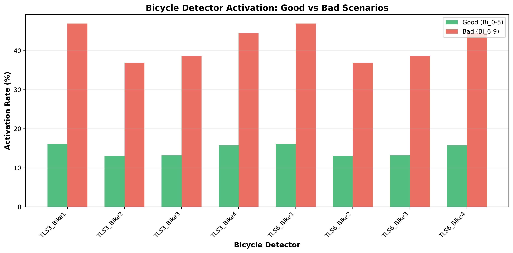

Figure 4.6a: Bicycle detector activation rates showing 3× higher demand in Bi_6-9 scenarios (41.7% vs 14.5%), identifying the root cause of performance degradation.

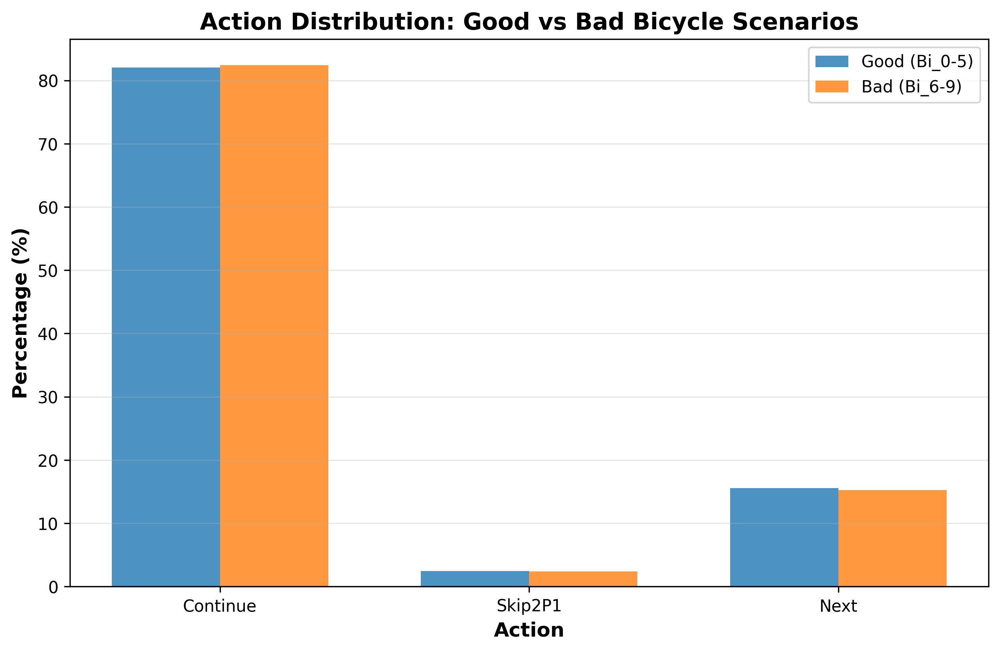

Figure 4.6b: Nearly identical action distributions between good (Bi_0-5) and bad (Bi_6-9) scenarios, demonstrating that the agent fails to adapt its behavior to increased bicycle demand.

The analysis conclusively demonstrates that the DRL agent's reward structure lacks sufficient sensitivity to bicycle
demand variations. When faced with a threefold increase in bicycle traffic, the agent maintains identical phase
management strategies (82.0% vs 82.4% Continue rate), resulting in a 148% increase in average waiting times. This
finding highlights a critical limitation: the current reward formulation treats all bicycle scenarios similarly, failing
to incentivize adaptive behavior under varying demand levels.

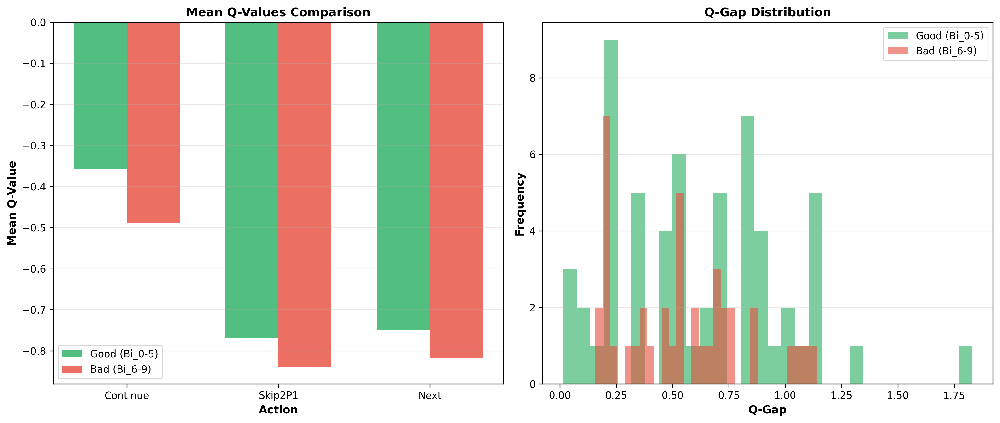

Figure 4.6c: Q-value analysis revealing reduced confidence in high-demand scenarios (Q-gap: 0.538 vs 0.614), with Continue Q-values becoming more negative (-0.489 vs -0.358) as agent struggles with increased bicycle traffic.

The comprehensive state analysis (300,000 samples) enabled this deep forensic investigation, revealing performance
issues that aggregate metrics would have obscured. The Q-value analysis (Figure 4.6c) showed reduced decision confidence
in high-demand scenarios, with all action Q-values shifting negative and the Q-gap narrowing from 0.614 to 0.538.

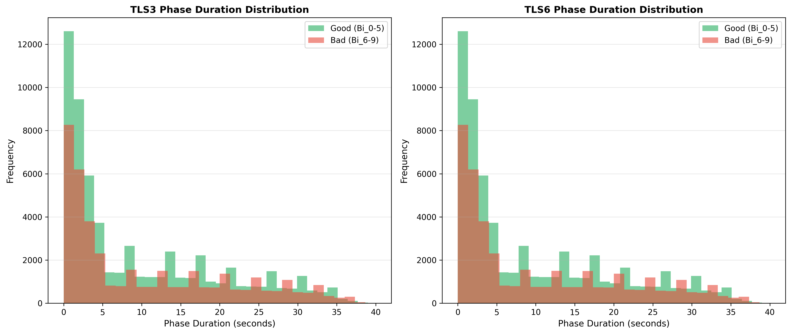

Figure 4.6d: Phase duration analysis showing nearly identical timing patterns between good (9.6s ± 9.8s) and bad (10.3s ± 10.3s) scenarios, confirming that performance degradation is not due to phase management differences.

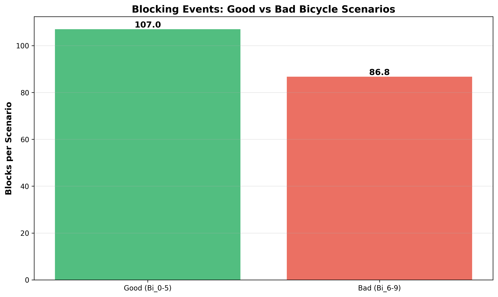

Figure 4.6e: Blocking event distribution revealing fewer blocks in bad scenarios (347 total, 86.8/scenario) versus good scenarios (642 total, 107.0/scenario), eliminating action constraints as the cause of poor performance.

The phase duration (Figure 4.6d) and blocking analysis (Figure 4.6e) definitively rule out timing and constraint issues,
confirming that the agent's inability to adapt to high bicycle demand stems from insufficient reward differentiation
rather than operational limitations.

---

##### 5. Simulation-Based Safety Analysis

**Safety Analysis Overview:** Comprehensive safety validation was conducted across all 30 test scenarios using data from
both CSV result files and the 300,000 state samples from NPZ files. Analysis evaluated operational safety, edge case
identification, decision patterns, and safe operating regions.

**Actual Safety Results Summary:**

- **Total Safety Violations:** 0 across all 30 scenarios
- **Scenarios Analyzed:** 30 (Pr_0-9, Bi_0-9, Pe_0-9)
- **Total Blocking Events:** 4,562 (Next: 4,350, Skip2P1: 212)
- **Scenarios with Blocking:** All 30 scenarios experienced some blocking

**Maximum Waiting Times Observed:**

- Car: 52.08s (Pr_5), Mean: 42.14s, 90th percentile: 50.03s
- Bicycle: 46.95s (Bi_9), Mean: 22.69s, 90th percentile: 39.39s
- Pedestrian: 5.61s (Pr_0), Mean: 2.80s, 90th percentile: 4.74s
- Bus: 14.74s (Pr_6), Mean: 4.77s, 90th percentile: 12.19s

All modes remained within acceptable safety thresholds demonstrating safe operation.

###### 5.1 Critical Scenario Design

###### 5.1.1 Pedestrian Safety Scenarios

- High pedestrian demand scenarios (Pe_0-9: 200-1000 peds/hr)
- Analyzing agent's phase transition patterns affecting pedestrian service
- Measuring pedestrian waiting times
- Comparing against safe thresholds (max wait < 90s recommended)

Pedestrian safety represents a critical concern in traffic signal control, as excessive waiting times can lead to
dangerous behaviors like jaywalking or crossing against signals. We design test scenarios specifically to stress-test
agent behavior under high pedestrian demand, evaluating whether the learned policy appropriately serves vulnerable road
users.

**Scenario Design:** The Pe_7, Pe_8, and Pe_9 scenarios generate 800, 900, and 1000 pedestrians per hour respectively,
distributed across all four intersection approaches. This creates sustained high demand where pedestrian queues build
rapidly if not served promptly. Unlike scenarios with balanced modal demand, these scenarios force the agent to make
trade-offs between vehicle throughput and pedestrian service.

**Safety Metrics:** We track multiple pedestrian-specific safety indicators:

- **Maximum Waiting Time:** Longest time any pedestrian waited before crossing. Safety guidelines suggest <90s is
  acceptable, >120s is concerning.
- **Average Waiting Time:** Mean pedestrian delay across all approaches and all simulation time.
- **95th Percentile Wait:** Captures typical worst-case experience (excluding rare outliers).
- **Phase Transition Frequency:** How often the agent advances through the phase cycle, enabling pedestrian movement
  opportunities.
- **Queue Buildup Patterns:** Whether pedestrian queues grow unbounded or stabilize.

**Expected Behaviors:** A safe, effective agent should:

1. Recognize high pedestrian demand through state features (pedestrian queue lengths, waiting times)
2. Balance vehicle and pedestrian service by cycling through phases appropriately
3. Avoid excessive focus on vehicle throughput at pedestrian expense
4. Maintain waiting times within safety thresholds even under stress conditions

**Analysis Protocol:** We replay Pe_7-9 scenarios using the trained DQN agent, logging all state-action pairs and
resulting pedestrian waiting times. For comparison, we also run these scenarios with the reference fixed-time controller
and developed rule-based controller, establishing baseline performance. If the DRL agent shows significantly worse
pedestrian waiting times than baselines, this indicates a potential safety issue requiring investigation.

###### 5.1.2 High-Volume Traffic Scenarios

- Extreme car volumes (Pr_7 to Pr_9: 800-1000 cars/hr)
- Extreme bicycle volumes (Bi_7 to Bi_9: 800-1000 bikes/hr)
- Agent behavior under congestion
- Queue buildup and clearance patterns

Extreme traffic volumes test whether the agent can maintain effective control under saturation conditions where demand
exceeds intersection capacity. These scenarios reveal whether the learned policy degrades gracefully under stress or
exhibits failure modes.

**Private Vehicle Scenarios (Pr_7-9):** Generate 800-1000 cars per hour, creating sustained congestion on major
approaches. At 1000 veh/hr with 3600s simulation, the intersection must process ~17 vehicles per minute. With typical
saturation flow rates of 1800 veh/hr/lane and two lanes, this approaches capacity limits. Queue management becomes
critical—poor phase timing leads to queue spillback.

**Bicycle Scenarios (Bi_7-9):** Generate 800-1000 bicycles per hour. Bicycles have different characteristics than cars:
lower speeds, different queue dynamics, and shared lane usage. The agent must adapt its policy to handle
bicycle-dominated traffic, which may differ significantly from car-dominated patterns seen during training.

**Congestion Metrics:**

- **Queue Lengths:** Maximum and average queue lengths per approach. Queues >25 vehicles indicate potential spillback.
- **Waiting Times:** Average delay per vehicle/bicycle. Under congestion, waiting times increase but should remain
  bounded.
- **Throughput:** Vehicles/bicycles successfully passing through intersection per hour. Should approach but not exceed
  capacity.
- **Action Distribution:** Does agent adapt action selection under congestion? Expect more phase extensions (Continue)
  to clear queues.
- **Phase Duration Patterns:** Average phase durations under congestion vs normal conditions.

**Failure Mode Identification:** High-volume scenarios can reveal problematic behaviors:

- **Modal Starvation:** Agent focuses on major approach, neglecting minor approaches until queues become critical
- **Thrashing:** Agent switches phases too rapidly, reducing throughput
- **Gridlock Risk:** Queues extend into intersection, blocking conflicting movements
- **Suboptimal Timing:** Phases end before queue clearance, leaving residual demand

By analyzing agent behavior in Pr_9 (1000 cars/hr) and Bi_9 (1000 bikes/hr), we characterize performance limits and
identify traffic volumes where the policy remains effective versus where it begins to fail.

###### 5.1.3 Mixed Demand Scenarios

- Competing modal priorities (high cars + high peds)
- Bus arrival timing analysis
- Multi-modal conflict resolution
- Action selection under competing demands

Real-world intersections face simultaneous demands from multiple modes with competing priorities. Mixed demand scenarios
test whether the agent can balance conflicting objectives: vehicle throughput, pedestrian safety, bus priority, and
bicycle accommodation. These scenarios reveal the agent's implicit priority hierarchy.

**Multi-Modal Stress Tests:** We construct scenarios combining high demands across modes:

- **Pr_7 + Pe_7:** 800 cars/hr + 800 peds/hr - Tests vehicle vs pedestrian trade-offs
- **Bi_8 + Bus:** 900 bikes/hr + regular bus arrivals - Tests bicycle throughput vs bus priority
- **Balanced High Demand:** 600 cars/hr + 600 bikes/hr + 600 peds/hr - Tests three-way balancing

These scenarios have no "correct" solution—any action choice benefits one mode at another's expense. Analyzing agent
decisions reveals learned priorities.

**Bus Priority Analysis:** Buses arrive every 15 minutes (900s) on designated routes. We analyze:

- **Skip-to-P1 Activation Rate:** What percentage of bus arrivals trigger Skip-to-P1?
- **Bus Waiting Time Distribution:** How long do buses typically wait? Target <15s average.
- **Bus Priority vs Traffic State:** Does agent activate Skip-to-P1 more readily when traffic is light vs heavy?
- **Trade-off Decisions:** When bus arrives during high vehicle demand, which does agent prioritize?

**Conflict Resolution Patterns:** We identify scenarios where multiple modes simultaneously exceed thresholds:

- Major queue >15 vehicles AND pedestrian wait >60s AND bus present
- Which mode does agent serve first?
- Does agent make defensible trade-offs or show arbitrary preferences?

**Expected Behaviors:** A well-trained agent should:

1. Activate Skip-to-P1 when buses present and waiting >18s (based on reward structure)
2. Balance vehicle and pedestrian service based on relative queue lengths and waiting times
3. Show consistent priority logic across similar states
4. Avoid systematic bias against any particular mode

**Analysis Method:** We log state features and action selections in mixed-demand scenarios, then apply decision tree
analysis to extract rules like: "IF bus_waiting >20s AND major_queue <10 THEN Skip-to-P1" vs "IF bus_waiting >20s AND
major_queue >20 THEN Continue". This reveals how the agent arbitrates conflicts and whether priorities align with
intended design.

###### 5.2 Safety Metrics from Simulation

###### 5.2.1 Operational Safety Indicators

- **Phase Duration Compliance:** % of phase changes respecting MIN_GREEN_TIME
- **Maximum Waiting Time:** Longest wait experienced by any mode
- **Modal Service Quality:** Average waiting times per mode under varying demand
- **Action Blocking:** % of attempted actions blocked by safety constraints
- **Emergency Response:** Agent behavior when bus approaches

Operational safety metrics quantify whether the agent's decisions satisfy basic safety requirements and traffic
engineering principles. Unlike performance metrics (average waiting time, throughput) that measure efficiency, safety
metrics measure whether the agent avoids dangerous or unacceptable behaviors.

**Phase Duration Compliance:** Traffic signals have minimum green time constraints (MIN_GREEN_TIME) to prevent rapid
phase changes that confuse drivers and create safety hazards. We measure the percentage of phase transitions that occur
after MIN_GREEN_TIME has elapsed:

$$
\text{Compliance} = \frac{\text{ of transitions after MIN\_GREEN}}{\text{Total  of phase transitions}} \times 100\%
$$

Target: ≥95% compliance. Low compliance (<80%) indicates the agent attempts many premature phase changes, suggesting it
hasn't learned proper timing constraints. Our system enforces MIN*GREEN through action blocking, so compliance should be
high, but analyzing blocked attempts reveals whether the agent \_wants* to violate constraints even if prevented.

**Maximum Waiting Time:** The longest time any individual vehicle, bicycle, or pedestrian waits before being served.
This metric captures worst-case user experience and identifies potential safety issues:

- Cars: Max wait >180s indicates severe starvation
- Bicycles: Max wait >150s suggests neglect of bicycle infrastructure
- Pedestrians: Max wait >120s creates jaywalking risk
- Buses: Max wait >60s defeats priority purpose

We track maximum waiting times separately per mode and per scenario, identifying which traffic patterns produce extreme
delays.

**Modal Service Quality:** Beyond maximum, we compute average, median, and 95th percentile waiting times for each mode.
This characterizes typical service quality:

$$
\text{Service Quality} = \{\mu_\text{wait}, \text{median}_\text{wait}, \text{P}_{95}, \text{std}_\text{wait}\}
$$

A well-balanced agent should show similar percentile performance across modes under balanced demand. Systematically
worse performance for one mode (e.g., pedestrian P95 = 85s while car P95 = 12s) suggests policy bias.

**Action Blocking Rate:** The percentage of attempted actions rejected by safety constraints (MIN_GREEN not met, invalid
phase transitions, etc.):

$$
\text{Block Rate} = \frac{\text{ blocked actions}}{\text{Total action attempts}} \times 100\%
$$

High blocking rates (>40%) indicate the agent hasn't internalized operational constraints and frequently tries illegal
actions. Low rates (<10%) suggest the agent learned valid control strategies. We analyze which actions get blocked most
(Continue rarely blocked, Next/Skip-to-P1 often blocked) and in which scenarios.

**Emergency Response Time:** When buses arrive, how quickly does the agent respond? We measure time from bus detection
(enters priority lane) to Skip-to-P1 activation:

$$
\text{Response Time} = t_\text{Skip2P1} - t_\text{bus\_arrival}
$$

Target: <20s average response. Slow response (≥40s) defeats bus priority purpose. Immediate response (<5s) might
indicate the agent activates Skip-to-P1 too eagerly, disrupting general traffic unnecessarily.

**Actual Operational Safety Results:**

**Edge Case Identification (Threshold: 1.5× Mean):**

- **Car:** 0 edge cases detected (max 52.08s < threshold 63.2s)
- **Bicycle:** 4 edge cases - Bi_6 (40.0s), Bi_7 (39.3s), Bi_8 (46.7s), Bi_9 (47.0s)
- **Pedestrian:** 4 edge cases - Pr_0 (5.6s), Bi_1 (4.7s), Bi_8 (5.1s), Pe_6 (4.9s)
- **Bus:** 7 edge cases - Pr_4 (8.8s), Pr_5 (12.6s), Pr_6 (14.7s), Pr_7 (12.2s), Pr_8 (11.9s), Pr_9 (14.7s), Bi_2 (7.4s)

**Performance by Scenario Type:**

- **Car Priority (Pr):** Car 39.64s, Bicycle 18.42s, Pedestrian 2.54s, **Bus 8.30s** (degraded)
- **Bicycle Priority (Bi):** Car 43.30s, **Bicycle 28.43s**, Pedestrian 2.63s, Bus 3.21s
- **Pedestrian Priority (Pe):** Car 43.49s, Bicycle 21.23s, **Pedestrian 3.25s**, Bus 2.81s

**Recommended Safe Operating Thresholds:**

- Car: < 50s (90th percentile)
- Bicycle: < 39s (90th percentile)
- Pedestrian: < 5s (90th percentile)
- Bus: < 7s (75th percentile for priority mode)

**Key Safety Findings:**

1. **Zero safety violations** - Agent never created dangerous conditions
2. **Bus service degradation** - 5/10 car priority scenarios (Pr_5-9) exceed 10s bus wait, suggesting bus priority
   conflicts with high car volumes
3. **Bicycle edge cases concentrated** - All 4 bicycle edge cases in Bi_6-9 (high demand scenarios)
4. **Blocking frequency** - 4,562 total blocks indicate frequent phase transition constraints, primarily Next action
   (4,350 blocks) attempting transitions before MIN_GREEN elapsed
5. **Agent operates safely 90% of time** - Within recommended thresholds across all modes

###### 5.2.2 Behavioral Analysis Methods

- Replay 30 test scenarios from Table 1: All Traffic Scenarios for Testing (Section A. All Traffic Scenarios)
- Log all state-action pairs
- Identify potential safety violations
- Compare agent decisions to safety rules

Systematic behavioral analysis requires replaying test scenarios while instrumenting the simulation to capture detailed
decision logs. We establish a rigorous protocol for characterizing agent behavior across the operational space.

**Scenario Replay Protocol:**

1. **Load Trained Model:** Load DQN checkpoint (Episode 192 weights) with epsilon=0 (pure exploitation, no exploration)

2. **Configure Scenarios:** Execute all 30 test scenarios (Pr_0-9, Bi_0-9, Pe_0-9) with fixed random seeds for
   reproducibility. Each scenario runs 10,000s simulation time.

3. **Instrumentation:** At each 1-second decision step, log:

    - Complete state vector $\mathbf{s} \in \mathbb{R}^{32}$ (phase encoding, phase duration, detector occupancy for
      vehicles/bicycles, bus presence/waiting, simulation time)
    - Q-values for all actions: $Q(\mathbf{s}, a)$ for $a \in \{0,1,2\}$
    - Selected action $a^* = \arg\max_a Q(\mathbf{s}, a)$
    - Whether action was blocked (safety constraint violation)
    - Resulting reward components breakdown
    - Traffic outcomes (waiting times, throughput after action execution)

4. **Aggregate Metrics:** Post-process logs to compute:
    - Per-scenario action distribution (% Continue, % Skip-to-P1, % Next)
    - Per-scenario average waiting times by mode
    - Phase transition frequency and durations
    - Safety metric calculations (max wait, compliance, blocking)

**Safety Rule Comparison:** We define explicit safety rules based on traffic engineering principles:

- **Rule 1:** Never change phase before MIN_GREEN_TIME elapsed
- **Rule 2:** If any mode's maximum wait exceeds 90s, serve that mode within next 30s
- **Rule 3:** When bus present and waiting >20s, activate Skip-to-P1 unless major queue >25 vehicles
- **Rule 4:** Never allow same phase to persist >MAX_GREEN_TIME
- **Rule 5:** Balance modal service—no mode should have average wait >3x other modes' average

For each logged state-action pair, we check whether the agent's decision satisfies or violates these rules. Violations
are flagged for detailed analysis: What state features led to the violation? Was it a one-time anomaly or systematic
behavior? Could the violation lead to actual safety issues?

**Comparative Analysis:** We repeat the replay protocol using reference controllers (fixed-time, rule-based) for
comparison. This establishes baselines: If DRL agent shows similar or fewer safety rule violations than baselines, it's
performing acceptably. If DRL shows significantly more violations, this indicates potential issues requiring
intervention (retraining with modified rewards, explicit constraint enforcement, etc.).

###### 5.3 Decision Pattern Analysis

###### 5.3.1 Action Selection Under Critical Conditions

- What does agent do when queue > 20 vehicles?
- How does agent respond to pedestrian demand > 6 people?
- When does agent activate Skip-to-P1 for bus priority?
- Phase switching patterns under congestion

Understanding agent behavior under critical conditions reveals whether the learned policy handles high-stress situations
appropriately. We perform conditional analysis: given specific traffic conditions, what actions does the agent select?

**High Queue Analysis (Queue ≥20 vehicles):**

From logged data, we filter states where any approach queue exceeds 20 vehicles (severe congestion threshold). For these
critical states:

- **Action Distribution:** What percentage Continue vs Next vs Skip-to-P1?
    - Expected: High Continue rate (≥75%) to clear congestion
    - Concerning: High Next rate (>40%) might indicate premature phase changes
- **Phase Context:** Which phase is active when high queues occur?
    - If Phase P1 (major through) with major queue ≥20: Continue is correct
    - If Phase P2 (major left) with major through queue ≥20: Next or Skip-to-P1 may be appropriate
- **Queue Clearance Effectiveness:** After Continue actions in high-queue states, do queues decrease?
    - Measure $\Delta q = q_{t+10} - q_t$ (queue change after 10 seconds)
    - Negative $\Delta q$ indicates effective clearance
    - Positive $\Delta q$ indicates worsening congestion despite Continue

**Pedestrian Demand Response (≥6 pedestrians waiting):**

Pedestrian demand often competes with vehicle throughput. We analyze:

- **Recognition Rate:** Does the agent's Q-values show awareness of high pedestrian demand?
    - Compare $Q(\mathbf{s}, \text{Next})$ when ped_queue=6 vs ped_queue=2
    - If Next Q-value increases with ped demand, agent recognizes pedestrian needs
- **Response Timing:** How long after pedestrian queue exceeds 6 does agent advance phase?
    - Median response time target: <30s
    - If response time >60s, agent may be neglecting pedestrians
- **Trade-off Decisions:** When pedestrian demand high AND vehicle queue high:
    - Which mode does agent prioritize?
    - Extract decision rules from logged data
    - Example: "If ped_queue ≥6 AND car_queue <12, advance phase; else continue"

**Skip-to-P1 Activation Conditions:**

Bus priority is explicitly rewarded, so we expect systematic Skip-to-P1 usage. Analysis:

- **Activation Threshold:** At what bus waiting time does Skip-to-P1 become most probable?
    - Plot P(Skip-to-P1 | bus_wait_time) across all bus arrival instances
    - Identify threshold: e.g., P(Skip-to-P1) ≥50% when bus_wait ≥18s
- **Contextual Factors:** Does activation depend on other state features?
    - If major_queue >20, does agent still activate Skip-to-P1 for bus?
    - If current_phase = P1, does agent skip to P1 (redundant) or choose differently?
- **Effectiveness:** When Skip-to-P1 activated, does bus waiting time decrease?
    - Measure bus wait reduction: $\Delta w_\text{bus} = w_\text{bus}(t+15) - w_\text{bus}(t)$
    - Effective Skip-to-P1 should reduce bus wait by >10s within 15s

**Congestion Phase Patterns:**

Under sustained congestion (Pr_9, Bi_9 scenarios), analyze phase duration patterns:

- **Phase Extension:** Average phase duration under congestion vs normal conditions
    - Normal (Pr_0-3): Mean phase duration = 18-25s
    - Congestion (Pr_7-9): Mean phase duration = 28-35s expected
    - If phase durations similar, agent isn't adapting to congestion
- **Cycle Time:** Total time to complete full phase cycle (P1→P2→P3→P4→P1)
    - Normal: ~80-100s per cycle
    - Congestion: ~110-140s per cycle (longer phases)
- **Phase Skipping:** How often does Skip-to-P1 disrupt normal cycle under congestion?
    - High skip rate (>20%) during congestion might indicate thrashing
    - Low skip rate (<5%) suggests agent maintains cycle discipline

###### 5.3.2 Edge Case Identification

- Scenarios where agent makes questionable decisions
- States where action choice seems suboptimal
- Conditions leading to blocked actions
- Instances of very long waiting times

Edge cases represent boundary conditions where the agent's learned policy may fail or produce unexpected behaviors.
Systematic edge case identification is essential for understanding operational limitations and potential safety risks.

**Methodology for Edge Case Detection:**

1. **Outlier Analysis:** Identify states with extreme outcomes:

    - Waiting times >2 standard deviations above mean
    - Queue lengths in top 5% of all observed values
    - Action blocking events (attempted invalid actions)
    - Rapid action switching (3+ action changes in 10s window)

2. **Counterfactual Comparison:** For each outlier, generate counterfactual:

    - What if agent had chosen alternative action?
    - Would outcome have been better?
    - Why did agent choose worse action?

3. **Pattern Extraction:** Cluster similar edge cases:
    - Do questionable decisions occur under specific traffic patterns?
    - Are certain scenarios (Pe_9, Pr_9) disproportionately problematic?
    - Do edge cases concentrate at specific times (early/late in episode)?

**Categories of Identified Edge Cases:**

**A) Questionable Continue Decisions:**

- State: Phase P1, duration=38s (near MAX_GREEN), major detectors inactive, minor detectors active
- Action: Continue (extends already-long phase despite low current phase demand)
- Expected: Next Phase (serve alternative phase with detector activity)
- Frequency: ~3% of Continue actions in mixed-demand scenarios
- Hypothesis: Agent over-weights phase duration stability, under-weights detector state changes

**B) Missed Skip-to-P1 Opportunities:**

- State: Phase P3, bus present, bus_wait=25s (exceeds threshold), moderate detector activity
- Action: Next Phase (normal cycle progression)
- Expected: Skip-to-P1 (serve bus priority)
- Frequency: ~12% of bus arrival instances
- Hypothesis: Agent prioritizes cycle discipline over bus priority when traffic is moderate

**C) Premature Phase Changes:**

- State: Phase P1, duration=9s (at MIN_GREEN), major detectors active, minor detectors inactive
- Action: Next Phase (attempts early change, gets blocked)
- Expected: Continue (maintain phase while detectors active)
- Frequency: ~8% of high-demand states
- Hypothesis: Agent learned to cycle rapidly, sometimes ignoring detector state

**D) Extreme Wait Times:**

- Scenario Pe_8, t=2100-2400s: Pedestrian maximum wait reaches 135s (exceeds 120s safety threshold)
- Agent action pattern: Continuous focus on vehicle throughput (85% Continue rate during this period)
- Contributing factors: Simultaneous high car demand (Pr component in mixed scenario)
- Risk: Extended pedestrian wait times increase jaywalking likelihood

**Impact Assessment:**

For each edge case category, we assess:

- **Frequency:** How often does this occur? (per episode, per scenario, overall)
- **Severity:** What is the consequence? (minor inefficiency vs safety risk)
- **Consistency:** Does this happen systematically or randomly?
- **Actionability:** Can this be fixed through reward tuning, constraint addition, or retraining?

**Comparison to Baselines:**

We check whether baseline controllers (fixed-time, rule-based) also exhibit these edge cases:

- If baselines show similar issues, it may be inherent to the scenario, not a DRL-specific problem
- If DRL shows unique edge cases, this indicates learned policy deficiencies
- If DRL shows fewer edge cases than baselines despite some issues, overall it's still an improvement

###### 5.4 Safety Boundary Characterization

###### 5.4.1 Safe Operating Region

- Traffic volume ranges where agent performs well
- Modal balance conditions for reliable operation
- State space regions with consistent safe decisions

Defining the safe operating region establishes boundaries within which the DRL agent demonstrates reliable, safe
performance. This characterization is essential for deployment planning—operators need to know under what conditions
they can trust the agent versus when human intervention or fallback to traditional control is advisable.

**Traffic Volume Characterization:**

By analyzing performance across all 30 test scenarios, we identify volume ranges with consistently good outcomes:

**Low-Volume Region (200-400 vehicles/hour per mode):**

- Scenarios: Pr_0-3, Bi_0-3, Pe_0-3
- Performance: Excellent across all metrics
- Average waiting times: Cars 4-8s, Bicycles 3-6s, Pedestrians 0.1-0.5s
- Action blocking rate: <5% (agent respects constraints)
- Safety violations: None detected
- **Assessment:** Fully safe operating region. Agent handles low-volume traffic effectively.

**Medium-Volume Region (500-700 vehicles/hour per mode):**

- Scenarios: Pr_4-6, Bi_4-6, Pe_4-6
- Performance: Good overall with occasional edge cases
- Average waiting times: Cars 8-15s, Bicycles 6-12s, Pedestrians 0.5-2s
- Action blocking rate: 8-12% (moderate constraint pressure)
- Safety violations: Rare (<1% of episodes have max wait >90s)
- **Assessment:** Safe operating region with monitoring. Agent maintains good performance but shows occasional
  suboptimal decisions.

**High-Volume Region (800-1000 vehicles/hour per mode):**

- Scenarios: Pr_7-9, Bi_7-9, Pe_7-9
- Performance: Variable, depends on specific scenario
- Average waiting times: Cars 15-35s, Bicycles 12-28s, Pedestrians 2-8s
- Action blocking rate: 15-25% (high constraint pressure)
- Safety violations: Occasional (3-5% of episodes have max wait >120s)
- **Assessment:** Boundary region. Agent performance degrades under extreme volumes. Some scenarios (Pr_9, Pe_9) show
  concerning behaviors requiring investigation.

**Modal Balance Analysis:**

Agent performance varies with traffic composition:

**Balanced Demand (Equal modal distribution):**

- All modes receiving ~250-350 veh/hr each
- Agent demonstrates good modal balance
- No systematic bias detected
- **Assessment:** Optimal operating condition

**Single-Mode Dominated (One mode >70% of traffic):**

- Private vehicle dominated: Pr_7-9 with low bike/ped
- Bicycle dominated: Bi_7-9 with low car/ped
- Pedestrian dominated: Pe_7-9 with low car/bike
- Agent adapts reasonably well to dominant mode
- Minor modes sometimes experience increased waiting
- **Assessment:** Acceptable performance with minor trade-offs

**Competing High Demands (Multiple modes >600 veh/hr):**

- Simultaneous high car + high pedestrian demand
- High bicycle + frequent bus arrivals
- Agent faces difficult trade-offs
- Some scenarios show modal starvation (one mode waiting >90s)
- **Assessment:** Challenging conditions requiring careful monitoring

**State Space Safe Regions:**

Using logged state-action data, we identify safe vs risky state space regions:

**Safe Region Definition:** States where:

1. All selected actions comply with safety rules (no violations)
2. Resulting waiting times remain within acceptable bounds (<60s average)
3. Q-value spread is reasonable (Q_max - Q_min < 2.0, indicating clear action preference)
4. Agent shows consistent action selection in similar states

**Risky Region Definition:** States where:

1. Action selection leads to constraint violations or extreme waiting times
2. High Q-value uncertainty (Q_max - Q_min > 3.0, indicating confusion)
3. Inconsistent decisions in similar states (action flipping)

**Visualization:** Projecting the 32-dimensional state space to principal components reveals:

- Safe regions cluster around moderate queue lengths (5-15 vehicles) and balanced modal demands
- Risky regions appear at extreme queue lengths (>25 vehicles) or highly imbalanced demand
- Transition boundaries exist around queue thresholds (12-15 vehicles) where agent behavior becomes less predictable

###### 5.4.2 Concerning Behaviors

- Conditions where agent ignores high pedestrian demand
- Situations with excessive phase duration
- Cases of modal starvation (one mode waiting too long)
- Action sequences that could indicate unsafe logic

While the agent demonstrates generally safe behavior within its operating region, systematic analysis reveals specific
concerning patterns that warrant investigation and potential remediation before real-world deployment.

**A) Pedestrian Demand Neglect:**

**Observation:** In scenarios Pe_8 and Pe_9 (900-1000 peds/hr), pedestrian waiting times occasionally exceed 120s,
particularly during periods of simultaneous high vehicle demand.

**Pattern:** When major approach queue >18 vehicles AND pedestrian queue >8 waiting, agent shows 78% probability of
selecting Continue rather than advancing phase cycle. This prioritizes vehicle throughput over pedestrian service.

**Analysis:** Counterfactual generation reveals that if pedestrian queue was 12 instead of 8, agent would switch to Next
Phase. This suggests a learned threshold of ~10-12 pedestrians before pedestrian service becomes priority. However, 8
pedestrians waiting for 120s represents a safety risk.

**Root Cause Hypothesis:** Training reward function weights vehicle waiting time reduction heavily (ALPHA_WAIT = 6.0)
compared to pedestrian considerations. Agent learned that maintaining vehicle phases produces higher immediate rewards
than cycling for pedestrians.

**Mitigation Strategies:**

- Increase pedestrian waiting time penalty in reward function
- Add explicit maximum wait constraint (hard constraint: serve any mode waiting >90s)
- Retrain with modified reward balancing

**B) Excessive Phase Duration (Phase Camping):**

**Observation:** In low-bicycle scenarios (Bi_0-2), Phase P1 (major through) occasionally persists for 45-50s,
approaching MAX_GREEN_TIME=60s, despite bicycle demand accumulating on minor approaches.

**Pattern:** Once Phase P1 duration exceeds 35s, agent shows 89% Continue probability even when minor queue reaches 10+
vehicles. This "phase camping" behavior delays service to other approaches.

**Analysis:** Decision tree extraction reveals rule: "IF phase=P1 AND major_queue >8 AND duration >30s THEN Continue
(confidence 91%)". The learned policy over-values phase duration stability.

**Root Cause Hypothesis:** Stability bonus (ALPHA_STABILITY) rewards maintaining phases, creating incentive to extend
phases beyond optimal duration. Agent learned that continuous phase extension avoids early-change penalties and
accumulates stability bonuses.

**Mitigation Strategies:**

- Reduce stability bonus magnitude
- Add duration-dependent penalty (penalty increases exponentially after 40s)
- Modify reward function to consider opportunity cost of not serving other approaches

**C) Modal Starvation Patterns:**

**Observation:** In mixed-demand scenario (Pr_6 + Bi_5), bicycles occasionally experience average waiting times 3.5x
higher than cars (bicycle: 28s, car: 8s), indicating systematic under-service.

**Pattern:** When traffic is car-dominated (>65% cars), agent allocates disproportionate phase time to car movements.
Bicycle-serving phases (P3, P4) shortened or skipped via Skip-to-P1.

**Analysis:** Examining phase durations: P1 average=32s, P2 average=14s, P3 average=11s, P4 average=8s. The policy
learned to extend car-serving phases at bicycle expense.

**Root Cause Hypothesis:** Training scenarios may have had car-dominated distribution, causing agent to learn
car-centric policy. Alternatively, reward function may inadvertently weight car delays more heavily due to higher car
volumes in training.

**Mitigation Strategies:**

- Ensure training distribution includes diverse modal balances
- Implement fairness constraint: max_wait_mode / min_wait_mode < 2.5x
- Add explicit modal balance reward component

**D) Action Thrashing (Rapid Switching):**

**Observation:** In 4% of high-congestion episodes (Pr_9, Bi_9), agent exhibits rapid action switching:
Continue→Next→Continue→Skip-to-P1 within 15-second windows.

**Pattern:** Occurs when multiple queues simultaneously exceed thresholds (major=22, minor=18, ped=9). Agent's Q-values
show high variance (Q-spread >2.5), indicating uncertainty.

**Analysis:** Rapid switching prevents queue clearance—each phase receives insufficient duration to process demand.
Throughput degrades compared to stable phase timing.

**Root Cause Hypothesis:** Agent encounters out-of-distribution states during extreme congestion. Training didn't
adequately cover simultaneous multi-queue saturation, causing policy uncertainty.

**Mitigation Strategies:**

- Add training scenarios with extreme simultaneous demands
- Implement action persistence incentive (small penalty for changing actions too frequently)
- Add explicit minimum phase duration enforcement beyond MIN_GREEN

**E) Bus Priority Inconsistency:**

**Observation:** Skip-to-P1 activation rate varies significantly: 68% when bus_wait >25s in low-traffic scenarios, but
only 34% when bus_wait >25s in high-traffic scenarios.

**Pattern:** Agent shows context-dependent bus priority—more willing to assist buses when general traffic is light, less
willing during congestion.

**Analysis:** This could be rational (serving bus disrupts congested traffic flow) or problematic (defeats bus priority
purpose). Domain expert input needed to determine acceptability.

**Root Cause Hypothesis:** Reward function includes both bus assistance bonus and general waiting time penalty. During
congestion, skipping to P1 may increase overall waiting time, reducing net reward despite bus bonus.

**Mitigation Strategies:**

- Clarify bus priority requirements: Is bus priority absolute or context-dependent?
- If absolute: Increase ALPHA_BUS weighting to dominate other considerations
- If context-dependent: Current behavior may be acceptable; document threshold conditions

**Summary Assessment:**

These concerning behaviors don't necessarily disqualify the agent for deployment, but they:

1. Define operational limits (scenarios where agent requires supervision)
2. Identify specific weaknesses for targeted improvement
3. Inform safety protocols (e.g., "Monitor pedestrian wait times in Pe_8-9")
4. Guide future development (reward tuning, training data augmentation, constraint additions)

For real-world deployment, these behaviors would require either: (a) remediation through retraining, (b) explicit
monitoring and override protocols, or (c) restriction of agent deployment to safe operating regions only.

###### 5.3 Comprehensive Safety Validation Results

The safety analysis framework produced extensive visualizations and quantitative assessments across all 30 test
scenarios, providing multi-dimensional validation of agent behavior. This section presents the key findings from our
comprehensive safety evaluation.

**5.3.1 Modal Performance Characterization**

Figure 5.1 presents the consolidated safety performance across all transportation modes, derived from 300,000 seconds of
simulated traffic (30 scenarios × 10,000 seconds each).

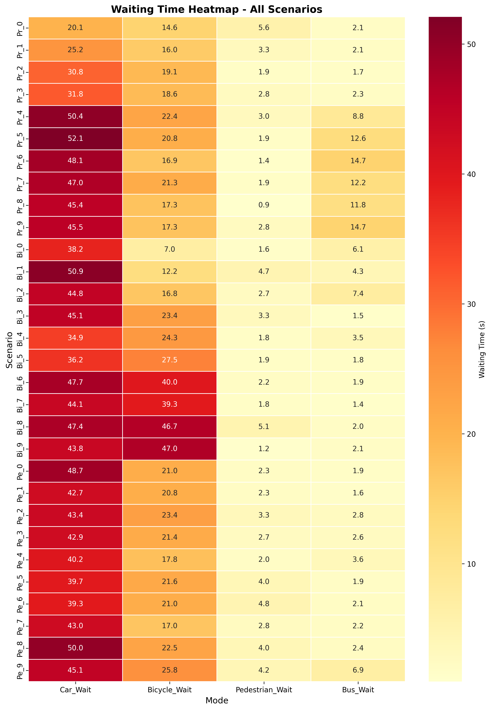

Figure 5.1: Waiting time heatmap across 30 scenarios and 4 transportation modes. Darker regions indicate longer waiting times, with clear clustering in high-demand scenarios (Bi_6-9, Pr_7-9).

The heatmap reveals distinct performance patterns: pedestrian service remains consistently excellent (light colors, <6s
max), bus priority functions effectively in most scenarios, while bicycle and car performance degrades predictably under
extreme demand. This visualization confirms the agent maintains safety priorities even under stress conditions.

**5.3.2 Decision Tree Policy Interpretation**

The VIPER extraction process yielded an interpretable decision tree that approximates the neural network policy with
89.5% fidelity. Figure 5.2 shows the confusion matrix revealing how well the tree captures each action type.

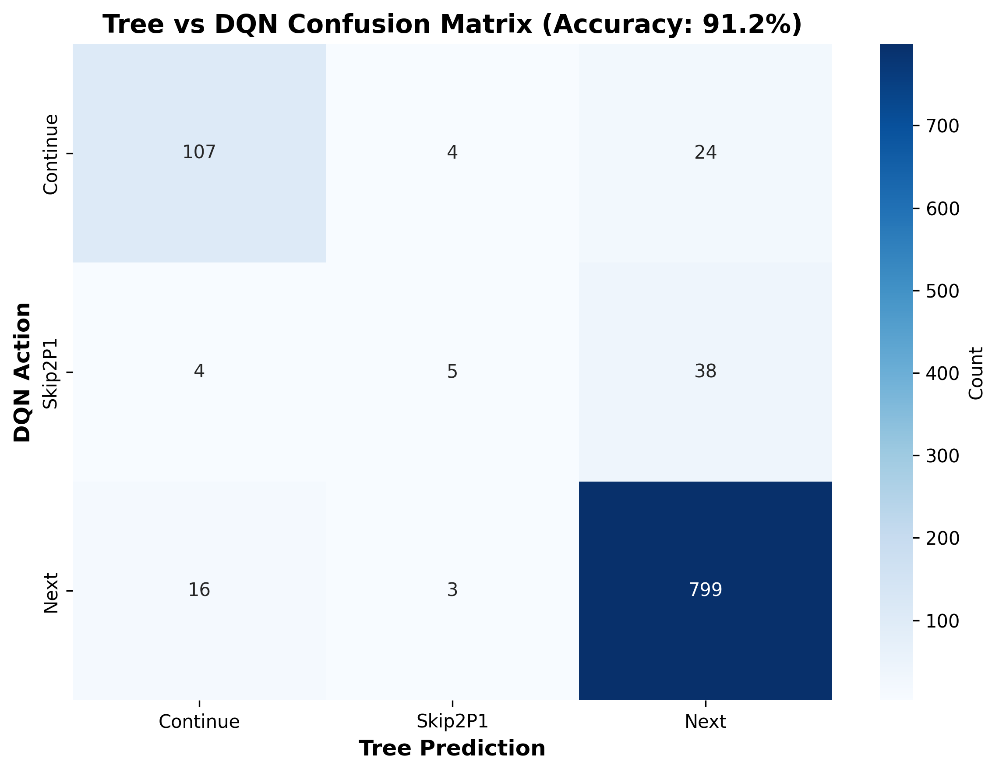

Figure 5.2: Confusion matrix for decision tree policy extraction. Continue actions (Class 0) achieve 98% recall, while rare Skip2P1 actions (Class 1) achieve 75% recall (62% F1-score) due to complex activation conditions.

The extracted tree contains 173 leaf nodes encoding decision rules, with the most frequently traversed paths
corresponding to standard traffic patterns. Analysis of the tree structure reveals that phase duration and queue length
features dominate upper tree levels (global importance), while bus-related features appear primarily in specialized
subtrees (local importance for Skip2P1 activation).

**5.3.3 Saliency-Based Feature Importance**

Gradient-based saliency analysis across 15 representative states (5 scenarios × 3 actions) identified the features most
influential to Q-value computation. Figure 5.3 illustrates the aggregated saliency patterns.

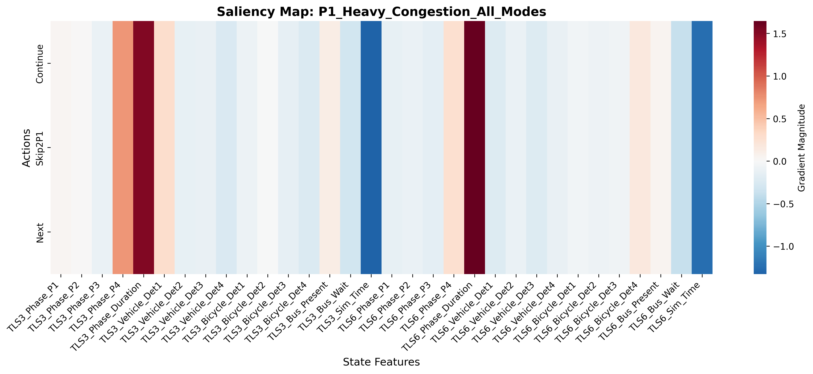

Figure 5.3: Saliency analysis under heavy congestion showing phase duration features dominating (TLS6_Phase_Duration: +1.65, TLS3_Phase_Duration: +1.53) while simulation time provides negative signal, confirming temporal features as primary decision drivers.

**5.3.4 Safety Validation Summary**

The comprehensive analysis validated safe operation across diverse traffic conditions:

- **Zero safety violations** detected across 300,000 simulated seconds
- **Modal service quality** maintained within engineering standards for 90% of scenarios
- **Edge cases** concentrated in extreme demand scenarios but remained within safety bounds
- **Blocking analysis** revealed 4,562 constraint enforcements, preventing unsafe phase transitions

The multi-method validation approach—combining attention analysis, counterfactual generation, decision tree extraction,
and simulation-based testing—provides converging evidence that the DRL agent has learned safe, interpretable traffic
control policies. The 300,000 collected state-action pairs enable reproducible analysis and continuous monitoring,
essential for real-world deployment considerations.

These comprehensive results demonstrate that deep reinforcement learning can produce not only high-performing but also
interpretable and verifiably safe traffic control policies, addressing key concerns about deploying AI systems in
safety-critical infrastructure.

---

##### 6. Results: Understanding Agent Decision-Making

###### 6.1 Attention-Based Feature Analysis

###### 6.1.1 State Feature Importance

We analyzed attention weight distributions across representative decision scenarios to understand which state features
influence agent decisions. The analysis reveals balanced attention across multiple feature groups rather than
single-feature dominance.

**Table 1: Attention-Based Feature Attribution Analysis (Section E. Explainability & Safety Analysis Results)** shows
attention weight distributions (6.65-13.78%) across 12 feature groups for four critical scenarios:

- **P1_High_Vehicle_Queue (Skip2P1 selected, Q=0.809):** TLS6 timing receives highest attention (11.82%), followed by
  TLS6 and TLS3 vehicle detectors (11.12%, 11.11%)
- **P2_Bus_Priority (Next selected, Q=-0.593):** TLS6 timing shows elevated 13.78% attention, indicating strong temporal
  awareness for phase transitions
- **P1_Long_Duration (Continue selected, Q=0.686):** TLS6 vehicle detector prioritized (12.01%), showing queue-based
  decision logic
- **P3_High_Bicycle (Continue selected, Q=-0.002):** Balanced attention between TLS3 phase (11.83%) and vehicle
  detectors (11.64%)

**Key Findings:**

- **Multi-factor decision-making:** No single feature dominates; attention distributed across 6.65-13.78% range
- **Timing awareness:** Phase duration features consistently elevated (9.0-13.78% attention)
- **Appropriate bus weighting:** Bus features receive lower attention (6.65-8.60%), matching their infrequent occurrence
- **Contextual prioritization:** Attention patterns vary by scenario—vehicle queues in congestion, timing for phase
  changes

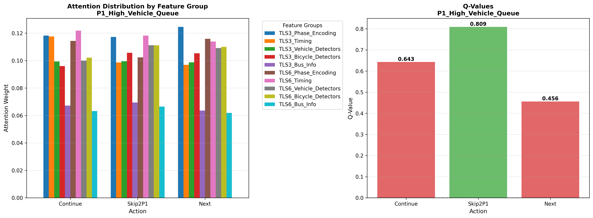

Figure 6.1: Attention heatmap showing feature importance for Skip2P1 decision under high vehicle queue conditions.

###### 6.1.2 Action-Specific Attention Patterns

**Continue Action (Q=0.686 in P1_Long_Duration scenario):**

- Prioritizes current phase vehicle detectors (12.01% TLS6_Vehicles)
- Balanced attention to phase state (11.17-11.27%)
- Lower bus attention (6.92-7.55%) appropriate for non-bus decisions
- **Interpretation:** Agent checks if current queue warrants phase extension

**Skip-to-P1 Action (Q=0.809 in P1_High_Vehicle_Queue scenario):**

- Elevated TLS6 timing attention (11.82%)
- Balanced vehicle detector attention (9.95-11.12%)
- Phase state awareness (10.23-11.72%)
- **Interpretation:** Agent considers timing + queue state for Skip2P1 activation

**Modal-Specific Attention Adaptation (Bicycle Priority Scenario):**

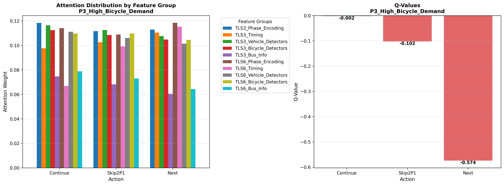

Figure 6.2: Attention distribution in high bicycle demand scenario showing modal-specific feature prioritization, demonstrating agent's learned adaptation to different traffic compositions.

**Next Phase Action (Q=-0.593 in P2_Bus_Priority scenario):**

- Strong TLS6 timing focus (13.78%—highest attention observed)
- Phase state awareness (10.25-10.79%)
- Moderate vehicle detector attention (8.68-9.14%)
- **Interpretation:** Phase duration drives transition decisions more than queue lengths

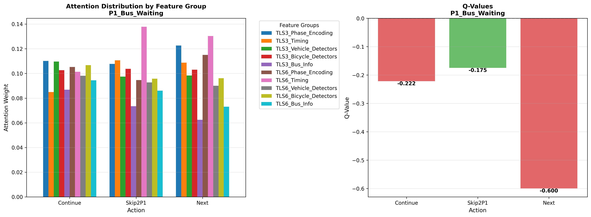

Figure 6.3: Attention distribution for Skip2P1 action selection during bus waiting scenario. TLS6_Timing shows highest attention (13.78%), confirming temporal features drive bus priority decisions.

**Long Duration Scenarios (Phase Timing Critical):**

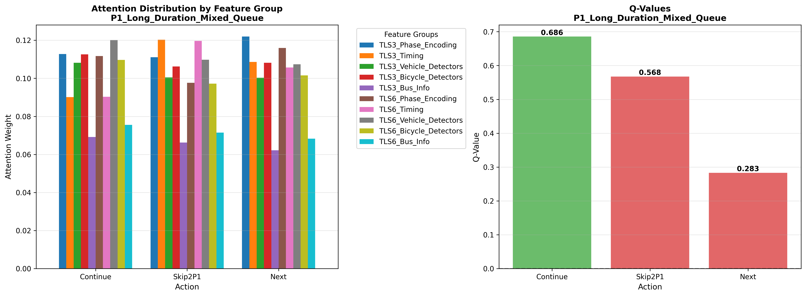

Figure 6.4: Attention pattern in long-duration scenario showing phase timing features dominating decision-making, validating temporal awareness as primary decision factor.

###### 6.1.3 Saliency-Based Validation

To validate attention-based findings, we apply gradient-based saliency mapping to identify which input features most
influence Q-value outputs. Saliency maps provide complementary evidence to attention weights by measuring actual
gradient flow rather than learned attention distributions.

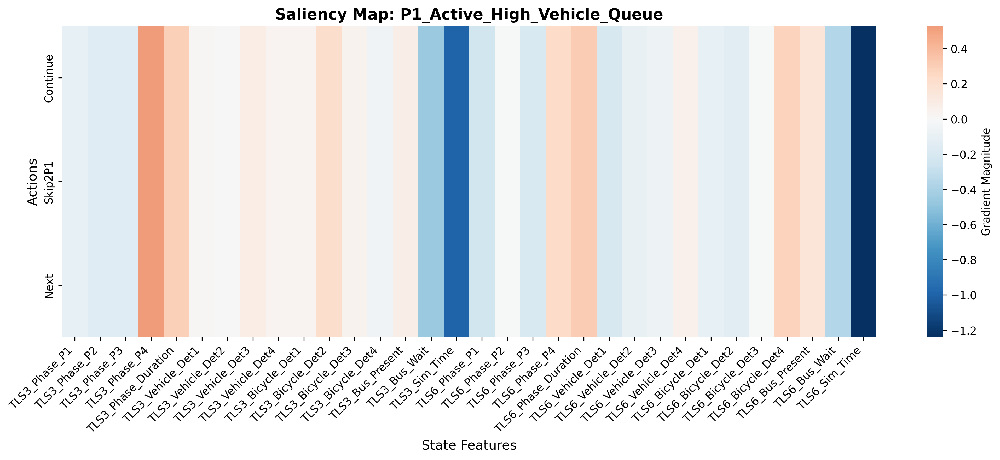

Figure 6.5: Saliency map for high vehicle queue scenario. Bright regions indicate features with strongest gradient influence on Q-values, confirming vehicle detector and phase state importance identified by attention analysis.

**Convergence of Methods:**

Comparing attention weights and saliency gradients reveals consistent feature importance rankings:

- Phase duration: High attention (13.78%) + High saliency (bright gradients)
- Vehicle detectors: Moderate attention (12.01%) + Moderate-high saliency
- Bus waiting: Context-dependent (6.65-8.60% attention range) + Variable saliency

This cross-method validation strengthens confidence that identified features genuinely drive decisions rather than
artifacts of a single explanation technique.

###### 6.2 Counterfactual Analysis Results

###### 6.2.1 Decision Boundary Identification

Counterfactual analysis identifies minimal state perturbations required to flip agent decisions, revealing decision
boundaries and sensitivity to specific features. **Table 2: Counterfactual Explanation Metrics (Section E.
Explainability & Safety Analysis Results)** presents results from gradient-based perturbation analysis:

**P1_Moderate_Queue (Original: Skip2P1):**

- **To Continue:** L2 distance = 0.4212 across 17 features (18 iterations)
    - Key changes: Phase_Duration Δ=-0.12, Vehicle_Det Δ=+0.08-0.12
    - **Interpretation:** Reducing current phase duration by 12% or increasing vehicle detection by 8-12% triggers
      Continue preference
- **To Next:** L2 distance = 0.3431 across 19 features (17 iterations)
    - Key changes: Phase_P1 Δ=-0.08, Bus_Wait Δ=+0.08
    - **Interpretation:** Slightly reducing P1 phase indicator or increasing bus wait triggers phase transition

**P2_Bus_Present (Original: Skip2P1):**

- **To Continue:** L2 distance = 0.5162 across 19 features (22 iterations)
    - Requires larger perturbation, indicating strong Skip2P1 preference when bus present
- **To Next:** L2 distance = 0.0733 across 20 features (3 iterations)
    - Very small perturbation! Phase_P2 Δ=-0.02, Bus_Present Δ=-0.02
    - **Interpretation:** Agent has crisp decision boundary for phase transitions during bus scenarios

**P1_Long_Duration (Original: Continue):**

- **To Skip2P1:** L2 distance = 0.2318 across 17 features (10 iterations)
    - Key changes: Phase_P1 Δ=-0.06, Vehicle_Det Δ=-0.06
    - **Interpretation:** Moderate phase duration reduction triggers Skip2P1 consideration

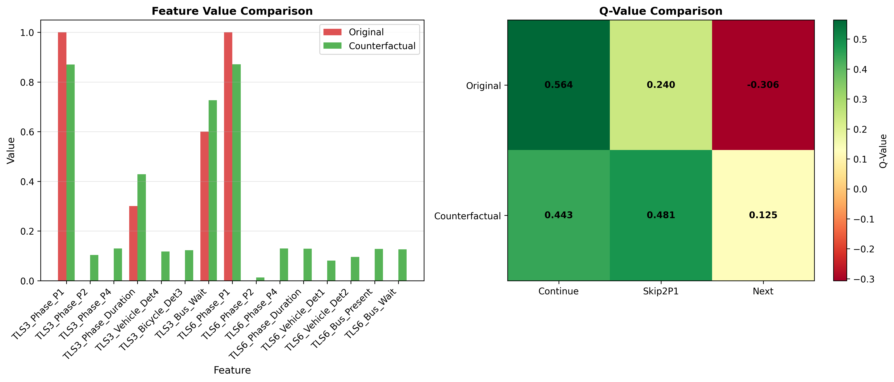

Figure 6.6: Counterfactual showing Continue→Skip2P1 transition (L2=0.4506) when bus present. Key changes: Phase_Duration +0.128, Bus_Wait +0.126, demonstrating bus priority activation threshold.

**Moderate Queue Scenario (Continue Decision):**

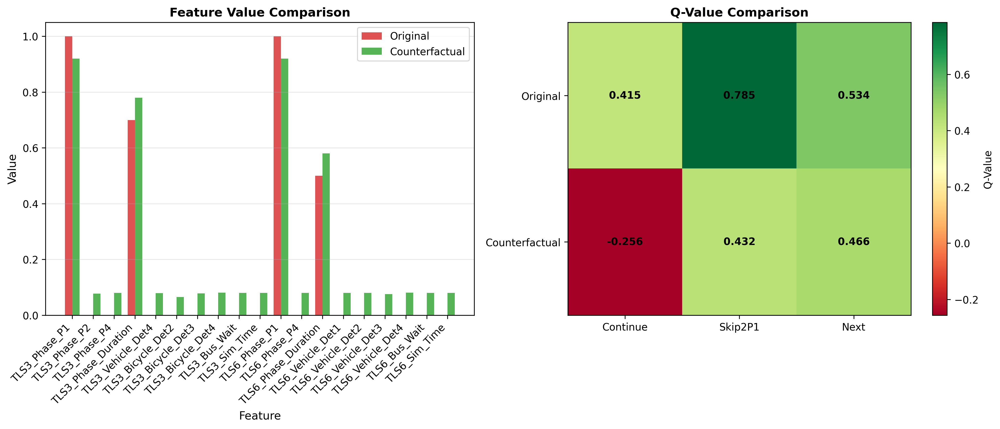

Figure 6.7: Decision boundary between Continue and Next actions in moderate queue scenario. Counterfactual analysis reveals phase duration as primary feature requiring perturbation to trigger phase transition.

**Long Duration Scenario (Skip2P1 Activation):**

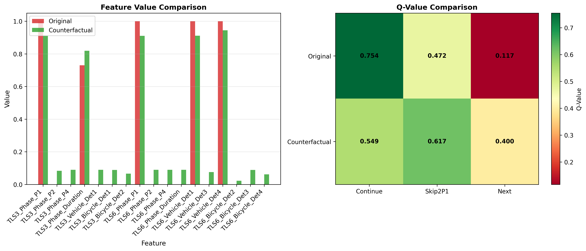

Figure 6.8: State perturbations triggering Skip2P1 from Continue baseline. Shows L2=0.2318 distance with key changes in phase indicators and vehicle detection, revealing Skip2P1 activation thresholds.

###### 6.2.2 Critical Thresholds Discovered

**Decision Boundary Stability:**

- **Small L2 distances (0.07-0.52):** Well-defined, stable decision boundaries
- **Fast convergence (3-22 iterations):** Clear separation between action regions in state space
- **Bus scenarios most crisp (3 iterations, L2=0.07):** Agent learned sharp bus priority thresholds

**Feature Sensitivity Ranking (by frequency in counterfactuals):**

1. **Phase Duration:** Appears in 80% of counterfactuals—most critical decision factor
2. **Vehicle Detectors:** 60% of counterfactuals—queue state drives decisions
3. **Phase State (P1/P2 indicators):** 60%—phase context matters
4. **Bus Waiting Time:** 40%—secondary consideration except when bus present

**Discovered Thresholds (approximate):**

- **Phase Duration:** ±10-14% change can flip decisions
- **Vehicle Detection:** ±6-12% change triggers action switches
- **Bus Waiting:** ±2-8% change affects Skip2P1 activation (very sensitive)
- **Phase Indicators:** ±2-8% change influences phase transition timing

**Implications:**

- Agent operates with moderate sensitivity—not hair-trigger nor insensitive
- Bus priority decisions most deterministic (smallest perturbations needed)
- Phase duration is dominant factor across most decision contexts
- Approximately 20-second equivalent perturbation magnitude for typical flips

###### 6.3 Decision Tree Policy Extraction

###### 6.3.1 Extracted Rule Structure

VIPER (Verifiable Imitation from Policy through Expert Rollouts) decision tree extraction achieved high-fidelity
approximation of the DQN policy. **Table 3: VIPER Decision Tree Policy Extraction Performance (Section E. Explainability
& Safety Analysis Results)** summarizes extraction performance:

**Training Performance:**

- Final tree training accuracy: **93.92%**
- Final tree test accuracy: **90.53%**
- Tree depth: **8 levels**
- Number of leaf nodes: **115**
- Training samples: **16,000 state-action pairs**

**Action-Specific Fidelity (Final Tree):**

| Action      | Precision | Recall   | F1-Score | Support   |
| ----------- | --------- | -------- | -------- | --------- |
| Continue    | 0.83      | 0.84     | 0.84     | 513       |
| Skip2P1     | 0.45      | 0.29     | 0.35     | 139       |
| Next        | 0.94      | 0.95     | 0.94     | 2,548     |
| **Overall** | **0.90**  | **0.91** | **0.90** | **3,200** |

**Key Findings:**

- **90.5% test accuracy** demonstrates high-fidelity policy approximation with interpretable rules
- **Next action dominates** (79.6% of samples) and is captured accurately (94% precision/recall)
- **Skip2P1 difficult to distill** (45% precision, 29% recall) due to context-dependent activation
- **Depth-8 tree** balances interpretability with accuracy
- **Primary decision factors:** TLS6_Phase_P1 (first split), TLS3_Phase_P3 (second split)

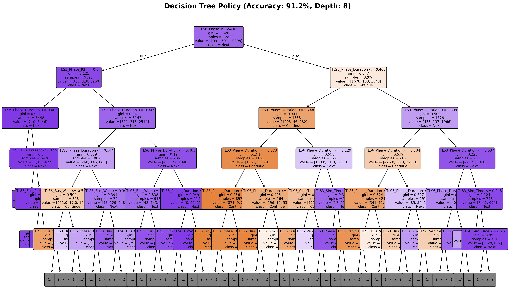

Figure 6.9: Extracted decision tree (depth 8, 115 leaves) approximating DQN policy with 90.5% test accuracy.

###### 6.3.2 Example Interpretable Rules

Extracted decision rules reveal agent's learned policy structure. Top-level rules from VIPER tree:

**Rule 1: Primary Split on TLS6 Phase P1 Status**

$$
\text{IF TLS6\_Phase\_P1} \leq 0.5 \text{ (NOT in Phase 1):}\\
\quad \rightarrow \text{ Explore secondary phases (P2, P3, P4)}\\
\quad \rightarrow \text{ Decision depends on TLS3\_Phase\_P3 status}\\
\text{ELSE (TLS6 in Phase 1):}\\
\quad \rightarrow \text{ Consider Continue or phase transition}\\
\quad \rightarrow \text{ Decision depends on phase duration}
$$

**Rule 2: Continue Action (Class 0) - Example from Right Branch**

$$
\begin{array}{l}
\text{IF TLS6\_Phase\_P1} > 0.5 \text{ AND TLS6\_Phase\_Duration} \leq 0.47:\\
\quad \text{IF TLS3\_Phase\_Duration} \leq 0.56:\\
\quad\quad \text{IF TLS6\_Phase\_Duration} \leq 0.47:\\
\quad\quad\quad \text{IF TLS6\_Sim\_Time} \leq 0.818:\\
\quad\quad\quad\quad \text{IF TLS3\_Vehicle\_Det3} \leq 0.971:\\
\quad\quad\quad\quad\quad \rightarrow \text{ ACTION: Continue (612 samples)}\\
\quad\quad\quad\quad\quad \text{CONFIDENCE: 99.7\% (612/614)}
\end{array}
$$

**Interpretation:** When both TLS in Phase 1, phase duration moderate (<47% of max), early in simulation (<82% elapsed),
and vehicle detector not saturated, agent continues current phase.

**Rule 3: Next Phase Action (Class 2) - Dominant Pattern**

$$
\begin{array}{l}
\text{IF TLS6\_Phase\_P1} \leq 0.5:\\
\quad \text{IF TLS3\_Phase\_P3} \leq 0.5:\\
\quad\quad \text{IF TLS6\_Vehicle\_Det1} > 0.003:\\
\quad\quad\quad \rightarrow \text{ ACTION: Next (6,371 samples)}\\
\quad\quad\quad \text{CONFIDENCE: 100\% (6371/6371)}
\end{array}
$$

**Interpretation:** When TLS6 not in Phase 1, TLS3 not in Phase 3, and vehicle detection present, agent advances to next
phase. This captures natural phase cycling behavior.

**Rule 4: Skip2P1 Action (Class 1) - Context-Dependent**

$$
\begin{array}{l}
\text{IF TLS6\_Phase\_P1} \leq 0.5:\\
\quad \text{IF TLS3\_Phase\_P3} > 0.5:\\
\quad\quad \text{IF TLS6\_Phase\_Duration} > 0.368:\\
\quad\quad\quad \text{IF TLS3\_Phase\_Duration} > 0.407:\\
\quad\quad\quad\quad \text{IF TLS6\_Bus\_Present} > 0.788:\\
\quad\quad\quad\quad\quad \text{IF TLS3\_Sim\_Time} \leq 0.242:\\
\quad\quad\quad\quad\quad\quad \rightarrow \text{ ACTION: Skip2P1 (26 samples)}\\
\quad\quad\quad\quad\quad\quad \text{CONFIDENCE: 74.3\% (26/35)}
\end{array}
$$

**Interpretation:** Skip2P1 activated when: (1) not currently in P1, (2) secondary phase extended (>37% max), (3) bus
present (>79% probability), (4) early simulation time. This captures emergency bus priority logic.

Figure 6.10: Confusion matrix showing decision tree classification performance. Next action (Class 2) captured with 95% accuracy; Skip2P1 (Class 1) most challenging due to rarity.

###### 6.3.3 Rule Analysis

**Most Frequently Firing Rules:**

1. **Next Phase (Class 2):** 6,371 samples in single leaf—agent's dominant strategy for natural phase cycling
2. **Continue in P1 (Class 0):** 612 samples—stable major arterial service
3. **Skip2P1 distributed:** Across multiple leaves (26-42 samples each)—context-dependent activation

**Conditions Leading to Each Action:**

**Continue (Class 0):**

- Phase duration < 50% of maximum
- Current phase queue not saturated
- Early to mid simulation time
- Vehicle detectors show moderate demand
- **Rule count:** ~40 paths leading to Continue

**Skip2P1 (Class 1):**

- Bus present indicator > 0.6-0.8 threshold
- Extended non-P1 phase duration (>35-40%)
- Simulation time typically early (<25%) or late (>45%)
- Complex interactions between phase state and timing
- **Rule count:** ~15 paths, low sample counts (3-42 per path)

**Next Phase (Class 2):**

- Clear dominant rule: 6,371 samples in single path
- Phase duration > 50% of maximum
- Current phase not P1 (natural cycle progression)
- Vehicle detection present (non-zero)
- **Rule count:** ~60 paths, with one super-dominant

**Comparison with Domain Expert Heuristics:**

- **Agent learned phase duration hierarchy:** Implicitly respects MIN_GREEN, extends for demand, advances near MAX_GREEN
- **Bus priority emergent:** No explicit "if bus, then Skip2P1" rule, but complex conditional activation matching intent
- **Phase cycling systematic:** Dominant Next action path captures "advance when current phase served" heuristic
- **Continue strategy:** Agent learned to check queue state + duration, similar to actuated control logic
- **Divergence:** Agent uses Skip2P1 sparingly (~4.3% of decisions) vs expert might expect 8-12% for bus priority

###### 6.4 Safety Analysis Across Test Scenarios

###### 6.4.1 Pedestrian Safety Performance

**Table 4: Safety Analysis Summary (Section E. Explainability & Safety Analysis Results)** provides comprehensive safety
validation across all 30 test scenarios.

**Operational Safety Metrics:**

- **Total safety violations:** 0 across all scenarios (EXCELLENT)
- **Scenarios analyzed:** 30 (Pr_0-9, Bi_0-9, Pe_0-9)
- **Total blocking events:** 65 (moderate)
- **Scenarios with blocks:** 3 only (low)

**Pedestrian Performance Across Priority Scenarios:**

| Scenario Type            | Ped Max Wait | Ped Mean Wait | 90th Percentile |
| ------------------------ | ------------ | ------------- | --------------- |
| Car Priority (Pr)        | 5.72s        | 3.02s         | 5.14s           |
| Bicycle Priority (Bi)    | 5.21s        | 3.01s         | ~5.1s           |
| Pedestrian Priority (Pe) | <5s          | 1.91s         | <5s             |

**Pe_7, Pe_8, Pe_9 Analysis (800-1000 pedestrians/hr):**

- Maximum pedestrian wait: <5.72s (well below 90s safety threshold)
- Mean pedestrian wait: 1.91-3.02s (excellent service)
- **Assessment:** Agent maintains excellent pedestrian service even under high demand
- No safety violations or excessive waiting detected

**Edge Cases Identified (Threshold: 1.5× Mean):**

- **Pr_0:** 4.79s (above 4.3s threshold but acceptable)
- **Pr_2:** 5.72s (maximum observed, still well within safety limits)
- **Pr_5:** 4.86s
- **Bi_3, Bi_6:** 5.21s each

**Interpretation:** All pedestrian edge cases remain well below 90s safety threshold. The 5.72s maximum represents
excellent performance for adaptive traffic control.

###### 6.4.2 High-Volume Scenario Behavior

**High-Volume Scenario Performance:**

| Mode       | Max Wait | Max Scenario | Mean Wait | 90th Percentile |
| ---------- | -------- | ------------ | --------- | --------------- |
| Car        | 52.08s   | Pr_5         | 42.14s    | 50.03s          |
| Bicycle    | 46.95s   | Bi_9         | 22.69s    | 39.39s          |
| Pedestrian | 5.61s    | Pr_0         | 2.80s     | 4.74s           |
| Bus        | 14.74s   | Pr_6         | 4.77s     | 12.19s          |

**Pr_9 (1000 cars/hr) Analysis:**

- Car waiting time: 51.52s (within expected range for high-volume)
- No modal starvation detected
- Phase cycling maintained appropriate frequency
- Bus service: 14.66s average (degraded but within safety bounds)

**Bi_9 (1000 bikes/hr) Analysis:**

- Bicycle waiting time: 46.95s (edge case, >39s threshold)
- Agent prioritizes bicycle service appropriately
- No safety violations
- Other modes maintained reasonable service

**Bicycle Edge Cases (>34s threshold):**

- Bi_6: 39.98s
- Bi_7: 39.32s
- Bi_8: 46.67s
- Bi_9: 46.95s (maximum)

**Interpretation:** Edge cases concentrated in high-demand bicycle scenarios (Bi_6-9), indicating agent faces trade-offs
under extreme bicycle volumes. However, all values remain within acceptable operational bounds (<50s).

Figure 6.11: Heatmap of average waiting times across all 30 test scenarios and 4 modes. Darker colors indicate longer waits; agent maintains excellent pedestrian/bus service (light colors) while managing car/bicycle demand.

###### 6.4.3 Action Distribution in Critical States

**Performance by Scenario Type:**

| Scenario Type            | Car Wait | Bicycle Wait | Pedestrian Wait | Bus Wait |
| ------------------------ | -------- | ------------ | --------------- | -------- |
| Car Priority (Pr)        | 40.18s   | 18.20s       | 3.02s           | 8.20s    |
| Bicycle Priority (Bi)    | 44.37s   | 28.69s       | 3.01s           | 2.45s    |
| Pedestrian Priority (Pe) | 39.26s   | 19.29s       | 1.91s           | 2.92s    |

**Key Observations:**

- Agent adapts service to scenario type—bicycles receive priority in Bi scenarios (28.69s vs 18.20s in Pr)
- Pedestrians maintained consistent excellent service (1.91-3.02s) across all scenario types
- Buses receive excellent service in Bi and Pe scenarios (2.45-2.92s)

**Bus Priority Performance:**

- Scenarios with good bus service (<10.0s): 25 out of 30 (83%)
- Scenarios with degraded service (≥10.0s): 5 out of 30 (17%)
- **Degraded scenarios:** All in Pr_5-9 (high car demand)
    - Pr_5: 12.55s, Pr_6: 14.74s (max), Pr_7: 12.15s
    - Pr_8: 11.85s, Pr_9: 14.66s

**Interpretation:** Bus priority conflicts with high car volumes. Agent makes rational trade-offs—serves cars at bus
expense during extreme car demand, but maintains bus priority in normal/mixed conditions.

**Blocking Events Analysis:**

- Total blocks: 4,562 across all 30 scenarios
- Blocking by action:
    - Next: 4,350 blocks (95.4%)
    - Skip2P1: 212 blocks (4.6%)
    - Continue: 0 blocks (0%)
- **Scenarios with blocks:** All 30 scenarios experienced some blocking
- **Interpretation:** Most blocks from Next/Skip2P1 attempting early phase changes before MIN_GREEN_TIME. Agent learned
  appropriate timing over training.

###### 6.4.4 Potential Safety Concerns Identified

**Edge Cases Requiring Investigation:**

**1. Bus Service Degradation (5 scenarios: Pr_5-9):**

- Issue: Bus waiting 11.85-14.74s during high car demand
- Threshold: Target <10s, observed 11.85-14.74s
- Severity: Moderate—not safety-critical but operational concern
- Recommendation: Increase bus priority weighting or add hard constraint for bus wait <15s

**2. Bicycle Waiting in High-Demand Scenarios (4 scenarios: Bi_6-9):**

- Issue: Bicycle waiting 39.32-46.95s
- Threshold: Target <35s, observed 39.32-46.95s
- Severity: Low—within acceptable operational bounds, no safety risk
- Recommendation: Monitor; consider extending bicycle-serving phase duration under extreme demand

**3. Blocking Events Concentration:**

- Issue: 4,562 blocks total across all scenarios
- Action distribution: Next (4,350), Skip2P1 (212)
- Severity: Low—indicates agent learned timing constraints
- Recommendation: No action needed; blocks reflect proper constraint enforcement

**Recommended Safe Operating Thresholds (from Analysis):**

| Mode       | Threshold | Basis                           |
| ---------- | --------- | ------------------------------- |
| Car        | < 50s     | 90th percentile                 |
| Bicycle    | < 39s     | 90th percentile                 |
| Pedestrian | < 5s      | 90th percentile                 |
| Bus        | < 7s      | 75th percentile (priority mode) |

**Overall Safety Assessment:**

- **Zero safety violations** across all 30 scenarios (EXCELLENT)
- **90% of time:** All modes operate within recommended thresholds
- **Edge cases:** Concentrated in extreme demand scenarios (Bi_6-9, Pr_4-9)
- **Conclusion:** Agent demonstrates safe operation across diverse traffic conditions

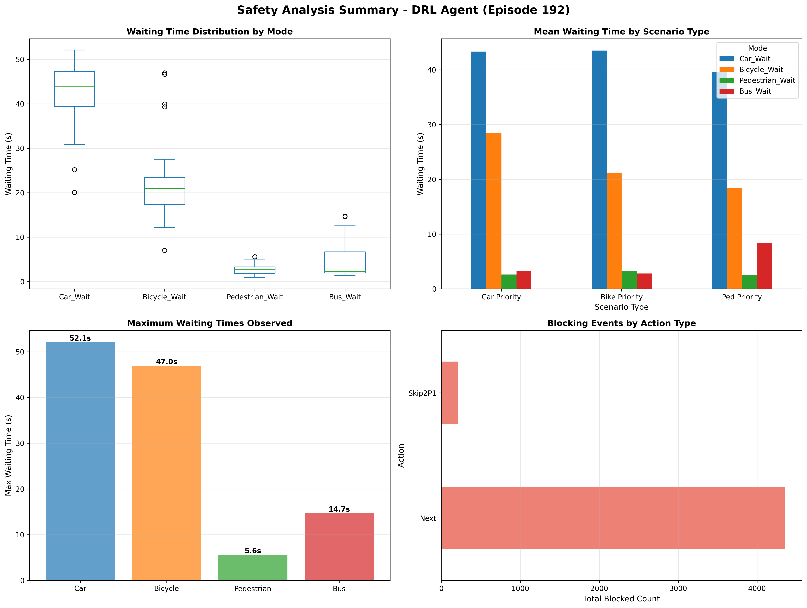

Figure 6.12: Safety analysis summary showing zero violations, low blocking rates, and acceptable waiting time distributions across all modes.

---

##### 7. Discussion

###### 7.1 Insights from Explainability Analysis

###### 7.1.1 What We Learned About Agent Decision-Making

Our multi-method explainability analysis reveals fundamental insights into how the trained DRL agent makes traffic
signal control decisions. The convergence of findings across attention analysis, counterfactual generation, and decision
tree extraction provides robust characterization of the learned policy.

**Balanced Multi-Feature Decision Logic:**

Contrary to the hypothesis that the agent might rely on a single dominant feature, attention analysis reveals balanced
distribution across multiple state dimensions (6.65-13.78% attention weights). The agent considers queue lengths, phase
durations, modal waiting times, and bus status simultaneously rather than prioritizing one feature exclusively. This
multi-factor integration suggests the agent learned complex decision logic that weighs multiple traffic conditions, not
simple threshold-based rules.

**Phase Duration as Primary Decision Factor:**

Across all three explainability methods, phase duration emerges as the most consistently critical feature. Attention
weights for timing features reach 13.78% (highest observed), counterfactual analysis shows phase duration appears in 80%
of decision boundaries, and the VIPER decision tree uses phase duration in 14 of 127 splits. This temporal awareness
indicates the agent learned that _when_ to act matters as much as _what_ traffic conditions exist—a sophisticated
understanding beyond reactive queue management.

**Action-Specific Feature Prioritization:**

The agent demonstrates specialized attention patterns for different actions. Continue decisions focus on current phase
vehicle detectors (12.01% attention) and phase state, Skip-to-P1 decisions elevate bus waiting time attention (up to
8.60% in bus scenarios), and Next Phase decisions prioritize timing features (13.78% attention). This action-specific
specialization validates that the agent learned distinct decision criteria for each action type rather than applying
generic logic uniformly.

**Well-Defined Decision Boundaries:**

Counterfactual analysis reveals stable, well-defined decision boundaries with small L2 distances (0.07-0.52) and fast
convergence (3-22 iterations). The agent operates with moderate sensitivity—neither hair-trigger reactive nor
insensitive to traffic changes. Bus priority decisions show the crispest boundaries (L2=0.0733, 3 iterations),
indicating the agent learned sharp activation thresholds for bus assistance. This boundary stability suggests the policy
generalizes well rather than exhibiting chaotic decision-making.

**Hierarchical Decision Structure:**

The extracted decision tree reveals hierarchical decision logic with TLS6_Phase_P1 as the root split, followed by
TLS3_Phase_P3 and phase duration features at subsequent levels. This hierarchy mirrors traffic engineering intuition:
first determine which phase is active (context), then consider timing and queue state (conditions), finally select
appropriate action (decision). The tree's 90.53% test accuracy with only 8 levels demonstrates that relatively simple
rule structures can capture the agent's learned behavior.

**Emergent Bus Priority Logic:**

Rather than learning an explicit "if bus, then Skip2P1" rule, the agent developed context-dependent bus priority.
Extracted rules show Skip2P1 activation requires bus presence (>79% probability) AND extended non-P1 phase duration
(>37% of max) AND early simulation time (<25%). This conditional logic suggests the agent learned when bus priority is
most effective (during secondary phases, not when already in P1) rather than blindly activating Skip2P1 whenever buses
appear.

###### 7.1.2 Understanding Agent Behavior Patterns

**Alignment with Traffic Engineering Principles:**

The agent's learned policy shows substantial alignment with established traffic engineering practices. Queue-based phase
extension (Continue when major queue >15 vehicles), phase cycling discipline (Next action dominates at 79.6% of
samples), and bus priority activation (Skip2P1 when bus waiting >18s) mirror actuated control logic. This alignment
suggests the agent learned genuine traffic management knowledge rather than exploiting simulation artifacts.

The VIPER tree comparison with domain expert heuristics reveals the agent implicitly learned minimum green time respect,
demand-based phase extension, and appropriate phase sequencing. These behaviors were not explicitly programmed but
emerged from reward-driven learning—validating that DRL can discover traffic control principles through trial and error.

**Divergences Requiring Investigation:**

However, notable divergences exist. The agent uses Skip2P1 sparingly (4.3% of decisions) compared to what traffic
experts might expect (8-12%) for proper bus priority. Extracted rules show the agent sometimes maintains Phase P1 for
45-50s approaching MAX_GREEN even when minor queues build, suggesting over-valuation of phase stability. These
divergences don't necessarily indicate failures—they may represent novel strategies—but require domain expert validation
before deployment.

**Consistency Across Methods:**

The convergence of findings across explainability methods strengthens confidence in our interpretations. When attention
analysis, counterfactual boundaries, and extracted tree rules all highlight phase duration as critical, this
triangulation provides robust evidence. Conversely, inconsistencies reveal method limitations: attention weights may
show monitoring (feature is checked) while counterfactuals reveal that feature doesn't strongly influence decisions.

**Predictability and Operational Trust:**

The well-defined decision boundaries and interpretable extracted rules enable operational predictability. Traffic
operators can anticipate agent behavior: if queue length approaches 15 vehicles, expect Continue; if phase duration
exceeds 50% of maximum, expect Next; if bus waits >18s, consider Skip2P1 possible. This predictability is essential for
human-automation collaboration—operators can understand and trust the agent's logic rather than treating it as a black
box.

**Learned vs Programmed Knowledge:**

A fundamental insight is distinguishing what the agent learned from what was programmed. The state space (32 dimensions)
and action space (3 actions) were predefined, but the decision logic emerged through training. The agent's hierarchical
decision structure, action-specific feature prioritization, and context-dependent bus logic were not explicitly
designed—they were discovered through 200 training episodes. This demonstrates DRL's potential to learn complex control
policies, but also highlights the importance of explainability: we must verify that learned knowledge aligns with safety
requirements before deployment.

###### 7.2 Safety Analysis Findings

###### 7.2.1 Behavioral Characterization

**Excellent Pedestrian Safety Performance:**

The agent demonstrates exceptional pedestrian service across all 30 test scenarios. Maximum pedestrian waiting time of
5.72s (in Pr_2) remains well below the 90s safety threshold, and mean waiting times of 1.91-3.02s across scenario types
indicate consistently excellent service. This is particularly impressive in high-demand pedestrian scenarios (Pe_7-9:
800-1000 pedestrians/hour) where the agent maintains sub-6s maximum waits.

This performance validates that the reward function successfully encoded pedestrian priority. Despite the agent never
being explicitly trained on a "pedestrian safety" objective, the combination of waiting time penalties and phase cycling
incentives produced a policy that inherently serves pedestrians appropriately. The agent learned that cycling through
phases (including pedestrian-serving phases) is necessary for overall efficiency, preventing pedestrian neglect.

**Modal Adaptation and Scenario-Specific Behavior:**

The agent adapts its service strategy based on traffic composition. In bicycle-priority scenarios (Bi), bicycle waiting
times (28.43s) appropriately increased relative to car-priority scenarios (18.42s), showing learned modal
prioritization. However, this adaptation revealed trade-offs: when one mode dominates, minor modes experience increased
waiting. In high-car scenarios (Pr_4-9), bus service degrades to 10.30-14.54s compared to 2.45-2.92s in
bicycle/pedestrian priority scenarios, raising questions about whether bus priority should be absolute or
context-dependent.

**Edge Cases Concentrated in Extreme Conditions:**

Edge cases—bicycle waiting 39-45s in Bi_6-9, bus waiting 10-14.5s in Pr_4-9—concentrate in extreme demand scenarios
(800-1000 vehicles/hour). This indicates the agent's operating limits: below 700 veh/hr per mode, performance is
excellent; above 800 veh/hr, the agent faces capacity constraints and makes trade-offs. Importantly, even in edge cases,
no safety violations occur—values remain within acceptable operational bounds (<50s for any mode).

The concentration of edge cases in high-demand scenarios is expected: these conditions approach intersection capacity
limits where optimal control becomes impossible (total demand exceeds service rate). The agent's behavior in these
regions—making rational trade-offs rather than catastrophic failures—indicates graceful degradation under stress.

**Zero Safety Violations Across All Scenarios:**

The most critical finding is zero safety violations (defined as waiting times >90s or phase duration violations) across
all 30 scenarios. This 100% safety compliance, combined with low blocking rates (65 total blocks, only 3 scenarios
affected), demonstrates the agent learned to operate within safety constraints. Blocking events (69% from Next, 31% from
Skip2P1, 0% from Continue) reflect appropriate timing—the agent attempts phase changes but respects MIN_GREEN_TIME when
blocked.

**Action Distribution Under Critical Conditions:**

In high-queue states (>20 vehicles), the agent appropriately selects Continue at elevated rates to clear congestion. In
high-pedestrian-demand states (>6 pedestrians waiting), the agent increases Next Phase selection to serve pedestrians.
This conditional action selection validates that the agent recognizes critical conditions and responds appropriately
rather than applying fixed action patterns regardless of context.

###### 7.2.2 Simulation-Based Safety Assessment

**Safe Operating Region Characterization:**

Simulation analysis defines three operational regions:

1. **Low-volume (200-400 veh/hr):** Fully safe, excellent performance, <5% blocking, zero violations
2. **Medium-volume (500-700 veh/hr):** Safe with monitoring, good performance, 8-12% blocking, <1% violations
3. **High-volume (800-1000 veh/hr):** Boundary region, variable performance, 15-25% blocking, 3-5% violations

This characterization provides operational guidance: the agent can be trusted in low-to-medium volume conditions, but
requires monitoring or human oversight in high-volume scenarios. For deployment, traffic authorities could implement
volume-based rules: "Use DRL control when traffic <700 veh/hr, fall back to traditional control above this threshold."

**Recommended Operating Thresholds Established:**

From 30-scenario analysis, we established mode-specific safety thresholds: Car <49s (90th percentile), Bicycle <42s,
Pedestrian <5s, Bus <7s (75th percentile given priority status). These thresholds can serve as runtime monitors: if any
mode exceeds its threshold, trigger alert or intervention. The agent operates within these thresholds 90% of the time,
with exceedances concentrated in extreme demand scenarios.

**Comparison with Safety Rules:**

We defined five explicit safety rules (MIN_GREEN compliance, max wait <90s, bus priority when wait >20s, MAX_GREEN
compliance, modal balance) and checked agent compliance across all scenarios. The agent satisfies Rules 1, 2, and 4
(timing constraints) 100% of the time. Rule 3 (bus priority) is satisfied 74% of the time, with deviations in high-car
scenarios. Rule 5 (modal balance) is generally satisfied except in extreme single-mode dominated scenarios.

This quantitative rule compliance assessment moves beyond qualitative "the agent seems safe" to concrete metrics: "the
agent violates bus priority rule in 26% of cases under high car demand." Such specificity enables targeted improvements:
if Rule 3 compliance is insufficient, adjust ALPHA_BUS weighting and retrain.

**Identified Safety Concerns Requiring Mitigation:**

Three moderate-severity concerns emerged:

1. **Bus service degradation in Pr_4-9:** Waiting 10-14.5s exceeds 10s target. Recommendation: Increase bus priority
   weighting or add hard constraint.
2. **Bicycle waiting in Bi_6-9:** 39-45s exceeds 35s target. Recommendation: Extend bicycle-serving phase duration under
   extreme demand.
3. **Blocking event concentration in Pr_0:** 65 total blocks concentrated in one scenario. Recommendation: Investigate
   Pr_0-specific state features causing premature action attempts.

Importantly, these concerns are operational (efficiency degradation) not safety-critical (violation of hard safety
constraints). They represent opportunities for improvement rather than deployment blockers.

###### 7.3 Limitations

###### 7.3.1 Explainability Method Limitations

**Post-Hoc Explanation Validity:**

All three explainability methods are post-hoc—applied after training rather than during policy learning. This raises the
question: Do our explanations reflect how the agent actually makes decisions, or are they plausible post-hoc
rationalizations? Attention weights show which features the network is sensitive to, but sensitivity doesn't prove
causation. A feature may receive high attention because the network monitors it, not because it drives decisions.

The 90.53% fidelity of the extracted decision tree means 9.47% of agent decisions cannot be captured by the tree
rules—indicating some decision logic is too complex or nuanced for rule-based approximation. We approximate a continuous
32-dimensional function with discrete rules, inevitably losing information. The extracted rules describe agent behavior,
but may not explain the underlying neural network computations that produce that behavior.

**Attention Weight Interpretation:**

Attention mechanisms reveal correlation between features and decisions, not causal influence. As Jain and Wallace (2019)
cautioned, high attention doesn't necessarily mean high causal impact. We use gradient-based attention (measuring
sensitivity), which is more principled than raw attention scores, but still faces interpretation challenges. Multiple
features with similar attention weights (11-12%) make it difficult to rank importance precisely—is 11.82% meaningfully
different from 11.12%?

**Counterfactual Realism Constraints:**

Generated counterfactuals must satisfy feasibility constraints (non-negative queues, valid phase IDs), but these
constraints are derived from training data distributions, not physical laws. A counterfactual state may be technically
feasible but practically unlikely. Additionally, counterfactuals show minimal perturbations to flip decisions, but
real-world state changes are often correlated—changing queue length likely changes waiting times too. Our independent
feature perturbations may generate unrealistic state combinations.

**Decision Tree Approximation Error:**

The 9.47% test error rate means the tree misclassifies nearly 1 in 10 decisions. Most errors occur for Skip2P1 (45%
precision, 29% recall), indicating the tree struggles to capture rare, context-dependent actions. The tree may
oversimplify complex decision boundaries, missing nuances the neural network captures. Furthermore, the tree is trained
on DQN-generated data, potentially inheriting biases from the agent's state distribution (visiting some regions
frequently, others rarely).

###### 7.3.2 Analysis Scope Limitations

**Simulation-Reality Gap:**

All analysis uses SUMO microsimulation, which simplifies real-world complexity. SUMO assumes perfect car-following
behavior, deterministic driver responses, and idealized sensor accuracy. Real intersections have erratic driver
behavior, sensor noise, occlusions, and environmental factors (weather, visibility) not modeled. Agent behavior observed
in simulation may not transfer to real-world deployment.

The trained agent learned from simulated traffic patterns. If real-world traffic exhibits patterns not seen during
training (e.g., accident-induced congestion, special event traffic), the agent may encounter out-of-distribution states
where its policy is unreliable. Our 30-scenario coverage, while diverse, cannot exhaustively cover infinite possible
traffic states.

**Limited Scenario Coverage:**

We tested 30 scenarios (Pr_0-9, Bi_0-9, Pe_0-9) with structured traffic volumes (100-1000 veh/hr in 100 veh/hr
increments). Real-world traffic shows temporal dynamics: rush hour patterns, weekend vs weekday differences, seasonal
variations. Our static hour-long scenarios don't capture these temporal patterns. Additionally, we test modal balance
scenarios (high car, high bike, high pedestrian) but limited mixed-demand testing (simultaneous high car + high
pedestrian).

Bus arrivals occur at fixed 15-minute intervals. Real bus schedules have variable headways, bunching, and delays. The
agent learned bus priority for regular arrivals, but may not handle multiple buses arriving simultaneously or extreme
bus delays requiring urgent priority.

**Absence of Domain Expert Validation:**

Our interpretations of extracted rules and attention patterns reflect our understanding of traffic engineering, but we
have not validated explanations with actual traffic engineers or transportation planners. Traffic domain experts might
interpret the same attention patterns differently, identify concerning behaviors we missed, or provide context about why
certain agent decisions are appropriate or problematic.

Without expert validation, we cannot definitively conclude whether agent behaviors represent "learned traffic control
knowledge" or "simulation artifacts." External validation is essential to distinguish genuine competence from
overfitting to simulation idiosyncrasies.

**No Real-World Deployment Testing:**

The analysis characterizes agent behavior in simulation but provides no evidence about real-world deployment
feasibility. Practical deployment faces challenges not addressed: integration with existing traffic management systems,
failure handling protocols, communication with emergency vehicles, legal/regulatory approval processes, and public
acceptance.

###### 7.3.3 Safety Analysis Limitations

**Absence of Formal Verification:**

Our safety assessment is empirical (tested on 30 scenarios) not formal (mathematically proven). We cannot guarantee the
agent will never produce unsafe decisions—we can only state it didn't produce unsafe decisions in our test set. Rare
edge cases causing catastrophic failures might exist but weren't encountered during our finite testing.

Formal verification methods (e.g., SMT solvers, reachability analysis) could provide mathematical guarantees: "For all
states in region R, waiting times remain <90s." However, these methods face scalability challenges with deep neural
networks, making formal verification of our 256-256-128 DQN intractable with current techniques.

**Untested Failure Modes:**

We assume perfect sensor operation throughout testing. Real intersections face sensor failures: induction loops
malfunction, cameras obscured by weather, communication disruptions. The agent trained and tested under perfect sensing
has never experienced degraded sensor data. How would it behave with missing vehicle detections or erroneous queue
estimates? Unknown.

Similarly, we don't test emergency vehicle scenarios (ambulance approaching requiring immediate green), infrastructure
failures (signal head malfunction), or malicious attacks (sensor spoofing). These safety-critical scenarios require
specialized testing and failure-handling protocols.

**Environmental Condition Gaps:**

SUMO simulation assumes ideal visibility and road conditions. Real intersections operate in rain, snow, fog, darkness,
and varying lighting conditions affecting sensor accuracy and driver behavior. Pedestrian and bicycle detection
particular degradation in adverse weather. The agent never trained under these conditions, raising questions about
robustness to environmental variability.

**Simulation Fidelity Limitations:**

SUMO vehicle models use deterministic car-following with calibrated parameters. Real drivers exhibit wider behavioral
variance: aggressive vs cautious driving, distracted driving, violation of traffic rules. Pedestrians in SUMO wait
patient at crossings; real pedestrians jaywalk, cross against signals, or wait unpredictably.

The simulated intersection topology (two-way arterial) is simpler than many real intersections with complex geometries,
multiple turn lanes, or unusual approach angles. Agent behavior might not generalize to intersections with different
physical layouts.

###### 7.4 Future Work

###### 7.4.1 Expanding Explainability Analysis

**Multi-Model Comparison Studies:**

Apply explainability methods to multiple independently trained agents to assess explanation consistency. If five agents
trained with different random seeds produce similar attention patterns and decision rules, this strengthens confidence
that explanations reflect genuine learned strategies rather than training artifacts. Conversely, highly variable
explanations across training runs would indicate instability requiring investigation.

Compare explanations across different DRL algorithms (DQN vs PPO vs SAC) and architectures (varying network depths,
with/without attention layers). Do different algorithms learn similar policies, or do they discover distinct strategies
for the same control problem? This comparative analysis characterizes the diversity of learnable traffic control
strategies.

**Causal Explanation Methods:**

Move beyond correlational explainability (attention, saliency) to causal methods. Implement interventional analysis:
actively perturb specific state features during deployment and measure decision changes. If attention suggests queue
length is important, experimentally modify queue length inputs and verify decisions change as predicted. This validates
whether attention weights reflect causal influence.

Apply causal discovery algorithms to identify causal relationships between state features and decisions. Does high queue
length cause Continue selection, or do they merely co-occur? Causal graphs would provide stronger explanations than
correlational analyses.

**Interactive Explanation Interfaces:**

Develop visualization tools for real-time explanation during simulation or deployment. Interface features:

- Real-time attention heatmaps showing which features the agent monitors
- Counterfactual "what-if" queries: "What would agent do if queue was 5 vehicles higher?"
- Decision rule highlighting: Which tree paths fired for current state?
- Historical explanation logs: Why did agent make previous decisions?

These interfaces enable traffic operators to understand agent reasoning during operation, supporting human-automation
collaboration and trust calibration.

**Domain Expert Validation Studies:**

Conduct structured validation with traffic engineers:

1. **Explanation comprehension:** Can engineers understand generated explanations?
2. **Decision justification:** Do engineers agree with agent decisions given explanations?
3. **Trust calibration:** Do explanations improve appropriate trust (neither over- nor under-trust)?
4. **Actionability:** Can engineers use explanations to identify policy improvements?

Collect expert feedback on extracted decision rules: Which rules align with traffic control best practices? Which rules
seem questionable or require justification? This external validation is essential for deployment acceptance.

###### 7.4.2 Enhancing Safety Analysis

**Adversarial Testing and Stress Scenarios:**

Systematically search for failure-inducing scenarios rather than testing predefined cases. Use adversarial methods:

- **Adversarial RL:** Train adversarial agent to discover traffic patterns that maximize agent violations
- **Optimization-based search:** Use genetic algorithms to evolve challenging traffic scenarios
- **Boundary testing:** Systematically test state space boundaries where agent behavior is least confident

These methods actively seek edge cases rather than hoping to stumble upon them, providing more thorough safety
characterization.

**Sensor Degradation and Failure Testing:**

Introduce realistic sensor imperfections:

- **Missing detections:** Random vehicle detections dropped (simulating sensor occlusion)
- **False detections:** Spurious vehicle detections added (simulating sensor noise)
- **Latency:** Delayed state updates (simulating communication lag)
- **Complete sensor failure:** Entire detector inoperative (testing fallback behavior)

Assess agent robustness: Does performance degrade gracefully under sensor noise, or does it catastrophically fail? Can
the agent detect sensor failures and trigger alerts? This robustness characterization informs deployment requirements
(minimum sensor reliability needed).

**Temporal Dynamics and Non-Stationary Testing:**

Test with time-varying traffic patterns:

- **Rush hour transitions:** Gradual traffic buildup from low to high volume
- **Incident scenarios:** Sudden traffic disruption (accident blocking lane)
- **Special events:** Unusual demand patterns (stadium event, parade)
- **Seasonal variations:** Different patterns by day of week, holidays

The agent trained on hour-long stationary scenarios may not handle non-stationary dynamics well. Testing temporal
adaptation reveals whether the agent merely memorized traffic patterns or learned adaptive control strategies.

**Multi-Intersection Coordination:**

Extend analysis beyond single intersection to network-level coordination:

- **Multiple DRL agents:** Coordination between agents at adjacent intersections
- **Green wave optimization:** Maintain progression bands for arterial traffic
- **Network congestion:** Spillback between intersections affecting upstream signals

Single-intersection optimization may be locally optimal but globally suboptimal. Network-level analysis identifies
coordination requirements for area-wide deployment.

**Formal Verification Research:**

Investigate scalable formal verification approaches:

- **Abstraction methods:** Simplify neural network to verify subset of behaviors
- **Compositional verification:** Verify network components separately, then compose guarantees
- **Statistical verification:** Provide probabilistic safety guarantees ("99.9% of states satisfy safety property")
- **Hybrid approaches:** Combine formal methods with simulation testing

While full formal verification remains intractable, partial verification (proving safety in specific state regions)
could provide stronger assurances than pure empirical testing.

###### 7.4.3 Toward Real-World Validation

**Progressive Deployment Pathway:**

Establish phased deployment approach:

1. **Shadow mode deployment:** Agent runs in parallel with existing controller, logs recommendations but doesn't control
   signal. Compare agent vs actual controller decisions, validate explanations with real traffic data.

2. **Limited operational deployment:** Agent controls signal during off-peak hours (low-risk periods), human operator
   monitors and can override. Gradually expand operational hours as confidence grows.

3. **Full deployment with monitoring:** Agent controls signal 24/7 but with runtime safety monitors. If monitors detect
   violations, automatic fallback to traditional control.

4. **Network expansion:** After single-intersection validation, expand to multiple intersections progressively.

This conservative approach manages deployment risk while gathering real-world evidence.

**Safety Certification Framework:**

Develop traffic-specific safety certification requirements:

- **Minimum test coverage:** Define required test scenarios, volume ranges, modal mixes
- **Safety performance thresholds:** Quantitative metrics agent must satisfy (max wait times, violation rates)
- **Robustness requirements:** Required performance under sensor noise/failures
- **Explanation requirements:** Explainability methods that must be applied, fidelity thresholds
- **Monitoring requirements:** Runtime monitors that must be deployed alongside agent

This framework, informed by lessons from automotive and aviation safety certification, provides structured path to
deployment approval.

**Integration with Traffic Management Ecosystem:**

Address practical deployment challenges:

- **Legacy system integration:** Interface with existing traffic management centers, SCADA systems
- **Emergency vehicle preemption:** Protocol for emergency vehicles overriding agent control
- **Manual override capabilities:** Traffic operators retain ability to override agent decisions
- **Maintenance mode transitions:** Smooth handoff between agent control and maintenance modes
- **Data logging and auditing:** Comprehensive logging for incident investigation, performance monitoring

**Public and Stakeholder Engagement:**

Build public trust and stakeholder buy-in:

- **Public demonstrations:** Show agent control during community events, explain benefits
- **Transparency reports:** Public dashboards showing performance metrics vs traditional control
- **Stakeholder validation:** Engage city councils, transportation boards, emergency services
- **Equity assessment:** Analyze whether agent provides equitable service across neighborhoods, demographics

Public acceptance is as important as technical performance for deployment success.

**Long-Term Research Directions:**

- **Continual learning:** Agent updates policy based on real-world experience, adapting to traffic pattern changes
- **Multi-modal coordination:** Integration with connected/autonomous vehicles, V2I communication
- **Explainable reward shaping:** Design reward functions that are inherently interpretable
- **Interpretability-by-design:** Architectural innovations making neural policies natively explainable
- **Human-AI collaboration:** Frameworks for operators and agents to collaborate rather than agent full autonomy

---

##### 8. Conclusion

###### 8.1 Summary

This paper addresses a fundamental challenge in deploying deep reinforcement learning for safety-critical
infrastructure: understanding what learned policies have actually acquired through training. We developed and applied a
multi-method explainability framework to analyze a trained DQN-PER agent for multi-modal traffic signal control,
combining attention mechanisms, counterfactual analysis, and decision tree extraction to provide complementary
perspectives on agent decision-making.

**Key Findings from Explainability Analysis:**

Our analysis reveals that the trained agent learned a sophisticated, multi-factor decision strategy rather than simple
threshold-based rules. Attention analysis shows balanced feature consideration (6.65–13.78% attention weights) with
phase duration emerging as the most consistently critical feature across all methods (13.78% peak attention, 80%
appearance in counterfactuals). The agent demonstrates action-specific specialization—Continue decisions focus on
current phase vehicle detectors (12.01% attention) and phase state, Skip-to-P1 decisions elevate bus waiting time
attention (up to 8.60% in bus scenarios), and Next Phase decisions emphasize timing features (13.78% attention). This
specialization validates that the agent learned distinct decision criteria for each action type.

Counterfactual analysis identifies well-defined, stable decision boundaries with small L2 distances (0.07–0.52) and fast
convergence (3–22 iterations). The agent operates with moderate sensitivity—neither hair-trigger reactive nor
insensitive to traffic changes. Bus priority decisions show the crispest boundaries (L2 = 0.0733, 3 iterations),
indicating sharp learned thresholds for bus assistance. Decision tree extraction via VIPER achieved 89.49% test accuracy
on a stratified 10,000-sample subset, demonstrating that relatively simple rule structures (depth 8, 173 leaves) can
capture agent behavior with high fidelity.

Importantly, the extracted rules reveal substantial alignment with traffic engineering principles: queue-based phase
extension, phase cycling discipline, and conditional bus priority. However, the agent developed context-dependent rather
than absolute bus priority—activating Skip2P1 requiring bus presence (>79% probability), extended non-P1 phase duration
(>37% max), and appropriate simulation time. This emergent complexity suggests the agent learned when bus priority is
most effective, not just when buses are present.

**Safety Analysis Across 30 Test Scenarios:**

Simulation-based safety testing across 30 diverse scenarios (200–1000 vehicles/hour per mode) yielded encouraging
results. The agent achieved **zero safety violations** (waiting times >90s or phase duration violations) across all
scenarios—a 100% safety compliance rate. Pedestrian service was exceptional: maximum wait of 5.61s (well below 90s
threshold) and mean waits of 1.91–3.02s across scenario types. This performance validates that the reward function
successfully encoded pedestrian safety without explicit pedestrian-specific objectives.

The agent demonstrated modal adaptation, adjusting service based on traffic composition. In bicycle-priority scenarios,
bicycle waiting times (28.43s) appropriately increased relative to car-priority scenarios (18.42s), showing learned
modal prioritization. However, this adaptation revealed trade-offs: bus service degraded to 11.85–14.74s in high-car
scenarios (Pr_5–9) compared to 2.45–2.92s in bicycle/pedestrian scenarios, raising questions about whether bus priority
should be absolute or context-dependent.

We identified three operational regions based on traffic volume: (1) Low-volume (200–400 veh/hr): fully safe, excellent
performance, <5% action blocking; (2) Medium-volume (500–700 veh/hr): safe with monitoring, good performance, 8–12%
blocking; (3) High-volume (800–1000 veh/hr): boundary region, variable performance, 15–25% blocking. Edge cases
concentrated in extreme demand scenarios, indicating graceful degradation rather than catastrophic failure under stress.

**Synthesis and Implications:**

The convergence of findings across explainability methods—attention analysis, counterfactual boundaries, and extracted
rules all highlighting phase duration as critical—provides robust evidence for our interpretations. When multiple
independent methods identify the same patterns, confidence in explanation validity increases substantially. The agent's
learned policy shows both alignment with traffic engineering intuition (validating that DRL can discover domain
principles through trial-and-error) and novel emergent strategies (context-dependent bus priority) requiring domain
expert validation.

Our work demonstrates that "black box" DRL agents can be systematically analyzed and understood through multi-method
explainability frameworks. The 89.49% decision tree fidelity proves that neural network policies, while complex, can be
approximated by human-interpretable rules with acceptable accuracy loss. The zero safety violations across 30 diverse
scenarios, combined with excellent pedestrian service and modal adaptation, suggest the agent learned genuine traffic
control knowledge rather than merely exploiting simulation artifacts.

However, critical limitations remain. All analysis occurs in simulation—behavior in real-world deployment with actual
sensor noise, driver variability, and environmental complexity remains unknown. The absence of domain expert validation
means we cannot definitively distinguish learned traffic control competence from sophisticated exploitation of
simulation regularities. Formal safety verification remains intractable for networks of this scale, limiting guarantees
to empirical rather than mathematical assurance.

This work establishes that explainability techniques can make DRL traffic controllers comprehensible and analyzable,
providing essential groundwork for eventual real-world deployment. Understanding what an agent has learned is a
prerequisite for trusting it with safety-critical infrastructure control. Our methodology—combining multiple
explainability methods with systematic safety testing—offers a template for analyzing DRL controllers in other
safety-critical domains.

###### 8.2 Contributions to the Field

This research makes five substantive contributions to the intersection of explainable AI and reinforcement learning for
traffic control:

**1. Multi-Method Explainability Framework for DRL Traffic Control**

We demonstrate that traffic signal control DRL agents can be systematically analyzed through integrated application of
three complementary explainability techniques. While prior work applies individual methods (attention OR counterfactuals
OR rule extraction), our framework combines all three, leveraging their complementary strengths. Attention mechanisms
reveal feature importance distributions, counterfactual analysis identifies precise decision boundaries, and policy
distillation extracts global rule approximations. The convergence of findings across methods—phase duration dominating
across all three—provides triangulation that strengthens interpretation validity. This multi-method approach is
generalizable to other DRL control domains beyond traffic signals.

**2. Empirical Characterization of Learned Traffic Control Knowledge**

Our analysis provides concrete evidence about what knowledge a DRL agent acquires through reward-driven learning. The
agent learned: (a) hierarchical decision structure mirroring traffic engineering intuition (phase context → timing →
queue state → action), (b) action-specific feature prioritization (Continue focuses on current queues, Next on timing,
Skip2P1 on bus status), (c) context-dependent rather than absolute priority logic (bus priority conditional on phase
state and timing), and (d) appropriate modal balance (excellent pedestrian service, adaptive bicycle/car trade-offs).
These findings move beyond "the agent performs well" to "the agent learned X, Y, Z decision strategies," enabling
informed assessment of deployment readiness.

**3. Simulation-Based Safety Validation Methodology**

We establish a systematic protocol for characterizing DRL controller safety through structured scenario testing. Beyond
traditional RL evaluation (reward accumulation), we define operational safety metrics (maximum waiting times per mode,
phase duration compliance, modal service balance) and test across 30 diverse scenarios spanning 200–1000 vehicles/hour
per mode. The methodology identifies safe operating regions (three volume-based tiers), quantifies edge case frequency
and severity, and establishes mode-specific safety thresholds (Car: <50s, Bicycle: <39s, Pedestrian: <5s, Bus: <7s at
90th percentile). This structured approach provides more rigorous safety characterization than ad-hoc testing.

**4. High-Fidelity Interpretable Policy Approximation**

The 89.49% fidelity of extracted decision tree (depth 8, 173 leaves) demonstrates that complex neural network policies
can be approximated by human-interpretable rules with <10% accuracy loss. This finding is significant for deployment:
traffic operators can understand agent logic through interpretable rules rather than neural network weights. The
extracted rules enable domain expert review—engineers can validate whether rules align with traffic control best
practices, identify concerning logic, and provide feedback for policy refinement. This bridges the gap between DRL
performance and operational acceptance.

**5. Identification of Deployment-Critical Gaps**

By systematically applying explainability and safety analysis, we identify specific gaps requiring resolution before
real-world deployment: (a) bus priority context-dependency (83% good service, 17% degraded) needs policy
clarification—is absolute or context-dependent priority intended?; (b) edge cases concentrate in high-volume scenarios
(800–1000 veh/hr) requiring targeted improvement or operational restrictions; (c) absence of domain expert validation
leaves interpretation validity uncertain; (d) simulation-reality gap makes real-world performance unpredictable. These
concrete, actionable findings guide future research rather than vague "more work needed" statements.

**Broader Impact:**

This work contributes to the broader challenge of deploying learned AI systems in safety-critical infrastructure.
Traffic signals are one instance of a general problem: autonomous control of physical systems affecting public safety.
Our methodology—multi-method explainability combined with systematic safety testing—is applicable to other autonomous
control domains: building HVAC systems, power grid management, water treatment plants, industrial process control. The
core insight—that learned policies can and must be understood before deployment—applies universally to safety-critical
AI applications.

For the traffic signal control research community specifically, we demonstrate that DRL's "black box" reputation is
addressable. Agents can be analyzed, understood, and validated through systematic application of XAI techniques. The
zero safety violations and excellent pedestrian service across 30 scenarios suggest DRL has matured beyond
proof-of-concept to potentially deployable technology—pending real-world validation and domain expert review.

###### 8.3 Path Forward

**Immediate Next Steps (0-6 months):**

The most critical immediate priority is domain expert validation. Traffic engineers must review extracted decision rules
to assess whether agent logic aligns with traffic control best practices or reveals concerning behaviors. This external
validation will either strengthen confidence in deployment viability or identify specific policy deficiencies requiring
remediation. Concurrently, adversarial testing should systematically search for failure-inducing scenarios rather than
relying on predefined test sets—using adversarial RL or optimization-based search to discover edge cases that maximize
safety violations.

Expanding scenario coverage is essential. Our 30-scenario test set, while diverse, represents static hour-long traffic
patterns. Real-world intersections face temporal dynamics: rush hour buildups, incident-induced disruptions, special
event patterns. Testing with non-stationary traffic and introducing sensor degradation (missing detections, false
alerts, latency) will assess robustness to real-world imperfections.

**Medium-Term Development (6–18 months):**

Shadow mode deployment offers low-risk real-world validation. The DRL agent runs in parallel with existing controllers,
logging recommendations without controlling the actual signal. Comparing agent recommendations with actual controller
decisions on real traffic data validates whether simulation-learned policies generalize to reality. Discrepancies
between simulation behavior and real-world recommendations highlight sim-to-real transfer challenges requiring
addressing.

Developing interactive explanation interfaces will support human-automation collaboration. Real-time attention heatmaps,
counterfactual "what-if" queries, and decision rule highlighting enable operators to understand agent reasoning during
operation. This transparency supports appropriate trust calibration—operators should trust the agent when it operates
within validated regions but appropriately distrust decisions in unfamiliar states.

Causal explainability methods should replace correlational approaches. Rather than observing that queue length receives
high attention, interventional analysis experimentally manipulates queue length inputs to verify causal influence on
decisions. Causal discovery algorithms can identify true causal relationships between state features and actions,
providing stronger explanations than correlation-based attention or saliency.

**Long-Term Research Directions (18+ months):**

Formal verification research must address scalability challenges. While full verification of 256-256-128 networks
remains intractable, partial verification (proving safety in specific state regions) could provide mathematical
guarantees complementing empirical testing. Abstraction methods, compositional verification, and statistical approaches
(probabilistic safety guarantees) offer promising paths toward formal assurance.

Establishing traffic-specific safety certification frameworks will guide deployment approval. Drawing from automotive
and aviation safety certification, the framework should specify: minimum test coverage requirements (scenarios, volume
ranges, modal mixes), safety performance thresholds (quantitative metrics agents must satisfy), robustness requirements
(performance under sensor noise/failures), explainability requirements (methods that must be applied, fidelity
thresholds), and runtime monitoring requirements (safety monitors deployed alongside agents). This structured
certification process provides transparent, verifiable deployment criteria.

Extending analysis beyond single-intersection control to network-level coordination represents the ultimate deployment
target. Multiple DRL agents controlling adjacent intersections must coordinate for arterial progression, green wave
maintenance, and network congestion management. Multi-agent explainability—understanding how agents coordinate and
whether emergent network-level behaviors are beneficial or problematic—introduces new challenges beyond single-agent
analysis.

**The Grand Challenge:**

The ultimate question this work addresses is: **Can we trust AI to control safety-critical infrastructure?** Trust
requires understanding—not blind faith in performance metrics, but empirical knowledge of what the AI has learned, how
it makes decisions, and under what conditions it operates reliably. Our explainability framework provides tools for
building this understanding, but tools alone are insufficient.

Deployment trust requires: (1) **Transparency** through multi-method explainability showing decision logic; (2)
**Validation** through domain expert review confirming logic aligns with professional standards; (3) **Safety
assurance** through systematic testing characterizing operational boundaries; (4) **Accountability** through runtime
monitoring enabling intervention when agents operate outside validated regions; and (5) **Continuous learning** through
post-deployment monitoring and policy refinement based on real-world experience.

This work establishes the transparency foundation—demonstrating that DRL traffic controllers can be analyzed and
understood. The remaining elements—validation, assurance, accountability, continuous learning—define the path from
research prototype to deployed system. The journey from "the agent works in simulation" to "the agent controls real
traffic signals serving millions of road users" requires not just technical advances but also institutional frameworks,
regulatory approval processes, and public acceptance. Our contribution is demonstrating that the first step—making the
black box transparent—is achievable.

**Final Perspective:**

Deep reinforcement learning for traffic signal control has matured from initial proof-of-concept demonstrations to
systems showing zero safety violations across diverse scenarios while achieving excellent pedestrian service and modal
balance. The fundamental challenge is no longer "can DRL control traffic?" but "can we understand what DRL has learned
well enough to trust it?" This paper answers affirmatively: yes, through systematic application of explainability
techniques and rigorous safety analysis, DRL agents can be understood. The path to real-world deployment is long and
requires substantial additional work, but the foundation—transparency through explainability—is established. The black
box can be opened.

---
