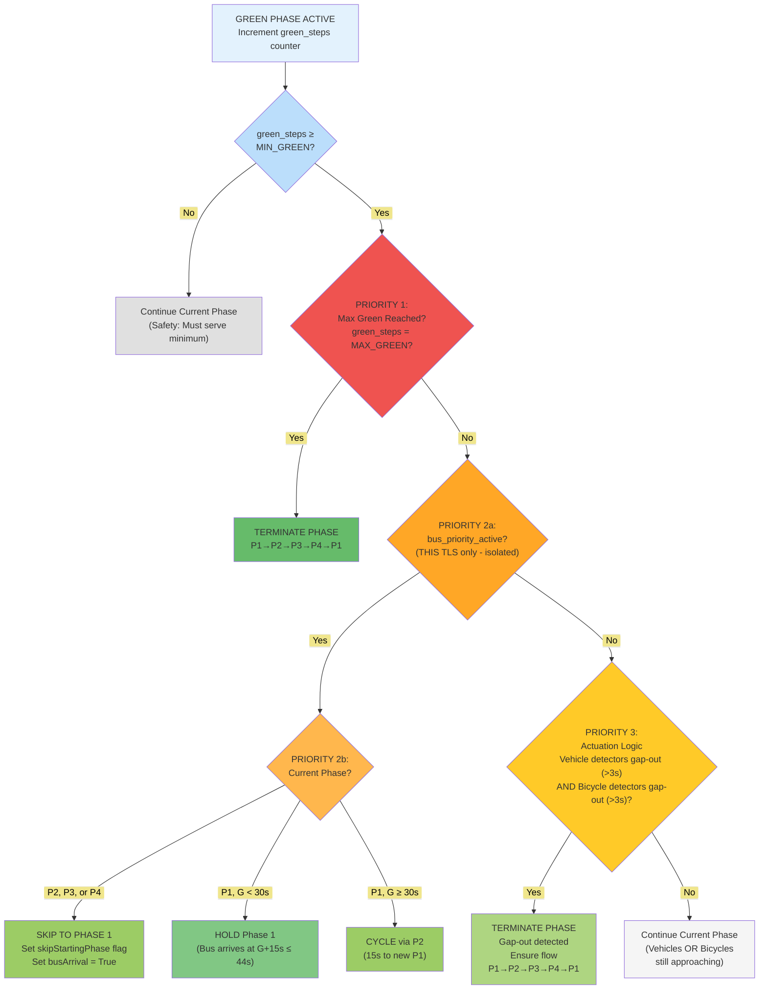
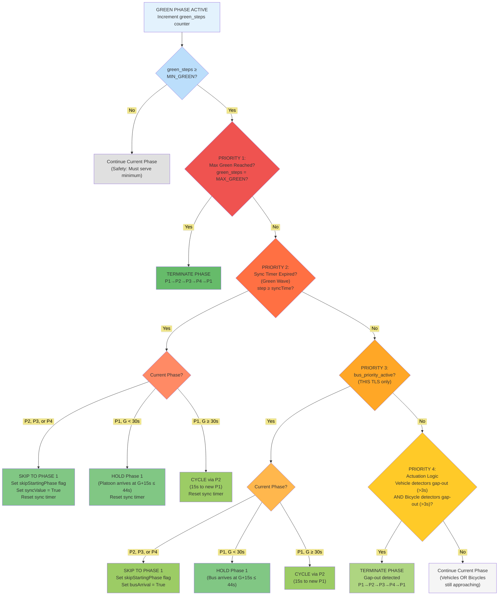

# Isolated Control Logic Without Semi-Synchronization (5-TLS Multi-Agent Network)

This section describes the **isolated actuated control** for the 5-intersection multi-agent network. Each intersection
operates **independently** based solely on its local detector readings—no coordination or synchronization between
intersections.

###### Effective Speeds for Modes

Since the lane speed limit (13.89 m/s) is lower than car/bus vType maxSpeed, the **effective speed is:**

| Vehicle | Effective Max Speed  | Reason                           |
| ------- | -------------------- | -------------------------------- |
| Car     | 13.89 m/s (50 km/h)  | Lane speed limit                 |
| Bus     | 13.89 m/s (50 km/h)  | Lane speed limit                 |
| Bicycle | 5.8 m/s (20.88 km/h) | vType maxSpeed (lower than lane) |

**Key insight:** Cars and buses are limited by the 50 km/h lane speed, while bicycles are limited by their vType
maxSpeed of ~21 km/h.

###### Key Differences from Semi-Synchronized Control

| Feature             | Isolated (5-TLS Network)          |
| ------------------- | --------------------------------- |
| **Coordination**    | None - fully independent          |
| **Phase Structure** | P1→P2→P3→P4→P1                    |
| **Actuation Logic** | Cars gap-out AND Bicycles gap-out |
| **Bus Skip to P1**  | Always WITH leading green         |
| **Priority Levels** | 3 tiers (MAX→Bus→Actuation)       |

###### Bus Signal Detection (Background Process)

The bus priority system uses **upstream emit lanes** positioned 64-72 seconds travel time from the intersection. When a
bus enters this lane, it **emits a signal to the TLS controller** announcing its approach. The controller then uses a
background timing process to activate priority exactly **15 seconds before the bus arrives**.

**Detection and Timing Sequence:**

1. **Bus enters emit lane**: Bus emits signal → Controller receives and records $\text{bus\_detected\_time}$, sets
   $\text{bus\_approaching} = True$
2. **Wait period**: Controller waits for $(\text{lane\_travel\_time} - 15s)$ to elapse
3. **Priority activation**: Controller sets $\text{bus\_priority\_active} = True$ and begins phase preparation

**Example Timing:**

| Emit Lane | Travel Time to TLS | Controller Wait | Priority Activated When Bus Is |
| --------- | ------------------ | --------------- | ------------------------------ |
| Lane A    | 64s                | 64s - 15s = 49s | 15s from TLS                   |
| Lane B    | 72s                | 72s - 15s = 57s | 15s from TLS                   |

**Why 15s Warning?** This guarantees sufficient time for the TLS to prepare P1 green:

- **If at P1 with G < 30s**: Hold P1 green (bus arrives at G+15s ≤ 44s MAX_GREEN)
- **If at P1 with G ≥ 30s**: Cycle through P2 (15s transition to fresh P1)
- **If at P2/P3/P4**: Skip to P1 (worst case 11s from P3 MIN_GREEN start)

**Result**: Zero bus delay in all scenarios—the bus always arrives when P1 green is active.

###### Green Actuation Logic: Isolated Control Decision Hierarchy



###### Isolated Control: Phase Transition Flow

```mermaid
flowchart TD
    subgraph P1_PHASE["PHASE 1: Major Through (Bus Priority: HOLD or CYCLE)"]
        P1_LG["Leading Green"] --> P1_Green["P1 GREEN"]
        P1_Green --> P1_Min{"green_steps ≥ MIN_GREEN?"}
        P1_Min -->|<span style='background-color:khaki; color:black; padding:2px 6px; border-radius:3px'>No</span>| P1_Green
        P1_Min -->|<span style='background-color:khaki; color:black; padding:2px 6px; border-radius:3px'>Yes</span>| P1_Pr1{"Priority 1:<br>MAX_GREEN?"}
        P1_Pr1 -->|<span style='background-color:khaki; color:black; padding:2px 6px; border-radius:3px'>Yes</span>| P1_Term["Terminate P1"]
        P1_Pr1 -->|<span style='background-color:khaki; color:black; padding:2px 6px; border-radius:3px'>No</span>| P1_Pr2{"Priority 2:<br>bus_priority_active?"}
        P1_Pr2 -->|<span style='background-color:khaki; color:black; padding:2px 6px; border-radius:3px'>Yes, G < 30s</span>| P1_Hold["Hold P1 for bus<br>(G+15s ≤ 44s)"]
        P1_Hold --> P1_Green
        P1_Pr2 -->|<span style='background-color:khaki; color:black; padding:2px 6px; border-radius:3px'>Yes, G ≥ 30s</span>| P1_Cycle["Cycle via P2"]
        P1_Pr2 -->|<span style='background-color:khaki; color:black; padding:2px 6px; border-radius:3px'>No</span>| P1_Pr3{"Priority 3:<br>Both Cars and Bicycles Gap-out?"}
        P1_Pr3 -->|<span style='background-color:khaki; color:black; padding:2px 6px; border-radius:3px'>Yes</span>| P1_Term
        P1_Pr3 -->|<span style='background-color:khaki; color:black; padding:2px 6px; border-radius:3px'>No</span>| P1_Green
    end

    P1_Term --> Y1["YELLOW"] --> R1["RED"]
    P1_Cycle --> Y1
    R1 -->|<span style='background-color:khaki; color:black; padding:2px 6px; border-radius:3px'>P1→P2 ALWAYS</span>| Px_LG

    subgraph Px_PHASE["PHASE 2/3/4 (Bus Priority: SKIP TO P1)"]
        Px_LG["Leading Green"] --> Px_Green["Px GREEN"]
        Px_Green --> Px_Min{"green_steps ≥ MIN_GREEN?"}
        Px_Min -->|<span style='background-color:khaki; color:black; padding:2px 6px; border-radius:3px'>No</span>| Px_Green
        Px_Min -->|<span style='background-color:khaki; color:black; padding:2px 6px; border-radius:3px'>Yes</span>| Px_Pr1{"Priority 1:<br>MAX_GREEN?"}
        Px_Pr1 -->|<span style='background-color:khaki; color:black; padding:2px 6px; border-radius:3px'>Yes</span>| Px_Term["Terminate Px"]
        Px_Pr1 -->|<span style='background-color:khaki; color:black; padding:2px 6px; border-radius:3px'>No</span>| Px_Pr2{"Priority 2:<br>bus_priority_active?"}
        Px_Pr2 -->|<span style='background-color:khaki; color:black; padding:2px 6px; border-radius:3px'>Yes</span>| Px_Skip["Skip to P1"]
        Px_Pr2 -->|<span style='background-color:khaki; color:black; padding:2px 6px; border-radius:3px'>No</span>| Px_Pr3{"Priority 3:<br>Both Cars and Bicycles Gap-out?"}
        Px_Pr3 -->|<span style='background-color:khaki; color:black; padding:2px 6px; border-radius:3px'>Yes</span>| Px_Term
        Px_Pr3 -->|<span style='background-color:khaki; color:black; padding:2px 6px; border-radius:3px'>No</span>| Px_Green
    end

    Px_Term --> Yx["YELLOW"] --> Rx["RED"]
    Px_Skip --> Yx
    Rx -->|<span style='background-color:khaki; color:black; padding:2px 6px; border-radius:3px'>P2→P3, P3→P4</span>| Px_LG
    Rx -->|<span style='background-color:khaki; color:black; padding:2px 6px; border-radius:3px'>P4→P1, Skip to P1</span>| P1_LG

    style P1_PHASE fill:#E3F2FD
    style Px_PHASE fill:#90CAF9
    style Y1 fill:#FDD835
    style Yx fill:#FDD835
    style R1 fill:#EF5350
    style Rx fill:#EF5350
```



###### Key Characteristics of Isolated Control

1. **Fully Independent**: Each TLS makes decisions based only on its local detectors
2. **No Coordination Overhead**: No sync timers or inter-TLS communication
3. **AND Actuation Logic**: Both cars AND bicycles must gap-out before phase termination
4. **No Pedestrian Phase**: 4-phase cycle only (P1→P2→P3→P4→P1)
5. **Bus Priority with 15s Warning**: Hold P1 (G < 30s) or cycle via P2 (G ≥ 30s) for zero bus delay
6. **Circular Flow Guaranteed**: MAX_GREEN always triggers next phase in sequence

---

###### Time Duration Analysis: Switching to P1 from Any Point in Cycle

This analysis calculates the minimum time required to reach Phase 1 (P1) from any point in the traffic signal cycle,
considering bus priority coordination requirements.

###### Constraints and Fixed Parameters

| Parameter           | Value | Purpose                                              |
| ------------------- | ----- | ---------------------------------------------------- |
| **Leading Green**   | 1s    | Bicycle priority start before main green             |
| **Yellow**          | 3s    | Warning interval (fixed, safety requirement)         |
| **Red Clearance**   | 2s    | Intersection clearance (fixed, safety requirement)   |
| **Transition Time** | 6s    | Yellow + Red per phase change (3s + 2s + 1s leading) |

**Critical Rule**: Cannot skip from P1 directly back to P1. Must pass through at least P2 before returning to P1.

###### Phase Timing Reference

| Phase              | MIN_GREEN | MAX_GREEN |
| ------------------ | --------- | --------- |
| P1 (Major Through) | 8s        | 44s       |
| P2 (Major Left)    | 3s        | 15s       |
| P3 (Minor Through) | 5s        | 24s       |
| P4 (Minor Left)    | 2s        | 12s       |

##### Case Analysis: Time to Reach P1

###### From P1 (Can HOLD - No Switching Needed)

If bus priority signal arrives while already at P1, the controller simply **holds P1 green** until bus passes. No
"switching to P1" is required since we're already there.

**Key constraint**: P1 green time G must satisfy: G + extension ≤ MAX_GREEN (44s)

**Case 1a: P1 green time G < 30s (Can extend)**

```
Bus signal arrives: Bus is 15s away
Current P1 green: G seconds (where G < 30s)
────────────────────────────────────────────
Action: HOLD P1 green
Bus arrives at: G + 15s (≤ 44s) ✓
No phase transition needed.
```

**Case 1b: P1 green time G ≥ 30s (Cannot extend, must cycle)**

```
Bus signal arrives: Bus is 15s away
Current P1 green: G seconds (where G ≥ 30s)
G + 15s > 44s (exceeds MAX_GREEN)
────────────────────────────────────────────
Action: Must cycle through P2 and return to P1

P1 Yellow: 3s
+ P1 Red: 2s
+ P2 Leading Green: 1s
+ P2 MIN_GREEN: 3s
+ P2 Yellow: 3s
+ P2 Red: 2s
+ P1 Leading Green: 1s
────────────────────────
Total: 15 seconds (via P2)
```

##### From P2 (Can skip to P1)

###### **Case 2a: At start of P2 MIN_GREEN**

```
P2 MIN_GREEN remaining: 3s
+ P2 Yellow: 3s
+ P2 Red: 2s
+ P1 Leading Green: 1s
────────────────────────
Total: 9 seconds
```

###### **Case 2b: In P2 actuation period (MIN served, can terminate)**

```
P2 Yellow: 3s
+ P2 Red: 2s
+ P1 Leading Green: 1s
────────────────────────
Total: 6 seconds
```

##### From P3 (Can skip to P1)

###### **Case 3a: At start of P3 MIN_GREEN**

```
P3 MIN_GREEN remaining: 5s
+ P3 Yellow: 3s
+ P3 Red: 2s
+ P1 Leading Green: 1s
────────────────────────
Total: 11 seconds
```

###### **Case 3b: In P3 actuation period (MIN served, can terminate)**

```
P3 Yellow: 3s
+ P3 Red: 2s
+ P1 Leading Green: 1s
────────────────────────
Total: 6 seconds
```

##### From P4 (Can skip to P1)

###### **Case 4a: At start of P4 MIN_GREEN**

```
P4 MIN_GREEN remaining: 2s
+ P4 Yellow: 3s
+ P4 Red: 2s
+ P1 Leading Green: 1s
────────────────────────
Total: 8 seconds
```

###### **Case 4b: In P4 actuation period (MIN served, can terminate)**

```
P4 Yellow: 3s
+ P4 Red: 2s
+ P1 Leading Green: 1s
────────────────────────
Total: 6 seconds
```

##### Summary Table

| Current Phase | At P1 G < 30s | P1 Duration When Bus Arrived | Bus Delay | At P1 G ≥ 30s | P1 Duration When Bus Arrived | Bus Delay | At Start of MIN_GREEN | P1 Duration When Bus Arrived | Bus Delay | In Actuation Period | P1 Duration When Bus Arrived | Bus Delay |
| ------------- | ------------- | ---------------------------- | --------- | ------------- | ---------------------------- | --------- | --------------------- | ---------------------------- | --------- | ------------------- | ---------------------------- | --------- |
| **P1**        | Hold (0s)     | G+15s                        | 0s        | 15s (via P2)  | 0                            | 0s        | -                     |                              |           | -                   |                              |           |
| **P2**        | -             |                              |           | -             |                              |           | 9s                    | 6s (15-9)                    | 0s        | 6s                  | 9s (15-6)                    | 0s        |
| **P3**        | -             |                              |           | -             |                              |           | 11s                   | 4s (15-11)                   | 0s        | 6s                  | 9s (15-6)                    | 0s        |
| **P4**        | -             |                              |           | -             |                              |           | 8s                    | 7s (15-8)                    | 0s        | 6s                  | 9s (15-6)                    | 0s        |

##### Worst Case Analysis (Transition Time to P1)

**Longest Transition: 15 seconds**

Two scenarios require the 15s and 11s transition times:

1. At P1 with G ≥ 30s → must cycle through P2 (15s to new P1)
2. At P3 start of MIN_GREEN → skip to P1 (11s) - still within 15s window

**No Transition Needed: 0 seconds**

- Occurs when already at P1 with G < 30s
- Simply hold P1 green until bus arrives

**Shortest Transition: 6 seconds**

- Occurs when in actuation period of P2, P3, or P4
- Only requires: Yellow (3s) → Red (2s) → P1 Leading (1s)

**Result: 0s Bus Delay in All Cases**

The 15s warning window ensures P1 is always green when the bus arrives, regardless of the transition time required.

##### Implication for Bus Coordination: 15s Warning Window

**Why 15s is the optimal warning time:**

The 15s warning window enables both **P1 extension** (when possible) and **P2 cycling** (when necessary), while
supporting bi-directional bus coordination.

**Key constraint**: G + 15s ≤ 44s → G ≤ 29s for extension

###### Bi-Directional Coordination Scenario

**Scenario A: Bus arrives early in P1 (G=0)**

```
P1 green time: G = 0s
Bus A signal arrives: Bus is 15s away
────────────────────────────────────────
Action: Hold P1 green
Bus A arrives at G = 15s

Then Bus B from opposite direction signals (15s away)
────────────────────────────────────────
Action: Continue holding P1
Bus B arrives at G = 30s
Total P1 green: 30s (< 44s MAX_GREEN) ✓
```

**Scenario B: Bus arrives late in P1 (G=30s)**

```
P1 green time: G = 30s
Bus signal arrives: Bus is 15s away
G + 15s = 45s > 44s (exceeds MAX_GREEN)
────────────────────────────────────────
Action: Must cycle through P2 (15s)
Bus arrives exactly when new P1 starts ✓
```

###### Controller Check Point: G = 29s

At P1 green time G = 29s, controller checks:

- **If bus within 15s window**: Extend P1 (bus arrives at G ≤ 44s)
- **If no bus signal**: Continue normal actuation

This ensures the controller can decide whether to extend or cycle before hitting the critical threshold.

###### Confirmation: 15s Warning Guarantees Green for All Cases

| Current State   | Bus Signal Action | Time to P1 Green   | P1 Duration at Arrival | Bus Delay |
| --------------- | ----------------- | ------------------ | ---------------------- | --------- |
| P1, G < 30s     | Hold P1           | 0s (already green) | G + 15s                | 0s        |
| P1, G ≥ 30s     | Cycle via P2      | 15s                | 0s (new P1)            | 0s        |
| P2 at MIN start | Skip to P1        | 9s                 | 6s                     | 0s        |
| P2 actuation    | Skip to P1        | 6s                 | 9s                     | 0s        |
| P3 at MIN start | Skip to P1        | 11s                | 4s                     | 0s        |
| P3 actuation    | Skip to P1        | 6s                 | 9s                     | 0s        |
| P4 at MIN start | Skip to P1        | 8s                 | 7s                     | 0s        |
| P4 actuation    | Skip to P1        | 6s                 | 9s                     | 0s        |

**Key Result**: With a 15s warning window, **all scenarios achieve 0s bus delay**. The bus always arrives when P1 green
is active.

###### Why 15s is the Optimal Warning Time

With 64-72s warning from emission lanes, we could use a longer window. However, 15s is optimal because:

1. **Guaranteed zero delay**: 15s covers worst-case transition (P1→P2→P1 = 15s)
2. **Bi-directional support**: Two consecutive buses (15s + 15s = 30s) fit within MAX_GREEN (44s)
3. **Fairness to other phases**: Limits P1 extension to reasonable duration
4. **Simple decision rule**: Check at G = 29s whether to extend or cycle

**Conclusion**: A 15s warning window enables:

1. **P1 extension** when G < 30s (most common case)
2. **P2 cycling** when G ≥ 30s (fallback)
3. **Bi-directional coordination** within MAX_GREEN limits
4. **Zero bus delay** in all scenarios

---

##### Isolated Actuated Control Mechanism

The isolated actuated control implements a three-tier priority hierarchy operating at each intersection independently,
without inter-signal coordination. This design prioritizes local responsiveness while maintaining safety constraints and
providing bus priority service.

###### Control Architecture

The controller evaluates phase termination decisions every simulation step (1 second) during the green phase, following
a strict priority order:

**Priority 1 - Maximum Green Enforcement**: The highest priority ensures no phase exceeds its maximum green time
(MAX_GREEN). When green duration reaches MAX_GREEN, the phase terminates unconditionally, guaranteeing fairness across
all traffic movements and preventing indefinite phase extension.

**Priority 2 - Bus Priority**: When a bus is detected in the emission lane (providing 64-72 seconds advance warning),
the controller activates bus priority mode. The response depends on current phase:

- **If at Phase 1 (Major Through)**: Hold green until bus clears the intersection
- **If at Phase 2, 3, or 4**: Skip remaining phases and transition to Phase 1 via yellow-red sequence

**Priority 3 - Gap-Out Actuation**: In the absence of higher-priority conditions, phase termination follows
detector-based actuation logic. A phase terminates when both vehicle detectors AND bicycle detectors indicate gap-out
(no detection for ≥3 seconds), ensuring all approaching traffic clears before phase change.

###### Phase Transition Rules

The control enforces a circular phase sequence: P1 → P2 → P3 → P4 → P1. A critical constraint prevents skipping directly
from P1 back to P1; transitions must pass through at least P2. This ensures minimum service for left-turn movements on
the major street.

Each phase transition follows a fixed sequence:

1. **Yellow interval** (3 seconds): Warning to clear the intersection
2. **All-red clearance** (2 seconds): Safety buffer for intersection clearing
3. **Leading green** (1 second): Bicycle priority start before main vehicle green

###### Bus Priority Implementation

The bus priority mechanism uses a 15-second warning window, calculated as the minimum time required to guarantee green
for an arriving bus from any phase state. This timing enables:

- **Phase 1 extension**: When P1 green duration G < 30s, the controller holds P1 green (G + 15s ≤ 44s MAX_GREEN)
- **Phase cycling**: When G ≥ 30s, the controller cycles through P2 (15 seconds) to start a fresh P1 when the bus
  arrives

The analysis confirms zero bus delay across all scenarios:

| Initial State  | Controller Action | Bus Delay |
| -------------- | ----------------- | --------- |
| At P1, G < 30s | Hold P1 green     | 0 seconds |
| At P1, G ≥ 30s | Cycle via P2      | 0 seconds |
| At P2/P3/P4    | Skip to P1        | 0 seconds |

###### Detector Configuration

The control relies on two detector types positioned upstream of the stop line:

- **Vehicle detectors (D30)**: Located 30 meters upstream, detecting cars and trucks with a 3-second memory window
- **Bicycle detectors (D15)**: Located 15 meters upstream, detecting cyclists with a 3-second memory window

The AND logic for gap-out (both vehicle AND bicycle detectors must indicate no traffic) ensures vulnerable road users
clear the intersection before phase termination.

###### Design Rationale

This isolated control approach offers several advantages for the multi-agent network:

1. **Scalability**: No communication overhead between intersections enables deployment at any network size
2. **Robustness**: Each intersection operates autonomously; failures do not cascade
3. **Responsiveness**: Local detector feedback provides immediate adaptation to traffic conditions
4. **Bus priority**: Guaranteed zero-delay service for transit vehicles without complex coordination
5. **Safety**: Fixed minimum green times, mandatory yellow/red sequences, and bicycle protection

The control serves as the baseline for comparison with DRL-based approaches, representing well-tuned conventional
practice in adaptive signal control.

---

# Isolated Control Logic With Semi-Synchronization (5-TLS Multi-Agent Network)

The system implements a **four-tier priority hierarchy** that evaluates conditions every second after minimum green
time. The control retains all three priorities from isolated control and adds **Sync Timer as Priority 2** for green
wave coordination between intersections.

###### Key Differences from Isolated Control

| Feature             | Semi-Synchronized (5-TLS Network)   |
| ------------------- | ----------------------------------- |
| **Coordination**    | Sync Timer between TLS1/TLS3 → TLS2 |
| **Phase Structure** | P1→P2→P3→P4→P1                      |
| **Actuation Logic** | Cars gap-out AND Bicycles gap-out   |
| **Bus Priority**    | Same as isolated (Priority 3)       |
| **Priority Levels** | 4 tiers (MAX→Sync→Bus→Actuation)    |

###### Platoon Priority (Green Wave Coordination via Sync Timer)

When P1 starts at TLS1 (or TLS3), a counter begins for the car platoon traveling toward TLS2. Since cars travel at the
same speed as buses (50 km/h lane speed), the travel time remains 64-72 seconds based on the lane.

**Platoon Timing Sequence:**

1. **P1 starts at TLS1**: Counter begins for car platoon heading to TLS2
2. **Wait period**: Counter runs for $(\text{lane\_travel\_time} - 15s)$
3. **Signal to TLS2**: TLS1 sends platoon_priority signal to TLS2 when platoon is 15s away

**Example (64s lane):**

- P1 starts at TLS1 → Counter begins
- After 49s (64s - 15s) → TLS1 signals TLS2 that platoon arriving in 15s
- TLS2 prepares P1 green using sync timer mechanism

The **Sync Timer (Priority 2)** serves as the Green Wave mechanism, ensuring TLS2 is synchronized to provide P1 green
when the platoon from TLS1/TLS3 arrives.

###### Bus Priority (Same as Isolated Control - Priority 3)

Bus priority works identically to the isolated control: the bus emits a signal when entering the upstream emit lane
(64-72s travel time), and the controller activates priority exactly 15 seconds before arrival.

###### Green Actuation Logic: The Core Decision Hierarchy

This is where the four-tier priority system operates during the actuated green phase:



##### Synchronization Mechanism

###### Complete Phase Transition Flow (Semi-Sync)

```mermaid
flowchart TD
    subgraph P1_PHASE["PHASE 1: Major Through (Sync: HOLD/CYCLE, Bus: HOLD/CYCLE)"]
        P1_LG["Leading Green"] --> P1_Green["P1 GREEN"]
        P1_Green --> P1_Min{"green_steps ≥ MIN_GREEN?"}
        P1_Min -->|<span style='background-color:khaki; color:black; padding:2px 6px; border-radius:3px'>No</span>| P1_Green
        P1_Min -->|<span style='background-color:khaki; color:black; padding:2px 6px; border-radius:3px'>Yes</span>| P1_Pr1{"Priority 1:<br>MAX_GREEN?"}
        P1_Pr1 -->|<span style='background-color:khaki; color:black; padding:2px 6px; border-radius:3px'>Yes</span>| P1_Term["Terminate P1"]
        P1_Pr1 -->|<span style='background-color:khaki; color:black; padding:2px 6px; border-radius:3px'>No</span>| P1_Pr2{"Priority 2:<br>Sync Timer Expired?<br>(Green Wave)"}
        P1_Pr2 -->|<span style='background-color:khaki; color:black; padding:2px 6px; border-radius:3px'>Yes, G < 30s</span>| P1_SyncHold["Hold P1<br>(Platoon: G+15s ≤ 44s)"]
        P1_SyncHold --> P1_Green
        P1_Pr2 -->|<span style='background-color:khaki; color:black; padding:2px 6px; border-radius:3px'>Yes, G ≥ 30s</span>| P1_SyncCycle["Cycle via P2<br>(Sync)"]
        P1_Pr2 -->|<span style='background-color:khaki; color:black; padding:2px 6px; border-radius:3px'>No</span>| P1_Pr3{"Priority 3:<br>bus_priority_active?"}
        P1_Pr3 -->|<span style='background-color:khaki; color:black; padding:2px 6px; border-radius:3px'>Yes, G < 30s</span>| P1_BusHold["Hold P1<br>(Bus: G+15s ≤ 44s)"]
        P1_BusHold --> P1_Green
        P1_Pr3 -->|<span style='background-color:khaki; color:black; padding:2px 6px; border-radius:3px'>Yes, G ≥ 30s</span>| P1_BusCycle["Cycle via P2<br>(Bus)"]
        P1_Pr3 -->|<span style='background-color:khaki; color:black; padding:2px 6px; border-radius:3px'>No</span>| P1_Pr4{"Priority 4:<br>Both Cars AND Bicycles Gap-out?"}
        P1_Pr4 -->|<span style='background-color:khaki; color:black; padding:2px 6px; border-radius:3px'>Yes</span>| P1_Term
        P1_Pr4 -->|<span style='background-color:khaki; color:black; padding:2px 6px; border-radius:3px'>No</span>| P1_Green
    end

    P1_Term --> Y1["YELLOW"] --> R1["RED"]
    P1_SyncCycle --> Y1
    P1_BusCycle --> Y1
    R1 --> Px_LG

    subgraph Px_PHASE["PHASE 2/3/4 (Sync: SKIP, Bus: SKIP TO P1)"]
        Px_LG["Leading Green"] --> Px_Green["Px GREEN"]
        Px_Green --> Px_Min{"green_steps ≥ MIN_GREEN?"}
        Px_Min -->|<span style='background-color:khaki; color:black; padding:2px 6px; border-radius:3px'>No</span>| Px_Green
        Px_Min -->|<span style='background-color:khaki; color:black; padding:2px 6px; border-radius:3px'>Yes</span>| Px_Pr1{"Priority 1:<br>MAX_GREEN?"}
        Px_Pr1 -->|<span style='background-color:khaki; color:black; padding:2px 6px; border-radius:3px'>Yes</span>| Px_Term["Terminate Px"]
        Px_Pr1 -->|<span style='background-color:khaki; color:black; padding:2px 6px; border-radius:3px'>No</span>| Px_Pr2{"Priority 2:<br>Sync Timer Expired?<br>(Green Wave)"}
        Px_Pr2 -->|<span style='background-color:khaki; color:black; padding:2px 6px; border-radius:3px'>Yes</span>| Px_SyncSkip["Skip to P1<br>(syncValue=True)"]
        Px_Pr2 -->|<span style='background-color:khaki; color:black; padding:2px 6px; border-radius:3px'>No</span>| Px_Pr3{"Priority 3:<br>bus_priority_active?"}
        Px_Pr3 -->|<span style='background-color:khaki; color:black; padding:2px 6px; border-radius:3px'>Yes</span>| Px_BusSkip["Skip to P1<br>(busArrival=True)"]
        Px_Pr3 -->|<span style='background-color:khaki; color:black; padding:2px 6px; border-radius:3px'>No</span>| Px_Pr4{"Priority 4:<br>Both Cars AND Bicycles Gap-out?"}
        Px_Pr4 -->|<span style='background-color:khaki; color:black; padding:2px 6px; border-radius:3px'>Yes</span>| Px_Term
        Px_Pr4 -->|<span style='background-color:khaki; color:black; padding:2px 6px; border-radius:3px'>No</span>| Px_Green
    end

    Px_Term --> Yx["YELLOW"] --> Rx["RED"]
    Px_SyncSkip --> Yx
    Px_BusSkip --> Yx
    Rx -->|<span style='background-color:khaki; color:black; padding:2px 6px; border-radius:3px'>P2→P3, P3→P4</span>| Px_LG
    Rx -->|<span style='background-color:khaki; color:black; padding:2px 6px; border-radius:3px'>P4→P1, Skip to P1</span>| P1_LG

    style P1_PHASE fill:#E3F2FD
    style Px_PHASE fill:#90CAF9
    style Y1 fill:#FDD835
    style Yx fill:#FDD835
    style R1 fill:#EF5350
    style Rx fill:#EF5350
```



###### Key Implementation Details from Code

###### Priority Values and Timing

| Parameter              | Value                               | Purpose                                  |
| ---------------------- | ----------------------------------- | ---------------------------------------- |
| **MIN_GREEN_TIME**     | 5 seconds                           | Safety: Minimum service before decisions |
| **YELLOW_TIME**        | 3 seconds                           | Warning interval before red              |
| **ALL_RED_TIME**       | 2 seconds                           | Clearance interval between phases        |
| **Leading Green**      | 1 second                            | Priority start for bicycles              |
| **Detector Gap-Out**   | 3 seconds (critical delay duration) | No detector activation threshold         |
| **Sync Offset**        | 22 seconds                          | Coordination delay between intersections |
| **Green Wave Warning** | 15 seconds                          | Time before bus/platoon arrival          |

###### Detector Logic

**Vehicle Detectors (D30)**:

- Positioned 30m upstream
- 3-second detection window
- Binary: Occupied if activation within last 3s

**Bicycle Detectors (D15)**:

- Positioned 15m upstream
- 3-second detection window
- Checked AFTER vehicle gap-out
- Provides bicycle protection

###### Green Wave Priority Implementation

**Platoon Priority** (TLS2 coordination via Sync Timer - Priority 2):

- When P1 starts at TLS1/TLS3, counter begins for car platoon
- After (travel_time - 15s), signal sent to TLS2
- TLS2 uses Sync Timer to provide P1 green when platoon arrives
- Enables green wave progression through corridor

**Bus Priority** (same as isolated control - Priority 3):

- Bus emits signal when entering emit lane (64-72s from TLS)
- Controller waits until bus is 15s away before activating priority
- Same hold/cycle logic as isolated control

##### Summary of Control Philosophy

The system implements a **four-tier hierarchical control** with these characteristics:

1. **Priority 1 - MAX_GREEN**: Hard constraint that cannot be overridden, guarantees fairness
2. **Priority 2 - Sync Timer (Green Wave)**: Periodic alignment between adjacent TLS for car platoons
3. **Priority 3 - Bus Priority**: Same as isolated control, 15s warning with hold/cycle logic
4. **Priority 4 - Actuation Logic**: Both cars AND bicycles must gap-out before phase termination
5. **4-Phase Cycle**: P1→P2→P3→P4→P1 with skip to P1 when sync timer or bus priority triggers
6. **Zero Delay Guarantee**: Both sync timer and bus priority ensure P1 green when traffic arrives

This represents a sophisticated rule-based system that balances multiple competing objectives through careful priority
ordering and detector-based responsiveness—coordinating green wave for car platoons and buses while maintaining safety
for all road users.

---
