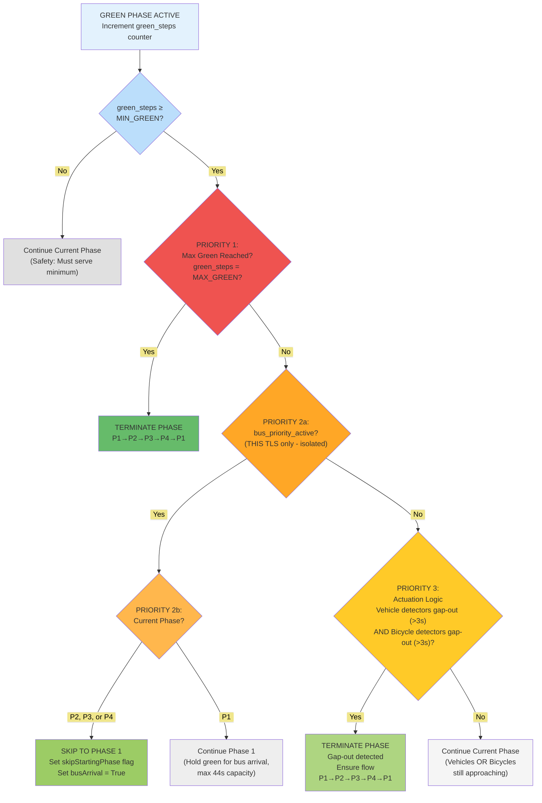
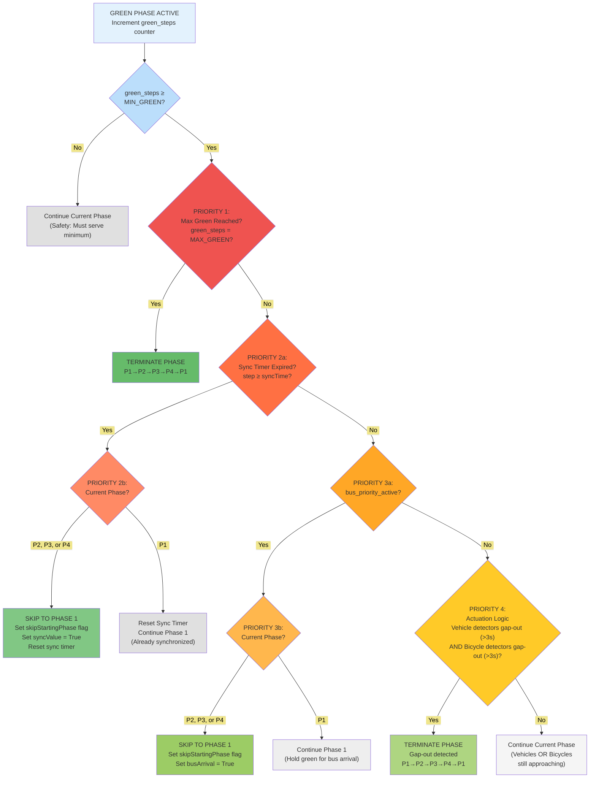

# Isolated Control Logic Without Semi-Synchronization (5-TLS Multi-Agent Network)

This section describes the **isolated actuated control** for the 5-intersection multi-agent network. Each intersection
operates **independently** based solely on its local detector readings—no coordination or synchronization between
intersections.

###### Key Differences from Semi-Synchronized Control

| Feature             | Isolated (5-TLS Network)          |
| ------------------- | --------------------------------- |
| **Coordination**    | None - fully independent          |
| **Phase Structure** | P1→P2→P3→P4→P1                    |
| **Actuation Logic** | Cars gap-out AND Bicycles gap-out |
| **Bus Skip to P1**  | Always WITH leading green         |
| **Priority Levels** | 3 tiers (MAX→Bus→Actuation)       |

###### Bus Signal Detection (Background Process)

When a bus enters the signal emit lane (64s-72s from TLS), the controller stores $\text{bus\_detected\_time}$ and sets
$\text{bus\_approaching} = True$. The controller then waits until $(\text{travel\_time} - 23s)$ has elapsed before
emitting $\text{bus\_priority\_active} = True$, ensuring the bus is exactly 23s away when the signal priority is
activated. This 23s warning guarantees sufficient time to switch to P1 from any phase state.

###### Green Actuation Logic: Isolated Control Decision Hierarchy



###### Isolated Control: Complete Phase Transition Flow

```mermaid
flowchart TD
    subgraph P1_PHASE["PHASE 1: Major Through"]
        P1_LG["Leading Green"] --> P1_Green["P1 GREEN"]
        P1_Green --> P1_Min{"green_steps ≥ MIN_GREEN?"}
        P1_Min -->|<span style='background-color:khaki; color:black; padding:2px 6px; border-radius:3px'>No</span>| P1_Green
        P1_Min -->|<span style='background-color:khaki; color:black; padding:2px 6px; border-radius:3px'>Yes</span>| P1_Pr1{"Priority 1:<br>MAX_GREEN?"}
        P1_Pr1 -->|<span style='background-color:khaki; color:black; padding:2px 6px; border-radius:3px'>Yes</span>| P1_Term["Terminate P1"]
        P1_Pr1 -->|<span style='background-color:khaki; color:black; padding:2px 6px; border-radius:3px'>No</span>| P1_Pr2{"Priority 2:<br>bus_priority_active?"}
        P1_Pr2 -->|<span style='background-color:khaki; color:black; padding:2px 6px; border-radius:3px'>Yes</span>| P1_Hold["Hold P1 for bus"]
        P1_Hold --> P1_Green
        P1_Pr2 -->|<span style='background-color:khaki; color:black; padding:2px 6px; border-radius:3px'>No</span>| P1_Pr3{"Priority 3:<br>Both Cars and Bicycles Gap-out?"}
        P1_Pr3 -->|<span style='background-color:khaki; color:black; padding:2px 6px; border-radius:3px'>Yes</span>| P1_Term
        P1_Pr3 -->|<span style='background-color:khaki; color:black; padding:2px 6px; border-radius:3px'>No</span>| P1_Green
    end

    P1_Term --> Y1["YELLOW"] --> R1["RED"]
    R1 --> P2_LG

    subgraph P2_PHASE["PHASE 2: Major Left"]
        P2_LG["Leading Green"] --> P2_Green["P2 GREEN"]
        P2_Green --> P2_Min{"green_steps ≥ MIN_GREEN?"}
        P2_Min -->|<span style='background-color:khaki; color:black; padding:2px 6px; border-radius:3px'>No</span>| P2_Green
        P2_Min -->|<span style='background-color:khaki; color:black; padding:2px 6px; border-radius:3px'>Yes</span>| P2_Pr1{"Priority 1:<br>MAX_GREEN?"}
        P2_Pr1 -->|<span style='background-color:khaki; color:black; padding:2px 6px; border-radius:3px'>Yes</span>| P2_Term["Terminate P2"]
        P2_Pr1 -->|<span style='background-color:khaki; color:black; padding:2px 6px; border-radius:3px'>No</span>| P2_Pr2{"Priority 2:<br>bus_priority_active?"}
        P2_Pr2 -->|<span style='background-color:khaki; color:black; padding:2px 6px; border-radius:3px'>Yes</span>| P2_Skip["Skip to P1"]
        P2_Pr2 -->|<span style='background-color:khaki; color:black; padding:2px 6px; border-radius:3px'>No</span>| P2_Pr3{"Priority 3:<br>Both Cars and Bicycles Gap-out?"}
        P2_Pr3 -->|<span style='background-color:khaki; color:black; padding:2px 6px; border-radius:3px'>Yes</span>| P2_Term
        P2_Pr3 -->|<span style='background-color:khaki; color:black; padding:2px 6px; border-radius:3px'>No</span>| P2_Green
    end

    P2_Term --> Y2["YELLOW"] --> R2["RED"]
    P2_Skip --> Y2S["YELLOW"] --> R2S["RED"] --> P1_LG
    R2 --> P3_LG

    subgraph P3_PHASE["PHASE 3: Minor Through"]
        P3_LG["Leading Green"] --> P3_Green["P3 GREEN"]
        P3_Green --> P3_Min{"green_steps ≥ MIN_GREEN?"}
        P3_Min -->|<span style='background-color:khaki; color:black; padding:2px 6px; border-radius:3px'>No</span>| P3_Green
        P3_Min -->|<span style='background-color:khaki; color:black; padding:2px 6px; border-radius:3px'>Yes</span>| P3_Pr1{"Priority 1:<br>MAX_GREEN?"}
        P3_Pr1 -->|<span style='background-color:khaki; color:black; padding:2px 6px; border-radius:3px'>Yes</span>| P3_Term["Terminate P3"]
        P3_Pr1 -->|<span style='background-color:khaki; color:black; padding:2px 6px; border-radius:3px'>No</span>| P3_Pr2{"Priority 2:<br>bus_priority_active?"}
        P3_Pr2 -->|<span style='background-color:khaki; color:black; padding:2px 6px; border-radius:3px'>Yes</span>| P3_Skip["Skip to P1"]
        P3_Pr2 -->|<span style='background-color:khaki; color:black; padding:2px 6px; border-radius:3px'>No</span>| P3_Pr3{"Priority 3:<br>Both Cars and Bicycles Gap-out?"}
        P3_Pr3 -->|<span style='background-color:khaki; color:black; padding:2px 6px; border-radius:3px'>Yes</span>| P3_Term
        P3_Pr3 -->|<span style='background-color:khaki; color:black; padding:2px 6px; border-radius:3px'>No</span>| P3_Green
    end

    P3_Term --> Y3["YELLOW"] --> R3["RED"]
    P3_Skip --> Y3S["YELLOW"] --> R3S["RED"] --> P1_LG
    R3 --> P4_LG

    subgraph P4_PHASE["PHASE 4: Minor Left"]
        P4_LG["Leading Green"] --> P4_Green["P4 GREEN"]
        P4_Green --> P4_Min{"green_steps ≥ MIN_GREEN?"}
        P4_Min -->|<span style='background-color:khaki; color:black; padding:2px 6px; border-radius:3px'>No</span>| P4_Green
        P4_Min -->|<span style='background-color:khaki; color:black; padding:2px 6px; border-radius:3px'>Yes</span>| P4_Pr1{"Priority 1:<br>MAX_GREEN?"}
        P4_Pr1 -->|<span style='background-color:khaki; color:black; padding:2px 6px; border-radius:3px'>Yes</span>| P4_Term["Terminate P4"]
        P4_Pr1 -->|<span style='background-color:khaki; color:black; padding:2px 6px; border-radius:3px'>No</span>| P4_Pr2{"Priority 2:<br>bus_priority_active?"}
        P4_Pr2 -->|<span style='background-color:khaki; color:black; padding:2px 6px; border-radius:3px'>Yes</span>| P4_Skip["Skip to P1"]
        P4_Pr2 -->|<span style='background-color:khaki; color:black; padding:2px 6px; border-radius:3px'>No</span>| P4_Pr3{"Priority 3:<br>Both Cars and Bicycles Gap-out?"}
        P4_Pr3 -->|<span style='background-color:khaki; color:black; padding:2px 6px; border-radius:3px'>Yes</span>| P4_Term
        P4_Pr3 -->|<span style='background-color:khaki; color:black; padding:2px 6px; border-radius:3px'>No</span>| P4_Green
    end

    P4_Term --> Y4["YELLOW"] --> R4["RED"] --> P1_LG
    P4_Skip --> Y4S["YELLOW"] --> R4S["RED"] --> P1_LG

    style P1_PHASE fill:#E3F2FD
    style P2_PHASE fill:#BBDEFB
    style P3_PHASE fill:#90CAF9
    style P4_PHASE fill:#64B5F6
    style Y1 fill:#FDD835
    style Y2 fill:#FDD835
    style Y3 fill:#FDD835
    style Y4 fill:#FDD835
    style Y2S fill:#FDD835
    style Y3S fill:#FDD835
    style Y4S fill:#FDD835
    style R1 fill:#EF5350
    style R2 fill:#EF5350
    style R3 fill:#EF5350
    style R4 fill:#EF5350
    style R2S fill:#EF5350
    style R3S fill:#EF5350
    style R4S fill:#EF5350
```



###### Isolated Control: Simplified Phase Transition Flow

```mermaid
flowchart TD
    subgraph P1_PHASE["PHASE 1: Major Through (Bus Priority: HOLD)"]
        P1_LG["Leading Green"] --> P1_Green["P1 GREEN"]
        P1_Green --> P1_Min{"green_steps ≥ MIN_GREEN?"}
        P1_Min -->|<span style='background-color:khaki; color:black; padding:2px 6px; border-radius:3px'>No</span>| P1_Green
        P1_Min -->|<span style='background-color:khaki; color:black; padding:2px 6px; border-radius:3px'>Yes</span>| P1_Pr1{"Priority 1:<br>MAX_GREEN?"}
        P1_Pr1 -->|<span style='background-color:khaki; color:black; padding:2px 6px; border-radius:3px'>Yes</span>| P1_Term["Terminate P1"]
        P1_Pr1 -->|<span style='background-color:khaki; color:black; padding:2px 6px; border-radius:3px'>No</span>| P1_Pr2{"Priority 2:<br>bus_priority_active?"}
        P1_Pr2 -->|<span style='background-color:khaki; color:black; padding:2px 6px; border-radius:3px'>Yes</span>| P1_Hold["Hold P1 for bus"]
        P1_Hold --> P1_Green
        P1_Pr2 -->|<span style='background-color:khaki; color:black; padding:2px 6px; border-radius:3px'>No</span>| P1_Pr3{"Priority 3:<br>Both Cars and Bicycles Gap-out?"}
        P1_Pr3 -->|<span style='background-color:khaki; color:black; padding:2px 6px; border-radius:3px'>Yes</span>| P1_Term
        P1_Pr3 -->|<span style='background-color:khaki; color:black; padding:2px 6px; border-radius:3px'>No</span>| P1_Green
    end

    P1_Term --> Y1["YELLOW"] --> R1["RED"]
    R1 -->|<span style='background-color:khaki; color:black; padding:2px 6px; border-radius:3px'>P1→P2 ALWAYS</span>| Px_LG

    subgraph Px_PHASE["PHASE 2/3/4 (Bus Priority: SKIP TO P1)"]
        Px_LG["Leading Green"] --> Px_Green["Px GREEN"]
        Px_Green --> Px_Min{"green_steps ≥ MIN_GREEN?"}
        Px_Min -->|<span style='background-color:khaki; color:black; padding:2px 6px; border-radius:3px'>No</span>| Px_Green
        Px_Min -->|<span style='background-color:khaki; color:black; padding:2px 6px; border-radius:3px'>Yes</span>| Px_Pr1{"Priority 1:<br>MAX_GREEN?"}
        Px_Pr1 -->|<span style='background-color:khaki; color:black; padding:2px 6px; border-radius:3px'>Yes</span>| Px_Term["Terminate Px"]
        Px_Pr1 -->|<span style='background-color:khaki; color:black; padding:2px 6px; border-radius:3px'>No</span>| Px_Pr2{"Priority 2:<br>bus_priority_active?"}
        Px_Pr2 -->|<span style='background-color:khaki; color:black; padding:2px 6px; border-radius:3px'>Yes</span>| Px_Skip["Skip to P1"]
        Px_Pr2 -->|<span style='background-color:khaki; color:black; padding:2px 6px; border-radius:3px'>No</span>| Px_Pr3{"Priority 3:<br>Both Cars and Bicycles Gap-out?"}
        Px_Pr3 -->|<span style='background-color:khaki; color:black; padding:2px 6px; border-radius:3px'>Yes</span>| Px_Term
        Px_Pr3 -->|<span style='background-color:khaki; color:black; padding:2px 6px; border-radius:3px'>No</span>| Px_Green
    end

    Px_Term --> Yx["YELLOW"] --> Rx["RED"]
    Px_Skip --> Yx
    Rx -->|<span style='background-color:khaki; color:black; padding:2px 6px; border-radius:3px'>P2→P3, P3→P4</span>| Px_LG
    Rx -->|<span style='background-color:khaki; color:black; padding:2px 6px; border-radius:3px'>P4→P1, Skip to P1</span>| P1_LG

    style P1_PHASE fill:#E3F2FD
    style Px_PHASE fill:#90CAF9
    style Y1 fill:#FDD835
    style Yx fill:#FDD835
    style R1 fill:#EF5350
    style Rx fill:#EF5350
```



###### Isolated Control: Priority Values and Timing

| Parameter            | Value      | Purpose                           |
| -------------------- | ---------- | --------------------------------- |
| **MIN_GREEN (P1)**   | 8 seconds  | Minimum service for major through |
| **MIN_GREEN (P2)**   | 3 seconds  | Minimum service for major left    |
| **MIN_GREEN (P3)**   | 5 seconds  | Minimum service for minor through |
| **MIN_GREEN (P4)**   | 2 seconds  | Minimum service for minor left    |
| **MAX_GREEN (P1)**   | 44 seconds | Maximum arterial through service  |
| **MAX_GREEN (P2)**   | 15 seconds | Maximum major left service        |
| **MAX_GREEN (P3)**   | 24 seconds | Maximum minor through service     |
| **MAX_GREEN (P4)**   | 12 seconds | Maximum minor left service        |
| **YELLOW_TIME**      | 3 seconds  | Warning interval before red       |
| **ALL_RED_TIME**     | 2 seconds  | Clearance interval between phases |
| **Leading Green**    | 1 second   | Priority start for bicycles       |
| **Detector Gap-Out** | 3 seconds  | No detector activation threshold  |

###### Key Characteristics of Isolated Control

1. **Fully Independent**: Each TLS makes decisions based only on its local detectors
2. **No Coordination Overhead**: No sync timers or inter-TLS communication
3. **Simplified Actuation**: OR logic (cars OR bikes gap-out) reduces phase holding
4. **No Pedestrian Phase**: 4-phase cycle only (P1→P2→P3→P4→P1)
5. **Bus Priority Preserved**: Skip to P1 for bus, but without bicycle leading green
6. **Circular Flow Guaranteed**: MAX_GREEN always triggers next phase in sequence

---

##### Time Duration Analysis: Switching to P1 from Any Point in Cycle

This analysis calculates the minimum time required to reach Phase 1 (P1) from any point in the traffic signal cycle,
considering bus priority coordination requirements.

###### Constraints and Fixed Parameters

| Parameter           | Value | Purpose                                              |
| ------------------- | ----- | ---------------------------------------------------- |
| **Leading Green**   | 1s    | Bicycle priority start before main green             |
| **Yellow**          | 3s    | Warning interval (fixed, safety requirement)         |
| **Red Clearance**   | 2s    | Intersection clearance (fixed, safety requirement)   |
| **Transition Time** | 6s    | Yellow + Red per phase change (3s + 2s + 1s leading) |

**Critical Rule**: Cannot skip from P1 directly back to P1. Must pass through at least P2 before returning to P1.

###### Phase Timing Reference

| Phase              | MIN_GREEN | MAX_GREEN |
| ------------------ | --------- | --------- |
| P1 (Major Through) | 8s        | 44s       |
| P2 (Major Left)    | 3s        | 15s       |
| P3 (Minor Through) | 5s        | 24s       |
| P4 (Minor Left)    | 2s        | 12s       |

##### Case Analysis: Time to Reach P1

###### From P1 (Must go through P2 minimum)

**Case 1a: At start of P1 MIN_GREEN**

```
P1 MIN_GREEN remaining: 8s
+ P1 Yellow: 3s
+ P1 Red: 2s
+ P2 Leading Green: 1s
+ P2 MIN_GREEN: 3s
+ P2 Yellow: 3s
+ P2 Red: 2s
+ P1 Leading Green: 1s
────────────────────────
Total: 23 seconds
```

###### **Case 1b: In P1 actuation period (MIN served, can terminate)**

```
P1 Yellow: 3s
+ P1 Red: 2s
+ P2 Leading Green: 1s
+ P2 MIN_GREEN: 3s
+ P2 Yellow: 3s
+ P2 Red: 2s
+ P1 Leading Green: 1s
────────────────────────
Total: 15 seconds
```

##### From P2 (Can skip to P1)

###### **Case 2a: At start of P2 MIN_GREEN**

```
P2 MIN_GREEN remaining: 3s
+ P2 Yellow: 3s
+ P2 Red: 2s
+ P1 Leading Green: 1s
────────────────────────
Total: 9 seconds
```

###### **Case 2b: In P2 actuation period (MIN served, can terminate)**

```
P2 Yellow: 3s
+ P2 Red: 2s
+ P1 Leading Green: 1s
────────────────────────
Total: 6 seconds
```

##### From P3 (Can skip to P1)

###### **Case 3a: At start of P3 MIN_GREEN**

```
P3 MIN_GREEN remaining: 5s
+ P3 Yellow: 3s
+ P3 Red: 2s
+ P1 Leading Green: 1s
────────────────────────
Total: 11 seconds
```

###### **Case 3b: In P3 actuation period (MIN served, can terminate)**

```
P3 Yellow: 3s
+ P3 Red: 2s
+ P1 Leading Green: 1s
────────────────────────
Total: 6 seconds
```

##### From P4 (Can skip to P1)

###### **Case 4a: At start of P4 MIN_GREEN**

```
P4 MIN_GREEN remaining: 2s
+ P4 Yellow: 3s
+ P4 Red: 2s
+ P1 Leading Green: 1s
────────────────────────
Total: 8 seconds
```

###### **Case 4b: In P4 actuation period (MIN served, can terminate)**

```
P4 Yellow: 3s
+ P4 Red: 2s
+ P1 Leading Green: 1s
────────────────────────
Total: 6 seconds
```

##### Summary Table

| Current Phase | At Start of MIN_GREEN | In Actuation Period |
| ------------- | --------------------- | ------------------- |
| **P1**        | 23s (via P2)          | 15s (via P2)        |
| **P2**        | 9s                    | 6s                  |
| **P3**        | 11s                   | 6s                  |
| **P4**        | 8s                    | 6s                  |

##### Worst Case Analysis

**Absolute Worst Case: 23 seconds**

- Occurs when bus signal arrives at the exact start of P1 MIN_GREEN
- Must complete: P1 MIN (8s) → P1 Yellow (3s) → P1 Red (2s) → P2 Leading (1s) → P2 MIN (3s) → P2 Yellow (3s) → P2 Red
  (2s) → P1 Leading (1s)

**Best Case: 6 seconds**

- Occurs when in actuation period of P2, P3, or P4
- Only requires: Yellow (3s) → Red (2s) → P1 Leading (1s)

##### Implication for Bus Coordination

With bus signal emission lanes providing 64-72 seconds warning:

- **64s warning** (middle TLS): Covers worst case (23s) with 41s margin
- **72s warning** (edge TLS): Covers worst case (23s) with 49s margin

This ensures the controller can always guarantee green for bus arrival regardless of current phase state.

##### Why 23s Warning is Sufficient for All Cases

**Question**: If we inform the TLS 23s before bus arrival (worst case timing), what happens in best case scenarios where
only 6s is needed?

**Analysis: Best Case Scenario (In Actuation Period of P2/P3/P4)**

```
Bus signal received: Bus is 23s away
Time to switch to P1: 6s (best case)
────────────────────────────────────
After P1 starts: Bus is 23s - 6s = 17s away

P1 sequence:
- Leading Green: 1s → Bus is 16s away
- MIN_GREEN: 8s → Bus is 8s away
- Actuation period: Hold green until bus passes

Bus arrives 8s after MIN_GREEN ends.
Controller simply holds P1 green for 8s more.
Total P1 green time: 1s + 8s + 8s = 17s (well under MAX of 44s)
```

**Analysis: Intermediate Case (At Start of P3 MIN_GREEN)**

```
Bus signal received: Bus is 23s away
Time to switch to P1: 11s (P3 case)
────────────────────────────────────
After P1 starts: Bus is 23s - 11s = 12s away

P1 sequence:
- Leading Green: 1s → Bus is 11s away
- MIN_GREEN: 8s → Bus is 3s away
- Actuation period: Hold green 3s more until bus passes

Bus arrives 3s after MIN_GREEN ends.
Controller holds P1 green for 3s more.
Total P1 green time: 1s + 8s + 3s = 12s (well under MAX of 44s)
```

**Analysis: Worst Case (At Start of P1 MIN_GREEN)**

```
Bus signal received: Bus is 23s away
Time to switch to P1: 23s (must go through P2)
────────────────────────────────────
Bus arrives exactly when P1 Leading Green starts.
Bus gets green immediately with no wait.
```

###### Confirmation: 23s Warning Guarantees Green for All Cases

| Scenario                       | Time to P1 | Bus Arrival After P1 Start | Action Required             |
| ------------------------------ | ---------- | -------------------------- | --------------------------- |
| Best case (actuation P2/P3/P4) | 6s         | 17s after P1 start         | Hold P1 green 9s after MIN  |
| P4 at MIN start                | 8s         | 15s after P1 start         | Hold P1 green 7s after MIN  |
| P2 at MIN start                | 9s         | 14s after P1 start         | Hold P1 green 6s after MIN  |
| P3 at MIN start                | 11s        | 12s after P1 start         | Hold P1 green 4s after MIN  |
| P1 actuation period            | 15s        | 8s after P1 start          | Hold P1 green at MIN        |
| Worst case (P1 at MIN start)   | 23s        | 0s (arrives at P1 start)   | Green immediately available |

**Key Insight**: Since P1 MAX_GREEN is 44s, the controller has ample capacity to hold P1 green until bus passes in all
scenarios. The only requirement is that the controller must NOT transition away from P1 while bus is approaching
(detected via bus priority lanes).

**Conclusion**: A fixed 23s warning time is sufficient to guarantee uninterrupted green for bus arrival regardless of
current phase state. The controller logic simply needs to:

1. Receive bus signal when bus enters emit lane
2. Switch to P1 as fast as possible (respecting MIN_GREEN and transitions)
3. Hold P1 green until bus clears the intersection

---

---

---

---

# Isolated Control Logic With Semi-Synchronization (5-TLS Multi-Agent Network)

Your system implements a **four-tier priority hierarchy** that evaluates conditions every second after minimum green
time. The control operates independently at each intersection but includes coordination mechanisms.

###### Green Actuation Logic: The Core Decision Hierarchy

This is where the four-tier priority system operates during the actuated green phase:



##### Synchronization Mechanism

###### Complete Phase Transition Flow (Semi-Sync)

```mermaid
flowchart TD
    subgraph P1_PHASE["PHASE 1: Major Through (Sync: RESET, Bus: HOLD)"]
        P1_LG["Leading Green"] --> P1_Green["P1 GREEN"]
        P1_Green --> P1_Min{"green_steps ≥ MIN_GREEN?"}
        P1_Min -->|<span style='background-color:khaki; color:black; padding:2px 6px; border-radius:3px'>No</span>| P1_Green
        P1_Min -->|<span style='background-color:khaki; color:black; padding:2px 6px; border-radius:3px'>Yes</span>| P1_Pr1{"Priority 1:<br>MAX_GREEN?"}
        P1_Pr1 -->|<span style='background-color:khaki; color:black; padding:2px 6px; border-radius:3px'>Yes</span>| P1_Term["Terminate P1"]
        P1_Pr1 -->|<span style='background-color:khaki; color:black; padding:2px 6px; border-radius:3px'>No</span>| P1_Pr2{"Priority 2:<br>Sync Timer Expired?"}
        P1_Pr2 -->|<span style='background-color:khaki; color:black; padding:2px 6px; border-radius:3px'>Yes</span>| P1_Sync["Reset Sync Timer<br>Continue P1"]
        P1_Sync --> P1_Green
        P1_Pr2 -->|<span style='background-color:khaki; color:black; padding:2px 6px; border-radius:3px'>No</span>| P1_Pr3{"Priority 3:<br>bus_priority_active?"}
        P1_Pr3 -->|<span style='background-color:khaki; color:black; padding:2px 6px; border-radius:3px'>Yes</span>| P1_Hold["Hold P1 for bus"]
        P1_Hold --> P1_Green
        P1_Pr3 -->|<span style='background-color:khaki; color:black; padding:2px 6px; border-radius:3px'>No</span>| P1_Pr4{"Priority 4:<br>Both Cars AND Bicycles Gap-out?"}
        P1_Pr4 -->|<span style='background-color:khaki; color:black; padding:2px 6px; border-radius:3px'>Yes</span>| P1_Term
        P1_Pr4 -->|<span style='background-color:khaki; color:black; padding:2px 6px; border-radius:3px'>No</span>| P1_Green
    end

    P1_Term --> Y1["YELLOW"] --> R1["RED"]
    R1 --> Px_LG

    subgraph Px_PHASE["PHASE 2/3/4 (Sync: SKIP, Bus: SKIP TO P1)"]
        Px_LG["Leading Green"] --> Px_Green["Px GREEN"]
        Px_Green --> Px_Min{"green_steps ≥ MIN_GREEN?"}
        Px_Min -->|<span style='background-color:khaki; color:black; padding:2px 6px; border-radius:3px'>No</span>| Px_Green
        Px_Min -->|<span style='background-color:khaki; color:black; padding:2px 6px; border-radius:3px'>Yes</span>| Px_Pr1{"Priority 1:<br>MAX_GREEN?"}
        Px_Pr1 -->|<span style='background-color:khaki; color:black; padding:2px 6px; border-radius:3px'>Yes</span>| Px_Term["Terminate Px"]
        Px_Pr1 -->|<span style='background-color:khaki; color:black; padding:2px 6px; border-radius:3px'>No</span>| Px_Pr2{"Priority 2:<br>Sync Timer Expired?"}
        Px_Pr2 -->|<span style='background-color:khaki; color:black; padding:2px 6px; border-radius:3px'>Yes</span>| Px_SyncSkip["Skip to P1<br>(syncValue=True)"]
        Px_Pr2 -->|<span style='background-color:khaki; color:black; padding:2px 6px; border-radius:3px'>No</span>| Px_Pr3{"Priority 3:<br>bus_priority_active?"}
        Px_Pr3 -->|<span style='background-color:khaki; color:black; padding:2px 6px; border-radius:3px'>Yes</span>| Px_BusSkip["Skip to P1<br>(busArrival=True)"]
        Px_Pr3 -->|<span style='background-color:khaki; color:black; padding:2px 6px; border-radius:3px'>No</span>| Px_Pr4{"Priority 4:<br>Both Cars AND Bicycles Gap-out?"}
        Px_Pr4 -->|<span style='background-color:khaki; color:black; padding:2px 6px; border-radius:3px'>Yes</span>| Px_Term
        Px_Pr4 -->|<span style='background-color:khaki; color:black; padding:2px 6px; border-radius:3px'>No</span>| Px_Green
    end

    Px_Term --> Yx["YELLOW"] --> Rx["RED"]
    Px_SyncSkip --> Yx
    Px_BusSkip --> Yx
    Rx -->|<span style='background-color:khaki; color:black; padding:2px 6px; border-radius:3px'>P2→P3, P3→P4</span>| Px_LG
    Rx -->|<span style='background-color:khaki; color:black; padding:2px 6px; border-radius:3px'>P4→P1, Skip to P1</span>| P1_LG

    style P1_PHASE fill:#E3F2FD
    style Px_PHASE fill:#90CAF9
    style Y1 fill:#FDD835
    style Yx fill:#FDD835
    style R1 fill:#EF5350
    style Rx fill:#EF5350
```



###### Key Implementation Details from Code

###### Priority Values and Timing

| Parameter                | Value                        | Purpose                                  |
| ------------------------ | ---------------------------- | ---------------------------------------- |
| **MIN_GREEN_TIME**       | 5 seconds                    | Safety: Minimum service before decisions |
| **YELLOW_TIME**          | 3 seconds                    | Warning interval before red              |
| **ALL_RED_TIME**         | 2 seconds                    | Clearance interval between phases        |
| **Leading Green**        | 1 second                     | Priority start for bicycles/pedestrians  |
| **Detector Gap-Out**     | 3 seconds (`critical_delay`) | No detector activation threshold         |
| **Sync Offset**          | 22 seconds                   | Coordination delay between intersections |
| **Pedestrian Threshold** | ≥12 waiting                  | Triggers exclusive Phase 5               |
| **Phase 5 Duration**     | 15 seconds                   | Fixed pedestrian service time            |

###### Detector Logic

**Vehicle Detectors (D30)**:

- Positioned 30m upstream
- 3-second detection window
- Binary: Occupied if activation within last 3s

**Bicycle Detectors (D15)**:

- Positioned 15m upstream
- 3-second detection window
- Checked AFTER vehicle gap-out
- Provides bicycle protection

**Pedestrian Detectors**:

- Uses SUMO inductionloop API
- Counts pedestrians with speed < 0.1 m/s
- Threshold: ≥12 triggers Phase 5

###### Bus Priority Implementation

- Checks bus presence in specific entry lanes
- Triggers immediate phase skip during P2, P3, P4
- Holds Phase 1 if bus already being served
- Phase skip leads to P1 **without leading green** for buses

##### Summary of Control Philosophy

The code implements a **pragmatic hierarchical control** with these characteristics:

1. **Safety First**: Minimum green and maximum green are hard constraints
2. **Coordination Attempted**: Semi-sync tries 60% success rate through timing
3. **Bus Priority**: Active detection with context-aware skipping
4. **Bicycle Protection**: Two-tier gap-out ensures vulnerable road user service
5. **Pedestrian Accommodation**: Dedicated phase when demand exceeds threshold
6. **Graceful Degradation**: When priority conditions fail, normal actuation takes over

This represents a sophisticated rule-based system that balances multiple competing objectives through careful priority
ordering and detector-based responsiveness—a substantial advancement over simple fixed-time or single-mode actuated
control.

---
