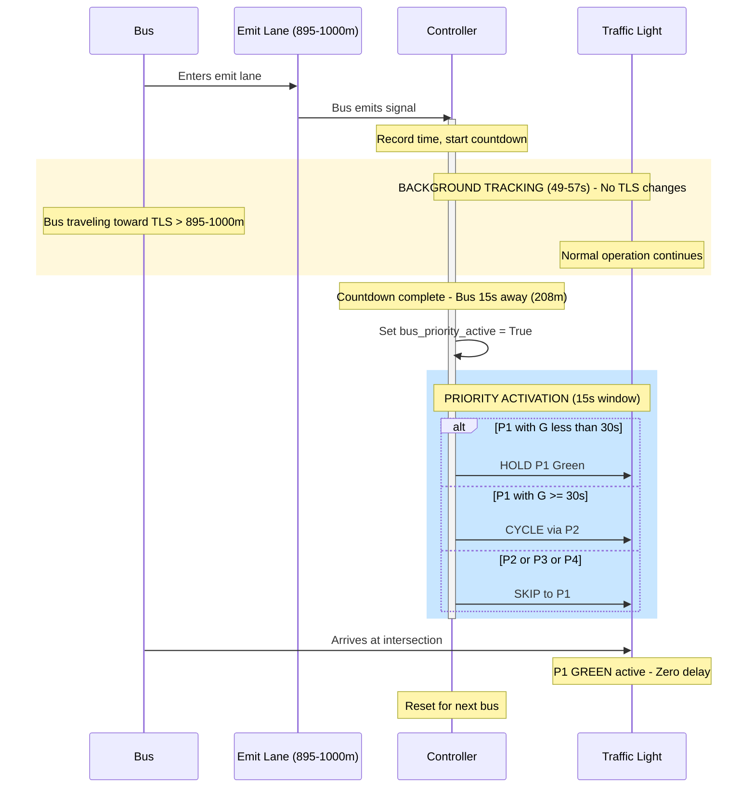
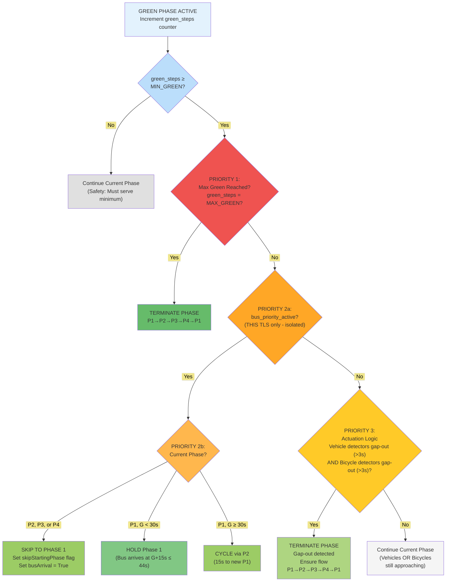
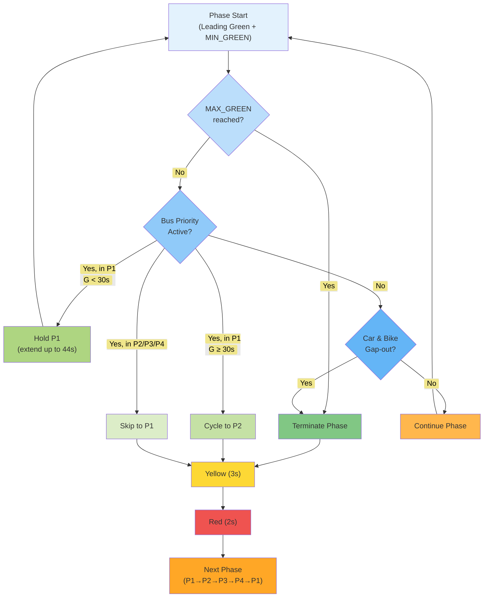
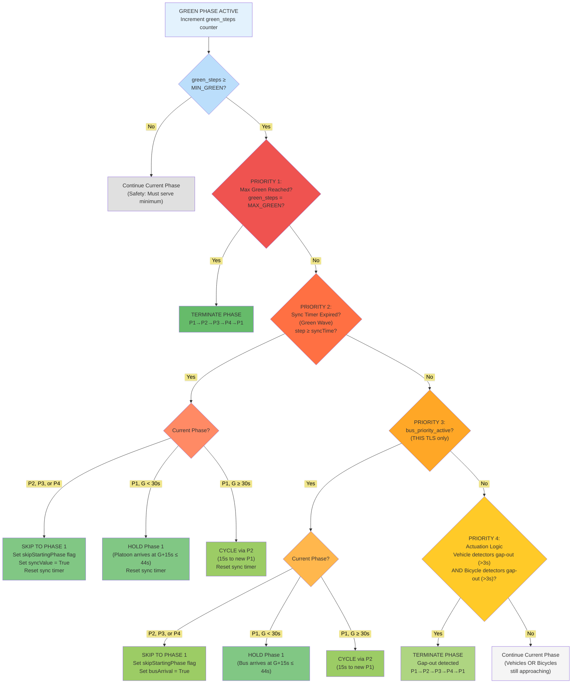
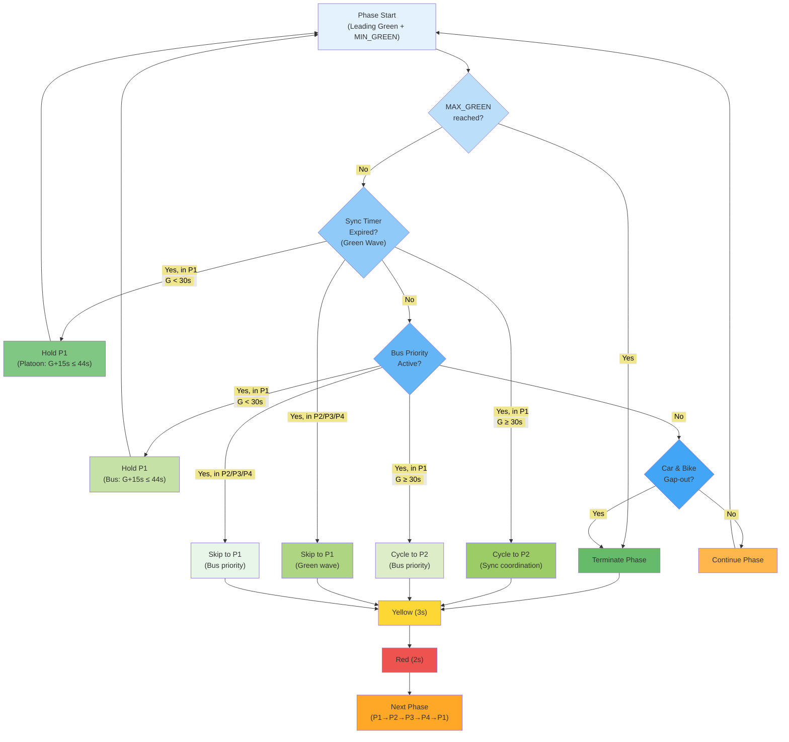

# Isolated Control Logic Without Semi-Synchronization (5-TLS Multi-Agent Network)

This section describes the **isolated actuated control** without Semi-Synchronization for the 5-intersection multi-agent
network. Each intersection operates **independently** based solely on its local detector readings—no coordination or
synchronization between intersections.

###### Effective Speeds for Modes

Since the lane speed limit (13.89 m/s) is lower than car/bus maximum speed, the **effective speed is:**

| Vehicle | Effective Max Speed  | Reason                           |
| ------- | -------------------- | -------------------------------- |
| Car     | 13.89 m/s (50 km/h)  | Lane speed limit                 |
| Bus     | 13.89 m/s (50 km/h)  | Lane speed limit                 |
| Bicycle | 5.8 m/s (20.88 km/h) | vType maxSpeed (lower than lane) |

**Key insight:** Cars and buses are limited by the 50 km/h lane speed, while bicycles are limited by about ~21 km/h.

###### Bus Signal Detection (Background Process)

The bus priority system uses **upstream emit lanes** positioned 64-72 seconds travel time from the intersection. When a
bus enters this lane, it **emits a signal to the TLS controller** announcing its approach. The controller then uses a
background timing process to activate priority exactly **15 seconds before the bus arrives**.

**How Travel Time is Calculated from Network Geometry:**

The emit lane positions are determined by the SUMO network geometry. Travel time is calculated from actual lane
distances:

| Parameter             | Value                                                 |
| --------------------- | ----------------------------------------------------- |
| Bus speed             | 13.89 m/s (50 km/h, limited by lane speed)            |
| Lane distance (short) | 895m (= 790m + 105m) → 895 / 13.89 = **64 seconds**   |
| Lane distance (long)  | 1000m (= 895m + 105m) → 1000 / 13.89 = **72 seconds** |

**Emit Lane Configuration by TLS:**

| TLS   | Upstream Lane | Downstream Lane |
| ----- | ------------- | --------------- |
| TLS-1 | 1000m (72s)   | 895m (64s)      |
| TLS-2 | 895m (64s)    | 895m (64s)      |
| TLS-3 | 895m (64s)    | 895m (64s)      |
| TLS-4 | 895m (64s)    | 895m (64s)      |
| TLS-5 | 895m (64s)    | 1000m (72s)     |

Most lanes are 895m (64s travel time), while the corridor endpoints (TLS-1 upstream, TLS-5 downstream) have 1000m lanes
(72s travel time).

**Detection and Timing Sequence:**



**Step-by-Step Timing:**

1. **Bus enters emit lane**: Bus emits signal → Controller receives and records $\text{bus\_detected\_time}$, sets
   $\text{bus\_approaching} = True$
2. **Wait period**: Controller waits for $(\text{lane\_travel\_time} - 15s)$ to elapse
3. **Priority activation**: Controller sets $\text{bus\_priority\_active} = True$ and begins phase preparation

**Example Timing:**

| Emit Lane    | Distance | Travel Time | Controller Wait | Priority Activated When Bus Is |
| ------------ | -------- | ----------- | --------------- | ------------------------------ |
| Short (most) | 895m     | 64s         | 64s - 15s = 49s | 15s (208m) from TLS            |
| Long (edges) | 1000m    | 72s         | 72s - 15s = 57s | 15s (208m) from TLS            |

**Why 15s Warning?** This guarantees sufficient time for the TLS to prepare P1 green:

- **If at P1 with G < 30s**: Hold P1 green (bus arrives at G+15s ≤ 44s MAX_GREEN)
- **If at P1 with G ≥ 30s**: Cycle through P2 (15s transition to fresh P1)
- **If at P2/P3/P4**: Skip to P1 (worst case 11s from P3 MIN_GREEN start)

**Result**: Zero bus delay in all scenarios—the bus always arrives when P1 green is active.

###### Green Actuation Logic: Isolated Control Decision Hierarchy



###### Isolated Control: Phase Transition Flow

```mermaid
flowchart TD
    subgraph P1_PHASE["PHASE 1: Major Through (Bus Priority: HOLD or CYCLE)"]
        P1_LG["Leading Green"] --> P1_Green["P1 GREEN"]
        P1_Green --> P1_Min{"green_steps ≥ MIN_GREEN?"}
        P1_Min -->|<span style='background-color:khaki; color:black; padding:2px 6px; border-radius:3px'>No</span>| P1_Green
        P1_Min -->|<span style='background-color:khaki; color:black; padding:2px 6px; border-radius:3px'>Yes</span>| P1_Pr1{"Priority 1:<br>MAX_GREEN?"}
        P1_Pr1 -->|<span style='background-color:khaki; color:black; padding:2px 6px; border-radius:3px'>Yes</span>| P1_Term["Terminate P1"]
        P1_Pr1 -->|<span style='background-color:khaki; color:black; padding:2px 6px; border-radius:3px'>No</span>| P1_Pr2{"Priority 2:<br>bus_priority_active?"}
        P1_Pr2 -->|<span style='background-color:khaki; color:black; padding:2px 6px; border-radius:3px'>Yes, G < 30s</span>| P1_Hold["Hold P1 for bus<br>(G+15s ≤ 44s)"]
        P1_Hold --> P1_Green
        P1_Pr2 -->|<span style='background-color:khaki; color:black; padding:2px 6px; border-radius:3px'>Yes, G ≥ 30s</span>| P1_Cycle["Cycle via P2"]
        P1_Pr2 -->|<span style='background-color:khaki; color:black; padding:2px 6px; border-radius:3px'>No</span>| P1_Pr3{"Priority 3:<br>Both Cars and Bicycles Gap-out?"}
        P1_Pr3 -->|<span style='background-color:khaki; color:black; padding:2px 6px; border-radius:3px'>Yes</span>| P1_Term
        P1_Pr3 -->|<span style='background-color:khaki; color:black; padding:2px 6px; border-radius:3px'>No</span>| P1_Green
    end

    P1_Term --> Y1["YELLOW"] --> R1["RED"]
    P1_Cycle --> Y1
    R1 -->|<span style='background-color:khaki; color:black; padding:2px 6px; border-radius:3px'>P1→P2 ALWAYS</span>| Px_LG

    subgraph Px_PHASE["PHASE 2/3/4 (Bus Priority: SKIP TO P1)"]
        Px_LG["Leading Green"] --> Px_Green["Px GREEN"]
        Px_Green --> Px_Min{"green_steps ≥ MIN_GREEN?"}
        Px_Min -->|<span style='background-color:khaki; color:black; padding:2px 6px; border-radius:3px'>No</span>| Px_Green
        Px_Min -->|<span style='background-color:khaki; color:black; padding:2px 6px; border-radius:3px'>Yes</span>| Px_Pr1{"Priority 1:<br>MAX_GREEN?"}
        Px_Pr1 -->|<span style='background-color:khaki; color:black; padding:2px 6px; border-radius:3px'>Yes</span>| Px_Term["Terminate Px"]
        Px_Pr1 -->|<span style='background-color:khaki; color:black; padding:2px 6px; border-radius:3px'>No</span>| Px_Pr2{"Priority 2:<br>bus_priority_active?"}
        Px_Pr2 -->|<span style='background-color:khaki; color:black; padding:2px 6px; border-radius:3px'>Yes</span>| Px_Skip["Skip to P1"]
        Px_Pr2 -->|<span style='background-color:khaki; color:black; padding:2px 6px; border-radius:3px'>No</span>| Px_Pr3{"Priority 3:<br>Both Cars and Bicycles Gap-out?"}
        Px_Pr3 -->|<span style='background-color:khaki; color:black; padding:2px 6px; border-radius:3px'>Yes</span>| Px_Term
        Px_Pr3 -->|<span style='background-color:khaki; color:black; padding:2px 6px; border-radius:3px'>No</span>| Px_Green
    end

    Px_Term --> Yx["YELLOW"] --> Rx["RED"]
    Px_Skip --> Yx
    Rx -->|<span style='background-color:khaki; color:black; padding:2px 6px; border-radius:3px'>P2→P3, P3→P4</span>| Px_LG
    Rx -->|<span style='background-color:khaki; color:black; padding:2px 6px; border-radius:3px'>P4→P1, Skip to P1</span>| P1_LG

    style P1_PHASE fill:#E3F2FD
    style Px_PHASE fill:#90CAF9
    style Y1 fill:#FDD835
    style Yx fill:#FDD835
    style R1 fill:#EF5350
    style Rx fill:#EF5350
```



###### Isolated Control: Phase Transition Flow (Concise Version)



###### Key Characteristics of Isolated Control

1. **Fully Independent**: Each TLS makes decisions based only on its local detectors
2. **No Coordination Overhead**: No sync timers or inter-TLS communication
3. **AND Actuation Logic**: Both cars AND bicycles must gap-out before phase termination
4. **Normal Flow is Circular**: 4-phase cycle only (P1→P2→P3→P4→P1)
5. **Bus Priority with 15s Warning**: Hold P1 (G < 30s) or cycle via P2 (G ≥ 30s) for zero bus delay
6. **Circular Flow Guaranteed**: MAX_GREEN always triggers next phase in sequence

---

##### Time Duration Analysis: Switching to P1 from Any Point in Cycle

This analysis calculates the minimum time required to reach Phase 1 (P1) from any point in the traffic signal cycle,
considering bus priority coordination requirements.

###### Constraints and Fixed Parameters

| Parameter           | Value | Purpose                                              |
| ------------------- | ----- | ---------------------------------------------------- |
| **Leading Green**   | 1s    | Bicycle priority start before main green             |
| **Yellow**          | 3s    | Warning interval (fixed, safety requirement)         |
| **Red Clearance**   | 2s    | Intersection clearance (fixed, safety requirement)   |
| **Transition Time** | 6s    | Yellow + Red per phase change (3s + 2s + 1s leading) |

**Critical Rule**: Cannot skip from P1 directly back to P1. Must pass through at least P2 before returning to P1.

###### Phase Timing Reference

| Phase              | MIN_GREEN | MAX_GREEN |
| ------------------ | --------- | --------- |
| P1 (Major Through) | 8s        | 44s       |
| P2 (Major Left)    | 3s        | 15s       |
| P3 (Minor Through) | 5s        | 24s       |
| P4 (Minor Left)    | 2s        | 12s       |

##### Case Analysis: Time to Reach P1

###### From P1 (HOLD or CYCLE)

If bus priority signal arrives while already at P1:

- **G < 30s**: Controller **holds P1 green** (bus arrives at G+15s ≤ 44s MAX_GREEN)
- **G ≥ 30s**: Controller must **cycle via P2** (G+15s would exceed 44s MAX_GREEN)

**Key constraint**: P1 green time G must satisfy: G + 15s ≤ MAX_GREEN (44s) → G ≤ 29s for hold

**Case 1a: P1 green time G < 30s (Can extend)**

```
Bus signal arrives: Bus is 15s away
Current P1 green: G seconds (where G < 30s)
────────────────────────────────────────────
Action: HOLD P1 green
Bus arrives at: G + 15s (≤ 44s) ✓
No phase transition needed.
```

When P1 has been green for less than 30 seconds and a bus signal arrives, the controller simply continues holding the
green phase. Since the bus will arrive in 15 seconds, the total P1 green time will be G+15s, which is at most 29+15=44s,
exactly matching MAX_GREEN. No phase transition occurs—the bus passes through without delay.

**Case 1b: P1 green time G ≥ 30s (Cannot extend, must cycle)**

```
Bus signal arrives: Bus is 15s away
Current P1 green: G seconds (where G ≥ 30s)
G + 15s > 44s (exceeds MAX_GREEN)
────────────────────────────────────────────
Action: Must cycle through P2 and return to P1

P1 Yellow: 3s
+ P1 Red: 2s
+ P2 Leading Green: 1s
+ P2 MIN_GREEN: 3s
+ P2 Yellow: 3s
+ P2 Red: 2s
+ P1 Leading Green: 1s
────────────────────────
Total: 15 seconds (via P2)
```

When P1 has been green for 30 seconds or more, extending it by 15 seconds would exceed the 44s MAX_GREEN limit. Instead,
the controller cycles through P2 with its minimum green time (3s), taking exactly 15 seconds total. The bus arrives
precisely when the new P1 phase begins—still achieving zero delay.

##### From P2 (Can skip to P1)

###### **Case 2a: At start of P2 MIN_GREEN**

```
P2 MIN_GREEN remaining: 3s
+ P2 Yellow: 3s
+ P2 Red: 2s
+ P1 Leading Green: 1s
────────────────────────
Total: 9 seconds
```

When bus priority activates at the beginning of P2's minimum green, the controller must serve the full 3s MIN_GREEN
(safety requirement), then transition through yellow and red clearance before starting P1's leading green. Total
transition time is 9 seconds, leaving 6 seconds of P1 green when the bus arrives (15s - 9s = 6s).

###### **Case 2b: In P2 actuation period (MIN served, can terminate)**

```
P2 Yellow: 3s
+ P2 Red: 2s
+ P1 Leading Green: 1s
────────────────────────
Total: 6 seconds
```

When bus priority activates after P2's minimum green has been served, the controller can immediately terminate P2 and
transition to P1. Only the mandatory yellow, red clearance, and leading green are required. Total transition time is 6
seconds, leaving 9 seconds of P1 green when the bus arrives (15s - 6s = 9s).

##### From P3 (Can skip to P1)

###### **Case 3a: At start of P3 MIN_GREEN**

```
P3 MIN_GREEN remaining: 5s
+ P3 Yellow: 3s
+ P3 Red: 2s
+ P1 Leading Green: 1s
────────────────────────
Total: 11 seconds
```

When bus priority activates at the beginning of P3's minimum green, the controller must serve the full 5s MIN_GREEN
(longest among P2/P3/P4), then transition through yellow and red clearance. This is the longest skip-to-P1 scenario,
taking 11 seconds—still within the 15s warning window. The bus arrives with 4 seconds of P1 green (15s - 11s = 4s).

###### **Case 3b: In P3 actuation period (MIN served, can terminate)**

```
P3 Yellow: 3s
+ P3 Red: 2s
+ P1 Leading Green: 1s
────────────────────────
Total: 6 seconds
```

When bus priority activates after P3's minimum green has been served, the controller immediately terminates P3. The
transition requires only the mandatory yellow, red clearance, and leading green (6 seconds total), leaving 9 seconds of
P1 green when the bus arrives.

##### From P4 (Can skip to P1)

###### **Case 4a: At start of P4 MIN_GREEN**

```
P4 MIN_GREEN remaining: 2s
+ P4 Yellow: 3s
+ P4 Red: 2s
+ P1 Leading Green: 1s
────────────────────────
Total: 8 seconds
```

When bus priority activates at the beginning of P4's minimum green, the controller serves the 2s MIN_GREEN (shortest
among all phases), then transitions. Total time is 8 seconds, leaving 7 seconds of P1 green when the bus arrives (15s -
8s = 7s).

###### **Case 4b: In P4 actuation period (MIN served, can terminate)**

```
P4 Yellow: 3s
+ P4 Red: 2s
+ P1 Leading Green: 1s
────────────────────────
Total: 6 seconds
```

When bus priority activates after P4's minimum green has been served, the controller immediately terminates P4. Like all
actuation-period cases, the transition takes 6 seconds (yellow + red + leading green), leaving 9 seconds of P1 green
when the bus arrives.

##### Summary Table

| Current Phase | At P1 G < 30s | P1 Duration When Bus Arrived | Bus Delay | At P1 G ≥ 30s | P1 Duration When Bus Arrived | Bus Delay | At Start of MIN_GREEN | P1 Duration When Bus Arrived | Bus Delay | In Actuation Period | P1 Duration When Bus Arrived | Bus Delay |
| ------------- | ------------- | ---------------------------- | --------- | ------------- | ---------------------------- | --------- | --------------------- | ---------------------------- | --------- | ------------------- | ---------------------------- | --------- |
| **P1**        | Hold (0s)     | G+15s                        | 0s        | 15s (via P2)  | 0                            | 0s        | -                     |                              |           | -                   |                              |           |
| **P2**        | -             |                              |           | -             |                              |           | 9s                    | 6s (15-9)                    | 0s        | 6s                  | 9s (15-6)                    | 0s        |
| **P3**        | -             |                              |           | -             |                              |           | 11s                   | 4s (15-11)                   | 0s        | 6s                  | 9s (15-6)                    | 0s        |
| **P4**        | -             |                              |           | -             |                              |           | 8s                    | 7s (15-8)                    | 0s        | 6s                  | 9s (15-6)                    | 0s        |

##### Transition Time Summary

**Two Longest Transition Durations:**

1. **15 seconds**: At P1 with G ≥ 30s → must cycle through P2 to new P1
2. **11 seconds**: At P3 start of MIN_GREEN → skip to P1 (5s MIN + 3s Y + 2s R + 1s LG)

Both durations fit within the 15s warning window, ensuring the bus arrives when P1 green is active.

**No Transition Needed: 0 seconds**

- Occurs when already at P1 with G < 30s
- Controller simply holds P1 green until bus arrives

**Shortest Transition: 6 seconds**

- Occurs when in actuation period of P2, P3, or P4
- Only requires: Yellow (3s) → Red (2s) → P1 Leading (1s)

**Result: 0s Bus Delay in All Cases**

The 15s warning window ensures P1 is always green when the bus arrives, regardless of which phase is active or how much
time remains in that phase.

##### Implication for Bus Coordination: 15s Warning Window

**Why 15s is the optimal warning time:**

The 15s warning window enables both **P1 extension** (when possible) and **P2 cycling** (when necessary), while
supporting bi-directional bus coordination.

**Key constraint**: G + 15s ≤ 44s → G ≤ 29s for extension

###### Bi-Directional Bus Coordination Scenarios

Buses can approach from opposite directions (east and west) along the corridor. The 15s warning window supports
consecutive bus arrivals while respecting MAX_GREEN limits.

**Scenario A: Consecutive buses, P1 green time allows extension (G < 15s)**

```
P1 green time: G = 0s
Bus A (east) signal arrives: Bus is 15s away
────────────────────────────────────────
Action: Hold P1 green
Bus A arrives at G = 15s

Then Bus B (west) signals (15s away)
Current G = 15s → G + 15s = 30s ≤ 44s
────────────────────────────────────────
Action: Continue holding P1
Bus B arrives at G = 30s
Total P1 green: 30s (< 44s MAX_GREEN) ✓
```

This scenario demonstrates the ideal case: P1 started recently, allowing both buses from opposite directions to pass
through by simply extending the green phase. The total green time (30s) remains within the MAX_GREEN limit (44s).

**Scenario B: Second bus arrives when extension not possible (G ≥ 15s at second signal)**

```
P1 green time: G = 20s
Bus A (east) signal arrives: Bus is 15s away
G + 15s = 35s ≤ 44s
────────────────────────────────────────
Action: Hold P1 green
Bus A arrives at G = 35s

Then Bus B (west) signals (15s away)
Current G = 35s → G + 15s = 50s > 44s
────────────────────────────────────────
Action: Must cycle via P2 (15s)
Bus B arrives exactly when new P1 starts ✓
```

When the second bus signal would push P1 beyond MAX_GREEN, the controller cycles through P2 and returns to a fresh P1.
Both buses still achieve zero delay.

**Scenario C: Bus arrives late in P1 (G ≥ 30s)**

```
P1 green time: G = 30s
Bus signal arrives: Bus is 15s away
G + 15s = 45s > 44s (exceeds MAX_GREEN)
────────────────────────────────────────
Action: Must cycle through P2 (15s)
Bus arrives exactly when new P1 starts ✓
```

When P1 has been green for 30 seconds or more, any bus signal triggers a P2 cycle. The 15s cycle time matches the 15s
warning window exactly, ensuring the bus arrives at the start of the new P1 phase.

###### Controller Check Point: G = 29s

At P1 green time G = 29s, controller checks:

- **If bus within 15s window**: Extend P1 (bus arrives at G ≤ 44s)
- **If no bus signal**: Continue normal actuation

This ensures the controller can decide whether to extend or cycle before hitting the critical threshold.

###### Confirmation: 15s Warning Guarantees Zero Delay (Including Bi-Directional)

**Single Bus Arrival:**

| Current State   | Action       | Time to P1 Green   | P1 Duration at Arrival | Bus Delay |
| --------------- | ------------ | ------------------ | ---------------------- | --------- |
| P1, G < 30s     | Hold P1      | 0s (already green) | G + 15s                | 0s        |
| P1, G ≥ 30s     | Cycle via P2 | 15s                | 0s (new P1)            | 0s        |
| P2 at MIN start | Skip to P1   | 9s                 | 6s                     | 0s        |
| P2 actuation    | Skip to P1   | 6s                 | 9s                     | 0s        |
| P3 at MIN start | Skip to P1   | 11s                | 4s                     | 0s        |
| P3 actuation    | Skip to P1   | 6s                 | 9s                     | 0s        |
| P4 at MIN start | Skip to P1   | 8s                 | 7s                     | 0s        |
| P4 actuation    | Skip to P1   | 6s                 | 9s                     | 0s        |

**Worst Case: Bi-Directional Bus Arrival with 15s Offset**

If two buses arrive simultaneously from opposite directions, both pass during the same P1 green—no special handling
needed. The worst case occurs when buses arrive with a **15-second offset** from opposite directions.

Let G1 = P1 green time when Bus A signal arrives, G2 = G1 + 15s when Bus B signal arrives:

| G1 (Bus A Signal) | G2 (Bus B Signal) | Bus A Action     | Bus A Arrives | Delay (Bus A) | Bus B Action     | Bus B Arrives | Delay (Bus B) |
| ----------------- | ----------------- | ---------------- | ------------- | ------------- | ---------------- | ------------- | ------------- |
| 0s                | 15s               | Hold (0+15≤44)   | G = 15s       | 0             | Hold (15+15≤44)  | G = 30s       | 0             |
| 15s               | 30s               | Hold (15+15≤44)  | G = 30s       | 0             | Cycle (30+15>44) | New P1 = 0s   | 0             |
| 25s               | 40s               | Hold (25+15≤44)  | G = 40s       | 0             | Cycle (40+15>44) | New P1 = 0s   | 0             |
| 29s               | 44s               | Hold (29+15=44)  | G = 44s       | 0             | Cycle (44+15>44) | New P1 = 0s   | 0             |
| 30s               | 45s               | Cycle (30+15>44) | New P1 = 0s   | 0             | Hold (0+15≤44)   | G = 15s       | 0             |
| 35s               | 50s               | Cycle (35+15>44) | New P1 = 0s   | 0             | Hold (0+15≤44)   | G = 15s       | 0             |
| 43s               | 58s               | Cycle (43+15>44) | New P1 = 0s   | 0             | Hold (0+15≤44)   | G = 15s       | 0             |
| 44s (MAX_GREEN)   | 59s               | Forced cycle     | New P1 = 0s   | 0             | Hold (0+15≤44)   | G = 15s       | 0             |

**Analysis**: When G1 ≤ 29s, Bus A holds and Bus B may need to cycle. When G1 ≥ 30s, Bus A cycles first, giving Bus B a
fresh P1 to hold. In all cases, both buses achieve zero delay.

**Key Result**: With a 15s warning window and 15s offset between buses, **all scenarios achieve 0s bus delay**. The
worst case (15s offset) is fully handled by the hold/cycle logic.

###### Why 15s is the Optimal Warning Time

With 64-72s warning from emission lanes, we could use a longer window. However, 15s is optimal because:

1. **Guaranteed zero delay**: 15s covers worst-case transition (P1→P2→P1 = 15s)
2. **Bi-directional support**: Two consecutive buses (15s + 15s = 30s) fit within MAX_GREEN (44s)
3. **Fairness to other phases**: Limits P1 extension to reasonable duration
4. **Simple decision rule**: Check at G = 29s whether to extend or cycle

**Conclusion**: A 15s warning window enables:

1. **P1 extension** when G < 30s (most common case)
2. **P2 cycling** when G ≥ 30s (fallback)
3. **Bi-directional coordination** within MAX_GREEN limits
4. **Zero bus delay** in all scenarios

---

##### Isolated Actuated Control Mechanism

The isolated actuated control implements a three-tier priority hierarchy operating at each intersection independently,
without inter-signal coordination. This design prioritizes local responsiveness while maintaining safety constraints and
providing bus priority service.

###### Control Architecture

The controller evaluates phase termination decisions every simulation step (1 second) during the green phase, following
a strict priority order:

**Priority 1 - Maximum Green Enforcement**: The highest priority ensures no phase exceeds its maximum green time
(MAX_GREEN). When green duration reaches MAX_GREEN, the phase terminates unconditionally, guaranteeing fairness across
all traffic movements and preventing indefinite phase extension.

**Priority 2 - Bus Priority**: When a bus is detected in the emission lane (providing 64-72 seconds advance warning),
the controller activates bus priority mode. The response depends on current phase:

- **If at Phase 1 (Major Through)**: Hold green until bus clears the intersection
- **If at Phase 2, 3, or 4**: Skip remaining phases and transition to Phase 1 via yellow-red sequence

**Priority 3 - Gap-Out Actuation**: In the absence of higher-priority conditions, phase termination follows
detector-based actuation logic. A phase terminates when both vehicle detectors AND bicycle detectors indicate gap-out
(no detection for ≥3 seconds), ensuring all approaching traffic clears before phase change.

###### Phase Transition Rules

The control enforces a circular phase sequence: P1 → P2 → P3 → P4 → P1. A critical constraint prevents skipping directly
from P1 back to P1; transitions must pass through at least P2. This ensures minimum service for left-turn movements on
the major street.

Each phase transition follows a fixed sequence:

1. **Yellow interval** (3 seconds): Warning to clear the intersection
2. **All-red clearance** (2 seconds): Safety buffer for intersection clearing
3. **Leading green** (1 second): Bicycle priority start before main vehicle green

###### Bus Priority Implementation

The bus priority mechanism uses a 15-second warning window, calculated as the minimum time required to guarantee green
for an arriving bus from any phase state. This timing enables:

- **Phase 1 extension**: When P1 green duration G < 30s, the controller holds P1 green (G + 15s ≤ 44s MAX_GREEN)
- **Phase cycling**: When G ≥ 30s, the controller cycles through P2 (15 seconds) to start a fresh P1 when the bus
  arrives

The analysis confirms zero bus delay across all scenarios:

| Initial State  | Controller Action | Bus Delay |
| -------------- | ----------------- | --------- |
| At P1, G < 30s | Hold P1 green     | 0 seconds |
| At P1, G ≥ 30s | Cycle via P2      | 0 seconds |
| At P2/P3/P4    | Skip to P1        | 0 seconds |

###### Detector Configuration and 3-Second Gap-Out Justification

The control relies on two detector types positioned upstream of the stop line:

- **Vehicle detectors (D30)**: Located 30 meters upstream, detecting cars and trucks
- **Bicycle detectors (D15)**: Located 15 meters upstream, detecting cyclists

**Why 3 seconds for gap-out detection?**

The 3-second gap-out threshold is calculated from detector positions and vehicle speeds:

| Mode    | Detector Position | Speed     | Time to Clear Detector |
| ------- | ----------------- | --------- | ---------------------- |
| Car     | 30m upstream      | 13.89 m/s | 30 / 13.89 = **2.16s** |
| Bicycle | 15m upstream      | 5.8 m/s   | 15 / 5.8 = **2.59s**   |

Both clearing times are less than 3 seconds. Using a 3-second gap-out threshold provides a safety margin (~0.4-0.8s)
ensuring vehicles have fully cleared the detector zone before phase termination is considered.

- **Vehicle detectors**: Clearing time 2.16s with 0.84s safety margin
- **Bicycle detectors**: Clearing time 2.59s with 0.41s safety margin

The AND logic for gap-out (both vehicle AND bicycle detectors must indicate no traffic for >3s) ensures all approaching
traffic clears the intersection before phase termination.

###### Design Rationale

This isolated control approach offers several advantages for the multi-agent network:

1. **Scalability**: No communication overhead between intersections enables deployment at any network size
2. **Robustness**: Each intersection operates autonomously; failures do not cascade
3. **Responsiveness**: Local detector feedback provides immediate adaptation to traffic conditions
4. **Bus priority**: Guaranteed zero-delay service for transit vehicles without complex coordination
5. **Safety**: Fixed minimum green times, mandatory yellow/red sequences, and bicycle protection

The control serves as the baseline for comparison with DRL-based approaches, representing well-tuned conventional
practice in adaptive signal control.

---

# Isolated Control Logic With Semi-Synchronization (5-TLS Multi-Agent Network)

The system implements a **four-tier priority hierarchy** that evaluates conditions every second after minimum green
time. The control retains all three priorities from isolated control and adds **Sync Timer as Priority 2** for green
wave coordination between intersections.

###### Key Differences from Isolated Control

| Feature             | Semi-Synchronized (5-TLS Network)         |
| ------------------- | ----------------------------------------- |
| **Coordination**    | Sync Timer between adjacent intersections |
| **Phase Structure** | P1→P2→P3→P4→P1                            |
| **Actuation Logic** | Cars gap-out AND Bicycles gap-out         |
| **Bus Priority**    | Same as isolated (Priority 3)             |
| **Priority Levels** | 4 tiers (MAX→Sync→Bus→Actuation)          |

###### Platoon Priority (Green Wave Coordination via Sync Timer)

When P1 starts at any intersection, a counter begins for the car platoon traveling toward adjacent intersections. Since
cars travel at the same speed as buses (50 km/h lane speed), the travel time remains 64-72 seconds based on the lane.

**Platoon Timing Sequence:**

1. **P1 starts at source TLS**: Counter begins for car platoon heading to downstream TLS
2. **Wait period**: Counter runs for $(\text{lane\_travel\_time} - 15s)$
3. **Signal to downstream TLS**: Source TLS sends platoon_priority signal when platoon is 15s away

**Example (TLS1 → TLS2, 64s lane):**

- P1 starts at TLS1 → Counter begins
- After 49s (64s - 15s) → TLS1 signals TLS2 that platoon arriving in 15s
- TLS2 prepares P1 green using sync timer mechanism

##### Bi-Directional Semi-Synchronization

Each intersection receives coordination signals from **both adjacent intersections** simultaneously. This bi-directional
coordination applies to both platoon priority (Sync Timer) and bus priority.

**TLS2 Example (Central Intersection):**

TLS2 receives signals from both TLS1 (east) and TLS3 (west):

| Signal Source | Signal Type      | Timing                       | TLS2 Response    |
| ------------- | ---------------- | ---------------------------- | ---------------- |
| TLS1          | Platoon arriving | 15s before arrival from east | Prepare P1 green |
| TLS3          | Platoon arriving | 15s before arrival from west | Prepare P1 green |
| Bus (east)    | Bus approaching  | 15s before arrival from east | Prepare P1 green |
| Bus (west)    | Bus approaching  | 15s before arrival from west | Prepare P1 green |

**Bi-Directional Scenario:**

When TLS2 is at P1 and receives signals from both directions:

1. **Platoon from TLS1** signals arriving in 15s (P1 green time G = 5s)
2. TLS2 holds P1 → Platoon arrives at G = 20s
3. **Bus from TLS3** signals arriving in 15s (P1 green time G = 20s)
4. TLS2 continues holding P1 → Bus arrives at G = 35s
5. Total P1 green: 35s (< 44s MAX_GREEN) ✓

**Same Logic for Both Priority Types:**

| Priority   | At P1, G < 30s        | At P1, G ≥ 30s     | At P2/P3/P4 |
| ---------- | --------------------- | ------------------ | ----------- |
| Sync Timer | Hold P1 (G+15s ≤ 44s) | Cycle via P2 (15s) | Skip to P1  |
| Bus        | Hold P1 (G+15s ≤ 44s) | Cycle via P2 (15s) | Skip to P1  |

Both use the same hold/cycle logic because both provide exactly 15s warning before arrival.

**Network-Wide Bi-Directional Coordination:**

| Intersection | Receives Signals From     | Sends Signals To          |
| ------------ | ------------------------- | ------------------------- |
| TLS1         | TLS2 (west)               | TLS2 (east)               |
| TLS2         | TLS1 (east) + TLS3 (west) | TLS1 (west) + TLS3 (east) |
| TLS3         | TLS2 (east) + TLS4 (west) | TLS2 (west) + TLS4 (east) |
| TLS4         | TLS3 (east) + TLS5 (west) | TLS3 (west) + TLS5 (east) |
| TLS5         | TLS4 (east)               | TLS4 (west)               |

The **Sync Timer (Priority 2)** serves as the Green Wave mechanism, ensuring intersections are synchronized to provide
P1 green when platoons or buses from either direction arrive.

###### Bus Priority (Same as Isolated Control - Priority 3)

Bus priority works identically to the isolated control: the bus emits a signal when entering the upstream emit lane
(64-72s travel time), and the controller activates priority exactly 15 seconds before arrival.

###### Green Actuation Logic: The Core Decision Hierarchy

This is where the four-tier priority system operates during the actuated green phase:



##### Synchronization Mechanism

###### Complete Phase Transition Flow (Semi-Sync)

```mermaid
flowchart TD
    subgraph P1_PHASE["PHASE 1: Major Through (Sync: HOLD/CYCLE, Bus: HOLD/CYCLE)"]
        P1_LG["Leading Green"] --> P1_Green["P1 GREEN"]
        P1_Green --> P1_Min{"green_steps ≥ MIN_GREEN?"}
        P1_Min -->|<span style='background-color:khaki; color:black; padding:2px 6px; border-radius:3px'>No</span>| P1_Green
        P1_Min -->|<span style='background-color:khaki; color:black; padding:2px 6px; border-radius:3px'>Yes</span>| P1_Pr1{"Priority 1:<br>MAX_GREEN?"}
        P1_Pr1 -->|<span style='background-color:khaki; color:black; padding:2px 6px; border-radius:3px'>Yes</span>| P1_Term["Terminate P1"]
        P1_Pr1 -->|<span style='background-color:khaki; color:black; padding:2px 6px; border-radius:3px'>No</span>| P1_Pr2{"Priority 2:<br>Sync Timer Expired?<br>(Green Wave)"}
        P1_Pr2 -->|<span style='background-color:khaki; color:black; padding:2px 6px; border-radius:3px'>Yes, G < 30s</span>| P1_SyncHold["Hold P1<br>(Platoon: G+15s ≤ 44s)"]
        P1_SyncHold --> P1_Green
        P1_Pr2 -->|<span style='background-color:khaki; color:black; padding:2px 6px; border-radius:3px'>Yes, G ≥ 30s</span>| P1_SyncCycle["Cycle via P2<br>(Sync)"]
        P1_Pr2 -->|<span style='background-color:khaki; color:black; padding:2px 6px; border-radius:3px'>No</span>| P1_Pr3{"Priority 3:<br>bus_priority_active?"}
        P1_Pr3 -->|<span style='background-color:khaki; color:black; padding:2px 6px; border-radius:3px'>Yes, G < 30s</span>| P1_BusHold["Hold P1<br>(Bus: G+15s ≤ 44s)"]
        P1_BusHold --> P1_Green
        P1_Pr3 -->|<span style='background-color:khaki; color:black; padding:2px 6px; border-radius:3px'>Yes, G ≥ 30s</span>| P1_BusCycle["Cycle via P2<br>(Bus)"]
        P1_Pr3 -->|<span style='background-color:khaki; color:black; padding:2px 6px; border-radius:3px'>No</span>| P1_Pr4{"Priority 4:<br>Both Cars AND Bicycles Gap-out?"}
        P1_Pr4 -->|<span style='background-color:khaki; color:black; padding:2px 6px; border-radius:3px'>Yes</span>| P1_Term
        P1_Pr4 -->|<span style='background-color:khaki; color:black; padding:2px 6px; border-radius:3px'>No</span>| P1_Green
    end

    P1_Term --> Y1["YELLOW"] --> R1["RED"]
    P1_SyncCycle --> Y1
    P1_BusCycle --> Y1
    R1 --> Px_LG

    subgraph Px_PHASE["PHASE 2/3/4 (Sync: SKIP, Bus: SKIP TO P1)"]
        Px_LG["Leading Green"] --> Px_Green["Px GREEN"]
        Px_Green --> Px_Min{"green_steps ≥ MIN_GREEN?"}
        Px_Min -->|<span style='background-color:khaki; color:black; padding:2px 6px; border-radius:3px'>No</span>| Px_Green
        Px_Min -->|<span style='background-color:khaki; color:black; padding:2px 6px; border-radius:3px'>Yes</span>| Px_Pr1{"Priority 1:<br>MAX_GREEN?"}
        Px_Pr1 -->|<span style='background-color:khaki; color:black; padding:2px 6px; border-radius:3px'>Yes</span>| Px_Term["Terminate Px"]
        Px_Pr1 -->|<span style='background-color:khaki; color:black; padding:2px 6px; border-radius:3px'>No</span>| Px_Pr2{"Priority 2:<br>Sync Timer Expired?<br>(Green Wave)"}
        Px_Pr2 -->|<span style='background-color:khaki; color:black; padding:2px 6px; border-radius:3px'>Yes</span>| Px_SyncSkip["Skip to P1<br>(syncValue=True)"]
        Px_Pr2 -->|<span style='background-color:khaki; color:black; padding:2px 6px; border-radius:3px'>No</span>| Px_Pr3{"Priority 3:<br>bus_priority_active?"}
        Px_Pr3 -->|<span style='background-color:khaki; color:black; padding:2px 6px; border-radius:3px'>Yes</span>| Px_BusSkip["Skip to P1<br>(busArrival=True)"]
        Px_Pr3 -->|<span style='background-color:khaki; color:black; padding:2px 6px; border-radius:3px'>No</span>| Px_Pr4{"Priority 4:<br>Both Cars AND Bicycles Gap-out?"}
        Px_Pr4 -->|<span style='background-color:khaki; color:black; padding:2px 6px; border-radius:3px'>Yes</span>| Px_Term
        Px_Pr4 -->|<span style='background-color:khaki; color:black; padding:2px 6px; border-radius:3px'>No</span>| Px_Green
    end

    Px_Term --> Yx["YELLOW"] --> Rx["RED"]
    Px_SyncSkip --> Yx
    Px_BusSkip --> Yx
    Rx -->|<span style='background-color:khaki; color:black; padding:2px 6px; border-radius:3px'>P2→P3, P3→P4</span>| Px_LG
    Rx -->|<span style='background-color:khaki; color:black; padding:2px 6px; border-radius:3px'>P4→P1, Skip to P1</span>| P1_LG

    style P1_PHASE fill:#E3F2FD
    style Px_PHASE fill:#90CAF9
    style Y1 fill:#FDD835
    style Yx fill:#FDD835
    style R1 fill:#EF5350
    style Rx fill:#EF5350
```



###### Complete Phase Transition Flow (Semi-Sync) - Simplified



###### Key Implementation Details

###### Priority Values and Timing

| Parameter              | Value                       | Purpose                                  |
| ---------------------- | --------------------------- | ---------------------------------------- |
| **MIN_GREEN**          | Phase-dependent (see below) | Safety: Minimum service before decisions |
| **MAX_GREEN**          | Phase-dependent (see below) | Fairness: Maximum extension limit        |
| **YELLOW_TIME**        | 3 seconds                   | Warning interval before red              |
| **ALL_RED_TIME**       | 2 seconds                   | Clearance interval between phases        |
| **Leading Green**      | 1 second                    | Priority start for bicycles              |
| **Detector Gap-Out**   | 3 seconds                   | No detector activation threshold         |
| **Sync Timer Offset**  | 49-57 seconds               | (travel_time - 15s) based on lane        |
| **Green Wave Warning** | 15 seconds                  | Time before bus/platoon arrival          |

**Phase Timing (as defined earlier):**

| Phase              | MIN_GREEN | MAX_GREEN |
| ------------------ | --------- | --------- |
| P1 (Major Through) | 8s        | 44s       |
| P2 (Major Left)    | 3s        | 15s       |
| P3 (Minor Through) | 5s        | 24s       |
| P4 (Minor Left)    | 2s        | 12s       |

###### Detector Logic and 3-Second Gap-Out Justification

**Why 3 seconds for gap-out detection?**

The 3-second gap-out threshold is calculated from detector positions and vehicle speeds:

| Mode    | Detector Position | Speed     | Time to Clear Detector |
| ------- | ----------------- | --------- | ---------------------- |
| Car     | 30m upstream      | 13.89 m/s | 30 / 13.89 = **2.16s** |
| Bicycle | 15m upstream      | 5.8 m/s   | 15 / 5.8 = **2.59s**   |

Both clearing times are less than 3 seconds. Using a 3-second gap-out threshold provides a safety margin (~0.4-0.8s)
ensuring vehicles have fully cleared the detector zone before phase termination is considered.

**Vehicle Detectors (D30)**:

- Positioned 30m upstream of stop line
- Gap-out when no activation for >3 seconds
- Clearing time: 2.16s (with 0.84s safety margin)

**Bicycle Detectors (D15)**:

- Positioned 15m upstream of stop line
- Gap-out when no activation for >3 seconds
- Clearing time: 2.59s (with 0.41s safety margin)

###### Green Wave Priority Implementation

**Platoon Priority** (coordination via Sync Timer - Priority 2):

- When P1 starts at any TLS, counter begins for car platoon heading to adjacent TLS
- After (travel_time - 15s), signal sent to downstream TLS
- Downstream TLS uses Sync Timer to provide P1 green when platoon arrives
- Applies to all adjacent TLS pairs in the 5-intersection network

**Bus Priority** (same as isolated control - Priority 3):

- Bus emits signal when entering emit lane (64-72s from TLS)
- Controller waits until bus is 15s away before activating priority
- Same hold/cycle logic as isolated control

##### Summary of Control Philosophy

The system implements a **four-tier hierarchical control** with these characteristics:

1. **Priority 1 - MAX_GREEN**: Hard constraint that cannot be overridden, guarantees fairness
2. **Priority 2 - Sync Timer (Green Wave)**: Periodic alignment between adjacent TLS for car platoons
3. **Priority 3 - Bus Priority**: Same as isolated control, 15s warning with hold/cycle logic
4. **Priority 4 - Actuation Logic**: Both cars AND bicycles must gap-out before phase termination
5. **4-Phase Cycle**: P1→P2→P3→P4→P1 with skip to P1 when sync timer or bus priority triggers
6. **Zero Delay Guarantee**: Both sync timer and bus priority ensure P1 green when traffic arrives

This represents a sophisticated rule-based system that balances multiple competing objectives through careful priority
ordering and detector-based responsiveness—coordinating green wave for car platoons and buses while maintaining safety
for all road users.

##### Comparison: Isolated Control vs Semi-Synchronized Control

| Feature                     | Without Semi-Sync (Isolated)           | With Semi-Sync                                 |
| --------------------------- | -------------------------------------- | ---------------------------------------------- |
| **Priority Hierarchy**      | 3 tiers (MAX→Bus→Actuation)            | 4 tiers (MAX→Sync→Bus→Actuation)               |
| **Coordination**            | None - fully independent               | Sync Timer between adjacent intersections      |
| **Green Wave**              | No                                     | Yes - via Sync Timer (Priority 2)              |
| **Bus Priority**            | Priority 2 (15s warning)               | Priority 3 (15s warning, same logic)           |
| **Actuation Logic**         | Priority 3 (Cars AND Bicycles gap-out) | Priority 4 (Cars AND Bicycles gap-out)         |
| **Phase Structure**         | P1→P2→P3→P4→P1                         | P1→P2→P3→P4→P1                                 |
| **Inter-TLS Communication** | None                                   | Platoon signals between adjacent TLS           |
| **Bi-Directional Support**  | Bus only (from both directions)        | Both platoons and buses (from both directions) |

**Shared Characteristics:**

| Feature                   | Value                                         |
| ------------------------- | --------------------------------------------- |
| **MAX_GREEN Enforcement** | Priority 1 - cannot be overridden             |
| **Phase Timing**          | P1: 8-44s, P2: 3-15s, P3: 5-24s, P4: 2-12s    |
| **Transition Sequence**   | Yellow (3s) → Red (2s) → Leading Green (1s)   |
| **Gap-Out Threshold**     | 3 seconds (covers 2.16s cars, 2.59s bicycles) |
| **Bus Warning Window**    | 15 seconds before arrival                     |
| **Bus Hold Condition**    | G < 30s → Hold P1 (G+15s ≤ 44s)               |
| **Bus Cycle Condition**   | G ≥ 30s → Cycle via P2 (15s to new P1)        |
| **Zero Bus Delay**        | Guaranteed in all scenarios                   |
| **Detector Types**        | D30 (vehicles, 30m) + D15 (bicycles, 15m)     |

**Key Differences in Priority Handling:**

| Scenario                  | Isolated Control      | Semi-Synchronized Control             |
| ------------------------- | --------------------- | ------------------------------------- |
| At P1, sync timer expires | N/A                   | Hold (G<30s) or Cycle (G≥30s)         |
| At P2/P3/P4, sync expires | N/A                   | Skip to P1                            |
| At P1, bus arrives        | Hold (G<30s) or Cycle | Hold (G<30s) or Cycle (Priority 3)    |
| At P2/P3/P4, bus arrives  | Skip to P1            | Skip to P1                            |
| Both sync + bus active    | N/A                   | Sync Timer checked first (Priority 2) |

---
