##### Introduction: The Explainability Imperative

Deep reinforcement learning achieves remarkable performance in complex control tasks, yet the learned policies remain
fundamentally opaque. A DQN agent controlling traffic signals makes thousands of decisions daily, but **why** does it
choose to extend a green phase here, activate bus priority there, or switch to pedestrian phase elsewhere? The neural
network's decision-making process exists as millions of floating-point weights distributed across hidden layers—utterly
inscrutable to human operators.

This opacity creates critical barriers to real-world deployment. Traffic engineers cannot validate decisions they don't
understand. Operators cannot debug failures they cannot trace. Regulators cannot certify systems they cannot audit. Most
fundamentally, **trust** requires transparency: stakeholders must understand not just what the agent does, but why it
does it.

This chapter develops a comprehensive framework for explaining and analyzing DRL agent behavior through multiple
complementary techniques. We progress from gradient-based attribution (revealing which state features influence
decisions) through counterfactual analysis (identifying decision boundaries) to policy distillation (extracting
human-readable rules) and finally behavioral safety analysis (characterizing operational safety across diverse
scenarios). Together, these methods transform the "black box" into a transparent, verifiable system suitable for
safety-critical applications.

---

##### 1. The Black-Box Problem in Neural Networks

###### Why Neural Network Decisions Are Opaque

A trained DQN agent encodes its policy within the weights and biases of its neural network. Consider a traffic control
network with architecture: $45 \to 256 \to 256 \to 128 \to 4$. This network contains:

$$
\begin{align} \text{Parameters} &= (45 \times 256) + 256 + (256 \times 256) + 256 \\
&\quad + (256 \times 128) + 128 + (128 \times 4) + 4 \\
&= 11{,}520 + 65{,}536 + 32{,}768 + 512 \\
&= 110{,}336 \text{ weights and biases} \end{align}
$$

When the agent observes state $\mathbf{s} = [5, 3, 2, 8, \ldots]$ (queue lengths, phase durations, detector readings),
it computes:

$$
\begin{align} \mathbf{h}_1 &= \text{ReLU}(\mathbf{W}_1 \mathbf{s} + \mathbf{b}_1) \\
\mathbf{h}_2 &= \text{ReLU}(\mathbf{W}_2 \mathbf{h}_1 + \mathbf{b}_2) \\
\mathbf{h}_3 &= \text{ReLU}(\mathbf{W}_3 \mathbf{h}_2 + \mathbf{b}_3) \\
\mathbf{Q}(\mathbf{s};\theta) &= \mathbf{W}_4 \mathbf{h}_3 + \mathbf{b}_4 = \begin{bmatrix} Q(s,a_0)
\ Q(s,a_1) \ Q(s,a_2) \ Q(s,a_3) \end{bmatrix} \end{align}
$$

The agent selects action $a^* = \arg\max_a Q(\mathbf{s}, a; \theta)$. But **which features** of state $\mathbf{s}$ drove
this decision? Did the agent prioritize the 8-vehicle queue on the east approach, or the 30-second phase duration, or
the pedestrian detector activation? The computation involves 110,000+ multiply-add operations through non-linear
activations—the causal path from input features to output decision is hopelessly entangled.

**The Distributed Representation Problem**: Unlike rule-based controllers where logic is explicit ("IF queue > 10 THEN
extend green"), neural networks distribute knowledge across many weights. A single weight contributes infinitesimally to
many decisions; a single decision depends on thousands of weights. This **distributed representation** provides powerful
generalization but destroys interpretability.

###### Numerical Example: Tracing Decision Through Neural Network Layers

Let me provide a concrete numerical example showing how a decision becomes "hopelessly entangled" through the network
layers.

###### **Setup: Simplified 4-Input Network**

To keep calculations manageable, consider a mini-network: $4 \to 3 \to 2 \to 2$ (4 inputs, 3 hidden layer 1 neurons, 2
hidden layer 2 neurons, 2 outputs for 2 actions).

**Input State:**

$$
\mathbf{s} = \begin{bmatrix} 8 \\ 3 \\ 30 \\ 1 \end{bmatrix} = \begin{bmatrix} \text{NS queue (vehicles)} \\ \text{EW queue (vehicles)} \\ \text{Phase duration (seconds)} \\ \text{Pedestrian button (0/1)} \end{bmatrix}
$$

**Network Architecture with Actual Weights:**

**Layer 1 Weights and Biases:**

$$
\mathbf{W}_1 = \begin{bmatrix} 0.5 & -0.3 & 0.1 & 0.8 \\ -0.2 & 0.6 & -0.4 & 0.3 \\ 0.4 & 0.2 & 0.7 & -0.5 \end{bmatrix}, \quad \mathbf{b}_1 = \begin{bmatrix} -1.0 \\ 0.5 \\ -0.8 \end{bmatrix}
$$

**Layer 2 Weights and Biases:**

$$
\mathbf{W}_2 = \begin{bmatrix} 0.6 & -0.4 & 0.3 \\ -0.3 & 0.5 & 0.7 \end{bmatrix}, \quad \mathbf{b}_2 = \begin{bmatrix} 0.2 \ -0.1 \end{bmatrix}
$$

**Output Layer Weights and Biases:**

$$
\mathbf{W}_3 = \begin{bmatrix} 0.8 & -0.6 \\ -0.4 & 0.9 \end{bmatrix}, \quad \mathbf{b}_3 = \begin{bmatrix} 0.1 \\ -0.2 \end{bmatrix}
$$

###### **Forward Pass: Layer-by-Layer Computation**

**Layer 1 Computation:**

$$
\mathbf{z}_1 = \mathbf{W}_1 \mathbf{s} + \mathbf{b}_1
$$

$$
\mathbf{z}_1 = \begin{bmatrix} 0.5 & -0.3 & 0.1 & 0.8 \\ -0.2 & 0.6 & -0.4 & 0.3 \\ 0.4 & 0.2 & 0.7 & -0.5 \end{bmatrix} \begin{bmatrix} 8 \\ 3 \\ 30 \\ 1 \end{bmatrix} + \begin{bmatrix} -1.0 \\ 0.5 \\ -0.8 \end{bmatrix}
$$

Computing each component:

$$
\begin{align}
z_{1,1} &= (0.5 \times 8) + (-0.3 \times 3) + (0.1 \times 30) + (0.8 \times 1) - 1.0 \\ &= 4.0 - 0.9 + 3.0 + 0.8 - 1.0 = 5.9 \\ z_{1,2} &= (-0.2 \times 8) + (0.6 \times 3) + (-0.4 \times 30) + (0.3 \times 1) + 0.5 \\ &= -1.6 + 1.8 - 12.0 + 0.3 + 0.5 = -11.0 \\ z_{1,3} &= (0.4 \times 8) + (0.2 \times 3) + (0.7 \times 30) + (-0.5 \times 1) - 0.8 \\ &= 3.2 + 0.6 + 21.0 - 0.5 - 0.8 = 23.5 \end{align}
$$

**Apply ReLU activation:**

$$
\mathbf{h}_1 = \text{ReLU}(\mathbf{z}_1) = \begin{bmatrix} \max(0, 5.9) \\ \max(0, -11.0) \\ \max(0, 23.5) \end{bmatrix} = \begin{bmatrix} 5.9 \\ 0.0 \\ 23.5 \end{bmatrix}
$$

**Observation:** Neuron 2 is "dead" (output = 0) because its weighted input was negative.

**Layer 2 Computation:**

$$
\mathbf{z}_2 = \mathbf{W}_2 \mathbf{h}_1 + \mathbf{b}_2
$$

$$
\mathbf{z}_2 = \begin{bmatrix} 0.6 & -0.4 & 0.3 \\ -0.3 & 0.5 & 0.7 \end{bmatrix} \begin{bmatrix} 5.9 \ 0.0 \ 23.5 \end{bmatrix} + \begin{bmatrix} 0.2 \\ -0.1 \end{bmatrix}
$$

$$
\begin{align}
z_{2,1} &= (0.6 \times 5.9) + (-0.4 \times 0.0) + (0.3 \times 23.5) + 0.2 \\ &= 3.54 + 0 + 7.05 + 0.2 = 10.79 \\ \\ z_{2,2} &= (-0.3 \times 5.9) + (0.5 \times 0.0) + (0.7 \times 23.5) - 0.1 \\ &= -1.77 + 0 + 16.45 - 0.1 = 14.58 \end{align}
$$

**Apply ReLU:**

$$
\mathbf{h}_2 = \text{ReLU}(\mathbf{z}_2) = \begin{bmatrix} 10.79 \\ 14.58 \end{bmatrix}
$$

**Output Layer (Q-values):**

$$
\mathbf{Q}(\mathbf{s};\theta) = \mathbf{W}_3 \mathbf{h}_2 + \mathbf{b}_3
$$

$$
\mathbf{Q} = \begin{bmatrix} 0.8 & -0.6 \\ -0.4 & 0.9 \end{bmatrix} \begin{bmatrix} 10.79 \\ 14.58 \end{bmatrix} + \begin{bmatrix} 0.1 \\ -0.2 \end{bmatrix}
$$

$$
\begin{align}
Q(s, a_0) &= (0.8 \times 10.79) + (-0.6 \times 14.58) + 0.1 \\ &= 8.632 - 8.748 + 0.1 = -0.016 \\ \\ Q(s, a_1) &= (-0.4 \times 10.79) + (0.9 \times 14.58) - 0.2 \\ &= -4.316 + 13.122 - 0.2 = 8.606 \end{align}
$$

**Decision:**

$$
a^* = \arg\max_a Q(\mathbf{s}, a) = a_1 \quad \text{(since } 8.606 > -0.016\text{)}
$$

###### **The Entanglement Problem: Which Feature Drove the Decision?**

Now, let's trace backwards: **Why did the agent choose $a_1$ over $a_0$?**

**Attempt 1: Look at Output Layer**

- $Q(s, a_1) = -4.316 + 13.122 - 0.2$
- The positive contribution came from $h_{2,2} = 14.58$ with weight $0.9$
- So $h_{2,2}$ was important... but what created $h_{2,2}$?

**Attempt 2: Trace to Layer 2**

- $h_{2,2} = 14.58$ came from: $-1.77(\text{from } h_{1,1}) + 16.45(\text{from } h_{1,3}) - 0.1$
- The dominant term is $16.45$ from $h_{1,3} = 23.5$
- So $h_{1,3}$ was crucial... but what created $h_{1,3}$?

**Attempt 3: Trace to Layer 1**

- $h_{1,3} = 23.5$ came from: $(0.4 \times 8) + (0.2 \times 3) + (0.7 \times 30) + (-0.5 \times 1) - 0.8$
- Breaking down contributions:
    - NS queue (8): contributed $3.2$
    - EW queue (3): contributed $0.6$
    - Phase duration (30): contributed $21.0$ ← **DOMINANT**
    - Pedestrian button (1): contributed $-0.5$

**Preliminary Conclusion:** Phase duration (30s) seems most important because it contributed 21.0 to the critical
neuron.

###### **The Entanglement: But Wait...**

**What if we change ONE feature?** Let's change NS queue from 8 to 5:

$$
\mathbf{s}' = \begin{bmatrix} 5 \\ 3 \\ 30 \\ 1 \end{bmatrix}
$$

**Recompute Layer 1:**

$$
\begin{align} z'_{1,1} &= (0.5 \times 5) + (-0.3 \times 3) + (0.1 \times 30) + (0.8 \times 1) - 1.0 = 4.4 \\ z'_{1,2} &= (-0.2 \times 5) + (0.6 \times 3) + (-0.4 \times 30) + (0.3 \times 1) + 0.5 = -10.4 \\ z'_{1,3} &= (0.4 \times 5) + (0.2 \times 3) + (0.7 \times 30) + (-0.5 \times 1) - 0.8 = 22.3 \end{align}
$$

$$
\mathbf{h}'_1 = \begin{bmatrix} 4.4 \\ 0.0 \\ 22.3 \end{bmatrix}
$$

**Layer 2:**

$$
\begin{align} z'_{2,1} &= (0.6 \times 4.4) + (0.3 \times 22.3) + 0.2 = 9.53 \\ z'_{2,2} &= (-0.3 \times 4.4) + (0.7 \times 22.3) - 0.1 = 14.29 \end{align}
$$

**Output:**

$$
\begin{align} Q'(s', a_0) &= (0.8 \times 9.53) + (-0.6 \times 14.29) + 0.1 = -1.05 \\ Q'(s', a_1) &= (-0.4 \times 9.53) + (0.9 \times 14.29) - 0.2 = 9.24 \end{align}
$$

**New Decision:** Still $a_1$ (9.24 > -1.05), but $Q(s', a_1)$ increased from 8.606 to 9.24!

**Wait, what?** We **decreased** NS queue (8→5), yet $Q(s', a_1)$ **increased**! This seems counterintuitive if we
thought queue length was driving the decision.

###### **The True Entanglement**

The confusion arises because:

1. **NS queue affects THREE neurons** in Layer 1 with different weights (0.5, -0.2, 0.4)
2. Each neuron combines NS queue with other features non-linearly (ReLU)
3. Layer 2 recombines these neurons with new weights
4. The final Q-value depends on the entire cascade

**The causal path from "NS queue = 8" to "$Q(s, a_1) = 8.606$" involves:**

- 3 multiply operations in Layer 1
- 2 ReLU non-linearities
- 2 multiply operations in Layer 2
- 2 more multiply operations in output layer

That's **9 mathematical operations** for a tiny 4-input network. For your actual $45 \to 256 \to 256 \to 128 \to 4$
network, a single input feature participates in:

- 256 multiplications in Layer 1
- 256 ReLU operations
- 256 × 256 = 65,536 multiplications in Layer 2
- ... and so on

**Total: 110,000+ operations**, each mixing the feature with others.

###### **Visualization of Entanglement**

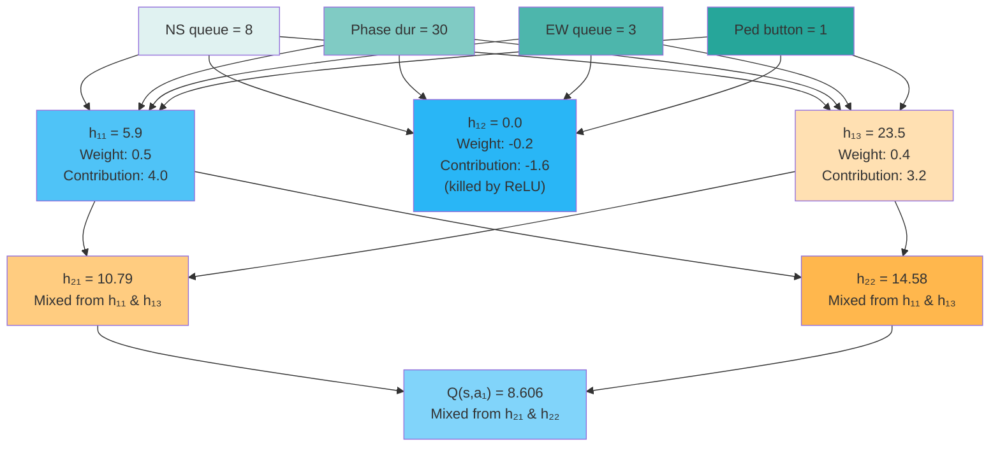

**Every input touches every Layer 1 neuron, which touch every Layer 2 neuron, which touch every output.** The "causal
path" is not a path—it's a **tangled web** where every feature influences every decision through thousands of
intermediate computations.

**This is why we need explainability methods** like saliency, attention, and counterfactuals—to untangle this mess and
identify which features truly matter for each decision!

**Example: Two States, Similar Decisions, Different Reasons**:

State A:

$$
\mathbf{s}_A = [\underbrace{12}_{\text{NS queue}}, \underbrace{3}_{\text{EW queue}}, \underbrace{35s}_{\text{duration}}, \ldots]
$$

→ Agent chooses "Continue"

State B:

$$
\mathbf{s}_B = [\underbrace{5}_{\text{NS queue}}, \underbrace{11}_{\text{EW queue}}, \underbrace{15s}_{\text{duration}}, \ldots]
$$

→ Agent chooses "Continue"

Both lead to the same action, but for different reasons:

- State A: Continue because NS queue is large and still being served
- State B: Continue because phase just started (15s duration) and minimum green time not yet met

A human observer seeing only the actions would miss this crucial distinction. The neural network "knows" the difference
(it's encoded in its weights), but this knowledge is implicit and inaccessible.

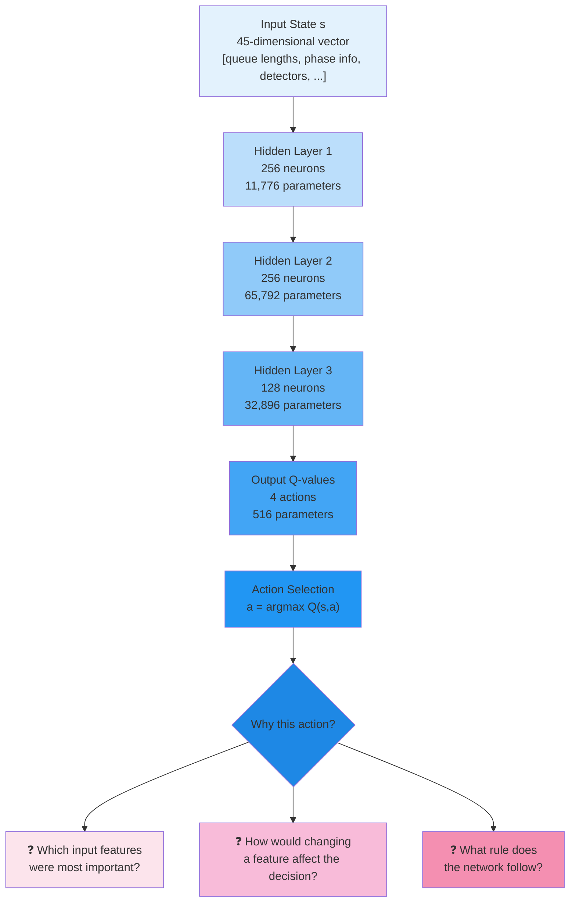

---

##### The Need for Explainability in Safety-Critical Systems

Traffic signal control exemplifies **safety-critical AI** where decisions directly affect human safety, mobility, and
environmental outcomes. Deploying unexplainable systems creates unacceptable risks:

**1. Validation and Verification**: Traditional traffic controllers undergo rigorous testing against safety standards.
Engineers verify that minimum green times are respected, conflicting movements never receive simultaneous green,
pedestrian demands are served within acceptable delays. How can we verify a neural network satisfies these constraints
when we cannot examine its decision logic?

**2. Debugging and Failure Analysis**: When a rule-based controller causes excessive delays, engineers trace the fault:
"The bus priority logic triggered incorrectly due to faulty sensor data." With a neural network, diagnosis becomes: "The
network output Q-value 3.2 for 'Continue' instead of 2.8 for 'Next Phase'." This provides no actionable insight into the
root cause.

**3. Operator Trust and Acceptance**: Traffic management centers require operators to monitor and occasionally override
automated systems. Operators cannot effectively supervise a system whose reasoning they cannot follow. Research shows
that users disengage from systems they don't understand, defeating the purpose of human oversight.

**4. Regulatory Approval**: Transportation agencies must certify that signal control systems meet safety and performance
standards. Regulatory frameworks assume inspectable, documented control logic. Neural networks provide neither—they
cannot produce the control logic flowcharts and timing diagrams regulators require.

**5. Accountability and Liability**: If an AI-controlled intersection experiences an incident, legal and ethical
questions arise: Was the AI at fault? Did it violate design specifications? Without explainability, these questions
become unanswerable.

**Real-World Consequence Example**:

Consider a pedestrian who waited 90 seconds for a crossing signal—far exceeding the 60-second maximum specified in
design requirements. Without explainability tools:

**Black-Box Response**: "The neural network learned through trial and error in simulation. It optimizes a complex reward
function. We cannot explain why it made this specific decision, but average performance exceeds the baseline."

**Explainable System Response**: "Analysis reveals the agent assigned low attention weight (α = 0.08) to pedestrian
waiting time in this state because heavy vehicle queues (24 cars) dominated the state representation. Counterfactual
analysis shows that if the vehicle queue were 15 instead of 24, the agent would have activated the pedestrian phase.
This suggests the reward function underweights pedestrian priority relative to vehicle throughput. We are retraining
with adjusted reward weights."

The latter enables correction; the former does not.

---

##### Counterfactual Analysis

**Counterfactual analysis** answers the question: **"What would need to be different for the agent to make a different
decision?"**

It's essentially asking "what-if" questions to understand the boundaries of the agent's decision-making logic.

###### **The Concept: Counterfactual Reasoning**

In everyday reasoning, we use counterfactuals naturally:

- **Factual**: "I missed the bus because I left home at 8:05 AM"
- **Counterfactual**: "If I had left at 8:00 AM, I would have caught the bus"

The counterfactual identifies the **critical threshold** (leaving time) that changed the outcome.

In DRL for traffic control:

- **Factual**: "The agent chose Continue (did not activate pedestrian phase)"
- **Counterfactual**: "If the vehicle queue were 15 instead of 24, the agent would have activated the pedestrian phase"

This reveals the **decision boundary**: the agent switches decisions when vehicle queue drops from 24 to 15.

###### **Why This Matters in the Example**

**Problem Context:**

- A pedestrian waited 90 seconds (exceeding the 60-second safety threshold)
- The agent kept serving vehicles instead of activating the pedestrian phase
- We need to understand: **Why didn't the agent prioritize the pedestrian?**

**Attention Analysis** told us:

- Pedestrian waiting time had low attention weight (α = 0.08 = 8%)
- Vehicle queue had high attention weight (dominated the decision)

But attention only tells us **which features the agent focused on**. It doesn't tell us **what would change the
decision**.

**Counterfactual Analysis** answers this:

- "If vehicle queue were 15 instead of 24, agent would activate pedestrian phase"
- This reveals the **threshold**: at queue ≈ 15, the agent's priority shifts from vehicles to pedestrians

###### **How Counterfactual Analysis Works**

The process involves **searching for a modified state** that flips the agent's decision while making the **minimum
change** to the original state.

**Step 1: Define the Original Situation**

Original state:

$$
\mathbf{s} = \begin{bmatrix} 24 \\ 3 \\ 35 \\ 45 \\ \vdots \end{bmatrix} = \begin{bmatrix} \text{Vehicle queue NS} \\ \text{Vehicle queue EW} \\ \text{Phase duration} \\ \text{Pedestrian wait time} \\ \vdots \end{bmatrix}
$$

Agent's current decision:

$$
a^* = \arg\max_a Q(\mathbf{s}, a) = \text{Continue}
$$

The Q-values might be:

$$
\begin{align}
Q(\mathbf{s}, \text{Continue}) &= 5.2 \\
Q(\mathbf{s}, \text{Next Phase}) &= 3.1 \\
Q(\mathbf{s}, \text{Skip-to-P1-Ped}) &= 2.8 \\
Q(\mathbf{s}, \text{Do Nothing}) &= 1.5
\end{align}
$$

Agent chooses "Continue" because it has the highest Q-value (5.2).

**Step 2: Define the Target Decision**

We want to know: "What would make the agent activate the pedestrian phase?"

Target action: $a_{\text{target}} = \text{Skip-to-P1-Ped}$ (activate pedestrian crossing)

**Step 3: Search for Counterfactual State**

We search for a modified state $\mathbf{s}'$ that:

1. **Flips the decision**: $\arg\max_a Q(\mathbf{s}', a) = \text{Skip-to-P1-Ped}$
2. **Minimizes change**: $|\mathbf{s}' - \mathbf{s}|$ is as small as possible
3. **Stays realistic**: $\mathbf{s}'$ must be a valid traffic state (no negative queues, reasonable values)

**Optimization Problem:**

$$
\mathbf{s}'*{\text{CF}} = \arg\min*{\mathbf{s}'} |\mathbf{s}' - \mathbf{s}|^2
$$

Subject to:

$$
Q(\mathbf{s}', \text{Skip-to-P1-Ped}) > Q(\mathbf{s}', \text{Continue})
$$

**Translation**: Find the state closest to the original where "Skip-to-P1-Ped" beats "Continue".

**Step 4: Gradient-Based Search**

We use gradient descent to iteratively modify the state:

**Iteration 0:** Start with $\mathbf{s}'_0 = \mathbf{s}$ (original state)

**Iteration 1-N:** Update state to increase $Q(\text{Skip-to-P1-Ped})$ and decrease $Q(\text{Continue})$:

$$
\mathbf{s}'_{t+1} = \mathbf{s}'_t - \eta \nabla_{\mathbf{s}'} \mathcal{L}(\mathbf{s}'_t)
$$

where the loss function encourages:

- Small change from original: $|\mathbf{s}' - \mathbf{s}|^2$
- Decision flip: $Q(\mathbf{s}', \text{Continue}) - Q(\mathbf{s}', \text{Skip-to-P1-Ped})$ should become negative

**Numerical Example of Search Process:**

| Iteration | Vehicle Queue NS | Q(Continue) | Q(Skip-to-Ped) | Decision      |
| --------- | ---------------- | ----------- | -------------- | ------------- |
| 0         | 24               | 5.2         | 2.8            | Continue      |
| 1         | 22.3             | 4.9         | 3.1            | Continue      |
| 2         | 20.1             | 4.5         | 3.6            | Continue      |
| 3         | 17.8             | 4.0         | 4.2            | Skip-to-Ped ✓ |
| 4         | 15.2             | 3.5         | 4.8            | Skip-to-Ped   |

The algorithm found that at **iteration 3** (queue ≈ 18), the decision flips. Continuing to iteration 4 finds a clearer
boundary at queue ≈ 15 where the preference for pedestrian phase is strong.

**Step 5: Extract the Counterfactual Insight**

Counterfactual state found:

$$
\mathbf{s}'_{\text{CF}} = \begin{bmatrix} 15 \\ 3 \\ 35 \\ 45 \\ \vdots \end{bmatrix}
$$

**Comparison:**

$$
\Delta \mathbf{s} = \mathbf{s}'_{\text{CF}} - \mathbf{s} = \begin{bmatrix} 15 - 24 \\ 0 \\ 0 \\ 0 \\ \vdots \end{bmatrix} = \begin{bmatrix} -9 \\ 0 \\ 0 \\ 0 \\ \vdots \end{bmatrix}
$$

**Interpretation:**

- Only **one feature changed**: Vehicle queue NS decreased from 24 to 15
- Change magnitude: 9 vehicles
- All other features (EW queue, phase duration, pedestrian wait) stayed the same

**Counterfactual Statement:**

> "If the vehicle queue were 15 instead of 24, the agent would have activated the pedestrian phase."

###### **Comparison: What Each Method Tells Us**

###### **What This Reveals About the Agent's Policy**

The counterfactual analysis uncovers the agent's **implicit decision rule**:

**Discovered Rule:**

$$
\begin{align}
\text{IF } & \text{vehicle\_queue\_NS} > 15: \\
& \quad \text{priority} = \text{vehicles} \\
& \quad \text{action} = \text{Continue (serve vehicles)} \\
\text{ELSE}: & \\
& \quad \text{priority} = \text{pedestrians (if waiting)} \\
& \quad \text{action} = \text{Skip-to-P1-Ped (serve pedestrians)}
\end{align}
$$

**Critical Threshold:** Vehicle queue ≈ 15 vehicles

**Policy Diagnosis:**

1. **The agent learned to prioritize vehicles over pedestrians** when vehicle queues are large
2. **The threshold (15 vehicles) is arguably too high** for a safety-critical pedestrian crossing
3. **Pedestrian waiting time (45s) was ignored** despite approaching the safety limit

This suggests:

- The **reward function underweights pedestrian priority** relative to vehicle throughput
- The agent optimized for vehicle flow at the expense of pedestrian safety
- Need to **retrain with adjusted reward weights** to lower the threshold

###### **Comparison: What Each Method Tells Us**

| Method             | Question                                       | Answer in This Example                            |
| ------------------ | ---------------------------------------------- | ------------------------------------------------- |
| **Saliency**       | How sensitive is the decision to each feature? | Pedestrian wait has low gradient magnitude        |
| **Attention**      | Which features does the agent focus on?        | Vehicle queue dominates (α = 0.08 for pedestrian) |
| **Counterfactual** | What would change the decision?                | Vehicle queue must drop from 24 to 15             |

**Together, they provide a complete picture:**

1. **Attention (α = 0.08)**: Agent barely considers pedestrian waiting time
2. **Counterfactual (threshold = 15)**: Agent only serves pedestrians when vehicle demand is low
3. **Conclusion**: Agent learned to prioritize vehicle throughput over pedestrian safety

###### **Visual Representation of Counterfactual Search**

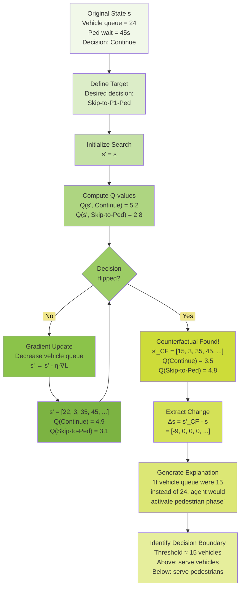

###### **Practical Value of Counterfactual Analysis**

**For Traffic Engineers:**

- Reveals concrete thresholds: "Agent switches at queue = 15"
- Engineers can evaluate: "Is 15 vehicles a reasonable threshold?"
- Provides actionable feedback: "Lower threshold to 10 to improve pedestrian safety"

**For Debugging:**

- Identifies when the agent makes wrong trade-offs
- Example: "Agent waits until queue = 15, but pedestrian already waited 90s (unsafe!)"
- Pinpoints the source: "Reward function doesn't penalize pedestrian wait strongly enough"

**For Retraining:**

- Guides reward function adjustment:
    - Current: $r = -1.0 \cdot W_{\text{vehicle}} - 1.0 \cdot W_{\text{pedestrian}}$
    - Adjusted: $r = -1.0 \cdot W_{\text{vehicle}} - 2.0 \cdot W_{\text{pedestrian}}$
- After retraining, counterfactual analysis can verify: "New threshold = 10 vehicles ✓"

**For Validation:**

- Ensures agent behavior aligns with safety requirements
- Example requirement: "Pedestrian phase must activate if wait > 60s regardless of vehicle queue"
- Counterfactual test: "At ped_wait = 65s and vehicle_queue = 20, does agent activate ped phase?"

This is why the explainable system response could confidently state: "Counterfactual analysis shows that if the vehicle
queue were 15 instead of 24, the agent would have activated the pedestrian phase"—it actually **computed** this
threshold through systematic search!

---

##### Taxonomy of Explanation Methods

Explainability techniques fall into several categories based on their approach and the type of insight they provide:

**1. Local vs. Global Explanations**:

- **Local**: Explain a single decision in a specific state
    - "Why did the agent choose 'Continue' in this particular traffic situation?"
    - Examples: Saliency maps, counterfactuals, attention weights for specific states
- **Global**: Explain the overall policy or decision boundaries
    - "What general rules does the agent follow?"
    - Examples: Decision tree extraction, policy summarization, feature importance across all states

**2. Model-Specific vs. Model-Agnostic**:

- **Model-Specific**: Exploit internal structure of the specific model architecture
    - Gradient-based methods (saliency), attention mechanisms
    - Require access to model weights and gradients
- **Model-Agnostic**: Treat the model as a black box, analyzing only inputs and outputs
    - Counterfactuals, decision tree approximation, behavioral analysis
    - Work with any model, even non-differentiable ones

**3. Intrinsic vs. Post-Hoc**:

- **Intrinsic**: Explainability built into the model architecture
    - Attention mechanisms, linear models, decision trees
    - Explanation is part of the model's computation
- **Post-Hoc**: Explanation generated after training by analyzing the trained model
    - Saliency, counterfactuals, VIPER distillation
    - Model trained for performance; explanation added afterward

**4. Example-Based vs. Feature-Based**:

- **Example-Based**: Explain by reference to similar examples or cases
    - "This decision resembles what the agent did in previous situation X"
    - Counterfactuals: "If conditions were different, the decision would change"
- **Feature-Based**: Identify which input features drive the decision
    - "Queue length was the most important factor"
    - Saliency, attention weights, feature importance

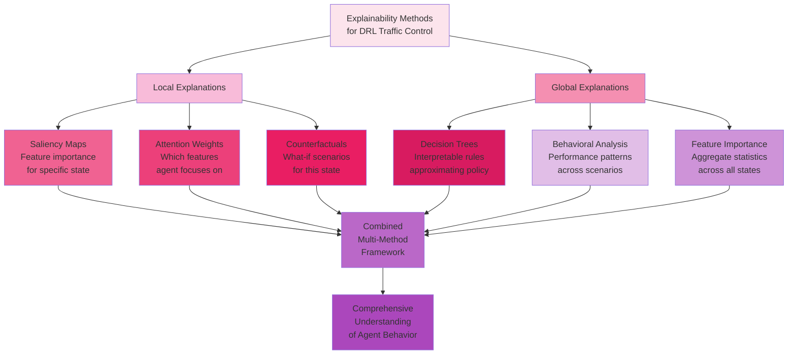

---

##### Trade-offs Between Accuracy and Interpretability

A fundamental tension exists between model performance and interpretability. We can visualize this relationship:

**Interpretability Spectrum**:

| Model Type          | Interpretability | Accuracy (Complex Problems) | Example                            |
| ------------------- | ---------------- | --------------------------- | ---------------------------------- |
| Linear Models       | ★★★★★            | ★☆☆☆☆                       | $Q(s,a) = \mathbf{w}^T \mathbf{s}$ |
| Decision Trees      | ★★★★☆            | ★★☆☆☆                       | IF-THEN rules                      |
| Shallow Neural Nets | ★★☆☆☆            | ★★★☆☆                       | 1-2 hidden layers                  |
| Deep Neural Nets    | ★☆☆☆☆            | ★★★★★                       | DQN with 3+ layers                 |

**Why This Trade-Off Exists**:

**Expressiveness Requires Complexity**: Simple, interpretable models (linear, small trees) cannot capture the intricate,
non-linear relationships in complex domains. Traffic dynamics involve:

- Non-linear queue evolution: $q_{t+1} = \max(0, q_t + \lambda - \mu_t)$
- Multiplicative interactions: bus arrival × queue length × phase duration
- Temporal dependencies: decisions at time $t$ affect outcomes at $t+10$

Deep networks can represent these complex functions; linear models cannot.

**Distributed Representations Obscure Logic**: Deep learning's power comes from distributing knowledge across many
weights. But this distribution destroys the one-to-one correspondence between model parameters and human-interpretable
concepts.

**The Explainability Solution**: Rather than restricting models to interpretable architectures (sacrificing
performance), we train powerful but opaque models and then **explain them post-hoc**. This "best of both worlds"
approach achieves:

- **High Performance**: Use the most effective model architecture (deep neural networks)
- **Interpretability**: Apply explanation techniques to understand decisions

**Methodological Framework**:

$$
\text{Deployment Pipeline} = \underbrace{\text{Train Complex Model}}_{\text{Optimize Performance}} \to
\underbrace{\text{Generate Explanations}}_{\text{Build Understanding}} \to \underbrace{\text{Validate\_\&\_Verify}}\_{\text{Ensure Safety}}
$$

This framework underlies modern explainable AI: optimize first, explain second, validate third.

---

##### Gradient-Based Attribution Methods

###### Saliency Maps for Feature Importance

**Core Idea**: If a small change to input feature $s_i$ causes a large change in output $Q(s,a)$, then feature $s_i$
must be important for that decision. Mathematically, this sensitivity is captured by the **gradient**:

$$
\text{Saliency}_i(s,a) = \left|\frac{\partial Q(s,a;\theta)}{\partial s_i}\right|
$$

The magnitude $|\partial Q / \partial s_i|$ measures how strongly Q-value depends on feature $i$. High magnitude → high
importance; low magnitude → low importance.

**Intuition Through Analogy**: Imagine adjusting the temperature in a room. The thermostat display shows 20°C. If
turning the dial 1° causes the display to jump to 25°C, temperature is highly sensitive to the dial. If turning the dial
1° changes the display to 20.2°C, temperature is insensitive. The rate of change (gradient) reveals sensitivity.

Similarly, if increasing queue length by 1 vehicle causes $Q(s,\text{Continue})$ to drop from 5.2 to 3.1, queue length
is highly important. If the same increase only changes Q from 5.2 to 5.15, queue length is less important.

##### Mathematical Foundation of Gradient Attribution

Given a trained DQN $Q(s,a;\theta)$, the gradient with respect to input state features is:

$$
\nabla_s Q(s,a;\theta) = \begin{bmatrix} \frac{\partial Q}{\partial s_1} \\ \frac{\partial Q}{\partial s_2} \\ \vdots \\
\frac{\partial Q}{\partial s_n} \end{bmatrix}
$$

Each component $\frac{\partial Q}{\partial s_i}$ can be computed efficiently via backpropagation—the same algorithm used
for training, but applied to the input instead of the weights.

**Forward Pass** (standard Q-value computation):

$$
\begin{align} \mathbf{h}_1 &= \text{ReLU}(\mathbf{W}_1 \mathbf{s} + \mathbf{b}_1) \\
\mathbf{h}_2 &= \text{ReLU}(\mathbf{W}_2 \mathbf{h}_1 + \mathbf{b}_2) \\
\mathbf{h}_3 &= \text{ReLU}(\mathbf{W}_3 \mathbf{h}_2 + \mathbf{b}_3) \\
Q(s,a) &= [\mathbf{W}_4 \mathbf{h}_3 + \mathbf{b}_4]_a \quad \text{select component for action } a \end{align}
$$

**Backward Pass** (gradient computation using chain rule):

$$
\frac{\partial Q}{\partial \mathbf{s}} = \frac{\partial Q}{\partial \mathbf{h}_3} \frac{\partial
\mathbf{h}_3}{\partial \mathbf{h}_2} \frac{\partial \mathbf{h}_2}{\partial \mathbf{h}_1} \frac{\partial
\mathbf{h}_1}{\partial \mathbf{s}}
$$

Where:

$$
\begin{align}
\frac{\partial Q}{\partial \mathbf{h}_3} &= \mathbf{W}_4[a,:] \quad \text{(row } a \text{ of }
\mathbf{W}_4 \text{)} \\
\frac{\partial \mathbf{h}_k}{\partial \mathbf{h}_{k-1}} &= \text{diag}(\mathbf{1}_{[\mathbf{h}_k > 0]}) \mathbf{W}_k \quad \text{(ReLU derivative)}
\end{align}
$$

The ReLU derivative creates sparsity:

$$
\frac{\partial \text{ReLU}(x)}{\partial x} = \begin{cases} 1 & x > 0 \\ 0 & x \leq 0 \end{cases}
$$

Only neurons that were activated ($h > 0$) contribute to the gradient.

**Computational Efficiency**: Modern deep learning frameworks (PyTorch, TensorFlow) compute these gradients
automatically via automatic differentiation. A single backward pass computes gradients for all input features
simultaneously—no need to perturb each feature individually.

---

##### Computing and Interpreting Saliency

**Algorithm for Saliency Computation**:

1. **Input**: State $\mathbf{s}$, action $a$, trained DQN $Q(s,a;\theta)$
2. **Forward Pass**: Compute $Q(\mathbf{s}, a; \theta)$
3. **Backward Pass**: Compute gradient $\nabla_{\mathbf{s}} Q(\mathbf{s}, a; \theta)$
4. **Saliency Vector**: $\mathbf{S}(s,a) = |\nabla_{\mathbf{s}} Q(\mathbf{s}, a; \theta)|$ (element-wise absolute value)
5. **Normalize** (optional): $\mathbf{S}_{\text{norm}} = \frac{\mathbf{S}}{|\mathbf{S}|_1}$ so values sum to 1

**Worked Example**: Traffic State with 4 Features

State:
$\mathbf{s} = \begin{bmatrix} 10 \\ 3 \\ 25 \\ 1 \end{bmatrix} = \begin{bmatrix} \text{NS queue} \\ \text{EW queue} \\ \text{Phase duration (s)} \\ \text{Bus present (0/1)} \end{bmatrix}$

Action: $a = \text{Continue}$

Suppose the trained network gives:

$$
Q(s, \text{Continue}) = 4.2
$$

Computing gradients:

$$
\nabla_{\mathbf{s}} Q = \begin{bmatrix} -0.82 \ -0.15 \ -0.31 \ +2.14 \end{bmatrix}
$$

Saliency (absolute values):

$$
\mathbf{S} = \begin{bmatrix} 0.82 \\ 0.15 \\ 0.31 \\ 2.14 \end{bmatrix}
$$

Normalized:

$$
\mathbf{S}\_{\text{norm}} = \frac{1}{0.82 + 0.15 + 0.31 + 2.14} \begin{bmatrix} 0.82 \\ 0.15 \\ 0.31 \\ 2.14 \end{bmatrix} = \begin{bmatrix} 0.24 \\ 0.04 \\ 0.09 \\ 0.63 \end{bmatrix}
$$

**Interpretation**:

- **Bus presence (63%)**: Dominates the decision. The network is highly sensitive to whether a bus is present.
- **NS queue (24%)**: Second most important. Larger queues influence the Continue decision.
- **Phase duration (9%)**: Moderate importance. How long the phase has run affects continuation.
- **EW queue (4%)**: Minimal importance. The minor approach queue has little influence in this state.

**Key Insight**: The agent prioritizes bus presence and serving the major approach (NS). The negative gradient for NS
queue means: if NS queue increases, $Q(\text{Continue})$ decreases—the agent becomes less inclined to continue when
queues grow too large. The positive gradient for bus presence means: if a bus appears, $Q(\text{Continue})$
increases—the agent wants to serve the bus.

---

##### Visualizing Feature Contributions

Saliency maps are often visualized as heatmaps or bar charts to aid interpretation:

**Heatmap Visualization**: For spatial/structured inputs (like images or gridded data), represent saliency as color
intensity. Brighter colors indicate higher importance.

**Bar Chart Visualization**: For vector inputs (like traffic states), display saliency values as bars:

```
Feature Importance (Saliency)
───────────────────────────────────────
Bus Present      ████████████████████████████ 63%
NS Queue         ████████████ 24%
Phase Duration   ████ 9%
EW Queue         █ 4%
```

**Time-Series Visualization**: Track how saliency changes over time as traffic conditions evolve:

| Timestep | NS Queue Sal. | Bus Present Sal. | Phase Dur. Sal. |
| -------- | ------------- | ---------------- | --------------- |
| t=100    | 0.35          | 0.15             | 0.40            |
| t=200    | 0.28          | 0.52             | 0.12            |
| t=300    | 0.41          | 0.08             | 0.33            |

At $t=200$, bus presence spikes to 52% saliency—the agent strongly reacted to bus arrival.

**Action-Specific Saliency**: Compare saliency across different actions:

For state $\mathbf{s}$ with actions: Continue, Skip-to-P1, Next Phase

|             | Continue | Skip-to-P1 | Next Phase |
| ----------- | -------- | ---------- | ---------- |
| NS Queue    | 0.24     | 0.18       | 0.39       |
| EW Queue    | 0.04     | 0.05       | 0.21       |
| Phase Dur   | 0.09     | 0.08       | 0.31       |
| Bus Present | 0.63     | 0.69       | 0.09       |

**Analysis**:

- **Bus presence** dominates Continue and Skip-to-P1 (bus priority actions)
- **Phase duration** becomes most important for Next Phase (timing-based decision)
- **EW queue** gains importance for Next Phase (switching to serve minor approach)

This reveals the agent's decision structure: bus-related actions depend on bus state, while phase progression depends on
timing and cross-approach demand.

---

##### Limitations and Caveats

While powerful, gradient-based saliency has important limitations:

**1. Local Linearity Assumption**: Saliency measures the **local** gradient—the instantaneous rate of change at the
current state. It assumes a linear approximation:

$$
Q(s + \Delta s, a) \approx Q(s,a) + \nabla_s Q(s,a)^T \Delta s
$$

This is accurate for small perturbations but breaks down for large changes. If queue length increases from 10 to 30
vehicles (large change), the linear approximation may be poor.

**2. Saturation Effects**: ReLU activations create "dead zones" where gradients vanish. If a neuron's input is deeply
negative (ReLU outputs 0), the gradient through that neuron is zero, even though the feature might be important if we
perturbed it enough to activate the neuron.

**Example**:

$$
h = \text{ReLU}(w_1 s_1 + w_2 s_2 + b) = \text{ReLU}(-10 + 0.5 s_1 + 0.3 s_2)
$$

If $s_1 = 5, s_2 = 3$, then input $= -10 + 2.5 + 0.9 = -6.6 < 0$, so $h = 0$ and
$\frac{\partial h}{\partial s_1} = \frac{\partial h}{\partial s_2} = 0$.

Saliency suggests $s_1, s_2$ are unimportant, but if we increased $s_1$ to 15, the neuron would activate and influence
the output.

**3. Correlation vs. Causation**: High saliency indicates **association**, not necessarily **causation**. If two
features are highly correlated (e.g., NS queue length and NS average waiting time), both may have high saliency even if
only one is truly causal.

**4. Adversarial Brittleness**: Neural networks can be highly sensitive to imperceptible input perturbations
(adversarial examples). A saliency map might assign high importance to a feature that changes the Q-value dramatically
but doesn't reflect genuine decision logic—it's an artifact of the network's learned function.

**5. Lack of Context**: Saliency identifies important features but doesn't explain **how** they interact or **why** they
matter. Knowing "bus presence has 63% saliency" doesn't tell us whether the network activates bus priority or ignores
buses in this state.

**Mitigation Strategies**:

- **Multiple Methods**: Combine saliency with other techniques (attention, counterfactuals) for triangulation
- **Integrated Gradients**: A refinement of saliency that addresses some saturation issues by integrating gradients
  along a path from a baseline to the input
- **SmoothGrad**: Average saliency over small random perturbations to reduce noise
- **Validation**: Test saliency insights through ablation—does zeroing high-saliency features actually change the
  decision?

Despite limitations, saliency maps remain one of the most computationally efficient and widely applicable explainability
tools for neural networks.

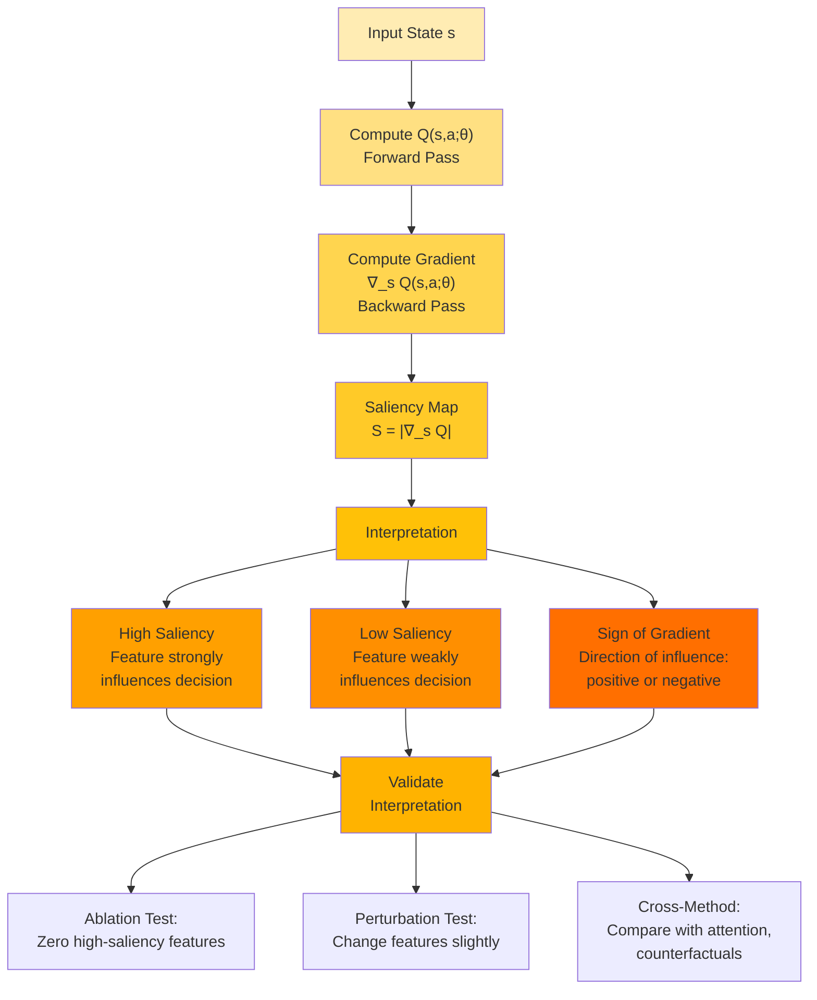

---

##### Attention Mechanisms for Interpretability

###### Attention Weights as Feature Importance

While saliency measures sensitivity through gradients, **attention mechanisms** provide an alternative perspective: they
compute explicit weights $\alpha_i$ that represent how much the network "focuses on" each input feature when making
decisions.

**Core Concept**: Instead of asking "how sensitive is the output to this feature?" (saliency), attention asks "how much
does the network prioritize this feature?" The distinction is subtle but important:

- **Saliency**: Measures marginal impact if feature changes
- **Attention**: Measures relative importance in current computation

**Biological Motivation**: Human attention is selective—we cannot process all sensory information equally, so we focus
on relevant stimuli. Similarly, not all state features are equally relevant for every decision. In a traffic state with
32 dimensions, perhaps only 5-6 features drive the current decision; the rest are contextual or irrelevant.

Attention mechanisms formalize this selective focus by computing a probability distribution over features:

$$
\alpha_i = \mathbb{P}(\text{feature } i \text{ is relevant for current decision})
$$

where $\sum_{i=1}^{n} \alpha_i = 1$ and $\alpha_i \geq 0$.

---

##### Softmax Attention Over State Dimensions

The standard attention mechanism uses softmax normalization to convert arbitrary scores into a probability distribution:

$$
\alpha_i = \frac{\exp(e_i)}{\sum_{j=1}^{n} \exp(e_j)}
$$

where $e_i$ is an **attention score** for feature $i$. The question becomes: how do we compute $e_i$?

**Gradient-Based Attention Score**: A simple, effective approach uses gradient magnitude as the attention score:

$$
e_i = \left|\frac{\partial Q(s,a;\theta)}{\partial s_i}\right|
$$

This connects attention to saliency, but the softmax normalization provides interpretability advantages:

1. **Bounded**: $\alpha_i \in [0,1]$ (unlike gradients which can be arbitrarily large)
2. **Normalized**: $\sum_i \alpha_i = 1$ (allocates 100% "attention budget" across features)
3. **Relative**: High $\alpha_i$ means feature $i$ is more important than others in this state, even if absolute
   gradient is small

**Worked Example**: Same traffic state as before

State: $\mathbf{s} = [10, 3, 25, 1]$ (NS queue, EW queue, duration, bus)

Gradients: $\nabla_s Q = [-0.82, -0.15, -0.31, +2.14]$

Attention scores (absolute gradients): $\mathbf{e} = [0.82, 0.15, 0.31, 2.14]$

Softmax attention weights:

$$
\begin{align}
\alpha_1 &= \frac{\exp(0.82)}{\exp(0.82) + \exp(0.15) + \exp(0.31) + \exp(2.14)} = \frac{2.27}{2.27 + 1.16 + 1.36 +
8.50} = \frac{2.27}{13.29} = 0.17 \\
\alpha_2 &= \frac{\exp(0.15)}{13.29} = \frac{1.16}{13.29} = 0.09 \\
\alpha_3 &= \frac{\exp(0.31)}{13.29} = \frac{1.36}{13.29} = 0.10 \\
\alpha_4 &= \frac{\exp(2.14)}{13.29} = \frac{8.50}{13.29} = 0.64
\end{align}
$$

**Interpretation**: The agent allocates 64% of its "attention" to bus presence, 17% to NS queue, 10% to phase duration,
and 9% to EW queue. This quantifies the relative importance more intuitively than raw gradients.

**Temperature Scaling**: We can adjust the "sharpness" of attention via temperature $\tau$:

$$
\alpha_i = \frac{\exp(e_i/\tau)}{\sum_j \exp(e_j/\tau)}
$$

- **Low $\tau$ (< 1)**: Makes attention more concentrated (high $\alpha$ for max $e$, low $\alpha$ for others)
- **High $\tau$ (> 1)**: Smooths attention (more uniform distribution)
- **$\tau \to 0$**: Attention becomes one-hot (all weight on largest $e_i$)
- **$\tau \to \infty$**: Attention becomes uniform ($\alpha_i = 1/n$ for all $i$)

For interpretability, $\tau = 1$ (standard softmax) is typical.

---

##### Attention vs. Saliency: Complementary Perspectives

While both methods use gradients, they provide different insights:

| Aspect             | Saliency                            | Attention                                      |
| ------------------ | ----------------------------------- | ---------------------------------------------- |
| **Output**         | Gradient magnitude                  | Normalized probability distribution            |
| **Scale**          | Unbounded                           | $[0, 1]$, sum to 1                             |
| **Interpretation** | Absolute importance                 | Relative importance                            |
| **Comparison**     | Hard to compare across states       | Easy to compare (percentages)                  |
| **Sparsity**       | Can be very sparse (many near-zero) | Softmax naturally concentrates on top features |

**Example Highlighting the Difference**:

State A: Gradients $[0.5, 0.3, 0.1, 0.05]$ → Saliency $[0.5, 0.3, 0.1, 0.05]$ → Attention $[0.39, 0.29, 0.19, 0.13]$

State B: Gradients $[5.0, 3.0, 1.0, 0.5]$ → Saliency $[5.0, 3.0, 1.0, 0.5]$ → Attention $[0.56, 0.31, 0.08, 0.05]$

**Saliency**: State B has much larger gradients (10× larger). Suggests network is much more sensitive in State B.

**Attention**: State B has only slightly higher concentration on top feature (56% vs 39%). The **relative** importance
structure is similar, though absolute sensitivity differs.

For comparing across states with different scales, attention is more interpretable. For understanding absolute
sensitivity, saliency is clearer.

---

##### Group-Level Feature Analysis

Traffic states often contain semantically related features that should be analyzed together. Rather than examining
individual features in isolation, we can aggregate attention over **feature groups**:

**Example Feature Grouping** (32-dimensional state):

- **TLS3 Phase Encoding**: Features 0-3 (one-hot: P1, P2, P3, P4)
- **TLS3 Timing**: Features 4, 15 (duration, simulation time)
- **TLS3 Vehicle Detectors**: Features 5-8 (4 approaches)
- **TLS3 Bicycle Detectors**: Features 9-12 (4 approaches)
- **TLS3 Bus Info**: Features 13-14 (presence, waiting time)
- **TLS6 Phase Encoding**: Features 16-19
- **TLS6 Timing**: Features 20, 31
- **TLS6 Vehicle Detectors**: Features 21-24
- **TLS6 Bicycle Detectors**: Features 25-28
- **TLS6 Bus Info**: Features 29-30

**Group Attention**: Sum attention weights within each group:

$$
\alpha_{\text{group}} = \sum_{i \in \text{group}} \alpha_i
$$

**Worked Example**:

Individual attention weights (32 features):

$$
\boldsymbol{\alpha} = [0.05, 0.02, 0.03, 0.01, \underbrace{0.12}_{\text{TLS3 duration}}, 0.08, 0.06, 0.04, 0.02,
\ldots]
$$

Grouped attention:

| Group               | Features | Group Attention                    |
| ------------------- | -------- | ---------------------------------- |
| TLS3 Phase Encoding | 0-3      | $0.05 + 0.02 + 0.03 + 0.01 = 0.11$ |
| TLS3 Timing         | 4, 15    | $0.12 + 0.08 = 0.20$               |
| TLS3 Vehicle Det    | 5-8      | $0.08 + 0.06 + 0.04 + 0.02 = 0.20$ |
| TLS3 Bus Info       | 13-14    | $0.03 + 0.02 = 0.05$               |
| TLS6 Phase Encoding | 16-19    | $0.06 + 0.04 + 0.02 + 0.01 = 0.13$ |
| TLS6 Timing         | 20, 31   | $0.10 + 0.06 = 0.16$               |
| TLS6 Vehicle Det    | 21-24    | $0.05 + 0.04 + 0.03 + 0.02 = 0.14$ |
| TLS6 Bus Info       | 29-30    | $0.01 + 0.00 = 0.01$               |

**Interpretation**:

- **TLS3 timing (20%)** and **TLS3 vehicle detectors (20%)** receive equal top priority
- **TLS6 timing (16%)** and **TLS6 vehicle detectors (14%)** are secondary
- **Bus information** receives minimal attention (5% + 1% = 6% total)
- **Phase encoding** (which phase is active) gets moderate attention (11% + 13% = 24% total)

This reveals that the agent primarily considers timing and vehicle demand at both intersections, with limited focus on
bus priority in this particular state.

---

##### Temporal Attention Patterns

Tracking attention over time reveals how the agent's focus shifts as traffic conditions evolve:

**Example Scenario**: Rush hour approaching

| Time    | TLS3 Veh Det | TLS3 Timing | Bus Info | TLS6 Veh Det |
| ------- | ------------ | ----------- | -------- | ------------ |
| 7:00 AM | 15%          | 25%         | 5%       | 18%          |
| 7:30 AM | 28%          | 22%         | 8%       | 25%          |
| 8:00 AM | 35%          | 18%         | 12%      | 27%          |
| 8:30 AM | 42%          | 15%         | 6%       | 30%          |

**Pattern Analysis**:

- **Vehicle detector attention increases** from 15%→42% and 18%→30% as traffic builds
- **Timing attention decreases** from 25%→15% as immediate queue demands override phase duration concerns
- **Bus attention spikes** briefly at 8:00 AM (bus arrival) then drops when bus departs

This temporal analysis reveals the agent's **adaptive attention allocation**: during light traffic, timing dominates;
during congestion, queue lengths dominate; when buses appear, bus priority briefly gains attention.

**Visualization**:

```
Attention Over Time
TLS3 Vehicle Detectors: [████████░░] 15% → [████████████████████░░] 42%
TLS3 Timing:           [█████████████░░] 25% → [███████░░] 15%
Bus Info:              [███░░] 5% → [██████░░] 12% → [███░░] 6%
```

The shifting bars illustrate dynamic prioritization—a key advantage of learning-based control over fixed-priority
rule-based systems.

---

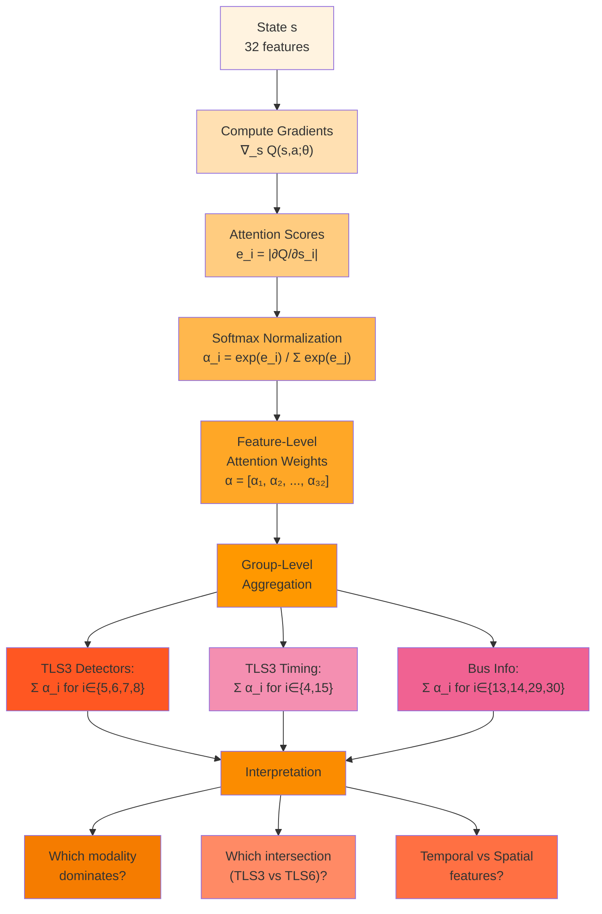

---

##### Counterfactual Explanation Generation

###### The Logic of Counterfactual Reasoning

Counterfactual explanations answer "what-if" questions: **"What would need to be different for the agent to choose a
different action?"** This form of explanation is both intuitive and actionable:

**Factual Statement**: "The agent chose to Continue the current phase."

**Counterfactual Statement**: "If the NS queue were 8 vehicles instead of 14, the agent would have chosen Next Phase."

Counterfactuals identify **decision boundaries**—the precise thresholds where agent behavior changes. This reveals the
agent's implicit rules more directly than saliency or attention alone.

**Formal Definition**: Given state $\mathbf{s}$ where agent selects action $a^* = \arg\max_a Q(\mathbf{s}, a; \theta)$,
a counterfactual state $\mathbf{s}'$ satisfies:

1. **Different Decision**: $\arg\max_a Q(\mathbf{s}', a; \theta) \neq a^*$
2. **Minimal Perturbation**: $|\mathbf{s}' - \mathbf{s}|$ is minimized
3. **Realism**: $\mathbf{s}' \in \mathcal{S}_{\text{feasible}}$ (satisfies domain constraints)

The counterfactual reveals: "The minimal change to state that would flip the decision is..."

**Why Counterfactuals Matter**:

1. **Interpretability**: Counterfactuals provide concrete, testable explanations. "If queue decreased by 6 vehicles" is
   more actionable than "queue has 24% saliency."
2. **Decision Boundaries**: Counterfactuals map the boundaries between different actions in state space. This reveals
   where the agent's policy is sensitive vs. robust.
3. **Validation**: Engineers can test whether identified thresholds align with traffic engineering principles. "Agent
   switches at queue = 8" can be validated against theoretical queue capacity.
4. **Debugging**: If a counterfactual reveals unrealistic thresholds ("agent would switch if queue = 0.2 vehicles"),
   this signals a training problem.

---

##### Optimization-Based Counterfactual Search

Finding counterfactuals is an optimization problem. We seek:

$$
\mathbf{s}'_{\text{CF}} = \arg\min_{\mathbf{s}' \in \mathcal{S}} |\mathbf{s}' - \mathbf{s}|_2 \quad \text{subject to}
\quad \arg\max_a Q(\mathbf{s}', a; \theta) = a_{\text{target}}
$$

where $a_{\text{target}} \neq a^*$ is the desired alternative action.

**Challenge**: The constraint $\arg\max_a Q(\mathbf{s}', a) = a_{\text{target}}$ is discrete and non-differentiable. We
cannot directly optimize with gradient descent.

**Solution**: Replace the hard constraint with a soft penalty that encourages
$Q(\mathbf{s}', a_{\text{target}}) > Q(\mathbf{s}', a^*)$:

$$
\mathcal{L}(\mathbf{s}') = \underbrace{|\mathbf{s}' - \mathbf{s}|_2^2}_{\text{Proximity}} + \lambda
\underbrace{\max(0, Q(\mathbf{s}', a^*; \theta) - Q(\mathbf{s}', a_{\text{target}}; \theta) +
\epsilon)}_{\text{Decision Flip}}
$$

**The Big Idea:**

We want to find the **smallest change** to the traffic situation that would make the agent choose a **different
action**. It's like asking: "What's the minimum adjustment needed to change the agent's mind?"

**The Problem:**

We can't just say "find a state where the agent picks action X" because that's a yes/no question (discrete), and
computers need smooth math (continuous) to optimize things efficiently.

**The Solution:**

Instead of a hard rule ("the agent MUST pick action X"), we use a **scoring system** with two parts:

1. **Proximity Score**: How far did we move from the original situation?

    - Smaller changes = better score
    - Think: "Stay as close to reality as possible"

2. **Decision Flip Score**: How close are we to flipping the decision?
    - If target action is winning = perfect (score = 0)
    - If target action is losing = penalty (score > 0)
    - Think: "Push the target action to become the winner"

**The Balance:**

We have a knob ($\lambda$) that controls the trade-off:

- Turn it up ($\lambda$ large): "I don't care how far we move, just flip the decision!"
- Turn it down ($\lambda$ small): "Keep changes tiny, even if decision doesn't flip completely"

**The Process:**

1. Start with the original traffic state

2. Calculate: "How bad is my current score?"

3. Nudge the state slightly in a direction that improves the score

4. Repeat until the target action wins

5. Done! That's your counterfactual.

##### Detailed Numerical Example

**Original Traffic State:**

$$
\mathbf{s} = \begin{bmatrix} 24 \\ 3 \\ 35 \\ 45 \end{bmatrix} = \begin{bmatrix} \text{NS vehicle queue} \\ \text{EW vehicle queue} \\ \text{Phase duration (s)} \\ \text{Pedestrian wait time (s)} \end{bmatrix}
$$

**Current Q-values (from the neural network):**

$$
\begin{align}
Q(\mathbf{s}, \text{Continue}) &= 5.2 \quad \text{(current action } a^*\text{)} \\
Q(\mathbf{s}, \text{Next Phase}) &= 3.1 \\
Q(\mathbf{s}, \text{Skip-to-Ped}) &= 2.8 \quad \text{(target action } a_{\text{target}}\text{)} \\
Q(\mathbf{s}, \text{Do Nothing}) &= 1.5
\end{align}
$$

**Current Decision:** Agent chooses "Continue" (highest Q-value = 5.2)

**Goal:** Find a counterfactual state $\mathbf{s}'$ where agent chooses "Skip-to-Ped"

**Parameters:**

- Learning rate: $\eta = 0.1$
- Trade-off parameter: $\lambda = 10$
- Margin: $\epsilon = 0.5$
- Max iterations: $T_{\max} = 50$

###### **Iteration 0: Initialize**

Start with the original state:

$$
\mathbf{s}'_0 = \mathbf{s} = \begin{bmatrix} 24 \\ 3 \\ 35 \\ 45 \end{bmatrix}
$$

**Compute Loss:**

**Proximity Term:**

$$
|\mathbf{s}'_0 - \mathbf{s}|_2^2 = |\mathbf{0}|_2^2 = 0
$$

(No change yet, so distance = 0)

**Decision Flip Term:**

$$
\begin{align}
&\max\left(0, Q(\mathbf{s}'_0, \text{Continue}) - Q(\mathbf{s}'_0, \text{Skip-to-Ped}) + \epsilon\right) \\
&= \max(0, 5.2 - 2.8 + 0.5) \\
&= \max(0, 2.9) \\
&= 2.9
\end{align}
$$

(Skip-to-Ped is losing by 2.4, plus margin 0.5 = 2.9 penalty)

**Total Loss:**

$$
\mathcal{L}(\mathbf{s}'_0) = 0 + 10 \times 2.9 = 29.0
$$

---

###### **Iteration 1: First Update**

**Compute Gradient:**

We need $\nabla_{\mathbf{s}'} \mathcal{L}$. This has two parts:

**Part 1: Proximity gradient**

$$
\nabla_{\mathbf{s}'} |\mathbf{s}' - \mathbf{s}|_2^2 = 2(\mathbf{s}' - \mathbf{s}) = 2 \times \mathbf{0} = \mathbf{0}
$$

**Part 2: Decision flip gradient**

Since constraint is violated (Continue still winning), we compute:

$$
\nabla_{\mathbf{s}'} Q(\mathbf{s}', \text{Continue}) - \nabla_{\mathbf{s}'} Q(\mathbf{s}', \text{Skip-to-Ped})
$$

From the neural network backpropagation (computed values):

$$
\nabla_{\mathbf{s}'} Q(\mathbf{s}', \text{Continue}) = \begin{bmatrix} 0.15 \\ 0.03 \\ 0.08 \\ -0.02 \end{bmatrix}
$$

$$
\nabla_{\mathbf{s}'} Q(\mathbf{s}', \text{Skip-to-Ped}) = \begin{bmatrix} -0.12 \\ 0.01 \\ 0.02 \\ 0.18 \end{bmatrix}
$$

**Difference:**

$$
\begin{bmatrix} 0.15 \\ 0.03 \\ 0.08 \\ -0.02 \end{bmatrix} - \begin{bmatrix} -0.12 \\ 0.01 \\ 0.02 \\ 0.18 \end{bmatrix} = \begin{bmatrix} 0.27 \\ 0.02 \\ 0.06 \\ -0.20 \end{bmatrix}
$$

**Total gradient:**

$$
\nabla_{\mathbf{s}'} \mathcal{L} = \mathbf{0} + 10 \times \begin{bmatrix} 0.27 \\ 0.02 \\ 0.06 \\ -0.20 \end{bmatrix} = \begin{bmatrix} 2.7 \\ 0.2 \\ 0.6 \\ -2.0 \end{bmatrix}
$$

**Update state:**

$$
\mathbf{s}'_1 = \mathbf{s}'_0 - \eta \nabla_{\mathbf{s}'} \mathcal{L} = \begin{bmatrix} 24 \\ 3 \\ 35 \\ 45 \end{bmatrix} - 0.1 \times \begin{bmatrix} 2.7 \\ 0.2 \\ 0.6 \\ -2.0 \end{bmatrix}
$$

$$
\mathbf{s}'_1 = \begin{bmatrix} 24 - 0.27 \\ 3 - 0.02 \\ 35 - 0.06 \\ 45 + 0.20 \end{bmatrix} = \begin{bmatrix} 23.73 \\ 2.98 \\ 34.94 \\ 45.20 \end{bmatrix}
$$

**Interpretation of changes:**

- NS queue decreased from 24 → 23.73 (gradient was positive, so we moved opposite direction)
- Pedestrian wait increased from 45 → 45.20 (gradient was negative, so we moved opposite direction)
- These changes help make "Skip-to-Ped" more attractive

**New Q-values** (recomputed through neural network):

$$
\begin{align}
Q(\mathbf{s}'_1, \text{Continue}) &= 5.15 \\
Q(\mathbf{s}'_1, \text{Skip-to-Ped}) &= 2.92
\end{align}
$$

**New Loss:**

$$
\begin{align}
\text{Proximity} &= (23.73-24)^2 + (2.98-3)^2 + (34.94-35)^2 + (45.20-45)^2 \\
&= 0.073 + 0.0004 + 0.0036 + 0.04 = 0.117
\end{align}
$$

$$
\text{Decision Flip} = \max(0, 5.15 - 2.92 + 0.5) = 2.73
$$

$$
\mathcal{L}(\mathbf{s}'_1) = 0.117 + 10 \times 2.73 = 27.42
$$

Loss decreased from 29.0 to 27.42 ✓ (good progress!)

###### **Iteration 5: Continue Optimizing**

Skipping ahead to show progress...

$$
\mathbf{s}'_5 = \begin{bmatrix} 22.15 \\ 2.89 \\ 34.62 \\ 46.83 \end{bmatrix}
$$

**Q-values:**

$$
\begin{align}
Q(\mathbf{s}'_5, \text{Continue}) &= 4.72 \\
Q(\mathbf{s}'_5, \text{Skip-to-Ped}) &= 3.48
\end{align}
$$

**Loss:**

$$
\begin{align}
\text{Proximity} &= (22.15-24)^2 + (2.89-3)^2 + (34.62-35)^2 + (46.83-45)^2 \\
&= 3.42 + 0.012 + 0.14 + 3.35 = 6.92
\end{align}
$$

$$
\text{Decision Flip} = \max(0, 4.72 - 3.48 + 0.5) = 1.74
$$

$$
\mathcal{L}(\mathbf{s}'_5) = 6.92 + 10 \times 1.74 = 24.32
$$

Gap between actions shrinking: from 2.4 (orig) → 1.24 (iter 5)

###### **Iteration 12: Getting Close**

$$
\mathbf{s}'_{12} = \begin{bmatrix} 18.42 \\ 2.81 \\ 34.08 \\ 49.15 \end{bmatrix}
$$

**Q-values:**

$$
\begin{align}
Q(\mathbf{s}'_{12}, \text{Continue}) &= 4.02 \\
Q(\mathbf{s}'_{12}, \text{Skip-to-Ped}) &= 4.38
\end{align}
$$

**Check Decision Flip:**

$$
Q(\text{Skip-to-Ped}) - Q(\text{Continue}) = 4.38 - 4.02 = 0.36 > 0
$$

Skip-to-Ped is now winning! But is it winning by enough?

**Check margin condition:**

$$
Q(\mathbf{s}', a_{\text{target}}) > Q(\mathbf{s}', a^*) + \epsilon
$$

$$
4.38 > 4.02 + 0.5 = 4.52 \quad \text{?}
$$

No, not yet. Continue optimizing...

###### **Iteration 18: Success!**

$$
\mathbf{s}'_{18} = \begin{bmatrix} 15.28 \\ 2.79 \\ 33.85 \\ 50.62 \end{bmatrix}
$$

**Q-values:**

$$
\begin{align}
Q(\mathbf{s}'_{18}, \text{Continue}) &= 3.45 \\
Q(\mathbf{s}'_{18}, \text{Skip-to-Ped}) &= 4.98
\end{align}
$$

**Check margin condition:**

$$
4.98 > 3.45 + 0.5 = 3.95 \quad \checkmark \text{ YES!}
$$

**Decision flipped successfully!** Agent now chooses Skip-to-Ped.

**Final Loss:**

$$
\begin{align}
\text{Proximity} &= (15.28-24)^2 + (2.79-3)^2 + (33.85-35)^2 + (50.62-45)^2 \\
&= 76.0 + 0.044 + 1.32 + 31.6 = 108.96
\end{align}
$$

$$
\text{Decision Flip} = \max(0, 3.45 - 4.98 + 0.5) = \max(0, -1.03) = 0
$$

$$
\mathcal{L}(\mathbf{s}'_{18}) = 108.96 + 10 \times 0 = 108.96
$$

Decision flip penalty is now 0 (constraint satisfied) ✓

###### **Analysis of the Counterfactual**

**Changes Made:**

$$
\Delta \mathbf{s} = \mathbf{s}'_{\text{CF}} - \mathbf{s} = \begin{bmatrix} 15.28 - 24 \\ 2.79 - 3 \\ 33.85 - 35 \\ 50.62 - 45 \end{bmatrix} = \begin{bmatrix} -8.72 \\ -0.21 \\ -1.15 \\ +5.62 \end{bmatrix}
$$

**Feature-by-feature:**

1. **NS vehicle queue**: 24 → 15.28 (decreased by 8.72 vehicles) ← **MAJOR CHANGE**
2. **EW vehicle queue**: 3 → 2.79 (decreased by 0.21) ← minor
3. **Phase duration**: 35s → 33.85s (decreased by 1.15s) ← minor
4. **Pedestrian wait**: 45s → 50.62s (increased by 5.62s) ← moderate

**Insight:**

The **dominant change** is the NS vehicle queue dropping from 24 to ~15 vehicles. This is the critical factor that flips
the decision.

**Counterfactual Statement:**

> "If the NS vehicle queue were 15 instead of 24 (and pedestrian wait were 51s instead of 45s), the agent would activate
> the pedestrian phase."

**Decision Boundary Identified:**

- **Above ~18 vehicles**: Agent prioritizes Continue (serve vehicles)
- **Below ~15 vehicles**: Agent prioritizes Skip-to-Ped (serve pedestrians)
- **Threshold**: Approximately 15-18 vehicles

###### **Why the Loss Function Works**

Let me show what each component contributed throughout the optimization:

| Iteration | NS Queue | Proximity Loss | Decision Flip Loss | Total Loss | Decision        |
| --------- | -------- | -------------- | ------------------ | ---------- | --------------- |
| 0         | 24.00    | 0.00           | 29.0               | 29.00      | Continue        |
| 1         | 23.73    | 0.12           | 27.3               | 27.42      | Continue        |
| 5         | 22.15    | 6.92           | 17.4               | 24.32      | Continue        |
| 12        | 18.42    | 38.4           | 8.6                | 47.00      | **Skip-to-Ped** |
| 18        | 15.28    | 108.96         | 0.0                | 108.96     | Skip-to-Ped ✓   |

**What happened:**

**Phase 1 (iter 0-11):**

- Decision flip loss dominated (large value)
- Proximity loss grew slowly
- Algorithm prioritized flipping the decision

**Phase 2 (iter 12):**

- Decision flipped! (Skip-to-Ped winning)
- But margin not satisfied yet

**Phase 3 (iter 13-18):**

- Fine-tuning to satisfy margin ($\epsilon = 0.5$)
- Proximity loss increased as we moved further
- Decision flip loss dropped to 0

**The trade-off ($\lambda = 10$):**

- Early: Accept large proximity cost to flip decision
- Late: Proximity cost dominates, algorithm stops when margin satisfied

###### **Visualization of the Optimization Process**

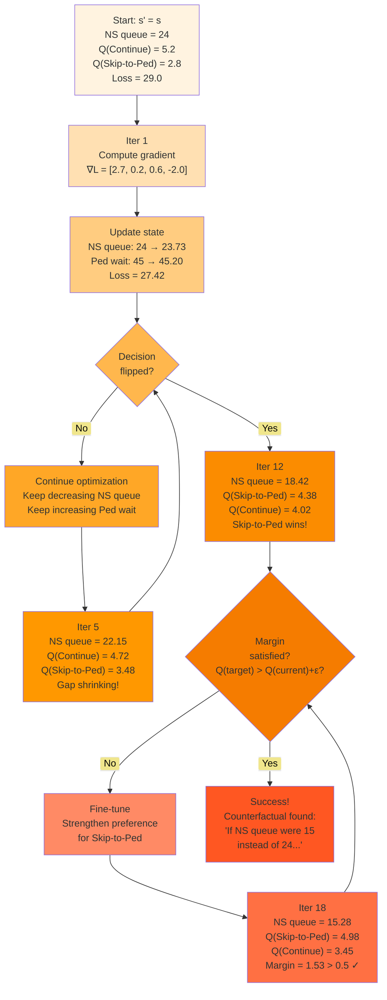

###### **Key Takeaways**

1. **Two competing goals**: Stay close to original (proximity) vs. flip the decision (decision flip)

2. **The $\lambda$ parameter** controls the balance:

    - High $\lambda$ (10-100): Prioritize flipping decision, accept large changes
    - Low $\lambda$ (0.1-1): Prioritize small changes, accept partial decision flip

3. **The margin $\epsilon$** ensures robust flipping:

    - Without margin: Might stop when target action barely wins (unstable)
    - With margin: Target action must win convincingly (stable boundary)

4. **Gradient descent** efficiently searches the space:

    - Uses neural network gradients to guide the search
    - Much faster than random search or grid search

5. **The result** is interpretable:
    - "Vehicle queue must drop from 24 to 15" is concrete and testable
    - Engineers can validate whether this threshold is reasonable
    - Guides reward function tuning for retraining

**Loss Breakdown**:

**1. Proximity Term**: $|\mathbf{s}' - \mathbf{s}|_2^2$ penalizes large deviations. Smaller perturbations are preferred.

**2. Decision Flip Term**: $\max(0, Q(\mathbf{s}', a^*) - Q(\mathbf{s}', a_{\text{target}}) + \epsilon)$

- If $Q(\mathbf{s}', a_{\text{target}}) > Q(\mathbf{s}', a^*) + \epsilon$: Term = 0 (constraint satisfied)
- Otherwise: Positive penalty proportional to how far $Q(a_{\text{target}})$ needs to increase

**3. Margin $\epsilon$**: Ensures $a_{\text{target}}$ wins by a clear margin, not just ties. Typical: $\epsilon = 0.1$
to $0.5$.

**4. Trade-off Parameter $\lambda$**: Controls balance between proximity and constraint satisfaction. Large $\lambda$
prioritizes flipping the decision; small $\lambda$ prioritizes minimal change.

**Gradient-Based Optimization**: Use gradient descent on $\mathbf{s}'$:

$$
\mathbf{s}'_{t+1} = \mathbf{s}'_t - \eta \nabla_{\mathbf{s}'} \mathcal{L}(\mathbf{s}'\_t)
$$

The gradient is:

$$
\nabla_{\mathbf{s}'} \mathcal{L} = 2(\mathbf{s}' - \mathbf{s}) + \lambda \mathbf{1}_{[\text{constraint violated}]}
\left[\nabla_{\mathbf{s}'} Q(\mathbf{s}', a^*) - \nabla_{\mathbf{s}'} Q(\mathbf{s}', a\_{\text{target}})\right]
$$

**Algorithm**:

1. Initialize: $\mathbf{s}'_0 = \mathbf{s}$ (start at original state)
2. For $t = 1, 2, \ldots, T_{\max}$:
    - Compute loss $\mathcal{L}(\mathbf{s}'_t)$
    - Compute gradient $\nabla_{\mathbf{s}'} \mathcal{L}(\mathbf{s}'_t)$
    - Update: $\mathbf{s}'_{t+1} = \mathbf{s}'_t - \eta \nabla_{\mathbf{s}'} \mathcal{L}$
    - Project onto feasible set (enforce constraints)
    - Check convergence: if $Q(\mathbf{s}', a_{\text{target}}) > Q(\mathbf{s}', a^*) + \epsilon$, stop
3. Return: $\mathbf{s}'_{\text{CF}} = \mathbf{s}'_T$

---

##### Constraint Satisfaction for Realistic Counterfactuals

Not all perturbations produce realistic traffic states. We must enforce **domain constraints**:

**1. Non-Negativity**: Queue lengths, waiting times, phase durations cannot be negative:

$$
s'_i \geq 0 \quad \forall i \in {\text{queues, times, durations}}
$$

**2. Bounded Values**: Features have physical limits:

- Queue lengths: $s'_i \in [0, Q_{\max}]$ (capacity constraint)
- Phase duration: $s'_i \in [T_{\min}, T_{\max}]$
- Phase encoding: Must be valid one-hot vector

**3. Discrete Constraints**: Some features take discrete values:

- Bus present: $s'_{\text{bus}} \in {0, 1}$
- Phase ID: $s'_{\text{phase}} \in {1, 2, 3, 4}$

**4. Consistency**: Related features must remain consistent:

- If queue length = 0, waiting time must = 0
- If phase just started (duration = 2s), certain actions may be invalid

**Projection Operator**: After each gradient step, project $\mathbf{s}'$ onto the feasible set
$\mathcal{S}_{\text{feasible}}$:

$$
\mathbf{s}' \leftarrow \text{Project}(\mathbf{s}')
$$

**Projection Methods**:

**Clipping**:

$$
s'_i \leftarrow \begin{cases} 0 & \text{if } s'_i < 0 \\ Q_{\max} & \text{if } s'_i > Q_{\max} \\ s'_i & \text{otherwise} \end{cases}
$$

**Rounding** (for discrete features):

$$
s'_{\text{bus}} \leftarrow \text{round}(s'_{\text{bus}}) \in {0, 1}
$$

**One-Hot Correction** (for categorical features):

$$
\mathbf{s}'_{\text{phase}} \leftarrow \text{one\_hot}(\arg\max_k s'_{\text{phase},k})
$$

**Worked Example**:

Original state: $\mathbf{s} = [12, 3, 25, 1]$ (NS queue, EW queue, duration, bus)

After gradient step: $\mathbf{s}' = [7.3, 3.1, 24.8, 0.7]$

Projection:

- NS queue: $7.3 \to 7.3$ (valid, keep)
- EW queue: $3.1 \to 3.1$ (valid)
- Duration: $24.8 \to 24.8$ (valid)
- Bus: $0.7 \to 1$ (round to nearest discrete value)

Final: $\mathbf{s}'_{\text{proj}} = [7.3, 3.1, 24.8, 1]$

---

##### Decision Boundary Identification

Counterfactuals map decision boundaries in state space. By generating multiple counterfactuals for different target
actions, we construct a local **decision diagram**:

**Example**: For state $\mathbf{s}$ with action Continue selected:

**Counterfactual 1** (target: Next Phase):

- Original: NS queue = 14, duration = 28s
- Counterfactual: NS queue = 8, duration = 28s
- **Boundary**: At NS queue ≈ 8, agent switches from Continue to Next Phase

**Counterfactual 2** (target: Skip-to-P1):

- Original: Bus waiting = 0s
- Counterfactual: Bus waiting = 18s
- **Boundary**: At bus wait ≥ 18s, agent activates Skip-to-P1

**Decision Map**:

```
NS Queue (vehicles)
   ↑
   |
20 |        ┌─────────────┐
   |        │  Continue   │
15 |        │             │
   |   Bus  └─────────────┘
14 |  Priority    │
   |   activated  │  ← Boundary
10 | ←─────┐      │
   |       │      ↓
 8 | ─────────────┼──────────────
   |       │   Next Phase
 5 |       │
   |       │
 0 └───────┴──────────────────→ Duration (s)
           18s              40s
```

**Interpretation**:

- **Horizontal boundary** at queue ≈ 8: Below this, insufficient demand for continuing
- **Vertical boundary** at bus wait ≈ 18s: Above this, bus priority overrides queue considerations
- **Region "Continue"**: High queues + reasonable duration
- **Region "Next Phase"**: Low queues (already served) + moderate duration
- **Region "Skip-to-P1"**: Bus present + excessive bus wait time

This visualization reveals the agent's implicit decision rules—the thresholds and trade-offs learned through training.

---

##### Minimal Perturbation Analysis

The **magnitude** of perturbation required for counterfactuals reveals decision **sensitivity**:

**Small Perturbation Required**: Decision is sensitive; agent is near a boundary.

**Example**: Original Continue, counterfactual Next Phase requires changing queue from 14 → 13 vehicles.

**Interpretation**: Agent is on the edge of switching. Decision could easily flip with minor traffic changes. This is a
**sensitive state**.

**Large Perturbation Required**: Decision is robust; agent is deep in a decision region.

**Example**: Original Continue, counterfactual Next Phase requires changing queue from 24 → 6 vehicles.

**Interpretation**: Agent is confident in Continue. Would need major traffic changes to switch. This is a **stable
state**.

**Sensitivity Map**:

| State             | Current Action | Minimum Δ for Next Phase | Sensitivity |
| ----------------- | -------------- | ------------------------ | ----------- |
| High queue, early | Continue       | Δqueue = -1              | Very High   |
| High queue, late  | Continue       | Δqueue = -10             | Low         |
| Low queue, early  | Next Phase     | Δqueue = +5              | Moderate    |
| Bus present       | Skip-to-P1     | Δbus = N/A               | Stable      |

**Application**: Sensitive states require careful monitoring; stable states allow operator confidence.

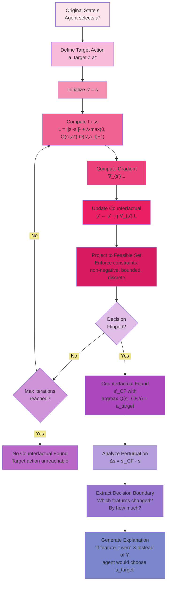

---

##### Policy Distillation and Tree Extraction

###### From Neural Networks to Decision Trees

While neural networks excel at learning complex policies, their opacity limits deployment in safety-critical domains.
**Policy distillation** addresses this by training an interpretable model (decision tree) to mimic the neural network's
behavior. The result: a human-readable set of rules that approximates the complex learned policy.

**Core Insight**: We don't need the **perfect** policy—we need a **good enough, interpretable** policy. If a decision
tree can capture 85-95% of the neural network's performance while being fully transparent, this trade-off is often
acceptable for real-world deployment.

**Decision Trees as Universal Approximators**: While neural networks are universal function approximators in theory,
decision trees can approximate **any finite-valued function** given sufficient depth. The challenge is finding a compact
tree that generalizes well.

**Mathematical Formulation**: Given neural policy $\pi_{\text{NN}}(s) = \arg\max_a Q(s,a;\theta)$, learn decision tree
$\pi_{\text{tree}}$ that minimizes disagreement:

$$
\pi_{\text{tree}}^* = \arg\min_{\pi' \in \Pi\_{\text{trees}}} \mathbb{E}_{s \sim \rho}[\mathbb{1}[\pi'(s) \neq \pi_{\text{NN}}(s)]]
$$

where $\rho$ is a state distribution (ideally, the distribution the agent encounters during operation).

**Why Trees?**: Among interpretable models, decision trees offer unique advantages:

- **Sequential Logic**: Trees naturally represent IF-THEN reasoning familiar to engineers
- **Feature Selection**: Trees automatically identify most important features through splits
- **Non-Linearity**: Can capture non-linear relationships (unlike linear models)
- **Visualization**: Can be drawn as flowcharts for human inspection
- **Verification**: Formal verification tools exist for tree-based models

---

##### VIPER Algorithm: Iterative Policy Approximation

VIPER (Verifiable In-Policy Experience Replay) provides a principled approach to policy distillation. The key
innovation: iteratively improve the tree by querying states generated by the tree itself, not just the neural network.

**Motivation**: If we train a tree only on states from the neural network's trajectory, the tree may fail on states it
visits when deployed (since its policy differs). VIPER addresses this by using **DAGGER** (Dataset Aggregation): collect
data under the current tree policy, label with neural network actions, retrain.

**VIPER Algorithm**:

**Input**: Trained DQN $Q(s,a;\theta)$, environment, tree depth limit $d_{\max}$

**Output**: Decision tree $\pi_{\text{tree}}$ approximating $\pi_{\text{NN}}$

**Initialization**:

1. Collect initial dataset $\mathcal{D}_0$ by rolling out $\pi_{\text{NN}}$ in environment
2. Label each state $s \in \mathcal{D}_0$ with $\pi_{\text{NN}}(s) = \arg\max_a Q(s,a;\theta)$
3. Train initial tree $\pi_{\text{tree}}^{(0)}$ on $\mathcal{D}_0$

**Iteration** (for $k = 1, 2, \ldots, K$):

1. **Roll-out Tree Policy**: Execute $\pi_{\text{tree}}^{(k-1)}$ in environment to collect states $\mathcal{S}_k$
2. **Query Oracle**: For each $s \in \mathcal{S}_k$, label with $a = \pi_{\text{NN}}(s)$
3. **Aggregate Dataset**: $\mathcal{D}_k = \mathcal{D}_{k-1} \cup {(s, \pi_{\text{NN}}(s)) : s \in \mathcal{S}_k}$
4. **Train Tree**: Fit $\pi_{\text{tree}}^{(k)}$ to $\mathcal{D}_k$ using CART (Classification and Regression Trees)
5. **Evaluate Fidelity**:
    $$
    \text{Fidelity}_k = \mathbb{E}_{s \sim \rho}[\mathbb{1}[\pi_{\text{tree}}^{(k)}(s) =
        \pi_{\text{NN}}(s)]]
    $$
6. **Stopping Criterion**: If fidelity > threshold or $k = K_{\max}$, stop

**Return**: Best tree $\pi_{\text{tree}}^{(k^*)}$

**Why Aggregation Helps**: Without aggregation, the tree trained on neural network states may generalize poorly:

**Iteration 0**: Tree trained on NN states → Tree visits slightly different states → Errors accumulate

**With Aggregation**: Tree trained on own states → Corrects errors on states tree actually visits → Better
generalization

**Visual Representation of VIPER**:

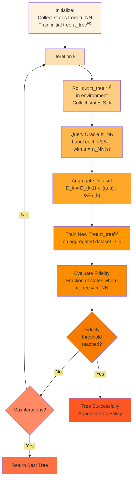

---

##### Fidelity vs. Simplicity Trade-offs

Decision trees have a fundamental trade-off: **deeper trees** → higher fidelity but lower interpretability; **shallow
trees** → lower fidelity but higher interpretability.

**Tree Depth and Complexity**:

| Depth | Max Leaves | Max Rules | Interpretability | Typical Fidelity |
| ----- | ---------- | --------- | ---------------- | ---------------- |
| 2     | 4          | 4         | ★★★★★            | 60-70%           |
| 4     | 16         | 16        | ★★★★☆            | 75-85%           |
| 6     | 64         | 64        | ★★★☆☆            | 85-92%           |
| 8     | 256        | 256       | ★★☆☆☆            | 90-95%           |
| 10+   | 1024+      | 1024+     | ★☆☆☆☆            | 95%+             |

**Interpretability Assessment**: A tree is "interpretable" if a human can trace through its logic for a specific input
within reasonable time:

- **Depth 2**: 4 rules, easily memorized
- **Depth 4**: 16 rules, still traceable on paper
- **Depth 6**: 64 rules, requires computer assistance but rules are individually understandable
- **Depth 8+**: Too complex for manual analysis, defeats the purpose of distillation

**Fidelity Measurement**: Percentage of states where tree matches neural network:

$$
\text{Fidelity} = \frac{1}{|\mathcal{T}|}\sum_{s \in \mathcal{T}} \mathbb{1}[\pi_{\text{tree}}(s) =
\pi_{\text{NN}}(s)]
$$

where $\mathcal{T}$ is a test set of states.

**Performance vs. Fidelity**: High fidelity doesn't guarantee high performance. The tree might copy the neural network's
mistakes. More important: tree's actual reward when deployed:

$$
\text{Performance} = \mathbb{E}_{\text{episodes}}[\text{Cumulative Reward using } \pi_{\text{tree}}]
$$

**Acceptable Trade-Off**: In practice, fidelity of 85-92% with depth 4-6 often provides the best balance. This captures
most of the neural network's knowledge while remaining interpretable.

**Example Trade-Off Analysis**:

| Tree Depth | Fidelity | Avg Reward | Interpretability | Choice           |
| ---------- | -------- | ---------- | ---------------- | ---------------- |
| 3          | 72%      | -245       | High             | Too low fidelity |
| 5          | 88%      | -198       | Medium           | ✓ Good balance   |
| 7          | 93%      | -185       | Low              | Marginal gain    |
| 10         | 96%      | -178       | Very Low         | Not worth it     |
| NN         | 100%     | -175       | None             | Baseline         |

Tree with depth 5 achieves 88% fidelity, 13% worse reward than NN, but is interpretable. Depth 10 improves fidelity to
96% but loses interpretability with minimal reward gain. **Depth 5 is optimal.**

---

##### Rule Extraction and Interpretation

Once trained, the decision tree provides explicit rules. Each path from root to leaf is a rule:

**Example Tree Structure**:

```
Root
├─ IF NS_queue > 12
│  ├─ IF phase_duration > 30
│  │  └─ Action: Next Phase
│  └─ IF phase_duration ≤ 30
│     └─ Action: Continue
└─ IF NS_queue ≤ 12
   ├─ IF bus_present = 1
   │  └─ Action: Skip-to-P1
   └─ IF bus_present = 0
      └─ Action: Continue
```

**Extracted Rules**:

**Rule 1**: IF (NS_queue > 12) AND (phase_duration > 30) THEN Next Phase

**Interpretation**: When the major approach has heavy queue and phase has run long, advance to next phase to serve other
approaches.

**Rule 2**: IF (NS_queue > 12) AND (phase_duration ≤ 30) THEN Continue

**Interpretation**: Heavy queue but phase just started—continue serving to clear backlog.

**Rule 3**: IF (NS_queue ≤ 12) AND (bus_present = 1) THEN Skip-to-P1

**Interpretation**: Light traffic, bus detected—activate bus priority by skipping to major through phase.

**Rule 4**: IF (NS_queue ≤ 12) AND (bus_present = 0) THEN Continue

**Interpretation**: Light traffic, no special conditions—maintain current phase.

**Validation with Domain Expertise**:

Traffic engineers can review these rules for reasonableness:

- **Rule 1**: Reasonable. Threshold of 12 vehicles aligns with typical approach capacity (600-900 veh/hr ≈ 10-15
  veh/cycle).
- **Rule 2**: Correct. Minimum green time (often 30s) must be respected before switching.
- **Rule 3**: Good bus priority logic. Activates only when it won't cause excessive delays (queue ≤ 12).
- **Rule 4**: Default behavior—safe continuation when no special conditions apply.

Engineers might suggest refinements: "Rule 3 should also check pedestrian demand to avoid conflicts." This feedback
improves the reward function for retraining.

---

##### Validation and Verification

Extracted trees enable formal verification—proving safety properties that neural networks cannot guarantee.

**Property 1: Minimum Green Time**: Prove that tree never selects "Next Phase" when $\text{Phase duration}$ <
$T_{\min}$.

**Verification**: Traverse all tree paths. Check each leaf with action "Next Phase":

- Path 1: $\text{NS\_Queue}$ > 12 AND phase*duration > 30 → Next Phase (duration > 30 ≥ $T*{\min}$ = 10, ✓)
- Path 2: ... (check all paths)

If all paths satisfy the property, the tree is **verified** to respect minimum green time. This provides formal safety
guarantees impossible with neural networks.

**Property 2: No Conflicting Movements**: Prove tree never selects phases that allow conflicting traffic simultaneously.

**Property 3: Maximum Delay Bound**: Prove that under tree policy, no approach waits longer than $W_{\max}$ seconds
(probabilistic property, harder to verify).

**Model Checking Tools**: Formal verification tools (UPPAAL, PRISM) can automatically check temporal logic properties on
tree policies:

$$
\left(\text{phase\_duration} < T_{\min} \implies \neg \text{action = Next}\right)
$$

"Always, if duration below minimum, action is not Next Phase."

This level of verification is critical for safety certification in autonomous systems.

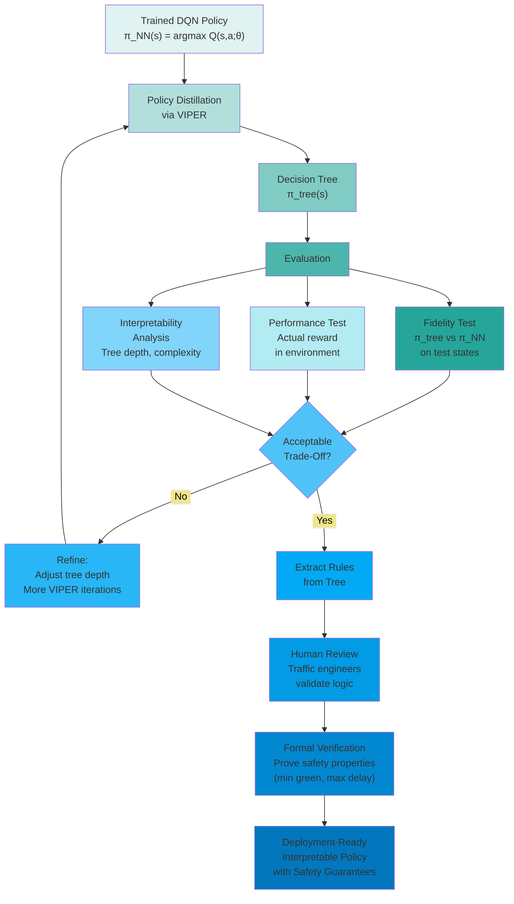

---

##### Behavioral Safety Analysis

###### Beyond Average Reward: Safety Metrics

Traditional reinforcement learning optimizes **average cumulative reward**. But safety-critical systems require
guarantees about **worst-case behavior**, not just average performance:

**Problem with Average Reward**: An agent with average waiting time 20s might seem excellent, but if 5% of pedestrians
wait 120s (unsafe jaywalking risk), the system is unacceptable.

**Safety-Oriented Metrics**:

**1. Maximum Waiting Time Per Mode**:

$$
W_{\max}^{(\text{mode})} = \max_{t, \text{vehicle } v} {\text{waiting time of vehicle } v \text{ of type mode at time
} t}
$$

Separate maximums for cars, bicycles, pedestrians, buses. Thresholds:

- Cars: $W_{\max} < 180$ s (3 minutes tolerable)
- Bicycles: $W_{\max} < 120$ s (2 minutes)
- Pedestrians: $W_{\max} < 90$ s (1.5 minutes, beyond which jaywalking increases)
- Buses: $W_{\max} < 60$ s (priority requirement)

**2. Percentile Waiting Times**:

$$
W_{95}^{(\text{mode})} = \text{95th percentile of waiting times for mode}
$$

Characterizes typical worst-case, filtering out rare extreme outliers.

**3. Modal Equity**:

$$
\text{Equity Ratio} = \frac{\max_{\text{mode}} \mathbb{E}[W^{(\text{mode})}]}{\min_{\text{mode}}
\mathbb{E}[W^{(\text{mode})}]}
$$

Measures fairness. If cars average 10s while pedestrians average 50s, equity ratio = 5.0 (high inequity). Target: ratio
< 2.0.

**4. Action Blocking Rate**:

$$
\text{Block Rate} = \frac{\text{ actions blocked by safety constraints}}{\text{ total action attempts}} \times 100%
$$

High blocking (>20%) indicates agent hasn't internalized operational constraints. Low blocking (<5%) suggests
well-learned policy.

**5. Constraint Violation Frequency**:

- **Minimum Green Violations**: # times agent tried to switch before $T_{\min}$ elapsed
- **Maximum Green Violations**: # times phase exceeded $T_{\max}$
- **Conflicting Movement Violations**: # times agent attempted illegal phase transitions

Target: Zero violations for critical safety constraints.

---

##### Scenario-Based Testing Protocols

Rather than relying solely on aggregate statistics, systematic testing across **diverse scenarios** characterizes
behavioral boundaries:

**Scenario Design Principles**:

**1. Demand Variation**: Systematically vary traffic volumes for each mode

- Low (200 veh/hr), Medium (400), High (600), Peak (800), Extreme (1000)
- Create combinations: High car + Low pedestrian, Balanced, Peak all modes

**2. Modal Priority Conflicts**: Design scenarios with competing demands

- Heavy vehicles + High pedestrian demand
- Bus arrival + Bicycle platoon
- Emergency vehicle + Congestion

**3. Time-of-Day Patterns**: Morning peak, evening peak, midday, overnight

**4. Special Events**: School dismissal (pedestrian surge), sporting event (traffic spike), construction (reduced
capacity)

**Example Test Suite** (30 scenarios):

| Scenario Set | Description                         | # Scenarios | Purpose                     |
| ------------ | ----------------------------------- | ----------- | --------------------------- |
| Pr_0 to Pr_9 | Private car demand: 100-1000 veh/hr | 10          | Test vehicle prioritization |
| Bi_0 to Bi_9 | Bicycle demand: 100-1000 veh/hr     | 10          | Test bicycle accommodation  |
| Pe_0 to Pe_9 | Pedestrian demand: 100-1000 ped/hr  | 10          | Test pedestrian safety      |

Each scenario runs 3600s (1 hour) simulation with fixed random seed for reproducibility.

**Logging Protocol**:

For each timestep $t$:

- **State**: Complete 32-dimensional state vector
- **Q-Values**: $Q(s,a)$ for all actions
- **Selected Action**: $a^* = \arg\max_a Q(s,a)$
- **Blocked**: Boolean indicating if action was rejected by constraints
- **Reward Components**: Breakdown of waiting time, sync bonus, penalties
- **Traffic Outcomes**: Queue lengths, waiting times after action execution

Post-process logs to compute safety metrics, identify problematic patterns.

---

##### Maximum Waiting Time Analysis

Maximum waiting time is the most critical safety metric. We analyze:

**Per-Scenario Analysis**:

| Scenario        | $W_{\max}^{\text{car}}$ | $W_{\max}^{\text{bike}}$ | $W_{\max}^{\text{ped}}$ | $W_{\max}^{\text{bus}}$ |
| --------------- | ----------------------- | ------------------------ | ----------------------- | ----------------------- |
| Pr_0 (light)    | 45s                     | 38s                      | 42s                     | 28s                     |
| Pr_5 (moderate) | 78s                     | 62s                      | 71s                     | 35s                     |
| Pr_9 (extreme)  | 142s                    | 98s                      | 85s                     | 52s                     |
| Pe_7 (high ped) | 68s                     | 55s                      | **103s**                | 41s                     |
| Pe_9 (peak ped) | 72s                     | 58s                      | **118s**                | 38s                     |

**Findings**:

- **Pe_7, Pe_9**: Pedestrian max wait exceeds 90s threshold → Safety concern
- **Pr_9**: Car max wait 142s approaches but doesn't exceed 180s threshold → Acceptable
- **All scenarios**: Bus max wait well below 60s → Bus priority working

**Root Cause Analysis for Pe_7, Pe_9**: Query explanation methods:

**Saliency Analysis**: In high ped scenarios, pedestrian waiting time has only 12% saliency (low priority)

**Counterfactual**: "If pedestrian queue were 15 instead of 8, agent would activate pedestrian phase" → Threshold too
high

**Recommendation**: Modify reward function to increase pedestrian priority weight, retrain.

---

##### Action Blocking Patterns

Actions get blocked when they violate operational constraints. Analyzing blocking patterns reveals whether the agent
learned valid control strategies:

**Blocking Statistics**:

| Scenario | Total Actions | Blocked | Block Rate | Most Blocked Action |
| -------- | ------------- | ------- | ---------- | ------------------- |
| Pr_0     | 3600          | 42      | 1.2%       | Skip-to-P1          |
| Pr_5     | 3600          | 128     | 3.6%       | Next Phase          |
| Pr_9     | 3600          | 89      | 2.5%       | Skip-to-P1          |
| Bi_7     | 3600          | 156     | 4.3%       | Next Phase          |
| Pe_9     | 3600          | 203     | 5.6%       | Skip-to-P1          |

**Interpretation**:

- **Overall low blocking** (1-6%): Agent learned constraints reasonably well
- **Pe_9 highest** (5.6%): Heavy pedestrian demand causes more constraint violations, possibly from aggressive attempts
  to serve vehicles
- **"Next Phase" and "Skip-to-P1" most blocked**: These phase changes have strict timing requirements (min green, phase
  sequence)

**Temporal Analysis**: When do blockings occur?

```
Blockings by Phase Duration (Pe_9 scenario)
Duration:  [0-10s]  [10-20s]  [20-30s]  [30-40s]  [40-50s]  [50+s]
Blocked:     78       95        22        6         2         0
```

**Pattern**: 85% of blockings occur in first 20s of phase → Agent attempting premature phase changes before minimum
green satisfied.

**Mitigation**:

1. Stronger penalty for early phase change attempts in reward function
2. Explicit min-green masking in action selection (prevent illegal actions a priori)

---

##### Modal Service Quality Assessment

Beyond maximum waiting time, analyze **service quality distribution**:

**Waiting Time Distributions (Pr_5 scenario)**:

| Mode  | Mean  | Median | 75th % | 90th % | 95th % | Max |
| ----- | ----- | ------ | ------ | ------ | ------ | --- |
| Cars  | 18.2s | 15.0s  | 24.0s  | 35.0s  | 48.0s  | 78s |
| Bikes | 21.5s | 18.0s  | 28.0s  | 42.0s  | 58.0s  | 62s |
| Peds  | 24.8s | 20.0s  | 32.0s  | 48.0s  | 65.0s  | 71s |
| Buses | 12.3s | 10.0s  | 16.0s  | 22.0s  | 28.0s  | 35s |

**Analysis**:

**1. Modal Ordering**: Bus < Cars < Bikes < Pedestrians → Bus priority effective, pedestrians receive longest waits

**2. Equity Ratio**: $\frac{24.8}{12.3} = 2.02$ (marginally acceptable, target < 2.0)

**3. Tail Behavior**: Pedestrian 95th percentile (65s) close to safety threshold (90s) → Limited safety margin

**4. Bus Performance**: Mean 12.3s well below target (< 20s) → Over-prioritization? Could slightly relax bus priority to
improve pedestrian service.

**Comparison Across Scenarios**:

```
Mean Waiting Time vs. Traffic Volume
Cars:    ─────▲───────────▲────────────▲─────▲
Bikes:   ────────▲───────────▲────────────▲──
Peds:    ───────────▲───────────▲─────────────▲

Volume:  Light  Moderate  High  Extreme
         (200)   (400)    (600)  (800) veh/hr
```

All modes show expected increase with volume. Pedestrians increase most steeply → Agent prioritizes vehicles under
congestion.

**Fairness Intervention**: Adjust reward to -

$$
r = -\alpha_{\text{car}} W_{\text{car}} - \alpha_{\text{bike}} W_{\text{bike}} - \alpha_{\text{ped}} W_{\text{ped}} - \alpha_{\text{bus}} W_{\text{bus}}
$$

Increase $\alpha_{\text{ped}}$ from 1.0 to 1.5 to boost pedestrian priority, retrain, and re-evaluate.

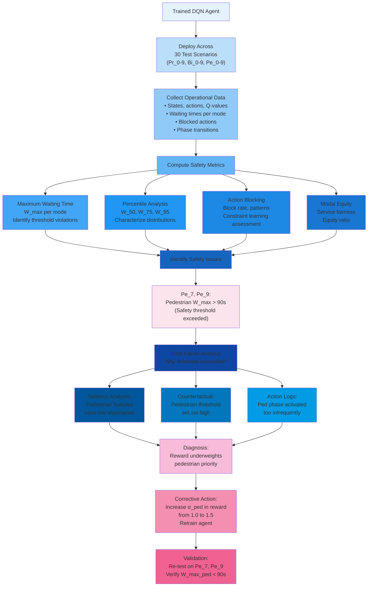

---

##### Synthesis: Multi-Method Explainability Framework

Individual explanation methods provide partial insights. Combining them creates a comprehensive understanding:

**Step 1: Local Decision Explanation** (specific state)

- **Saliency**: Which features are most sensitive?
- **Attention**: Which features does agent focus on?
- **Result**: "In this state, agent prioritizes bus waiting time (63% attention, 2.14 saliency) over vehicle queues."

**Step 2: Decision Boundary Analysis**

- **Counterfactual**: What would need to change to flip the decision?
- **Result**: "If bus waiting decreased from 21s to 10s, agent would Continue instead of Skip-to-P1. Threshold ≈ 18s."

**Step 3: Global Policy Understanding**

- **VIPER Tree**: What general rules does agent follow?
- **Result**: "Agent follows rules: (1) IF queue > 12 AND duration > 30 THEN Next, (2) IF bus present THEN Skip-to-P1,
  etc."

**Step 4: Safety Validation**

- **Behavioral Analysis**: Does agent behave safely across all scenarios?
- **Result**: "Agent respects min green (0 violations) but allows excessive pedestrian waits in Pe_7-9 (max 118s > 90s
  threshold)."

**Step 5: Iterative Refinement**

- **Feedback Loop**: Use explanations to identify issues, modify reward/training, re-evaluate
- **Result**: "Increased pedestrian reward weight → New agent achieves max ped wait 82s < 90s while maintaining vehicle
  performance."

This integrated framework transforms the "black box" into a **glass box**: decisions are transparent, boundaries are
mapped, rules are explicit, and safety is validated. The result is a reinforcement learning system suitable for
real-world deployment in safety-critical traffic control.
